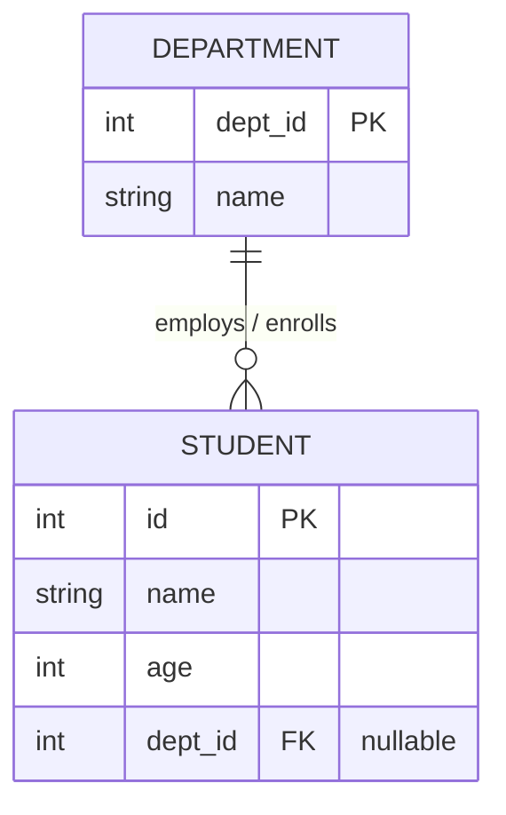
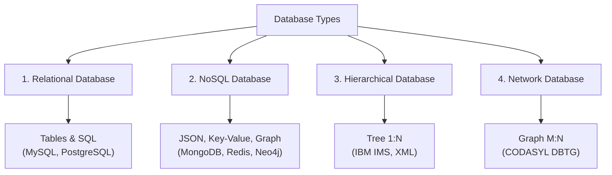
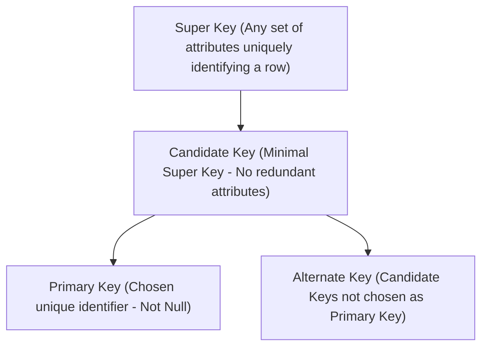

# Phase 1 — Database Fundamentals

For technical interviews, the key to mastering DBMS is **understanding what each concept means, why it exists, and being able to write clean SQL queries**. Throughout this series, we use a single, consistent example database so all concepts connect seamlessly.

---

## The Consistent Example Database

We will reference these two core tables across our discussions and queries:

```sql
-- DEPARTMENT Table
+---------+----------+
| dept_id | name     |
+---------+----------+
| 10      | CSE      |
| 20      | ECE      |
| 30      | ME       |
+---------+----------+

-- STUDENT Table
+----+--------+-----+------------+
| id | name   | age | dept_id    |
+----+--------+-----+------------+
| 1  | Alice  | 20  | 10         |
| 2  | Bob    | 21  | 20         |
| 3  | Carol  | 20  | 10         |
| 4  | David  | 22  | NULL       |
+----+--------+-----+------------+
```



---

## 1. What is a Database?

A **database** is an organized, structured collection of related data stored electronically in a computer system so that it can be efficiently searched, accessed, updated, and managed.

For example, a university may store:

- Students & Faculty records
- Courses & Syllabi
- Marks & Grades
- Attendance logs
- Tuition & Fee payments

Instead of keeping everything in isolated flat files (like spreadsheets or text files), related information is managed centrally within a database.

```text
Without Database (Flat Files):
[Students.txt]   [Marks.csv]   [Fees.xlsx]
   └── Inconsistent data, duplicate entries, no concurrent access control!

With Centralized Database:
               ┌───────────────┐
               │    Database   │
               │ (ACID & Auth) │
               └───────┬───────┘
         ┌─────────────┼─────────────┐
         ▼             ▼             ▼
    [ Students ]   [ Courses ]   [ Enrollment ]
```

### Why do we need databases?

Using a database rather than a traditional file-processing system provides vital benefits:

1. **Scalable storage**: Storing large volumes of structured and unstructured data.
2. **Efficient retrieval**: Fast indexing and querying (B-Trees, Hash indexes).
3. **Data consistency & integrity**: Enforcing business rules and constraints across records.
4. **Controlled concurrent access**: Multiple users can read and write simultaneously without corrupting data.
5. **Reduced data redundancy**: Normalization eliminates unnecessary duplicate storage.
6. **Security & access control**: Role-based permissions protect sensitive tables.
7. **Crash recovery & backups**: Transaction logs safeguard data against hardware failure.

> [!NOTE]
> **Standard Interview Answer:**
> *"A database is an organized collection of related data that can be efficiently stored, accessed, updated, and managed with strong consistency and access control."*

---

## 2. DBMS vs RDBMS

### DBMS (Database Management System)

A **DBMS** is the system software that provides an interface between the end user/applications and the underlying database storage. It enables creation, retrieval, updating, and administration of data.

Examples:
- MySQL, PostgreSQL, Oracle (Relational)
- MongoDB, Redis, Cassandra (NoSQL)
- SQLite, FileMaker

A DBMS does **not** necessarily store data in relational tables with pre-defined schemas and foreign key constraints.

### RDBMS (Relational Database Management System)

An **RDBMS** is a specialized, advanced DBMS based on the **Relational Model** introduced by E.F. Codd. It stores data in two-dimensional **tables (relations)** comprising rows (tuples) and columns (attributes), and models relationships between tables using keys.

Examples:
- MySQL
- PostgreSQL
- Oracle Database
- Microsoft SQL Server
- SQLite

```text
STUDENT Table
+----+--------+---------+
| id | name   | dept_id |
+----+--------+---------+
| 1  | Alice  | 10      |───┐ (dept_id establishes the relationship)
+----+--------+---------+   │
                            ▼
DEPARTMENT Table      +---------+----------+
                      | dept_id | name     |
                      +---------+----------+
                      | 10      | CSE      |
                      +---------+----------+
```

### Core Differences

| Feature | DBMS | RDBMS |
|---|---|---|
| **Data Storage** | Stores data as files, key-value pairs, XML, or hierarchical trees | Stores data strictly in structured **tables** (relations) |
| **Relationships** | Not inherently supported or required between data entities | **Relationships are fundamental** (enforced via Foreign Keys) |
| **Data Integrity** | Weak or manual; application code must enforce rules | **Strict constraint enforcement** (Primary Key, Foreign Key, Domain rules) |
| **Normalization** | Not typically supported | Designed for **normalization (1NF to BCNF)** to eliminate redundancy |
| **ACID Support** | Often partial or configurable (e.g., eventual consistency) | **Strict ACID compliance** is standard |
| **User Load** | Often designed for single-user or lightweight apps | Designed for **high concurrency & distributed enterprise workloads** |
| **Examples** | XML files, early dBase, file systems, Redis, MongoDB | MySQL, PostgreSQL, Oracle, SQL Server |

> [!IMPORTANT]
> **Golden Interview Rule:**
> **"Every RDBMS is a DBMS, but every DBMS is not an RDBMS."**

---

## 3. Types of Databases

For fresher software engineering interviews, you should be familiar with these four fundamental database models:



### 1. Relational Database (RDBMS)

Data is organized into tabular rows and columns linked by primary and foreign keys.

```text
STUDENT
id | name  | age
---+-------+----
1  | Alice | 20
2  | Bob   | 21
```

- **Strengths**: ACID compliance, rich query power (`SQL`), data integrity.
- **Examples**: MySQL, PostgreSQL, Oracle, SQLite.
- **Best For**: Banking, e-commerce transactions, inventory systems, enterprise ERPs.

---

### 2. NoSQL Database (Not Only SQL)

Designed for distributed architectures, horizontal scaling, and flexible, schema-less data structures.

Common NoSQL categories:
- **Document Store**: JSON/BSON documents (e.g., MongoDB, CouchDB).
- **Key-Value Store**: Fast in-memory key lookups (e.g., Redis, DynamoDB).
- **Column-Family / Wide-Column**: Partitioned column families (e.g., Apache Cassandra, HBase).
- **Graph Database**: Nodes and edges for network analysis (e.g., Neo4j).

Example JSON document in MongoDB:

```json
{
  "_id": 1,
  "name": "Alice",
  "age": 20,
  "skills": ["SQL", "C++", "Docker"],
  "address": {
    "city": "Bengaluru",
    "pincode": "560001"
  }
}
```

- **Best For**: Big data pipelines, real-time analytics, social media feeds, rapid prototyping with evolving schemas.

---

### 3. Hierarchical Database

Data is organized into a **tree-like structure** with one parent record and multiple child records (1-to-many relationship).

```text
University (Root)
│
├── Department: CSE
│   ├── Student: Alice
│   └── Student: Bob
│
└── Department: ECE
    └── Student: Carol
```

- **Characteristic**: A child entity can have **only one parent**. Deleting a parent automatically deletes all child entities.
- **Examples**: IBM IMS, Windows Registry, XML documents.

---

### 4. Network Database

An evolution of the hierarchical model where records can have multiple parent and child nodes, forming an arbitrary **graph-like structure** (many-to-many relationships).

```text
Alice ──────── Course: CS101
  │          ╱
  │         ╱
  └── Course: CS102
```

- **Characteristic**: Uses pointers to link records together. Complex to maintain and query compared to the mathematical simplicity of relational tables.
- **Historical Context**: CODASYL model. While rarely asked beyond definitions in fresher interviews, it laid the conceptual groundwork for modern graph databases.

---

## 4. Database Schema vs Instance

This is a staple interview question.

### Schema

The **logical blueprint, design, and structure** of the database. It defines the tables, column names, data types, constraints, and relationships. It changes very infrequently.

```sql
-- Schema Definition
CREATE TABLE Student (
    id INT PRIMARY KEY,
    name VARCHAR(50) NOT NULL,
    age INT CHECK (age >= 18)
);
```

### Instance

The **actual snapshot of data stored** in the database at a specific moment in time. It changes dynamically whenever records are inserted, updated, or deleted.

```text
Instance at 10:00 AM:
1 | Alice | 20
2 | Bob   | 21

Instance at 10:05 AM (after inserting Carol):
1 | Alice | 20
2 | Bob   | 21
3 | Carol | 20   <-- Schema remains unchanged, instance changed!
```

### Summary Comparison

| Aspect | Database Schema | Database Instance |
|---|---|---|
| **Definition** | Structural design & blueprint | Actual operational data at a given instant |
| **Frequency of change** | Rare (requires DDL `ALTER TABLE`) | Continuous (modified by DML `INSERT`, `UPDATE`, `DELETE`) |
| **Analogous to** | Class definition in OOP | Object / State in OOP |

> [!TIP]
> **Memory Hook:**
> - **Schema = Structure (Skeleton)**
> - **Instance = Data (Snapshot in time)**

---

## 5. Tables, Rows, Columns, Records

Let's dissect a relational table:

```text
                      COLUMN / ATTRIBUTE (Property)
                      │
                      ▼
STUDENT               id     name     age
            ┌───────┬──────┬────────┬─────┐
ROW / TUPLE │ Row 1 │ 1    │ Alice  │ 20  │ ◄── RECORD (Single entity instance)
(Tuple)     │ Row 2 │ 2    │ Bob    │ 21  │
            └───────┴──────┴────────┴─────┘
            ▲
            └── TABLE / RELATION (Entire 2D entity structure)
```

- **Table (Relation)**: The entire two-dimensional collection of related data consisting of rows and columns.
- **Column (Attribute)**: A specific property or characteristic of the entity (e.g., `id`, `name`, `age`).
- **Row (Tuple / Record)**: A single complete entry representing an individual real-world instance.
- **Cardinality**: The total number of rows (tuples) in a table.
- **Degree (Arity)**: The total number of columns (attributes) in a table.

---

## 6. SQL Data Types

Data types dictate what kind of values can be stored in each column and how much storage space is allocated.

| Data Type | Description | Example |
|---|---|---|
| `INT` / `INTEGER` | Standard integer values | `id INT` |
| `BIGINT` | Large integers for high-scale primary keys | `user_id BIGINT` |
| `VARCHAR(n)` | Variable-length string up to $n$ characters | `name VARCHAR(50)` |
| `CHAR(n)` | Fixed-length string of exactly $n$ characters | `country_code CHAR(2)` |
| `DECIMAL(p, s)` | Exact precision numbers ($p$ total digits, $s$ after decimal) | `cgpa DECIMAL(3, 2)` |
| `DATE` | Calendar date (`YYYY-MM-DD`) | `dob DATE` |
| `TIME` | Time of day (`HH:MM:SS`) | `checkin_time TIME` |
| `DATETIME` / `TIMESTAMP` | Date and time combined | `created_at TIMESTAMP` |
| `BOOLEAN` | Truth value (`TRUE` or `FALSE` / `1` or `0`) | `is_active BOOLEAN` |

### Complete Table Creation Example

```sql
CREATE TABLE Student (
    id INT PRIMARY KEY,
    name VARCHAR(50) NOT NULL,
    age INT,
    cgpa DECIMAL(3, 2),
    dob DATE,
    is_enrolled BOOLEAN DEFAULT TRUE
);
```

### `VARCHAR` vs `CHAR` (Very Common Interview Question)

```text
Value: 'Alice' (length 5)

VARCHAR(10):
['A']['l']['i']['c']['e']  --> Uses only 5 characters (+ 1-2 length byte header)

CHAR(10):
['A']['l']['i']['c']['e'][' '][' '][' '][' '][' ']  --> Padded with spaces to 10 bytes!
```

- **`VARCHAR(N)` (Variable Character)**: Only consumes space for the actual characters entered plus small length metadata. Ideal for names, emails, addresses.
- **`CHAR(N)` (Fixed Character)**: Always consumes the full $N$ characters, padding shorter strings with trailing spaces. Ideal for fixed-length strings like country codes (`IN`, `US`), status codes (`PEND`, `DONE`), or MD5 hashes.

---

## 7. Keys in DBMS

Keys uniquely identify rows and establish relationships across tables. Understanding the differences between keys is **crucial for technical interviews**.

Consider this student dataset:

```text
STUDENT
id | email              | roll_no | name  | dept_id
1  | alice@univ.edu     | R101    | Alice | 10
2  | bob@univ.edu       | R102    | Bob   | 20
3  | carol@univ.edu     | R103    | Carol | 10
```



### 1. Super Key

A **Super Key** is any attribute or set of attributes that can uniquely identify a row within a table.

Examples:
- `{id}`
- `{email}`
- `{roll_no}`
- `{id, name}`
- `{id, email}`
- `{email, name, age}`

All of these combinations uniquely identify a specific student. Hence, all of them are super keys.

---

### 2. Candidate Key

A **Candidate Key** is a **minimal super key** — meaning no proper subset of the key can uniquely identify a row. There are no redundant attributes.

Examples:
- `{id}`
- `{email}`
- `{roll_no}`

Why is `{id, name}` **not** a candidate key?
Because `{id}` alone is sufficient to uniquely identify a row; adding `name` introduces a redundant attribute.

> [!TIP]
> **Remember:**
> - Super Key = Any unique identifier.
> - Candidate Key = **Minimal** unique identifier.
> - Every Candidate Key is a Super Key, but not every Super Key is a Candidate Key.

---

### 3. Primary Key

The **Primary Key** is the specific candidate key chosen by the database architect as the main identifier for the table.

```sql
id INT PRIMARY KEY
```

**Key Properties:**
- Must be **UNIQUE** across all rows.
- Can **NEVER be `NULL`**.
- A table can have **only one** primary key (which can be a single column or composite).

---

### 4. Alternate Key (Secondary Key)

The candidate keys that were **not** chosen as the primary key are called **Alternate Keys**.

In our student table:
- Candidate keys: `{id}`, `{email}`, `{roll_no}`
- Selected Primary Key: `{id}`
- Alternate Keys: `{email}`, `{roll_no}`

They can be enforced with `UNIQUE NOT NULL` constraints.

---

### 5. Foreign Key (Referential Key)

A **Foreign Key** is a column (or combination of columns) in one table that references the Primary Key (or unique key) in another table. It enforces **Referential Integrity**.

```sql
CREATE TABLE Department (
    dept_id INT PRIMARY KEY,
    name VARCHAR(50) NOT NULL
);

CREATE TABLE Student (
    id INT PRIMARY KEY,
    name VARCHAR(50) NOT NULL,
    dept_id INT,
    FOREIGN KEY (dept_id) REFERENCES Department(dept_id)
        ON DELETE SET NULL
        ON UPDATE CASCADE
);
```

- `Department.dept_id` $\rightarrow$ Primary Key (Parent table)
- `Student.dept_id` $\rightarrow$ Foreign Key (Child table)
- **Constraint behavior**: You cannot insert a student with `dept_id = 99` if department `99` does not exist in the parent table.

---

### 6. Composite Key

A **Composite Key** is a primary key or candidate key made up of **two or more columns** because no single column alone is unique.

Consider course enrollments:

```text
ENROLLMENT
student_id | course_id | semester | grade
-----------+-----------+----------+------
1          | 101       | Fall2026 | A
1          | 102       | Fall2026 | B
2          | 101       | Fall2026 | A
```

- A student can enroll in multiple courses $\rightarrow$ `student_id` is not unique.
- A course can have multiple students $\rightarrow$ `course_id` is not unique.
- Together, `(student_id, course_id)` uniquely identifies each enrollment.

```sql
CREATE TABLE Enrollment (
    student_id INT,
    course_id INT,
    semester VARCHAR(20),
    grade CHAR(2),
    PRIMARY KEY (student_id, course_id),
    FOREIGN KEY (student_id) REFERENCES Student(id),
    FOREIGN KEY (course_id) REFERENCES Course(course_id)
);
```

---

## 8. Database Constraints

Constraints are validation rules enforced by the RDBMS engine on data columns to preserve data integrity and correctness.

| Constraint | Purpose | Example |
|---|---|---|
| `NOT NULL` | Guarantees that a column cannot have missing/NULL values | `name VARCHAR(50) NOT NULL` |
| `UNIQUE` | Guarantees that all values in a column are distinct | `email VARCHAR(100) UNIQUE` |
| `PRIMARY KEY` | Combines `NOT NULL` and `UNIQUE` to uniquely identify rows | `id INT PRIMARY KEY` |
| `FOREIGN KEY` | Enforces referential integrity pointing to another table | `FOREIGN KEY (dept_id) REFERENCES Dept(id)` |
| `CHECK` | Ensures that all values in a column satisfy a boolean condition | `age INT CHECK(age >= 18)` |
| `DEFAULT` | Automatically assigns a fallback value when none is supplied | `status VARCHAR(20) DEFAULT 'active'` |

### All Constraints in a Unified Example

```sql
CREATE TABLE Employee (
    emp_id INT PRIMARY KEY,                       -- PRIMARY KEY (UNIQUE + NOT NULL)
    email VARCHAR(100) NOT NULL UNIQUE,           -- NOT NULL & UNIQUE
    age INT CHECK (age >= 18 AND age <= 65),      -- CHECK constraint
    salary DECIMAL(10, 2) CHECK (salary > 0),    -- CHECK constraint
    status VARCHAR(20) DEFAULT 'Active',          -- DEFAULT constraint
    dept_id INT,                                  -- FOREIGN KEY
    FOREIGN KEY (dept_id) REFERENCES Department(dept_id)
);
```

If an application attempts to insert:
- `age = 15` $\rightarrow$ Rejected by `CHECK (age >= 18)`
- `email = NULL` $\rightarrow$ Rejected by `NOT NULL`
- `dept_id = 999` $\rightarrow$ Rejected by `FOREIGN KEY`
