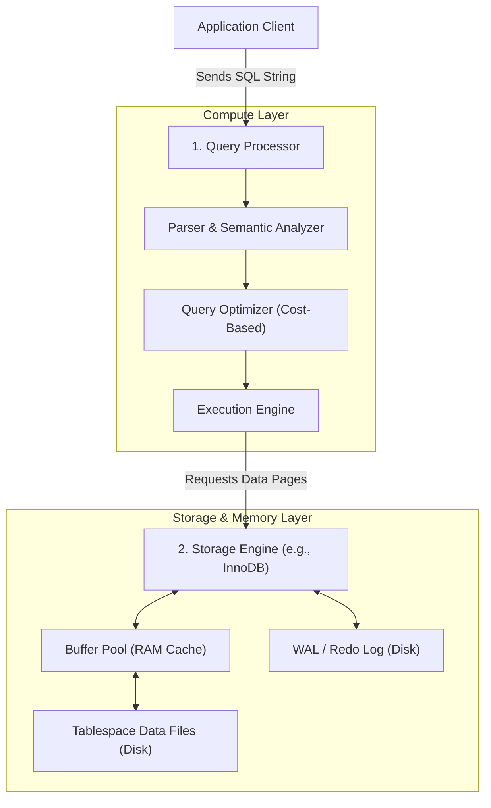
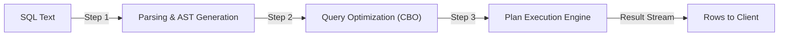
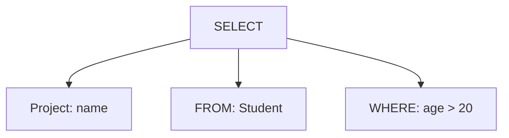
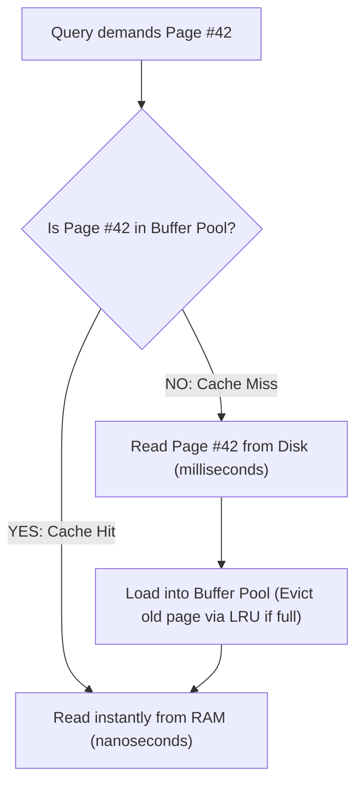
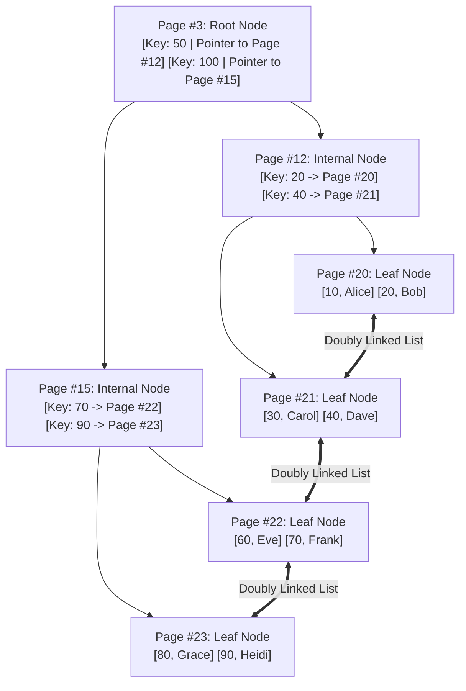
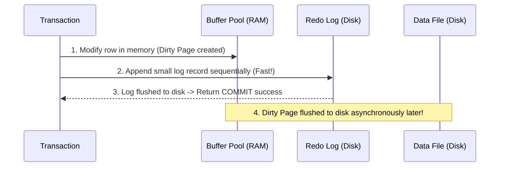
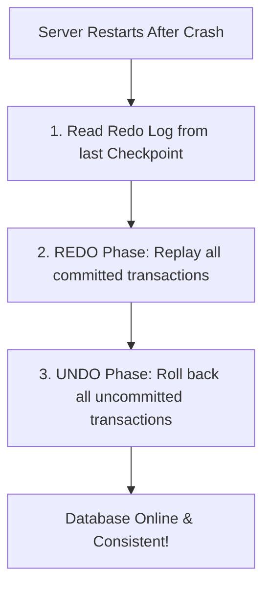

# Phase 9 — DBMS Internals

In fresher software engineering interviews, questions on database internals are not meant to test whether you can build a database engine from scratch. Instead, interviewers want to see that you understand **how a query travels from SQL string to disk, why RAM caching matters, how B+ Trees are structured physically, and how Write-Ahead Logging (WAL) ensures crash durability**.

---

## 1. High-Level DBMS Architecture

At a high level, a relational database system is divided into two primary subsystems: the **Query Processor** (compute layer) and the **Storage Engine** (storage & memory layer).



### The 4 Essential DBMS Subsystems:
1. **Query Processor**: Parses, optimizes, and executes incoming SQL queries.
2. **Storage Engine**: Manages physical record layout, page formats, and index lookups.
3. **Buffer Manager**: Caches disk pages in memory to minimize slow disk I/O.
4. **Transaction & Recovery Manager**: Enforces ACID properties using Write-Ahead Logging (WAL) and undo/redo logs.

---

## 2. The Query Processor

The **Query Processor** transforms a declarative SQL query into an optimized physical execution plan.

```text
Declarative SQL: "SELECT name FROM Student WHERE age > 20;"
(Tells the database WHAT data you want, not HOW to retrieve it)
                          │
                          ▼
Query Processor figures out the physical HOW:
(Index range scan on idx_age -> fetch pointer -> read name -> return stream)
```



---

## 3. Query Parsing & Semantic Analysis

Parsing is the first phase of query processing. It converts raw SQL text into an internal hierarchical data structure called a **Parse Tree** (or Abstract Syntax Tree).

```sql
SELECT name FROM Student WHERE age > 20;
```



### What happens during Parsing?
1. **Syntax Checking**: Ensures the query follows valid SQL grammar. An error like `SELEKT * FROM Student` is rejected immediately.
2. **Semantic Verification (Catalog Lookup)**: Queries the database data dictionary (system catalog) to verify:
   - Does the table `Student` actually exist?
   - Do columns `name` and `age` exist in `Student`?
   - Does the current user have `SELECT` permissions on this table?
   - Are data types compatible (e.g., can `age` be compared with integer `20`)?

---

## 4. Query Optimization

Once a query is parsed, there are often **multiple physical ways** to retrieve the requested rows. The **Query Optimizer** evaluates alternative plans and picks the one with the lowest estimated execution cost.

```sql
SELECT * FROM Employee WHERE dept_id = 10 AND salary > 50000;
```

### Possible Execution Strategies:
- **Plan A**: Full table scan on `Employee` evaluating both conditions for every row.
- **Plan B**: Use index on `dept_id` to fetch matching rows, then filter by `salary > 50000`.
- **Plan C**: Use index on `salary` to find employees $> 50000$, then filter by `dept_id = 10`.
- **Plan D**: Use composite index `(dept_id, salary)` for a direct lookup.

### Cost-Based Optimizer (CBO)
Modern optimizers estimate the cost of each candidate plan using stored **table statistics**:
- Total number of rows in the table.
- Index cardinality and selectivity.
- Number of disk pages occupied by the table.
- Estimated CPU cycles and disk I/O operations required.

The optimizer chooses the plan with the lowest estimated score and compiles it into an executable plan.

---

## 5. Query Execution

The **Execution Engine** receives the compiled execution plan from the optimizer and carries out the physical operations by making requests to the underlying Storage Engine.

```text
Pipeline of Volcano Iterator Model:
Executor.next() ──► IndexScan.next() ──► StorageEngine.read_page() ──► Return row
```

### Conceptual Summary
- **Parsing**: *"Is this query syntactically and semantically valid?"*
- **Optimization**: *"What is the fastest physical strategy to fetch this data?"*
- **Execution**: *"Run the physical operators and stream rows back to the client."*

---

## 6. The Storage Engine

While the Query Processor compiles and optimizes SQL, the **Storage Engine** is responsible for reading, writing, and storing data records on disk and in memory.

Different storage engines make different architectural trade-offs:

| Storage Engine | Primary Use Case | Transactions (ACID) | Locking Granularity | Foreign Keys |
|---|---|:---:|---|:---:|
| **InnoDB** (MySQL default) | General OLTP & Web Applications | **Yes** | **Row-level locking** | **Yes** |
| **MyISAM** (Legacy MySQL) | Read-only / High-speed fulltext | No | Table-level locking | No |
| **PostgreSQL Engine** | Enterprise OLTP & Analytical | **Yes** | Row-level locking (MVCC) | **Yes** |

> [!NOTE]
> For modern MySQL interviews, **InnoDB** is the standard storage engine you need to know.

---

## 7. The Buffer Pool (RAM Cache)

Reading data from physical persistent storage (SSD or HDD) is orders of magnitude slower than reading from RAM. To maximize throughput, the storage engine reserves a large block of memory called the **Buffer Pool** (or Buffer Cache).



### Buffer Pool Mechanics:
1. **Page Read**: When a query needs data, the engine checks the Buffer Pool. If the page is present (**Cache Hit**), it reads it directly with zero disk I/O.
2. **Page Eviction (LRU)**: When the buffer pool is full, the engine evicts the least recently used pages using modified **LRU (Least Recently Used)** algorithms.
3. **Dirty Pages**: When a query updates a row, the database updates the page in the Buffer Pool immediately (marking it as a **Dirty Page**). It does **not** synchronously write the entire page back to disk right away; instead, a background thread flushes dirty pages in batches.

---

## 8. Memory Hierarchy: Disk Storage vs RAM

Understanding the latency gap between memory and storage is fundamental to database performance:

```text
Storage Tier          Typical Latency          Relative Speed
─────────────────────────────────────────────────────────────
CPU L1/L2 Cache       ~0.5 - 5 ns              Blazing Fast
Main Memory (RAM)     ~50 - 100 ns             ~100x slower than L1
NVMe SSD              ~50 - 150 µs             ~1,000x slower than RAM
Rotational HDD        ~5 - 10 ms               ~100,000x slower than RAM
```

> [!TIP]
> **Why this matters for database design:**
> The primary performance goal of any database engine is to **minimize random disk I/O** by maximizing Buffer Pool cache hits and converting random writes into sequential writes (via WAL).

---

## 9. Pages and Blocks: The Atomic Unit of Storage

Databases do **not** read or write individual rows from disk. Reading a single 50-byte row byte-by-byte would cause massive I/O overhead.

Instead, all database disk files are partitioned into fixed-size contiguous chunks called **Pages** (or disk blocks).

```text
InnoDB Tablespace (.ibd)
┌───────────────────┬───────────────────┬───────────────────┐
│ Page 0 (16 KB)    │ Page 1 (16 KB)    │ Page 2 (16 KB)    │ ...
└───────────────────┴───────────────────┴───────────────────┘
```

### Typical Database Page Sizes:
- **MySQL InnoDB**: `16 KB` default
- **PostgreSQL**: `8 KB` default
- **Oracle**: `8 KB` default

### Anatomy of an InnoDB Page:
```text
┌──────────────────────────────────────────────┐
│ Page Header (Metadata, checksum, page type)  │
├──────────────────────────────────────────────┤
│ Free Space Pointer                           │
├──────────────────────────────────────────────┤
│ User Records (Actual table rows or index keys)│
├──────────────────────────────────────────────┤
│ Page Directory (Sparse slot index for binary │
│                 search within the page)      │
├──────────────────────────────────────────────┤
│ Page Trailer (Checksum verification)         │
└──────────────────────────────────────────────┘
```

> [!NOTE]
> Even if your query only requests 1 single column from 1 row, the database **always loads the entire 16 KB page** containing that row into the Buffer Pool.

---

## 10. Database File Organization

On the physical filesystem, a relational database organizes data across several file categories:

```text
Database Directory
│
├── Data Files (.ibd / heap)       ── Stores table pages and secondary indexes
├── Redo Log / WAL Files           ── Sequential append-only log for durability
├── Undo Log Files                 ── Stores old versions of rows for rollback & MVCC
└── Metadata / Dictionary Files    ── Stores table schemas and system catalog
```

---

## 11. B+ Tree Index Internals

In Phase 8, we explored B+ Trees conceptually. Now let's examine how they map directly to physical 16 KB disk pages.



### Why a 3-Level B+ Tree Can Hold Millions of Rows:
- Each page is `16 KB`.
- An internal node contains `(Key, Pointer)` pairs. Assuming an 8-byte key and a 6-byte pointer: each entry is ~14 bytes.
- A single 16 KB page can hold over **1,000 child pointers** (Fan-out $\approx 1000$).
- At Level 1 (Root): 1 page.
- At Level 2: 1,000 pages.
- At Level 3 (Leaves): $1{,}000 \times 1{,}000 = 1{,}000{,}000$ leaf pages!
- If each leaf holds 100 records: $1{,}000{,}000 \times 100 = \mathbf{100{,}000{,}000}$ rows!
- **Locating any single record out of 100 million rows requires only 3 page reads!**

---

## 12. Write-Ahead Logging (WAL)

One of the most critical concepts in database engineering is **Write-Ahead Logging (WAL)** (known as the **Redo Log** in MySQL InnoDB).

> [!IMPORTANT]
> **The WAL Golden Rule:**
> **"Log records must be written and flushed to durable storage BEFORE the corresponding modified data pages are written to disk."**



### Why WAL is a Genius Design:
1. **Flushing entire 16 KB dirty pages** to random disk locations on every small update would cripple write performance.
2. **Appending tiny log entries** (e.g., *"Row 5 changed balance from 1000 to 900"*) to an append-only WAL file is purely **sequential I/O**, which disk drives and SSDs execute at maximum speed.
3. If the server suddenly loses power: the dirty pages in RAM are lost, but the WAL file on disk contains a permanent record of the committed change!

---

## 13. Crash Recovery (REDO and UNDO)

When a crashed database server restarts, the **Recovery Manager** reads the WAL/Redo log to restore the database to a completely consistent state.



### The Two Recovery Actions:
- **REDO (Roll Forward)**: Re-applies all changes from transactions that **committed** before the crash, ensuring **Durability**.
- **UNDO (Roll Back)**: Uses undo logs to reverse partial changes from transactions that were **active/uncommitted** when the crash occurred, preserving **Atomicity**.

---

## 14. Checkpoints

If a database ran for 6 months without restarting, the WAL log would grow to gigabytes, and crash recovery would take hours to replay every historical log entry.

A **Checkpoint** is a periodic synchronization event where the database:
1. Flushes all dirty memory pages in the Buffer Pool out to the persistent data files on disk.
2. Writes a `CHECKPOINT` marker record into the log with the current log sequence number.
3. Truncates or recycles log records older than the checkpoint.

```text
Log Timeline:
... | Log Entry #100 | Log Entry #101 | [CHECKPOINT] | Log Entry #102 | Log Entry #103 | (CRASH!)
                                              ▲
                                              │
                      Recovery starts HERE! No need to replay older entries!
```

> [!NOTE]
> **Standard Interview Answer:**
> *"A checkpoint establishes a known consistent point in time where all dirty buffer pages have been flushed to disk. During crash recovery, the database only needs to replay logs written after the most recent checkpoint, significantly reducing recovery time."*
