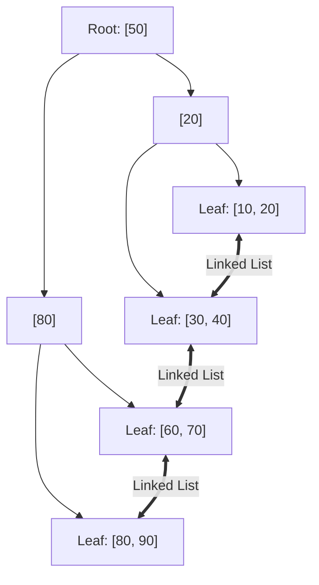
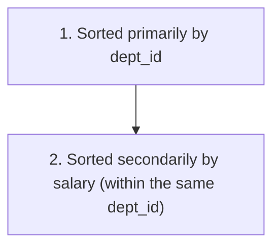

# Phase 8 — Indexing & Query Performance

Moving from database **correctness** to **performance**, indexing is the most impactful tool software engineers use to accelerate slow queries. For fresher interviews, the priority is to understand **how indexes work conceptually (B+ Trees, Hash), when to create them, and how to analyze queries using `EXPLAIN`**.

---

## 1. What is an Index?

An **Index** is an auxiliary data structure (typically a B+ Tree) created on one or more columns of a database table that enables the engine to **locate specific rows quickly without scanning every single row in the table**.

```mermaid
graph LR
    subgraph Full Table Scan (No Index)
        direction TB
        F1["Row 1"] --> F2["Row 2"] --> F3["..."] --> FN["Row 10,000,000"]
    end
    subgraph Index Lookup (With B+ Tree Index)
        direction TB
        Root["Root Node"] --> Branch["Internal Node"] --> Leaf["Leaf Node -> Direct Pointer to Row"]
    end
```

### The Book Index Analogy
Imagine a 1,000-page book on Computer Science:
- **Without an Index**: To find where "Deadlock" is discussed, you must flip through and read all 1,000 pages one by one (a **Full Table Scan**).
- **With an Index**: Turn to the back of the book, look up `"Deadlock"` under 'D', find `page 452`, and jump straight there (an **Index Lookup**).

---

## 2. Why Indexing is Needed

Consider a table with $10{,}000{,}000$ employee records:

```sql
SELECT * 
FROM Employee 
WHERE employee_id = 5000000;
```

- **Without an Index**: The database reads millions of disk blocks from storage, evaluating every row sequentially ($O(N)$ time complexity). This takes several seconds or minutes.
- **With an Index on `employee_id`**: The database navigates a balanced B+ Tree in $3\text{--}4$ disk block reads ($O(\log N)$ time complexity). The query executes in under **1 millisecond**.

Indexes dramatically accelerate queries containing:
- `WHERE` filtering clauses
- `JOIN` conditions (`ON a.dept_id = b.dept_id`)
- `ORDER BY` sorting clauses
- `GROUP BY` aggregations

---

## 3. Clustered vs Non-Clustered (Secondary) Index

```mermaid
graph TD
    subgraph Clustered Index (Table IS the Index)
        C_Root["B+ Tree Root"] --> C_Leaf["Leaf Pages: Contain ACTUAL ROW DATA"]
    end
    subgraph Non-Clustered Index (Secondary Index)
        NC_Root["Secondary B+ Tree Root"] --> NC_Leaf["Leaf Pages: Contain Key + Pointer to Row"]
        NC_Leaf --> TableData["Table Heap / Clustered PK Lookup"]
    end
```

### Clustered Index
- Determines the **physical/logical storage order of the actual rows** on disk.
- Because physical rows can only be sorted in one order, a table can have **only ONE clustered index**.
- In **MySQL InnoDB**, the **Primary Key is automatically the Clustered Index**. The leaf nodes of the B+ Tree contain the full table row data.

### Non-Clustered Index (Secondary Index)
- A separate, distinct index structure that stores the indexed column values along with a **pointer/reference** to the actual row (such as the Primary Key or Row ID).
- A table can have **multiple non-clustered indexes** (e.g., on `email`, `created_at`, `status`).
- Querying a secondary index often involves two steps: looking up the secondary index to find the primary key, then looking up the clustered index to fetch the full row (**Bookmark / Key Lookup**).

---

## 4. B-Tree vs B+ Tree Indexes

Relational databases overwhelmingly use **B+ Trees** rather than standard binary search trees (BSTs) or standard B-Trees.

```text
Standard B-Tree:
Key values and actual record data pointers are stored in BOTH internal and leaf nodes.

B+ Tree:
Internal nodes store ONLY search keys (route guides).
ALL data pointers reside exclusively in the LEAF nodes.
Leaf nodes are linked together as a doubly linked list!
```



### Why B+ Trees are Preferred for Databases (Core Interview Question):
1. **Higher Fan-out & Shallow Depth**: Because internal nodes only store keys (not data records), hundreds of keys fit in a single disk page. A 4-level B+ Tree can index billions of rows. Fewer levels mean fewer disk I/O operations.
2. **Fast Range Queries & Sequential Scans**: Because leaf nodes are linked sequentially in a linked list, range queries (`WHERE age BETWEEN 20 AND 30`) simply locate the starting leaf and traverse forward horizontally without re-traversing the tree!
3. **Predictable $O(\log N)$ Lookup**: Every search path from root to leaf has the exact same depth.

---

## 5. Hash Indexes

A **Hash Index** uses a hash function to map column keys into hash buckets in $O(1)$ constant time.

```text
Key: 'alice@email.com' ──► Hash Function ──► Bucket Address #42 ──► Row Location
```

### B+ Tree Index vs Hash Index Comparison

| Feature | B+ Tree Index | Hash Index |
|---|---|---|
| **Equality Queries (`=`)** | Fast ($O(\log N)$) | **Ultra Fast ($O(1)$)** |
| **Range Queries (`<`, `>`, `BETWEEN`)** | **Supported & very fast** | ❌ **Unsupported** (hashes do not preserve order) |
| **Sorting (`ORDER BY`)** | **Supported** (leaf nodes sorted) | ❌ **Unsupported** |
| **Prefix Matching (`LIKE 'Ali%'`)** | **Supported** | ❌ **Unsupported** |
| **Default in RDBMS** | Yes (InnoDB, Postgres default) | Specialized (Memory tables, Redis) |

---

## 6. Composite Indexes & The Leftmost-Prefix Rule

A **Composite Index** (multi-column index) indexes two or more columns together in a single structure:

```sql
CREATE INDEX idx_dept_salary ON Employee (dept_id, salary);
```



### The Leftmost-Prefix Rule (Crucial Interview Concept)
The database can only use a composite index if the query filters include the **leftmost column** of the index definition:

| Query Condition | Uses `idx_dept_salary(dept_id, salary)`? | Explanation |
|---|:---:|---|
| `WHERE dept_id = 10 AND salary = 50000` | ✅ **Yes (Full index)** | Uses both columns |
| `WHERE dept_id = 10` | ✅ **Yes (Partial index)** | Leftmost prefix `dept_id` is present |
| `WHERE dept_id = 10 AND salary > 40000` | ✅ **Yes** | Prefix equality + range on second column |
| `WHERE salary = 50000` | ❌ **NO** | Leftmost column `dept_id` is missing! |

> [!TIP]
> Think of a telephone directory sorted by `(LastName, FirstName)`. You can easily search for `"Smith, John"` or all `"Smith"`s, but searching for anyone with first name `"John"` requires scanning the entire directory!

---

## 7. Unique and Covering Indexes

### Unique Index
Ensures that all non-null values in the indexed column are distinct across the table. When you declare a `UNIQUE` constraint in DDL, the database engine creates a unique index behind the scenes to enforce it.

```sql
CREATE UNIQUE INDEX idx_emp_email ON Employee (email);
```

### Covering Index (Index-Only Scan)
A **Covering Index** is an index that contains **every single column requested by a query** (both in the `SELECT`, `WHERE`, and `JOIN` clauses).

Consider the query:
```sql
SELECT name, salary 
FROM Employee 
WHERE dept_id = 10;
```

If we have an index:
```sql
CREATE INDEX idx_covering ON Employee (dept_id, name, salary);
```

The database satisfies the entire query **directly from the index pages** without ever reading the main table heap! This eliminates table bookmark lookups and dramatically improves read throughput.

---

## 8. Index Selectivity

**Selectivity** measures how uniquely a column distinguishes between rows in a table:

$$\text{Selectivity} = \frac{\text{Number of Distinct Values}}{\text{Total Number of Rows}}$$

- **High Selectivity ($\approx 1.0$)**: Almost every row has a distinct value (e.g., `id`, `email`, `SSN`). Indexes are **extremely efficient** here because they quickly narrow down millions of rows to 1 or 2 rows.
- **Low Selectivity ($\approx 0.0$)**: A tiny number of distinct values repeated millions of times (e.g., `gender`, `is_active`, `marital_status`). Indexes are **rarely used** by the optimizer here because scanning the index plus fetching table rows is often more expensive than a sequential table scan.

---

## 9. When Indexes Help vs When Indexes Hurt

```mermaid
graph TD
    subgraph Benefits (Reads)
        B1["Instant equality lookups"]
        B2["Fast range scans"]
        B3["Eliminate in-memory sorting for ORDER BY"]
        B4["Enforce UNIQUE constraints"]
    end
    subgraph Costs (Writes & Storage)
        C1["Extra disk & RAM storage"]
        C2["DML Overhead: INSERT/UPDATE/DELETE must update all indexes"]
        C3["Index fragmentation requiring defragmentation"]
    end
```

> [!CAUTION]
> **Golden Interview Rule: Do NOT Index Everything!**
> While indexes dramatically accelerate reads, every additional index slows down `INSERT`, `UPDATE`, and `DELETE` operations because the engine must rebalance B+ Tree nodes on every write.

---

## 10. Query Execution Plans & EXPLAIN

The database **Query Optimizer** inspects statistics about tables and indexes to determine the fastest physical execution strategy for each SQL query.

The `EXPLAIN` keyword displays the generated execution plan:

```sql
EXPLAIN SELECT * FROM Employee WHERE dept_id = 10;
```

### Common Output Fields to Understand:
- **`type` (Access Type)**:
  - `const` / `eq_ref`: Best. Direct lookup via primary key or unique index.
  - `ref`: Lookup using non-unique index.
  - `range`: Range scan using index (e.g. `BETWEEN`, `>`, `<`).
  - `index`: Full index scan (reading the entire index).
  - `ALL`: **Worst. Full Table Scan** (reading all rows on disk).
- **`possible_keys`**: Indexes the optimizer considered.
- **`key`**: The actual index chosen by the optimizer.
- **`rows`**: Estimated number of rows the engine expects to read.
- **`Extra`**:
  - `Using index`: **Covering index!** Best possible result.
  - `Using where`: Filtering rows.
  - `Using filesort`: Bad. Required an extra sorting pass because no index sorted the data.
  - `Using temporary`: Bad. Created a temporary disk table for `GROUP BY`/`DISTINCT`.

---

## 11. Practical Query Optimization Checklist

When asked in an interview how you would optimize a slow database query, structure your answer using these best practices:

1. **Avoid `SELECT *`**: Fetch only necessary columns to reduce I/O and enable covering indexes.
2. **Verify Index Usage with `EXPLAIN`**: Check for `type: ALL` (full table scan) and missing index usage.
3. **Respect the Leftmost-Prefix Rule**: Design composite indexes matching filter combinations.
4. **Avoid Functions on Indexed Columns**:
   ```sql
   -- BAD: Disables index on created_at
   WHERE YEAR(created_at) = 2026;
   
   -- GOOD: Utilizes index range scan
   WHERE created_at >= '2026-01-01' AND created_at < '2027-01-01';
   ```
5. **Use `LIMIT` with Pagination**: Restrict payload size for UI listings.
6. **Prefer `UNION ALL` over `UNION`**: When duplicates are either impossible or acceptable.
7. **Ensure Appropriate Data Types**: Mismatched types (e.g., comparing string to integer) trigger implicit type conversions that bypass indexes.

---

## 12. Complete Master Review: The Top Interview Comparisons

| Concept Pair | Core Distinction |
|---|---|
| **Atomicity vs Durability** | **Atomicity**: All or nothing before commit.<br/>**Durability**: Committed changes survive system crashes. |
| **Dirty Read vs Non-Repeatable Read** | **Dirty Read**: Reads uncommitted data that may roll back.<br/>**Non-Repeatable Read**: Reads committed data that changes between queries. |
| **Non-Repeatable Read vs Phantom Read** | **Non-Repeatable Read**: Existing row's column value changes.<br/>**Phantom Read**: The *set* of rows matching a predicate changes due to `INSERT`/`DELETE`. |
| **Shared vs Exclusive Lock** | **Shared (S)**: Read lock; multiple readers allowed.<br/>**Exclusive (X)**: Write lock; only one writer, blocks all readers and writers. |
| **Clustered vs Non-Clustered** | **Clustered**: Organizes physical table rows (1 per table).<br/>**Non-Clustered**: Separate index pointing back to row location (multiple allowed). |
| **B+ Tree vs Hash Index** | **B+ Tree**: Supports equality, ranges (`<`, `>`), and sorting (`ORDER BY`).<br/>**Hash**: Supports equality ($O(1)$) only; no range queries. |
| **High vs Low Selectivity** | **High**: Column has mostly unique values (ideal for indexing).<br/>**Low**: Column has few distinct values (poor candidate for indexing). |

---

## 13. Fresher SDE Interview Priority Roadmap

### Must Master (Core 90% of Placement Questions)
1. **Transactions & ACID Properties**: Definitions, transfer example, real-world failure scenarios.
2. **Concurrency Anomalies**: Dirty read, non-repeatable read, phantom read, lost update.
3. **Isolation Levels**: Standard 4 levels and the anomaly prevention table.
4. **Locks & Deadlocks**: Shared vs Exclusive locks, circular wait, lock ordering mitigation.
5. **What an Index is**: Book index analogy, B+ Tree shallow fan-out intuition.
6. **Composite Indexes**: The leftmost-prefix rule.
7. **Index Trade-offs**: When indexes help vs when they hurt write latency.
8. **`EXPLAIN` & Query Optimization**: Identifying full table scans, avoiding `SELECT *`, indexing filter columns.

### Good to Know (Differentiating Knowledge)
9. **`SAVEPOINT`**: Partial rollbacks.
10. **Covering Index**: Index-only scans without table heap access.
11. **Hash Indexes**: Fast equality lookups vs range limitations.
12. **B-Tree vs B+ Tree**: Why linked leaf nodes favor databases.
13. **Clustered Indexing**: InnoDB primary key clustering behavior.
