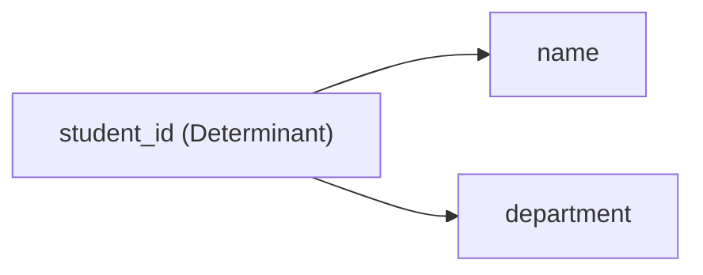
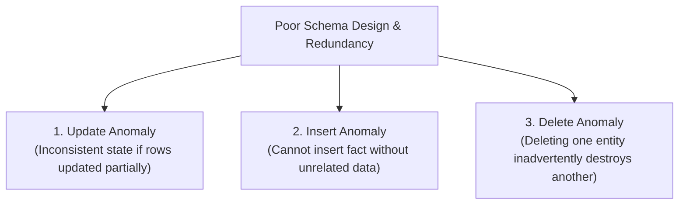
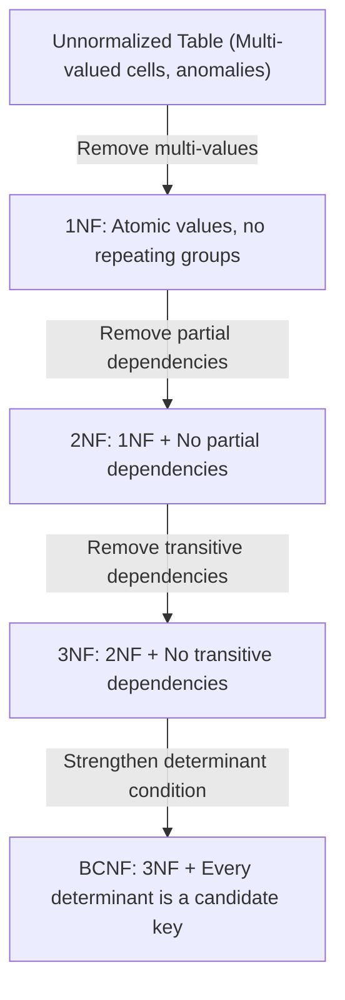
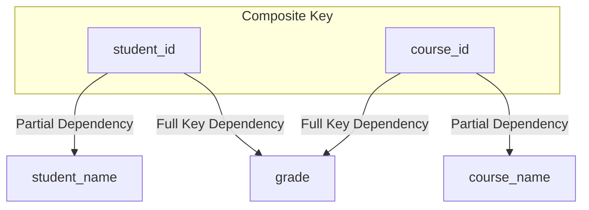
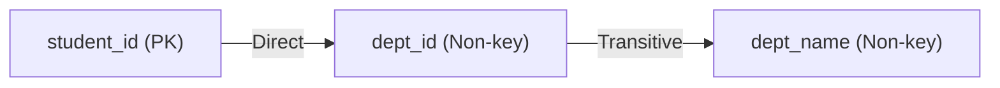

# Phase 5 — Database Design & Normalization

For fresher software engineering interviews, database design questions focus heavily on **functional dependencies, data anomalies, and normal forms (1NF, 2NF, 3NF, BCNF)**. Interviewers want to see that you understand **why** tables are normalized (to eliminate anomalies) and **when** to denormalize (to optimize read-heavy workloads).

---

## 1. Functional Dependencies (FD)

A **Functional Dependency (FD)** describes a mathematical relationship between attributes within a relation:

$$\text{Attribute } A \rightarrow \text{Attribute } B$$

Read as: **"$A$ functionally determines $B$"** or **"$B$ is functionally dependent on $A$"**.

> [!NOTE]
> **Definition:**
> If we know the value of $A$, we can uniquely and unambiguously determine the value of $B$. $A$ is called the **Determinant**, and $B$ is the **Dependent**.

### Example: Student Records

```text
STUDENT
+------------+-------+------------+
| student_id | name  | department |
+------------+-------+------------+
| 1          | Alice | CSE        |
| 2          | Bob   | ECE        |
| 3          | Carol | CSE        |
+------------+-------+------------+
```

Here:
- `student_id → name`: If you know `student_id = 1`, the name is guaranteed to be `Alice`.
- `student_id → department`: If you know `student_id = 1`, the department is guaranteed to be `CSE`.



### Contrast: Can `name → student_id`?
**No!** Two students can share the same name (e.g., two different students named "Rahul"). Therefore, knowing the name does not uniquely identify a single `student_id`.

```text
employee_id → employee_name   (VALID: IDs are unique)
employee_name → employee_id   (INVALID: Names can duplicate)
```

> [!TIP]
> **Why do Functional Dependencies matter for interviews?**
> Functional dependencies are the formal mathematical rules used to evaluate whether a table is in **1NF, 2NF, 3NF, or BCNF**.

---

## 2. Database Redundancy

**Redundancy** means unnecessarily storing duplicate copies of the same piece of information across multiple rows.

Consider this unnormalized table:

```text
STUDENT_ENROLLMENT
+------------+--------------+---------+------------+
| student_id | student_name | dept_id | dept_name  |
+------------+--------------+---------+------------+
| 1          | Alice        | 10      | CSE        |
| 2          | Bob          | 10      | CSE        |
| 3          | Carol        | 10      | CSE        |
| 4          | David        | 20      | ECE        |
+------------+--------------+---------+------------+
```

Notice:
- `'CSE'` is stored repeatedly for every single student in department `10`.
- If a department has $10{,}000$ students, the string `'Computer Science and Engineering'` is duplicated $10{,}000$ times!

### Why is Data Redundancy Bad?
1. **Wasted disk and memory storage**.
2. **Degraded write/update performance**.
3. **Risk of data inconsistency**.
4. **Data anomalies** during daily operations.

---

## 3. Data Anomalies (Update, Insert, Delete)

Poor table design with uncontrolled redundancy leads to three classic operational pitfalls known as **anomalies**.



### A. Update Anomaly
An update anomaly occurs when changing a single real-world fact requires updating multiple duplicate rows.

```text
+------------+---------+---------+-----------+
| student_id | student | dept_id | dept_name |
+------------+---------+---------+-----------+
| 1          | Alice   | 10      | CSE       |
| 2          | Bob     | 10      | CSE       |
+------------+---------+---------+-----------+
```

If Department `10` is renamed to `'Computer Science'`:
- We must update row 1 AND row 2.
- If an update modifies Alice's row but fails/crashes before updating Bob's row:
  - Alice shows `dept_id = 10, dept_name = 'Computer Science'`
  - Bob shows `dept_id = 10, dept_name = 'CSE'`
- The database is now in a corrupted, contradictory state!

---

### B. Insert Anomaly
An insert anomaly occurs when certain attributes cannot be inserted into the database without the presence of other unrelated attributes.

Suppose department information can only be stored inside the `STUDENT` table:

```text
Table: (student_id, student_name, dept_id, dept_name)
Primary Key: student_id
```

What if the college creates a brand new department:
- `dept_id = 30`, `dept_name = 'Mechanical Engineering'`
- Currently has **0 enrolled students**.

Since `student_id` is the primary key (and primary keys cannot be `NULL`), **we cannot insert the new department into the database at all** until the first student enrolls!

---

### C. Delete Anomaly
A delete anomaly occurs when deleting one piece of information unintentionally destroys an entirely different, unrelated piece of information.

```text
+------------+---------+---------+-----------+
| student_id | student | dept_id | dept_name |
+------------+---------+---------+-----------+
| 1          | Alice   | 10      | CSE       |
+------------+---------+---------+-----------+
```

Suppose Alice is the only student remaining in department `10 (CSE)`. If Alice graduates or drops out:
- Deleting Alice's row removes student `1`.
- **Inadvertent loss**: We completely lose all record that Department `10 (CSE)` ever existed!

---

## 4. What is Normalization?

**Normalization** is the systematic process of decomposing tables with redundant data and anomalies into two or more well-structured tables to ensure **data integrity** and **minimize redundancy**.



---

## 5. First Normal Form — 1NF

A relation is in **First Normal Form (1NF)** if and only if:
1. Every attribute cell holds **atomic (indivisible) single values**.
2. There are **no repeating groups** or arrays within a single column.
3. Each record is uniquely identifiable (has a primary key).

### ❌ Violates 1NF (Non-Atomic Values):

```text
STUDENT
+----+-------+--------------------+
| id | name  | phone              |
+----+-------+--------------------+
| 1  | Alice | 9876543210, 876543 |  <-- Multiple values in one cell!
| 2  | Bob   | 9999888877         |
+----+-------+--------------------+
```

### ✅ Decomposed into 1NF:

Separate the multi-valued attribute into its own relation linked by a foreign key:

```text
STUDENT
+----+-------+
| id | name  |
+----+-------+
| 1  | Alice |
| 2  | Bob   |
+----+-------+

STUDENT_PHONE
+------------+------------+
| student_id | phone      |
+------------+------------+
| 1          | 9876543210 |
| 1          | 8765432100 |
| 2          | 9999888877 |
+------------+------------+
```

> [!NOTE]
> **Interview Definition:**
> *"1NF requires every attribute value to be atomic, with no comma-separated lists or repeating groups in a single column."*

---

## 6. Second Normal Form — 2NF

A relation is in **Second Normal Form (2NF)** if and only if:
1. It is already in **1NF**.
2. There is **no partial functional dependency** (no non-prime attribute depends on a proper subset of a composite candidate key).

> [!IMPORTANT]
> **Crucial Rule:**
> **2NF is only relevant when a table has a COMPOSITE Primary Key.**
> If a table has a single-column primary key and is in 1NF, it is **automatically in 2NF**!

### ❌ Violates 2NF (Partial Dependency):

Consider course enrollments where the composite primary key is `(student_id, course_id)`:

```text
ENROLLMENT
+------------+-----------+--------------+-------------+-------+
| student_id | course_id | student_name | course_name | grade |
+------------+-----------+--------------+-------------+-------+
| 1          | 101       | Alice        | DBMS        | A     |
| 1          | 102       | Alice        | OS          | B     |
| 2          | 101       | Bob          | DBMS        | A     |
+------------+-----------+--------------+-------------+-------+
```

Functional Dependencies:
- `(student_id, course_id) → grade` (Full key dependency: requires BOTH to determine grade)
- `student_id → student_name` (**PARTIAL DEPENDENCY**: depends only on `student_id`!)
- `course_id → course_name` (**PARTIAL DEPENDENCY**: depends only on `course_id`!)



### ✅ Decomposed into 2NF:

Move partially dependent attributes into their own dedicated parent tables:

```sql
-- 1. Student Table
CREATE TABLE Student (
    student_id INT PRIMARY KEY,
    student_name VARCHAR(50)
);

-- 2. Course Table
CREATE TABLE Course (
    course_id INT PRIMARY KEY,
    course_name VARCHAR(50)
);

-- 3. Enrollment Table (Full Dependency Only)
CREATE TABLE Enrollment (
    student_id INT,
    course_id INT,
    grade CHAR(2),
    PRIMARY KEY (student_id, course_id),
    FOREIGN KEY (student_id) REFERENCES Student(student_id),
    FOREIGN KEY (course_id) REFERENCES Course(course_id)
);
```

---

## 7. Third Normal Form — 3NF

A relation is in **Third Normal Form (3NF)** if and only if:
1. It is already in **2NF**.
2. There are **no transitive dependencies** (no non-prime attribute depends on another non-prime attribute).

### What is a Transitive Dependency?
If attribute $A$ determines $B$, and $B$ determines $C$:
$$A \rightarrow B \quad \text{and} \quad B \rightarrow C \implies A \rightarrow C$$
Then $C$ is transitively dependent on $A$ through $B$.

### ❌ Violates 3NF (Transitive Dependency):

```text
STUDENT
+------------+--------------+---------+------------+
| student_id | student_name | dept_id | dept_name  |
+------------+--------------+---------+------------+
| 1          | Alice        | 10      | CSE        |
| 2          | Bob          | 20      | ECE        |
| 3          | Carol        | 10      | CSE        |
+------------+--------------+---------+------------+
```

Dependencies:
- `student_id → dept_id` (`student_id` is PK)
- `dept_id → dept_name` (non-prime attribute determines another non-prime attribute!)
- Therefore, `student_id → dept_name` is **transitive**!



### ✅ Decomposed into 3NF:

Extract the transitive relationship into an independent `DEPARTMENT` relation:

```sql
-- Student Table
CREATE TABLE Student (
    student_id INT PRIMARY KEY,
    student_name VARCHAR(50),
    dept_id INT,
    FOREIGN KEY (dept_id) REFERENCES Department(dept_id)
);

-- Department Table
CREATE TABLE Department (
    dept_id INT PRIMARY KEY,
    dept_name VARCHAR(50)
);
```

### Easy Memory Hook
> **"Every non-key attribute must provide a fact about the key, the whole key (2NF), and nothing but the key (3NF), so help me Codd."**

---

## 8. Boyce-Codd Normal Form (BCNF)

**BCNF (Boyce-Codd Normal Form)**, sometimes informally called **3.5NF**, is a stricter version of 3NF.

> [!NOTE]
> **BCNF Formal Rule:**
> For every non-trivial functional dependency $X \rightarrow Y$, **$X$ MUST be a Super Key**.
> In simple words: **Every determinant must be a candidate key.**

### When can a table be in 3NF but violate BCNF?
This occurs when:
1. The relation has multiple overlapping candidate keys.
2. An attribute of a candidate key depends on a non-candidate key attribute.

### Example: Professor Course Assignment

```text
STUDENT_COURSE_ADVISOR
+---------+--------+------------+
| student | course | instructor |
+---------+--------+------------+
| Alice   | DBMS   | Dr. John   |
| Bob     | DBMS   | Dr. John   |
| Carol   | OS     | Dr. Mike   |
+---------+--------+------------+
```

Assumptions:
- For each course, each instructor teaches only one course $\rightarrow \text{instructor} \rightarrow \text{course}$.
- A student can take multiple courses, but for each course has one instructor $\rightarrow (\text{student}, \text{course}) \rightarrow \text{instructor}$.

Candidate Keys:
- `(student, course)`
- `(student, instructor)`

Problem:
- `instructor → course` is a valid functional dependency.
- But `instructor` alone is **NOT a candidate key / super key**!
- This satisfies 3NF (because `course` is a prime attribute), but **violates BCNF**.

### Fresher Interview Takeaway
For fresher SDE interviews, remember:
- **3NF**: Removes transitive dependencies.
- **BCNF**: Guarantees that *every single determinant* is a candidate key.
- You are rarely asked to perform mathematical BCNF matrix decompositions; explaining the definition and why it is stricter than 3NF is typically sufficient.

---

## 9. Denormalization

**Denormalization** is the intentional, strategic introduction of redundancy into a normalized database to optimize query performance, eliminate expensive multi-table joins, or simplify reporting queries.

```text
Fully Normalized (3NF):
Read Student Department requires:
STUDENT (JOIN) DEPARTMENT ON student.dept_id = department.dept_id
(At 50,000 queries per second, this JOIN incurs significant CPU overhead)

Denormalized:
STUDENT table stores:
(student_id, student_name, dept_id, dept_name)
(Zero joins required! Blazing fast reads, but updates require extra care)
```

### Common Denormalization Techniques
1. **Pre-computing aggregates**: Storing `total_order_amount` on `Orders` rather than running `SUM(price * qty)` on `Order_Items` every time.
2. **Replicating parent names**: Storing `user_name` alongside `user_id` in comments/posts.
3. **Data Warehouses & OLAP**: Schemas like Star Schema and Snowflake Schema are deliberately denormalized for analytical throughput.

---

## 10. Normalization vs Denormalization

| Feature | Normalization | Denormalization |
|---|---|---|
| **Goal** | Eliminate redundancy & data anomalies | Optimize read performance & throughput |
| **Number of Tables** | High (decomposed into many smaller tables) | Low (fewer, consolidated wider tables) |
| **Joins Needed** | Frequent (multi-table queries) | Minimal / None |
| **Write Performance** | Faster (writes only happen in one place) | Slower (updates must modify duplicate copies) |
| **Read Performance** | Slower for complex reporting (heavy joins) | Significantly faster for high-volume reads |
| **Storage Usage** | Optimized / Minimal | Higher (redundant duplicate data) |
| **Best Used In** | **OLTP** (Online Transaction Processing, banking, e-commerce transactions) | **OLAP** (Data Warehousing, caching, analytics, social media feeds) |

> [!NOTE]
> **Summary Interview Pitch:**
> *"Normalization optimizes for write integrity and consistency by removing redundancy. Denormalization trades off storage and write speed to optimize read performance and avoid expensive joins in high-traffic applications."*
