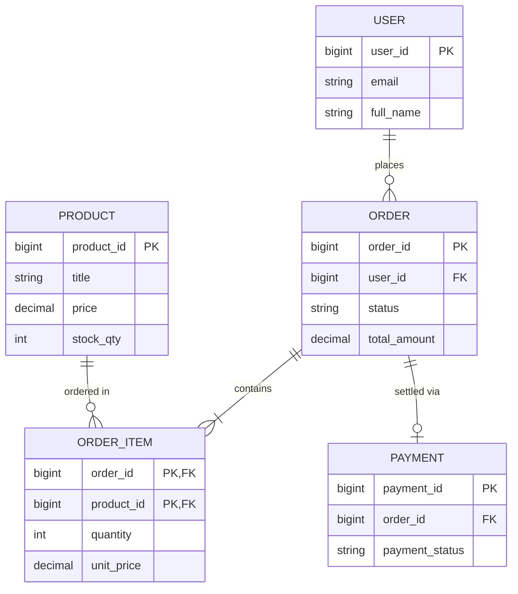
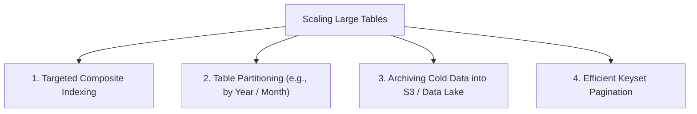
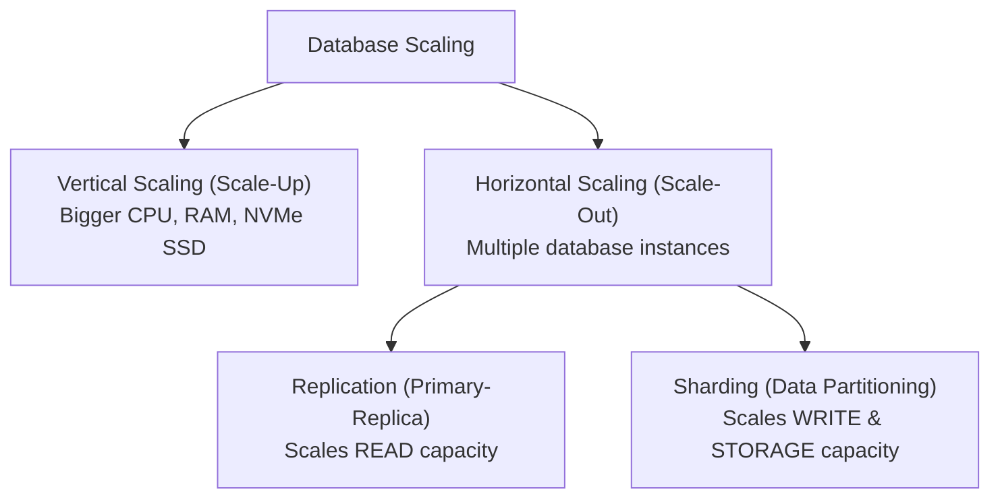
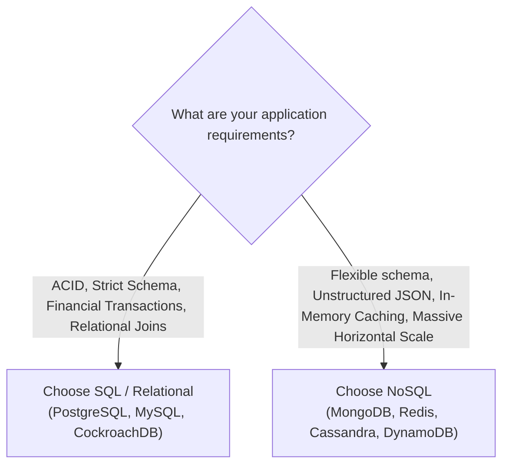

# Phase 10 — Real-World Database Design & Application Architecture

In senior rounds or system design discussions for fresher SDE roles, interviewers often ask practical, applied questions such as:
> *"Design the database schema for an e-commerce platform like Amazon or Swiggy. How would you handle high traffic, pagination, security, and scaling?"*

This final phase bridges theoretical database concepts with real-world software engineering practice.

---

## 1. Choosing Entities & Modeling Relationships

When tasked with designing a database for an application, start by identifying the core business **entities** and their **cardinalities**.

### Real-World Example: E-Commerce Store
Core Entities:
- **User**: Customers placing orders.
- **Product**: Items listed in the catalog with prices and stock.
- **Order**: High-level purchase metadata (total amount, timestamps, status).
- **OrderItem**: Individual line items within an order.
- **Payment**: Payment transaction status and gateway references.



> [!IMPORTANT]
> **Anti-Pattern Warning:**
> Never put multi-valued columns like `product_1`, `product_2`, `product_3` directly in the `Order` table! This violates 1NF and makes querying, aggregation, and inventory tracking nearly impossible. Always use a separate `OrderItem` associative table.

---

## 2. Complete Production Schema Design

Here is the clean SQL DDL implementation representing these relationships:

```sql
-- 1. Users Table
CREATE TABLE Users (
    user_id BIGINT AUTO_INCREMENT PRIMARY KEY,
    email VARCHAR(100) NOT NULL UNIQUE,
    full_name VARCHAR(100) NOT NULL,
    created_at TIMESTAMP DEFAULT CURRENT_TIMESTAMP
);

-- 2. Products Table
CREATE TABLE Products (
    product_id BIGINT AUTO_INCREMENT PRIMARY KEY,
    title VARCHAR(150) NOT NULL,
    price DECIMAL(10, 2) NOT NULL CHECK (price >= 0),
    stock_quantity INT NOT NULL DEFAULT 0 CHECK (stock_quantity >= 0)
);

-- 3. Orders Table
CREATE TABLE Orders (
    order_id BIGINT AUTO_INCREMENT PRIMARY KEY,
    user_id BIGINT NOT NULL,
    status VARCHAR(20) NOT NULL DEFAULT 'PENDING',
    shipping_address TEXT NOT NULL,
    total_amount DECIMAL(10, 2) NOT NULL DEFAULT 0.00,
    created_at TIMESTAMP DEFAULT CURRENT_TIMESTAMP,
    FOREIGN KEY (user_id) REFERENCES Users(user_id)
);

-- 4. Order Items Table (Junction Table)
CREATE TABLE OrderItems (
    order_id BIGINT NOT NULL,
    product_id BIGINT NOT NULL,
    quantity INT NOT NULL CHECK (quantity > 0),
    unit_price DECIMAL(10, 2) NOT NULL, -- Price snapshot at purchase time!
    PRIMARY KEY (order_id, product_id),
    FOREIGN KEY (order_id) REFERENCES Orders(order_id) ON DELETE CASCADE,
    FOREIGN KEY (product_id) REFERENCES Products(product_id)
);
```

---

## 3. Primary Key Design: Auto-Increment BigInt vs UUID

A common system design question: **"Should I use an auto-increment integer or a UUID for the primary key?"**

```text
Auto-Increment BIGINT:   1, 2, 3, 4, 5
UUID (v4):               550e8400-e29b-41d4-a716-446655440000
```

### Direct Comparison:

| Feature | Auto-Increment `BIGINT` | `UUID` (Universally Unique ID) |
|---|---|---|
| **Storage Size** | **8 bytes** | **16 bytes** (or 36 bytes as string) |
| **B+ Tree Index Efficiency** | **Extremely high** (sequential appends prevent page splits) | **Poor in random v4** (causes high page fragmentation) |
| **Distributed Generation** | Needs a centralized database or ticket server | **Can be generated anywhere on clients / microservices** |
| **Enumeration Attack Risk** | High (e.g., scraping `api/users/1`, `api/users/2`) | **Safe** (unguessable random strings) |
| **Best Used For** | Standard monolithic apps, internal tables, high-scale transactional tables | Multi-region distributed systems, public APIs, client-generated IDs |

> [!TIP]
> **Modern Best Practice:**
> If you want the benefits of both, use **UUIDv7** (time-ordered sequential UUIDs) or store an internal `BIGINT` for clustered B+ Tree performance while exposing an external `UUID` or `Public_ID` in public APIs.

---

## 4. Normalization vs Practical Denormalization

In real-world production architectures, we do not dogmatically normalize to 3NF/BCNF. We make deliberate, strategic trade-offs:

### The Historical Price Snapshot
Notice the `unit_price` column in our `OrderItems` table above:
- *Strict Normalization View*: "Why store `unit_price` in `OrderItems` when you can just join with `Products.price`?"
- *Real-World Business Reality*: If a product's price increases from ₹500 to ₹600 next week, **old orders must still reflect that the customer bought it for ₹500!** Storing `unit_price` directly in `OrderItems` preserves an immutable financial audit trail.

### The Shipping Address Snapshot
Similarly, storing `shipping_address` directly on `Orders` ensures that if a user later updates their profile address, past deliveries remain historically accurate.

> [!NOTE]
> **Practical Engineering Rule:**
> *"Start with a clean 3NF normalized schema. Denormalize only for immutable historical snapshots or demonstrated read-throughput bottlenecks."*

---

## 5. Handling High-Scale Tables (100M+ Rows)

When a table like `Orders` grows to 500 million rows, standard queries start slowing down. You should discuss these scaling solutions in interviews:



1. **Selective Indexing**: Index only the combinations searched by the application (e.g., `(user_id, status)`).
2. **Table Partitioning**: Split a single logical table physically across multiple partitions on disk (e.g., partitioning `Orders` by `YEAR(created_at)`). The engine can prune entire partitions during queries.
3. **Cold Storage Archiving**: Move completed orders older than 2 years into cold analytical storage (like Snowflake, BigQuery, or Amazon S3 Parquet files).

---

## 6. Pagination: LIMIT + OFFSET vs Keyset (Cursor) Pagination

When returning lists of products or orders to a frontend, you must paginate the results.

### Method 1: `OFFSET` Pagination (Simple but Inefficient)
```sql
SELECT * FROM Product 
ORDER BY id ASC 
LIMIT 20 OFFSET 5000000; -- Page 250,001
```

```text
The Deep Offset Problem:
The database must physically read and scan 5,000,020 rows, 
discard the first 5,000,000 rows, and return only the last 20 rows!
Execution Time: ~3-5 seconds!
```

### Method 2: Keyset / Cursor Pagination (Production Standard)
Instead of asking the database to skip 5 million rows, pass the **last ID seen on the previous page**:

```sql
SELECT * FROM Product 
WHERE id > 5000000 
ORDER BY id ASC 
LIMIT 20;
```

```text
Cursor Execution:
The B+ Tree index jumps directly to id = 5000001 in O(log N) time,
reads exactly 20 consecutive rows, and returns immediately!
Execution Time: < 1 millisecond!
```

| Pagination Type | Simplicity | Deep Page Performance | Infinite Scroll / APIs |
|---|---|---|---|
| **`OFFSET` Pagination** | Easy (`page_num * limit`) | **Degrades to $O(N)$** | Jumps to arbitrary pages |
| **Keyset / Cursor Pagination** | Requires state (`last_id`) | **Consistent $O(\log N)$** | **Ideal for modern web & mobile APIs** |

---

## 7. Multi-Statement Transactions in Code

In a real web application (e.g., Node.js, Spring Boot, Go, Django), checkout must execute within a strict transactional boundary:

```sql
START TRANSACTION;

-- 1. Create order record
INSERT INTO Orders (user_id, total_amount, shipping_address)
VALUES (42, 1200.00, 'Bengaluru, India');
SET @new_order_id = LAST_INSERT_ID();

-- 2. Add line item
INSERT INTO OrderItems (order_id, product_id, quantity, unit_price)
VALUES (@new_order_id, 101, 2, 600.00);

-- 3. Decrement inventory (Safe atomic update)
UPDATE Products 
SET stock_quantity = stock_quantity - 2 
WHERE product_id = 101 AND stock_quantity >= 2;

-- If stock_quantity was insufficient, rows affected is 0 -> ROLLBACK!
-- Otherwise:
COMMIT;
```

---

## 8. Database Connection Pooling

Opening a raw database connection involves a heavy **TCP handshake, TLS negotiation, authentication, and memory allocation** on the database server (~50–100ms per connection).

```mermaid
graph TD
    subgraph Without Connection Pool
        R1["Request 1"] -->|Opens new TCP/TLS connection (100ms)| DB1["Database Server"]
        R2["Request 2"] -->|Opens new TCP/TLS connection (100ms)| DB1
        R3["1000 Requests"] -->|Server exhausts connection limit -> CRASH!| DB1
    end
```

```mermaid
graph TD
    subgraph With Connection Pool (e.g., HikariCP, PgBouncer)
        Requests["Incoming Web Requests"] --> Pool["Connection Pool (e.g., 20 warm connections)"]
        Pool -->|Borrow warm connection (0ms)| DB2["Database Server (Healthy & protected)"]
        DB2 -->|Return connection back to pool| Pool
    end
```

### Benefits of Connection Pooling:
- **Zero connection latency**: Connections remain pre-warmed and ready in RAM.
- **Overload Protection**: Caps the maximum number of concurrent database connections, preventing traffic spikes from taking down the database.

---

## 9. Security: SQL Injection & Prepared Statements

> [!CAUTION]
> **SQL Injection is the #1 database security risk tested in software engineering interviews.**

### The Vulnerability: Raw String Concatenation
Suppose a backend developer writes:
```javascript
// DANGEROUS! Never do this!
const query = "SELECT * FROM Users WHERE email = '" + userInput + "' AND password = '" + pass + "'";
```

If an attacker enters this as `userInput`:
```text
admin@example.com' OR '1'='1
```

The resulting query becomes:
```sql
SELECT * FROM Users WHERE email = 'admin@example.com' OR '1'='1' AND password = '...';
```
Since `'1'='1'` is always true, the attacker logs in as the administrator without knowing the password!

### The Solution: Prepared Statements (Parameterized Queries)
```sql
-- The database pre-compiles the query template with placeholders (? or $1):
SELECT * FROM Users WHERE email = ? AND password = ?;
```

```javascript
// Secure backend code:
db.query("SELECT * FROM Users WHERE email = ? AND password = ?", [userInput, pass]);
```

### Why Prepared Statements Prevent SQL Injection:
The database compiles the query syntax **before** binding the parameters. The user input is treated strictly as **literal string data**, never as executable SQL code, regardless of quotes, semicolons, or comments inside it.

---

## 10. Database Scaling: Replication vs Sharding

When database read/write throughput surpasses the limits of a single machine, we scale the database:



### 1. Database Replication (Primary - Replicas)
- **Primary (Master)**: Handles all write operations (`INSERT`, `UPDATE`, `DELETE`).
- **Replicas (Slaves)**: Asynchronously replicate data from the primary and handle all read operations (`SELECT`).
- **Replication Lag**: Because replication is typically asynchronous, a user writing a comment might refresh immediately and not see it for a few milliseconds until the replica syncs.

### 2. Database Sharding
- Splits rows across physically separate database clusters using a **Shard Key** (e.g., `user_id % 4`).
- Shard 1 holds users `1 - 25M`, Shard 2 holds users `25M - 50M`, etc.

### Core Interview Distinction: Replication vs Sharding

| Feature | Database Replication | Database Sharding |
|---|---|---|
| **Data Distribution** | Every node holds a **copy of the SAME data** | Each node holds a **MUTUALLY EXCLUSIVE partition** |
| **Primary Benefit** | Scales **read throughput** & provides high-availability failover | Scales **write throughput** & overcomes single-disk storage limits |
| **Complexity** | Relatively simple | High (requires distributed routing, cross-shard joins are difficult) |

---

## 11. SQL vs NoSQL: The Architect's Decision Matrix

Never claim that *"NoSQL is faster than SQL"*. Frame your interview answer around architectural trade-offs:



| Factor | SQL (Relational) | NoSQL (Non-Relational) |
|---|---|---|
| **Data Model** | Tables with fixed rows and columns | Documents (JSON), Key-Value, Columnar, Graphs |
| **Schema** | Rigid, pre-defined schema (`ALTER TABLE`) | Flexible, dynamic, schema-on-read |
| **Relationships** | First-class citizen (`JOIN`s, Foreign Keys) | Typically denormalized (embedded sub-documents) |
| **Transactions** | Strict **ACID** compliance | Often **BASE** (Basically Available, Soft-state, Eventual Consistency) |
| **Best For** | Banking, E-Commerce checkout, ERP, complex relational queries | Real-time analytics, user sessions (Redis), IoT sensor ingest, product catalogs with varying attributes |

---

## 12. Complete 10-Phase DBMS Interview Master Map

Congratulations! You have completed the comprehensive DBMS placement syllabus. Here is the complete conceptual map:

```text
Phase 1: Database Fundamentals        ──► Relational concepts, Keys, Data Types, Constraints
Phase 2: Relational Model & ER        ──► Cardinality (1:1, 1:N, M:N), ER Notations, Weak Entities
Phase 3: SQL Fundamentals             ──► DDL, DML, DQL, Group By, Having vs Where, Case
Phase 4: Joins & Subqueries           ──► Inner, Left, Self Joins, Correlated Subqueries, CTEs
Phase 5: Normalization & Design       ──► Functional Dependencies, Anomalies, 1NF, 2NF, 3NF, BCNF
Phase 6: Window Functions & Advanced  ──► OVER, Partition By, ROW_NUMBER, RANK, DENSE_RANK, LAG/LEAD
Phase 7: Transactions & Concurrency   ──► ACID, Dirty/Non-Repeatable/Phantom Reads, Isolation, Locks
Phase 8: Indexing & Performance       ──► B+ Trees, Hash, Leftmost-Prefix, Covering Index, EXPLAIN
Phase 9: DBMS Internals               ──► Query Pipeline, Buffer Pool, Pages, WAL, Recovery
Phase 10: Real-World Database Design  ──► E-Commerce Schema, UUID vs Int, Pagination, Security, Scaling
```

---

## 13. Fresher SDE Interview Prioritization Guide

### Tier 1: Must Master (Top 90% of Placement Questions)
1. **Keys**: Primary Key, Foreign Key, Candidate Key, Composite Key.
2. **SQL Mastery**: Multi-table Joins, `GROUP BY`, `HAVING` vs `WHERE`, Subqueries.
3. **Window Functions**: `ROW_NUMBER()` vs `DENSE_RANK()`, `LEAD()` & `LAG()`.
4. **Transactions & ACID**: Atomic bank transfer, Durability guarantees.
5. **Concurrency Anomalies**: Dirty read vs non-repeatable read vs phantom read.
6. **Isolation Levels**: The 4 ANSI levels and the anomaly prevention table.
7. **Indexes**: How B+ Trees accelerate lookups, the leftmost-prefix rule, index costs.
8. **Security**: SQL Injection prevention with Prepared Statements.
9. **Basic Normalization**: 1NF, 2NF, 3NF, and why denormalization is used.

### Tier 2: Good to Know (Differentiator in System Design)
10. **Pagination**: `LIMIT + OFFSET` vs Keyset / Cursor pagination.
11. **Connection Pooling**: Reusing connections vs opening TCP handshakes.
12. **Scaling**: Primary-Replica replication vs Horizontal Sharding.
13. **Storage Engine Internals**: Buffer Pool caching, 16 KB Pages, Write-Ahead Logging (WAL).
14. **SQL vs NoSQL**: When to choose which based on schema and transactional needs.

### Tier 3: Do NOT Over-Study for Fresher Interviews
- Complex mathematical proofs for BCNF / 4NF / 5NF.
- Advanced distributed consensus algorithms (Raft / Paxos).
- Low-level C++ source code internals of InnoDB or PostgreSQL MVCC.

> [!TIP]
> **Next Step:**
> Put this theory into action by practicing real SQL questions combining **Joins + Aggregations + Window Functions** on LeetCode Database or HackerRank!
