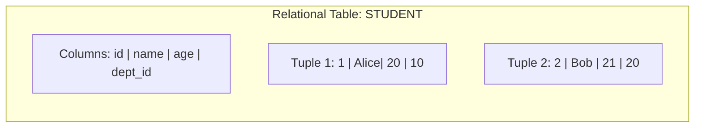
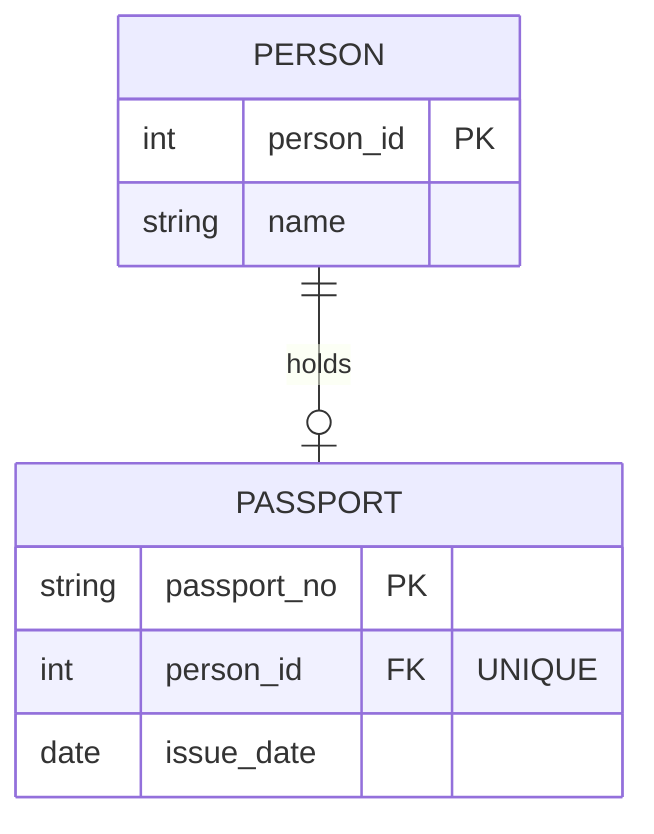
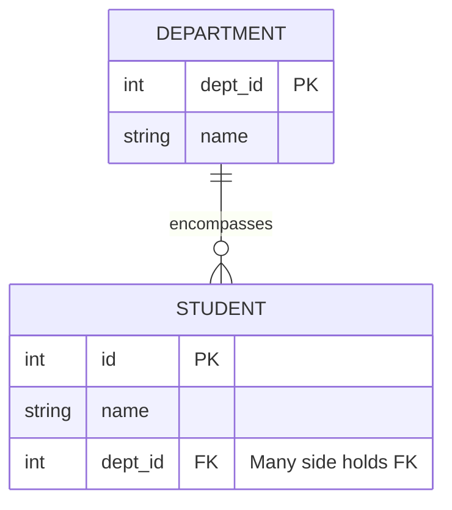
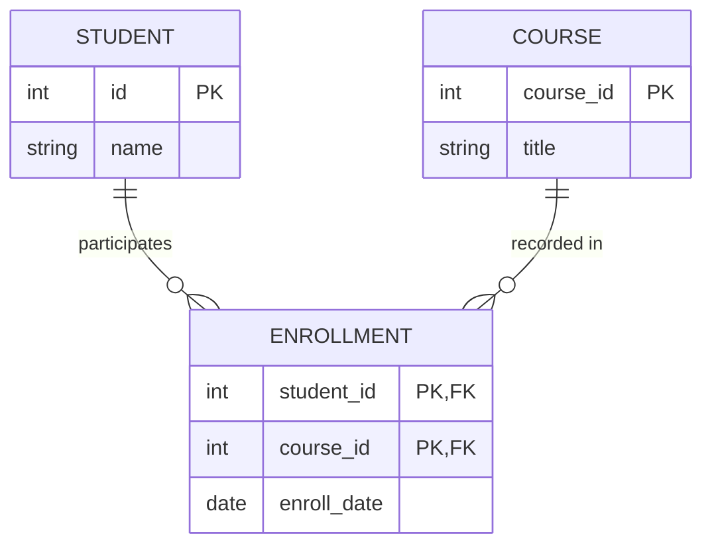
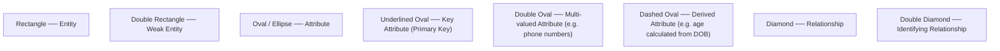
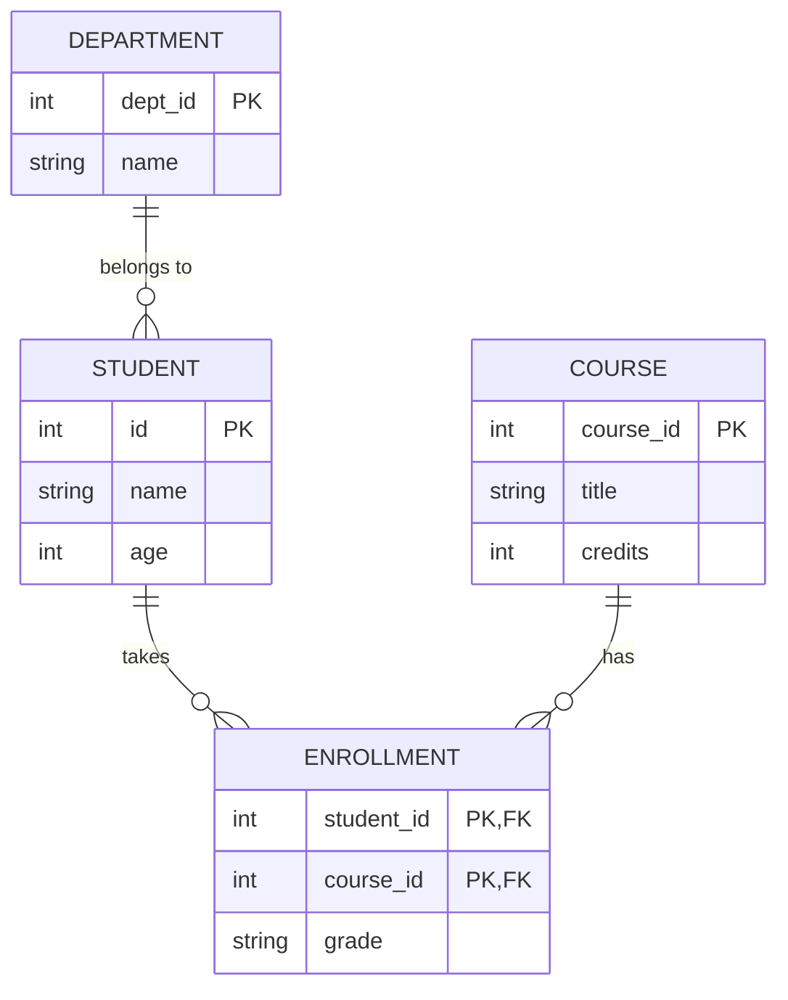
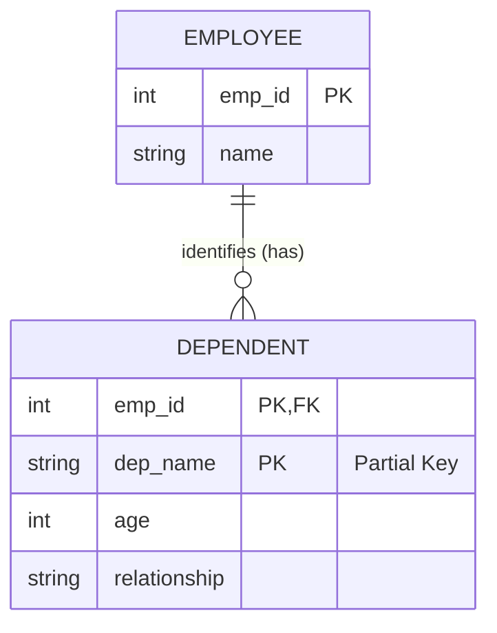

# Phase 2 — Relational Model & ER Modeling

The **Relational Model** is the theoretical cornerstone of modern database systems. Before creating physical tables in SQL, database designers visualize and plan systems using the **Entity-Relationship (ER) Model**.

---

## 1. The Relational Model

Proposed by Edgar F. Codd in 1970, the **Relational Model** organizes data into mathematical relations, known practically as **tables**. 

Key principles:
- All data is represented as values in two-dimensional tables (relations).
- Each row represents a relationship among a set of values.
- Tables are interconnected through common attributes (keys).
- Data access is declarative via queries (such as SQL) based on mathematical relational algebra rather than physical pointer navigation.



---

## 2. Relations, Tuples, and Attributes

Database theory uses formal terms that directly map to everyday spreadsheet/table terminology.

```text
RELATION (Table)
================
Attribute 1 (Column)      Attribute 2 (Column)      Attribute 3 (Column)
id                        name                      age
-------------------------------------------------------------------------
1                         Alice                     20          ◄── Tuple (Row)
2                         Bob                       21          ◄── Tuple (Row)
3                         Carol                     20          ◄── Tuple (Row)
```

### Formal Mapping Table

| Formal Relational Term | Common SQL Term | Spreadsheet Term | Description |
|---|---|---|---|
| **Relation** | Table | Sheet / Table | A 2D matrix of rows and columns |
| **Tuple** | Row / Record | Row | A single entity occurrence |
| **Attribute** | Column / Field | Column | A named property or characteristic |
| **Cardinality** | Row Count | Total Rows | Total number of tuples in a relation |
| **Degree (Arity)** | Column Count | Total Columns | Total number of attributes in a relation |

> [!NOTE]
> **Quick Rule:**
> - Relation = Table
> - Tuple = Row
> - Attribute = Column

---

## 3. Domains

A **Domain** represents the set of all permissible, atomic (indivisible) values that an attribute is allowed to hold.

Examples:
- `Age Domain` = Non-negative integers $\rightarrow \{0, 1, 2, \dots, 150\}$
- `Gender Domain` = Categorical set $\rightarrow \{\text{'Male'}, \text{'Female'}, \text{'Other'}\}$
- `RollNumber Domain` = Alphanumeric format matching regular expressions (e.g. `^R[0-9]{3}$`)

In SQL, domains are enforced through:
1. **Data types**: Restricts types (e.g., `INT`, `DATE`, `VARCHAR`).
2. **`CHECK` Constraints**: Restricts acceptable value ranges.

```sql
CREATE TABLE Student (
    id INT PRIMARY KEY,
    name VARCHAR(50) NOT NULL,
    age INT CHECK (age >= 17 AND age <= 100),    -- Domain constraint on age
    grade CHAR(1) CHECK (grade IN ('A', 'B', 'C', 'D', 'F')) -- Domain constraint on grade
);
```

---

## 4. Primary Key and Foreign Key Relationships

Relationships between entities in a relational database are established by pairing the **Primary Key** of one table with a matching **Foreign Key** in another table.

```text
DEPARTMENT (Parent Table)
+---------+----------+
| dept_id | name     |
+---------+----------+
| 10      | CSE      | ◄─── Primary Key
| 20      | ECE      |
+---------+----------+
      ▲
      │ References
      │
STUDENT (Child Table)
+----+--------+---------+
| id | name   | dept_id |
+----+--------+---------+
| 1  | Alice  | 10      | ◄─── Foreign Key points to dept_id = 10
| 2  | Bob    | 20      | ◄─── Foreign Key points to dept_id = 20
| 3  | Carol  | 10      | ◄─── Foreign Key points to dept_id = 10
+----+--------+---------+
```

Cardinality of this relationship:
```text
DEPARTMENT  (1) ─────────── (N)  STUDENT
(One department can have multiple students)
```

---

## 5. One-to-One (1:1) Relationship

In a **One-to-One** relationship, an entity in Table A is associated with at most **one** entity in Table B, and vice versa.

### Real-World Example: Person and Passport

- A Person has at most **one** active Passport.
- A Passport belongs to exactly **one** Person.

```text
PERSON (1) ─────────────── (1) PASSPORT
```



### SQL Implementation

Notice the `UNIQUE` constraint on the foreign key to enforce the 1-to-1 cardinality:

```sql
CREATE TABLE Person (
    person_id INT PRIMARY KEY,
    name VARCHAR(50) NOT NULL
);

CREATE TABLE Passport (
    passport_no VARCHAR(20) PRIMARY KEY,
    issue_date DATE,
    person_id INT UNIQUE, -- UNIQUE guarantees at most one passport per person!
    FOREIGN KEY (person_id) REFERENCES Person(person_id)
);
```

---

## 6. One-to-Many (1:N) Relationship

In a **One-to-Many** relationship, an entity in Table A can be associated with multiple entities in Table B, but an entity in Table B is associated with at most one entity in Table A.

### Real-World Example: Department and Student

- One Department can enroll many Students.
- Each Student belongs to at most one Department.

```text
DEPARTMENT (1) ─────────────── (N) STUDENT
```

```text
CSE (dept_id: 10)
├── Alice (id: 1)
└── Carol (id: 3)

ECE (dept_id: 20)
└── Bob (id: 2)
```



> [!IMPORTANT]
> **Fundamental RDBMS Rule:**
> In a **1-to-Many** relationship, the foreign key **ALWAYS resides on the "Many" side** (child table).
> Putting `student_id` in the `DEPARTMENT` table would violate 1NF because a department has multiple students.

---

## 7. Many-to-Many (M:N) Relationship

In a **Many-to-Many** relationship, an entity in Table A can relate to multiple entities in Table B, and an entity in Table B can relate to multiple entities in Table A.

### Real-World Example: Student and Course

- A Student can enroll in multiple Courses.
- A Course can be taken by multiple Students.

```text
STUDENT (M) ─────────────── (N) COURSE
```

### The Junction / Associative Table

Relational databases cannot directly store arrays or multi-valued columns in a row without violating 1NF. Therefore, an **M:N** relationship is always decomposed into **two 1:N relationships** using a **Junction Table** (also called a bridge or associative table):

```text
STUDENT (1) ──── (N) ENROLLMENT (N) ──── (1) COURSE
```



### SQL Implementation

```sql
CREATE TABLE Student (
    id INT PRIMARY KEY,
    name VARCHAR(50)
);

CREATE TABLE Course (
    course_id INT PRIMARY KEY,
    title VARCHAR(100)
);

-- Junction Table with Composite Primary Key
CREATE TABLE Enrollment (
    student_id INT,
    course_id INT,
    enroll_date DATE DEFAULT (CURRENT_DATE),
    PRIMARY KEY (student_id, course_id),
    FOREIGN KEY (student_id) REFERENCES Student(id) ON DELETE CASCADE,
    FOREIGN KEY (course_id) REFERENCES Course(course_id) ON DELETE CASCADE
);
```

---

## 8. The Entity-Relationship (ER) Model

The **Entity-Relationship (ER) Model** is a high-level conceptual data model developed by Peter Chen in 1976. It allows database designers to model the real-world schema visually before writing any DDL statements.

An ER model consists of three basic components:
1. **Entities**: Objects or concepts that have an independent existence.
2. **Attributes**: Properties describing entities.
3. **Relationships**: Logical associations between two or more entities.

---

## 9. ER Diagrams and Notations

Traditional ER diagrams use standard geometric shapes to represent schema components:



### University ER Diagram Representation



---

## 10. Entities, Attributes, and Relationships

### 1. Entities
An entity is an identifiable object with real-world existence:
- **Physical entities**: Student, Employee, Car, Product.
- **Conceptual entities**: Order, Bank Account, Course, Job Application.

### 2. Attributes
Properties describing an entity:
- **Simple / Atomic**: Cannot be divided (`age`, `salary`).
- **Composite**: Can be broken into smaller sub-parts (`Name` $\rightarrow$ `first_name`, `last_name`; `Address` $\rightarrow$ `street`, `city`, `zip`).
- **Single-valued**: Holds one value (`id`, `dob`).
- **Multi-valued**: Can hold multiple values (`phone_numbers`, `skills`).
- **Derived**: Calculated from other stored attributes (`age` derived from `dob`; `total_price` derived from `quantity * unit_price`).
- **Key Attribute**: Uniquely identifies the entity (`id`, `SSN`).

### 3. Relationships
Associations connecting entities:
- **Degree of relationship**: Number of participating entities:
  - *Unary (Recursive)*: An employee manages another employee.
  - *Binary*: Student belongs to Department (most common).
  - *Ternary*: Supplier supplies Part to Project.

---

## 11. Weak Entities

A **Weak Entity** is an entity that **cannot be uniquely identified by its own attributes alone** and depends for its existence and identification on another entity, called the **Owner / Strong Entity**.

### Identifying Characteristics
1. Does not possess a primary key of its own.
2. Contains a **Partial Key (Discriminator)**, typically represented by a dashed underline in ER diagrams.
3. Linked to its strong entity through an **Identifying Relationship** (represented as a double diamond).
4. Identified using a **Composite Key**: `(Owner Primary Key + Weak Entity Partial Key)`.

### Classic Example: Employee and Dependent

```text
EMPLOYEE (Strong Entity)
+-------------+-------+
| emp_id (PK) | name  |
+-------------+-------+
| 101         | Alice |
| 102         | Bob   |
+-------------+-------+

DEPENDENT (Weak Entity)
+-------------+----------------+-----+--------------+
| emp_id (FK) | dep_name (PK*) | age | relationship |
+-------------+----------------+-----+--------------+
| 101         | John           | 8   | Son          |
| 102         | John           | 12  | Son          |
+-------------+----------------+-----+--------------+
```

Notice:
- `dep_name = 'John'` appears for both employees.
- The name `John` alone cannot uniquely identify the dependent.
- The dependent is uniquely identified only when combined with the employee's ID: `(101, 'John')`.



### SQL Implementation

```sql
CREATE TABLE Employee (
    emp_id INT PRIMARY KEY,
    name VARCHAR(50) NOT NULL
);

CREATE TABLE Dependent (
    emp_id INT,
    dep_name VARCHAR(50),
    age INT,
    relationship VARCHAR(30),
    PRIMARY KEY (emp_id, dep_name), -- Composite Primary Key
    FOREIGN KEY (emp_id) REFERENCES Employee(emp_id) ON DELETE CASCADE
);
```

> [!NOTE]
> **Standard Interview Definition:**
> *"A weak entity is an entity that lacks sufficient attributes to form a primary key on its own. It depends on a strong entity for existence and identification via an identifying relationship, and its key is formed by combining the strong entity's primary key with its own partial discriminator."*
