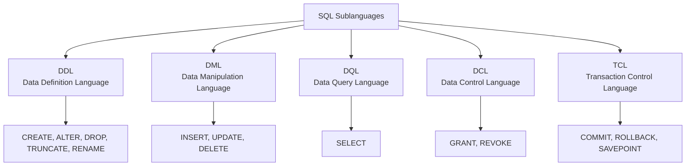

# Phase 3 — SQL Fundamentals

**SQL (Structured Query Language)** is the domain-specific language used to interact with, query, and manipulate relational databases.

---

## The Consistent Example Tables

We will run our queries against these two tables:

```sql
STUDENT
+----+--------+-----+------------+
| id | name   | age | dept_id    |
+----+--------+-----+------------+
| 1  | Alice  | 20  | 10         |
| 2  | Bob    | 21  | 20         |
| 3  | Carol  | 20  | 10         |
| 4  | David  | 22  | NULL       |
+----+--------+-----+------------+

DEPARTMENT
+---------+----------+
| dept_id | name     |
+---------+----------+
| 10      | CSE      |
| 20      | ECE      |
| 30      | ME       |
+---------+----------+
```

---

## 1. SQL Command Categories

SQL commands are divided into five sublanguages based on their operational purpose:



### Categorization Summary

| Category | Full Name | Purpose | Core Commands | Auto-Commit? |
|---|---|---|---|---|
| **DDL** | Data Definition Language | Defines & modifies database structure/schema | `CREATE`, `ALTER`, `DROP`, `TRUNCATE` | Yes (in most engines) |
| **DML** | Data Manipulation Language | Inserts, updates, or deletes actual records | `INSERT`, `UPDATE`, `DELETE` | No (in transactional mode) |
| **DQL** | Data Query Language | Retrieves data from tables | `SELECT` | Read-only |
| **DCL** | Data Control Language | Manages user access, privileges, and permissions | `GRANT`, `REVOKE` | Yes |
| **TCL** | Transaction Control Language | Manages transaction states and atomicity | `COMMIT`, `ROLLBACK`, `SAVEPOINT` | N/A |

---

## 2. DDL Commands: CREATE, ALTER, DROP, TRUNCATE

DDL commands manage the **schema (structure)** of database objects.

### CREATE
Creates a new database object (table, view, index).

```sql
CREATE TABLE Student (
    id INT PRIMARY KEY,
    name VARCHAR(50) NOT NULL,
    age INT,
    dept_id INT,
    FOREIGN KEY (dept_id) REFERENCES Department(dept_id)
);
```

### ALTER
Modifies the schema of an existing table (adding, modifying, or dropping columns/constraints).

```sql
-- Add a new column
ALTER TABLE Student 
ADD email VARCHAR(100);

-- Modify an existing column
ALTER TABLE Student 
MODIFY age SMALLINT;

-- Drop a column
ALTER TABLE Student 
DROP COLUMN email;
```

### DROP
Permanently deletes the entire table and all its data from the database.

```sql
DROP TABLE Student;
```

*The table schema and all rows are completely erased.*

### TRUNCATE
Removes all rows from a table while preserving its schema for future inserts.

```sql
TRUNCATE TABLE Student;
```

*The table structure remains intact, but the row count resets to 0.*

### Interview Comparison: DROP vs TRUNCATE vs DELETE

| Feature | DROP | TRUNCATE | DELETE |
|---|---|---|---|
| **Category** | DDL | DDL | DML |
| **Scope** | Deletes entire table + schema | Deletes all rows; keeps schema | Deletes specified or all rows |
| **`WHERE` clause** | No | No | **Yes (conditional)** |
| **Rollback** | Difficult / No | No (auto-committed) | **Yes (can be rolled back)** |
| **Performance** | Instantaneous | Fast (deallocates pages) | Slower (logs row by row) |
| **Triggers** | Does not fire DML triggers | Does not fire `ON DELETE` triggers | **Fires `ON DELETE` triggers** |

---

## 3. DML Commands: INSERT, UPDATE, DELETE

DML statements manipulate the data rows inside tables.

### INSERT
Adds new rows into a table.

```sql
-- Insert a single record
INSERT INTO Student (id, name, age, dept_id)
VALUES (1, 'Alice', 20, 10);

-- Insert multiple records in a single batch
INSERT INTO Student (id, name, age, dept_id)
VALUES 
    (2, 'Bob', 21, 20),
    (3, 'Carol', 20, 10),
    (4, 'David', 22, NULL);
```

### UPDATE
Modifies existing records.

```sql
-- Update specific row
UPDATE Student
SET age = 21, dept_id = 10
WHERE id = 1;
```

> [!CAUTION]
> **Classic Interview / Production Warning:**
> If you omit the `WHERE` clause in an `UPDATE` statement:
> ```sql
> UPDATE Student SET age = 21;
> ```
> **EVERY SINGLE ROW** in the table will have its age changed to `21`!

### DELETE
Removes rows from a table based on a condition.

```sql
-- Delete a specific student
DELETE FROM Student
WHERE id = 4;

-- Delete all students older than 25
DELETE FROM Student
WHERE age > 25;
```

> [!WARNING]
> Running `DELETE FROM Student;` without a `WHERE` clause deletes all rows in the table row by row!

---

## 4. SELECT — Data Query Language (DQL)

`SELECT` is the foundation of all database queries.

```sql
-- Select all columns from table
SELECT * FROM Student;

-- Select specific columns (best practice in production)
SELECT name, age 
FROM Student;

-- Using column aliases
SELECT name AS student_name, age AS student_age
FROM Student;
```

---

## 5. WHERE — Filtering Rows

The `WHERE` clause filters individual rows before grouping or aggregation.

```sql
-- Filter by single condition
SELECT * 
FROM Student 
WHERE age > 20;
-- Returns: Bob (21), David (22)

-- Combining conditions with AND, OR, NOT
SELECT * 
FROM Student 
WHERE age >= 20 AND dept_id = 10;
-- Returns: Alice (20, 10), Carol (20, 10)

SELECT * 
FROM Student 
WHERE dept_id = 10 OR dept_id = 20;
```

---

## 6. ORDER BY — Sorting Results

Sorts query results in ascending (`ASC`) or descending (`DESC`) order.

```sql
-- Ascending order (ASC is default)
SELECT * 
FROM Student 
ORDER BY age ASC;

-- Descending order
SELECT * 
FROM Student 
ORDER BY age DESC;

-- Multi-column sort: sort by age ascending, then name descending
SELECT * 
FROM Student 
ORDER BY age ASC, name DESC;
```

---

## 7. DISTINCT — Eliminating Duplicates

Removes duplicate values from the output.

```sql
-- Fetch unique department IDs present in the Student table
SELECT DISTINCT dept_id 
FROM Student;
```

**Result:**
```text
dept_id
-------
10
20
NULL
```

---

## 8. LIMIT and OFFSET — Restricting Output

Restricts the number of returned rows. Essential for pagination and top-N analysis.

```sql
-- Fetch the first 2 students
SELECT * 
FROM Student 
LIMIT 2;

-- Find the oldest student
SELECT * 
FROM Student 
ORDER BY age DESC 
LIMIT 1;

-- Pagination: Skip 2 rows, take the next 2 (Page 2)
SELECT * 
FROM Student 
LIMIT 2 OFFSET 2;
```

---

## 9. Aggregate Functions

Aggregate functions perform a calculation across a set of row values and return a single scalar value.

```text
Row 1: age = 20 ┐
Row 2: age = 21 ┼── Aggregate Function (e.g. AVG) ──► Result: 20.75
Row 3: age = 20 │
Row 4: age = 22 ┘
```

| Function | Description | Example |
|---|---|---|
| `COUNT(*)` | Counts all rows, including `NULL` values | `SELECT COUNT(*) FROM Student;` |
| `COUNT(col)` | Counts non-null values in `col` | `SELECT COUNT(dept_id) FROM Student;` (Returns 3, David is NULL) |
| `SUM(col)` | Computes the mathematical sum of numbers | `SELECT SUM(age) FROM Student;` |
| `AVG(col)` | Calculates the arithmetic mean (ignores NULLs) | `SELECT AVG(age) FROM Student;` |
| `MIN(col)` | Finds the minimum value | `SELECT MIN(age) FROM Student;` |
| `MAX(col)` | Finds the maximum value | `SELECT MAX(age) FROM Student;` |

> [!NOTE]
> `COUNT(*)` counts every row, while `COUNT(column)` ignores `NULL` entries in that column. In our table, `COUNT(*)` is `4`, but `COUNT(dept_id)` is `3`.

---

## 10. GROUP BY — Grouping Rows

The `GROUP BY` statement groups rows that have the same values in specified columns into summary rows.

```sql
-- Count students in each department
SELECT dept_id, COUNT(*) AS student_count
FROM Student
GROUP BY dept_id;
```

### Visual Mental Model

```text
All Students:
(Alice, 10), (Bob, 20), (Carol, 10), (David, NULL)
                    │
                    ▼  GROUP BY dept_id
Bucket 10:  [Alice, Carol]  ──► COUNT = 2
Bucket 20:  [Bob]           ──► COUNT = 1
Bucket NULL:[David]         ──► COUNT = 1
```

**Result:**
```text
dept_id | student_count
--------+--------------
10      | 2
20      | 1
NULL    | 1
```

---

## 11. HAVING — Filtering Groups

While `WHERE` filters individual rows **before** aggregation, `HAVING` filters groups **after** `GROUP BY` aggregation.

```sql
-- Find departments that have strictly more than 1 student
SELECT dept_id, COUNT(*) AS total_students
FROM Student
GROUP BY dept_id
HAVING COUNT(*) > 1;
```

**Result:**
```text
dept_id | total_students
--------+---------------
10      | 2
```

### WHERE vs HAVING (Crucial Interview Distinction)


| Feature | WHERE | HAVING |
|---|---|---|
| **Applies to** | Individual rows | Grouped / Aggregated rows |
| **Placement** | Before `GROUP BY` | After `GROUP BY` |
| **Aggregate Functions** | **Cannot** contain aggregate functions (`WHERE AVG(age) > 20` is illegal) | **Can** contain aggregate functions (`HAVING COUNT(*) > 1`) |
| **Purpose** | Filters rows prior to grouping | Filters groups after aggregation |

---

## 12. CASE Expressions — Conditional Logic

`CASE` is SQL's built-in `if-then-else` expression.

```sql
SELECT 
    name,
    age,
    CASE 
        WHEN age >= 21 THEN 'Senior Adult'
        WHEN age = 20 THEN 'Junior Adult'
        ELSE 'Teen'
    END AS age_category
FROM Student;
```

**Result:**
```text
name  | age | age_category
------+-----+--------------
Alice | 20  | Junior Adult
Bob   | 21  | Senior Adult
Carol | 20  | Junior Adult
David | 22  | Senior Adult
```

---

## 13. SQL Operators Cheatsheet

### 1. Comparison Operators
`=`, `<>`, `!=`, `>`, `<`, `>=`, `<=`

```sql
SELECT * FROM Student WHERE age >= 21;
```

### 2. Logical Operators
`AND`, `OR`, `NOT`

```sql
SELECT * FROM Student WHERE age >= 20 AND dept_id = 10;
```

### 3. IN Operator
Replaces multiple `OR` conditions:

```sql
-- Instead of: WHERE dept_id = 10 OR dept_id = 20
SELECT * FROM Student 
WHERE dept_id IN (10, 20);
```

### 4. BETWEEN Operator
Inclusive range test (`low <= value <= high`):

```sql
SELECT * FROM Student 
WHERE age BETWEEN 20 AND 21;
-- Matches Alice (20), Carol (20), Bob (21)
```

### 5. LIKE Operator (Pattern Matching)
Uses wildcards:
- `%` represents zero, one, or multiple characters.
- `_` represents exactly one character.

```sql
SELECT * FROM Student WHERE name LIKE 'A%';    -- Starts with 'A' (Alice)
SELECT * FROM Student WHERE name LIKE '%l%';   -- Contains 'l' (Alice, Carol)
SELECT * FROM Student WHERE name LIKE '_ob';   -- 3 letters ending in 'ob' (Bob)
```

### 6. IS NULL and IS NOT NULL
In SQL, `NULL` represents an **unknown, missing, or inapplicable value**.

> [!CAUTION]
> **Never write:** `WHERE dept_id = NULL`  
> In SQL, `NULL = NULL` evaluates to `UNKNOWN` (not `TRUE`)!
> **Always write:** `WHERE dept_id IS NULL` or `WHERE dept_id IS NOT NULL`

```sql
-- Find students who haven't been assigned a department
SELECT * FROM Student 
WHERE dept_id IS NULL;
-- Returns David
```
