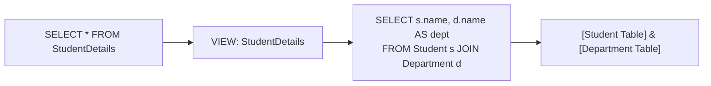
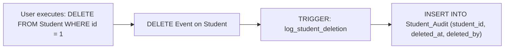
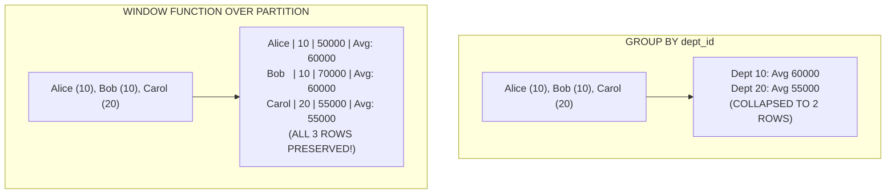

# Phase 6 — SQL Intermediate & Window Functions

In modern software engineering interviews, intermediate SQL questions distinguish candidates who only know basic `SELECT` statements from those who can write production-grade analytical queries. This phase covers **SQL Set Operations, Programmability (Views, Procedures, Triggers), and Window Functions**.

---

## 1. SQL Constraints in Practice

In real-world systems, constraints work together to form a robust data validation firewall at the database level:

```sql
CREATE TABLE Student (
    id INT PRIMARY KEY,                            -- Uniquely identifies the student (NOT NULL + UNIQUE)
    name VARCHAR(50) NOT NULL,                     -- Name is strictly required
    email VARCHAR(100) UNIQUE,                     -- Prevents duplicate email registrations
    age INT CHECK (age >= 18 AND age <= 100),      -- Enforces business domain logic
    status VARCHAR(20) DEFAULT 'active',           -- Automatically assigns fallback status
    dept_id INT,                                   -- Foreign key column
    FOREIGN KEY (dept_id)                          -- Enforces referential integrity
        REFERENCES Department(dept_id)
        ON DELETE SET NULL
        ON UPDATE CASCADE
);
```

### Constraint Checklist for Interviews:
- **`PRIMARY KEY`**: Table identifier, implicitly non-null and unique.
- **`NOT NULL`**: Rejects missing or undefined data.
- **`UNIQUE`**: Forbids duplicate values (allows multiple `NULL`s in standard SQL).
- **`CHECK`**: Restricts values to valid business boundaries.
- **`DEFAULT`**: Automatically populates missing fields on `INSERT`.
- **`FOREIGN KEY`**: Guarantees child rows reference a valid parent row.

---

## 2. SQL Set Operations: UNION and UNION ALL

Set operations combine the results of two or more independent `SELECT` queries into a single unified result set.

Suppose we have two department tables:

```text
CSE_STUDENTS           ECE_STUDENTS
+-------+              +-------+
| name  |              | name  |
+-------+              +-------+
| Alice |              | Bob   |
| Bob   |              | Carol |
+-------+              +-------+
```

```mermaid
graph TD
    subgraph UNION (Deduplicated)
        U_Alice["Alice"]
        U_Bob["Bob (Merged)"]
        U_Carol["Carol"]
    end
    subgraph UNION ALL (Preserves Duplicates)
        UA_Alice["Alice"]
        UA_Bob1["Bob"]
        UA_Bob2["Bob"]
        UA_Carol["Carol"]
    end
```

### UNION (Distinct Union)
Combines results and **removes duplicate rows**:

```sql
SELECT name FROM CSE_STUDENTS
UNION
SELECT name FROM ECE_STUDENTS;
```

**Result:**
```text
name
-----
Alice
Bob      <-- Appears only once
Carol
```

### UNION ALL (All Rows)
Combines results and **preserves all duplicates**:

```sql
SELECT name FROM CSE_STUDENTS
UNION ALL
SELECT name FROM ECE_STUDENTS;
```

**Result:**
```text
name
-----
Alice
Bob
Bob      <-- Kept both occurrences
Carol
```

### Rules for Set Operations
1. Both `SELECT` queries must return the **same number of columns**.
2. Corresponding columns must have **compatible data types**.
3. Column names in the output are determined by the **first query**.

### Interview Comparison: UNION vs UNION ALL

| Feature | UNION | UNION ALL |
|---|---|---|
| **Duplicates** | Automatically removed | Preserved |
| **Performance** | Slower (performs sorting & deduplication) | **Faster** (simply appends data) |
| **Memory usage** | Higher | Minimal |
| **Default choice** | Use only when uniqueness is required | Preferred in production when data is already disjoint |

---

## 3. INTERSECT (Set Intersection)

Returns only the rows that are present in **both** query results ($A \cap B$).

```sql
SELECT name FROM CSE_STUDENTS
INTERSECT
SELECT name FROM ECE_STUDENTS;
```

**Result:**
```text
name
-----
Bob
```
*(Bob is the only student present in both tables).*

> [!NOTE]
> Most modern RDBMS engines (PostgreSQL, SQL Server, Oracle) support `INTERSECT`. If using an older MySQL engine that lacks native `INTERSECT`, achieve the same result using `INNER JOIN` or `WHERE ... IN`.

---

## 4. EXCEPT / MINUS (Set Difference)

Returns distinct rows present in the **first query** that do **not** appear in the second query ($A - B$).

```sql
SELECT name FROM CSE_STUDENTS
EXCEPT
SELECT name FROM ECE_STUDENTS;
```

**Result:**
```text
name
-----
Alice
```
*(Alice is in CSE, but not in ECE. Bob is excluded because he is in ECE).*

> [!TIP]
> - In **Oracle**, `EXCEPT` is called **`MINUS`**.
> - In **MySQL**, `EXCEPT` is available from MySQL 8.0.31+. In earlier versions, rewrite using `LEFT JOIN ... WHERE right.col IS NULL` or `WHERE NOT EXISTS`.

---

## 5. Database Views

A **View** is a **virtual table** defined by an underlying SQL query. It does not store actual data on disk (unless materialized); instead, the database executes the view's query dynamically whenever it is referenced.



### Syntax and Example

```sql
-- Create a view joining students with department names
CREATE VIEW StudentDetails AS
SELECT s.name AS student_name, s.age, d.name AS department_name
FROM Student s
JOIN Department d
    ON s.dept_id = d.dept_id;

-- Query the view just like a regular table
SELECT * 
FROM StudentDetails
WHERE department_name = 'CSE';
```

### Why use Views?
1. **Query Simplification**: Pre-packages complex multi-table joins and calculations into a clean interface.
2. **Security & Column Masking**: Restricts sensitive data (e.g., exposing student names while hiding password hashes and SSNs).
3. **Data Independence**: Applications code against the view; underlying table schemas can be refactored without breaking client code.

---

## 6. Stored Procedures

A **Stored Procedure** is a pre-compiled batch of one or more SQL statements saved in the database catalog.

```sql
-- Creating a stored procedure (MySQL syntax)
DELIMITER //
CREATE PROCEDURE GetStudentsByDept(IN p_dept_id INT)
BEGIN
    SELECT id, name, age
    FROM Student
    WHERE dept_id = p_dept_id;
END //
DELIMITER ;

-- Executing the procedure
CALL GetStudentsByDept(10);
```

### Key Benefits
- **Reduced network traffic**: A single `CALL` executes multiple SQL operations on the server.
- **Pre-compiled execution plan**: Enhanced query optimization and speed.
- **Security**: Grant users permission to execute the procedure without granting direct `SELECT`/`UPDATE` rights on underlying tables.

---

## 7. Functions in SQL

A **User-Defined Function (UDF)** encapsulates reusable business logic and **always returns a value** (scalar or table).

```sql
-- Conceptual scalar function: calculates annual package with bonus
CREATE FUNCTION CalculateBonus(base_salary DECIMAL(10,2), bonus_pct DECIMAL(4,2))
RETURNS DECIMAL(10,2)
DETERMINISTIC
BEGIN
    RETURN base_salary * (1 + bonus_pct / 100);
END;

-- Calling the function inside standard SQL statements
SELECT name, salary, CalculateBonus(salary, 10.0) AS salary_with_bonus
FROM Employee;
```

### Stored Procedure vs Function (Common Interview Question)

| Feature | Stored Procedure | User-Defined Function |
|---|---|---|
| **Return Value** | May return 0, 1, or multiple result sets/output parameters | **Must return exactly one value** (scalar or table) |
| **Usage in SQL** | Executed using `CALL` or `EXEC` | Can be invoked inside `SELECT`, `WHERE`, `HAVING` expressions |
| **Transactions** | Can manage transactions (`COMMIT`, `ROLLBACK`) | Cannot manage transactions |
| **DML operations** | Can freely `INSERT`, `UPDATE`, `DELETE` | Usually restricted from modifying database state |

---

## 8. Database Triggers

A **Trigger** is a specialized procedure that **automatically executes (fires)** in response to a specific event (`INSERT`, `UPDATE`, or `DELETE`) on a particular table.



### Practical Audit Logging Example

```sql
-- Audit table to preserve history
CREATE TABLE StudentAudit (
    audit_id INT AUTO_INCREMENT PRIMARY KEY,
    student_id INT,
    action_type VARCHAR(20),
    action_timestamp TIMESTAMP DEFAULT CURRENT_TIMESTAMP
);

-- Trigger firing automatically after any deletion
CREATE TRIGGER trg_after_student_delete
AFTER DELETE ON Student
FOR EACH ROW
BEGIN
    INSERT INTO StudentAudit (student_id, action_type)
    VALUES (OLD.id, 'DELETED');
END;
```

### Trigger Points to Remember
- Fired by database events (`BEFORE INSERT`, `AFTER UPDATE`, `AFTER DELETE`).
- Can inspect previous values using `OLD.column` and new values using `NEW.column`.
- Commonly used for **audit logging, enforcing complex business constraints, and cache invalidation**.

---

## 9. Window Functions

> [!IMPORTANT]
> **Window Functions are among the MOST FREQUENTLY TESTED topics in fresher and junior SDE interviews!**

A **Window Function** performs calculations across a set of table rows that are related to the current row, **WITHOUT collapsing the rows into a single summary row**.

### Contrast: GROUP BY vs Window Function

```text
EMPLOYEE DATA:
Alice (Dept 10, Salary 50000)
Bob   (Dept 10, Salary 70000)
Carol (Dept 20, Salary 55000)
```



### The Window Function Syntax
```sql
SELECT 
    name,
    dept_id,
    salary,
    AVG(salary) OVER(PARTITION BY dept_id) AS dept_avg_salary
FROM Employee;
```

**Result:**
```text
name  | dept_id | salary | dept_avg_salary
------+---------+--------+----------------
Alice | 10      | 50000  | 60000
Bob   | 10      | 70000  | 60000
Carol | 20      | 55000  | 55000
```
Notice: Every employee retains their individual row and salary, alongside the department average!

---

## 10. The PARTITION BY Clause

`PARTITION BY` divides the query result set into independent partitions/buckets to which the window function is applied.

```sql
function_name() OVER (
    PARTITION BY column1, column2
    ORDER BY sort_column ASC|DESC
)
```

- If `PARTITION BY` is omitted, the entire result set is treated as a single window partition.
- If `ORDER BY` is included inside `OVER()`, it establishes the processing order within each partition.

---

## 11. ROW_NUMBER()

`ROW_NUMBER()` assigns a unique, strictly sequential integer ($1, 2, 3, \dots$) to each row within its partition, according to the specified ordering.

```sql
SELECT 
    name,
    dept_id,
    salary,
    ROW_NUMBER() OVER(
        PARTITION BY dept_id 
        ORDER BY salary DESC
    ) AS row_num
FROM Employee;
```

**Result:**
```text
name  | dept_id | salary | row_num
------+---------+--------+--------
Bob   | 10      | 70000  | 1
Alice | 10      | 50000  | 2
Carol | 20      | 55000  | 1
```

### ⭐ The Canonical Interview Pattern: Find Top-N per Group
**Problem: Find the highest-paid employee in each department.**

```sql
WITH RankedEmployees AS (
    SELECT 
        name,
        dept_id,
        salary,
        ROW_NUMBER() OVER(
            PARTITION BY dept_id 
            ORDER BY salary DESC
        ) AS rn
    FROM Employee
)
SELECT name, dept_id, salary
FROM RankedEmployees
WHERE rn = 1;
```

---

## 12. RANK() vs DENSE_RANK() vs ROW_NUMBER()

This is one of the most frequently asked comparisons in SQL interviews.

Consider employees with identical salaries:

```text
Salaries: 100, 100, 90, 80
```

```sql
SELECT 
    salary,
    ROW_NUMBER() OVER(ORDER BY salary DESC) AS [row_number],
    RANK()       OVER(ORDER BY salary DESC) AS [rank],
    DENSE_RANK() OVER(ORDER BY salary DESC) AS [dense_rank]
FROM Scores;
```

### The Definitive Comparison Table

| Salary | `ROW_NUMBER()` | `RANK()` | `DENSE_RANK()` | Behavior Explained |
|:---:|:---:|:---:|:---:|---|
| **100** | **1** | **1** | **1** | First tie |
| **100** | **2** | **1** | **1** | Second tie: `RANK` and `DENSE_RANK` both assign `1` |
| **90** | **3** | **3** | **2** | **Notice**: `RANK()` skips `2` and jumps to `3`; `DENSE_RANK()` assigns `2` (no gap!) |
| **80** | **4** | **4** | **3** | Continuous sequence continues |

### Easy Memory Guide
- **`ROW_NUMBER()`**: Strictly unique sequential numbers ($1, 2, 3, 4$). Never ties.
- **`RANK()`**: Assigns same rank to ties, but **leaves gaps** in subsequent ranks ($1, 1, 3, 4$).
- **`DENSE_RANK()`**: Assigns same rank to ties, and **leaves NO gaps** in subsequent ranks ($1, 1, 2, 3$).

> [!TIP]
> **Interview Rule of Thumb:**
> When asked to find the **$N$-th highest salary**, always use **`DENSE_RANK()`** because it handles duplicate top salaries correctly!

---

## 13. Value Window Functions: LEAD() and LAG()

`LEAD()` and `LAG()` allow a query to look forward or backward at adjacent rows without performing self-joins.

```text
                  Current Row
                      │
  ┌───────────────────┴───────────────────┐
  ▼                                       ▼
LAG()                                   LEAD()
Look backwards into previous row       Look forwards into upcoming row
```

Consider annual company sales:

```text
SALES
+------+-------+
| year | sales |
+------+-------+
| 2023 | 100   |
| 2024 | 120   |
| 2025 | 150   |
+------+-------+
```

### LAG() — Accessing the Previous Row

```sql
SELECT 
    year,
    sales,
    LAG(sales, 1) OVER (ORDER BY year) AS previous_year_sales
FROM Sales;
```

**Result:**
```text
year | sales | previous_year_sales
-----+-------+--------------------
2023 | 100   | NULL   <-- No previous row exists
2024 | 120   | 100
2025 | 150   | 120
```

### LEAD() — Accessing the Next Row

```sql
SELECT 
    year,
    sales,
    LEAD(sales, 1) OVER (ORDER BY year) AS next_year_sales
FROM Sales;
```

**Result:**
```text
year | sales | next_year_sales
-----+-------+----------------
2023 | 100   | 120
2024 | 120   | 150
2025 | 150   | NULL   <-- No following row exists
```

### ⭐ Practical Problem: Calculate Year-over-Year (YoY) Sales Growth

```sql
SELECT 
    year,
    sales,
    sales - LAG(sales) OVER (ORDER BY year) AS yoy_sales_diff,
    ROUND(
        (sales - LAG(sales) OVER (ORDER BY year)) * 100.0 / LAG(sales) OVER (ORDER BY year), 
        2
    ) AS yoy_growth_percent
FROM Sales;
```

**Result:**
```text
year | sales | yoy_sales_diff | yoy_growth_percent
-----+-------+----------------+-------------------
2023 | 100   | NULL           | NULL
2024 | 120   | 20             | 20.00%
2025 | 150   | 30             | 25.00%
```

---

## 14. Summary & Core Takeaways for Interviews

### Normalization Ladder
```text
1NF  ──► Atomic values, no repeating groups or arrays
2NF  ──► 1NF + No partial dependencies (only applies to composite keys!)
3NF  ──► 2NF + No transitive dependencies (non-key -> non-key)
BCNF ──► Strict 3NF: Every determinant MUST be a candidate/super key
```

### Set Operations Cheatsheet
```text
UNION      ──► Combine sets + remove duplicates (slower)
UNION ALL  ──► Combine sets + keep duplicates (faster)
INTERSECT  ──► Only rows appearing in both sets (A ∩ B)
EXCEPT     ──► Rows in first set but not second (A - B)
```

### Window Functions Cheatsheet
```text
OVER(PARTITION BY ...) ──► Computes within group WITHOUT collapsing rows
ROW_NUMBER()           ──► 1, 2, 3, 4 (strictly unique, no ties)
RANK()                 ──► 1, 1, 3, 4 (ties share rank, leaves gaps)
DENSE_RANK()           ──► 1, 1, 2, 3 (ties share rank, NO gaps)
LAG()                  ──► Look backward to previous row
LEAD()                 ──► Look forward to next row
```

---

## 15. Fresher Interview Priority Guide

### Must Know Extremely Well
1. **Functional Dependencies**: Determinant vs dependent.
2. **Anomalies**: Update, Insert, Delete anomalies with clear examples.
3. **1NF, 2NF, 3NF**: Rules, definitions, and decomposition steps.
4. **Normalization vs Denormalization**: Trade-offs between write integrity and read performance.
5. **`UNION` vs `UNION ALL`**: Duplicate removal and performance difference.
6. **Views**: Purpose, security, and query abstraction.
7. **Window Functions**: Difference between `GROUP BY` and `PARTITION BY`.
8. **`ROW_NUMBER()` vs `RANK()` vs `DENSE_RANK()`**: The tie-handling table.
9. **`LEAD()` & `LAG()`**: YoY growth pattern.

### Good to Know (Conceptual Understanding)
10. **BCNF**: Determinant requirement (explain definition, don't get stuck on complex decomposition proofs).
11. **Stored Procedures vs Functions**: Calling mechanism, return values, transactions.
12. **Triggers**: Event-driven firing, audit logging use-case.
13. **`INTERSECT` & `EXCEPT`**: Set operations concepts and dialect differences.
