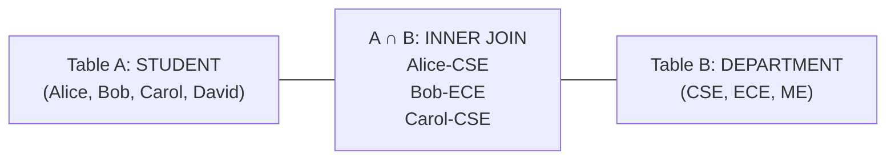
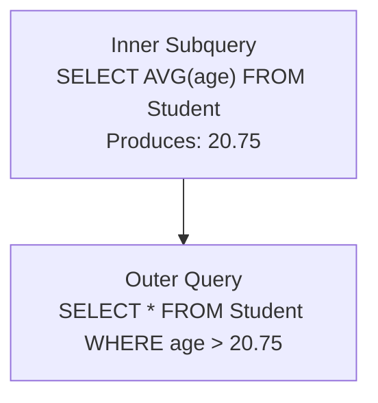

# Phase 4 — SQL Joins, Subqueries & CTEs

Joins, subqueries, and table expressions form the core of SQL interview assessments. Understanding the mathematical set logic behind joins and mastering correlated subqueries is vital for fresher software engineering roles.

---

## The Consistent Example Tables

```sql
STUDENT
+----+--------+-----+------------+
| id | name   | age | dept_id    |
+----+--------+-----+------------+
| 1  | Alice  | 20  | 10         |
| 2  | Bob    | 21  | 20         |
| 3  | Carol  | 20  | 10         |
| 4  | David  | 22  | NULL       |
+----+--------+-----+------------+

DEPARTMENT
+---------+----------+
| dept_id | name     |
+---------+----------+
| 10      | CSE      |
| 20      | ECE      |
| 30      | ME       |
+---------+----------+
```

Notice two critical edge cases in our data:
1. **David** has `dept_id = NULL` (Student without a department).
2. **ME** has `dept_id = 30` (Department without any enrolled students).

---

## 1. INNER JOIN

Returns only the rows that have **matching values in both tables**.



```sql
SELECT s.name AS student_name, d.name AS dept_name
FROM Student s
INNER JOIN Department d
    ON s.dept_id = d.dept_id;
```

**Result:**
```text
student_name | dept_name
-------------+----------
Alice        | CSE
Bob          | ECE
Carol        | CSE
```

- **Why is David excluded?** `David.dept_id = NULL`, which does not match any row in `Department`.
- **Why is ME excluded?** No student has `dept_id = 30`.

> [!NOTE]
> Think of `INNER JOIN` as set intersection: $A \cap B$.

---

## 2. LEFT JOIN (LEFT OUTER JOIN)

Returns **all rows from the left table**, paired with matching rows from the right table. If there is no match, the right side columns contain `NULL`.

```sql
SELECT s.name AS student_name, d.name AS dept_name
FROM Student s
LEFT JOIN Department d
    ON s.dept_id = d.dept_id;
```

**Result:**
```text
student_name | dept_name
-------------+----------
Alice        | CSE
Bob          | ECE
Carol        | CSE
David        | NULL     ◄── Retained from left table!
```

### Frequent Interview Question
**Find all students who are not assigned to any department:**

```sql
SELECT s.name
FROM Student s
LEFT JOIN Department d
    ON s.dept_id = d.dept_id
WHERE d.dept_id IS NULL;
```
*Returns: `David`*

---

## 3. RIGHT JOIN (RIGHT OUTER JOIN)

Returns **all rows from the right table**, paired with matching rows from the left table. If there is no match, the left side columns contain `NULL`.

```sql
SELECT s.name AS student_name, d.name AS dept_name
FROM Student s
RIGHT JOIN Department d
    ON s.dept_id = d.dept_id;
```

**Result:**
```text
student_name | dept_name
-------------+----------
Alice        | CSE
Bob          | ECE
Carol        | CSE
NULL         | ME       ◄── Retained from right table!
```

> [!TIP]
> **Industry Practice:**
> Most developers write queries using `LEFT JOIN` exclusively by reordering the tables. `TableA LEFT JOIN TableB` is generally easier to read from left to right than `TableB RIGHT JOIN TableA`.

---

## 4. FULL OUTER JOIN

Returns **all rows when there is a match in either left or right table**. Rows without matches on either side are filled with `NULL`.

Conceptually:
$$\text{FULL OUTER JOIN} = \text{LEFT JOIN} \cup \text{RIGHT JOIN}$$

```sql
-- Standard SQL / PostgreSQL syntax:
SELECT s.name AS student_name, d.name AS dept_name
FROM Student s
FULL OUTER JOIN Department d
    ON s.dept_id = d.dept_id;
```

**Result:**
```text
student_name | dept_name
-------------+----------
Alice        | CSE
Bob          | ECE
Carol        | CSE
David        | NULL
NULL         | ME
```

> [!IMPORTANT]
> **Database Engine Difference:**
> **MySQL does not support `FULL OUTER JOIN` directly**. In MySQL, you simulate it by taking the `UNION` of a `LEFT JOIN` and a `RIGHT JOIN`:
> ```sql
> SELECT s.name, d.name FROM Student s LEFT JOIN Department d ON s.dept_id = d.dept_id
> UNION
> SELECT s.name, d.name FROM Student s RIGHT JOIN Department d ON s.dept_id = d.dept_id;
> ```

---

## 5. Self Join

A **Self Join** is a regular join in which a table is joined with itself. It is commonly used for hierarchical data (such as employee-manager relationships or organizational trees).

Consider this `EMPLOYEE` table:

```text
EMPLOYEE
+----+--------+------------+
| id | name   | manager_id |
+----+--------+------------+
| 1  | Alice  | NULL       |  <-- CEO / Top Manager
| 2  | Bob    | 1          |  <-- Reports to Alice
| 3  | Carol  | 1          |  <-- Reports to Alice
+----+--------+------------+
```

### Query: Find each employee and their manager's name

```sql
SELECT 
    e.name AS employee_name,
    m.name AS manager_name
FROM Employee e
LEFT JOIN Employee m
    ON e.manager_id = m.id;
```

**Result:**
```text
employee_name | manager_name
--------------+-------------
Alice         | NULL
Bob           | Alice
Carol         | Alice
```

*Notice how `Employee e` acts as the employee instance, while `Employee m` acts as the manager instance.*

---

## 6. CROSS JOIN (Cartesian Product)

Produces the Cartesian product of two tables. Every row from the first table is paired with every row from the second table.

If Table A has $M$ rows and Table B has $N$ rows, the result contains $M \times N$ rows.

```sql
SELECT s.name, d.name
FROM Student s
CROSS JOIN Department d;
```

With 4 students and 3 departments, this produces $4 \times 3 = 12$ rows.

> [!WARNING]
> Be careful using `CROSS JOIN` on large production tables (e.g., $100{,}000 \times 100{,}000 = 10{,}000{,}000{,}000$ rows) as it can easily exhaust server memory!

---

## 7. Multiple Table Joins

In real-world applications, queries frequently combine data across three or more tables:

```text
STUDENT ────── ENROLLMENT ────── COURSE
  (id)          (student_id)      (course_id)
                (course_id)
```

```sql
SELECT 
    s.name AS student_name,
    c.title AS course_title,
    e.grade
FROM Student s
JOIN Enrollment e
    ON s.id = e.student_id
JOIN Course c
    ON e.course_id = c.course_id;
```

---

## 8. Join Conditions: ON vs WHERE

Understanding how `ON` and `WHERE` behave differently during outer joins is an advanced interview topic:

```sql
-- Query 1: Filter in the ON clause
SELECT s.name, d.name
FROM Student s
LEFT JOIN Department d
    ON s.dept_id = d.dept_id AND d.name = 'CSE';

-- Query 2: Filter in the WHERE clause
SELECT s.name, d.name
FROM Student s
LEFT JOIN Department d
    ON s.dept_id = d.dept_id
WHERE d.name = 'CSE';
```

### The Difference:
- **`ON` clause**: Determines how rows are matched during join construction. In a `LEFT JOIN`, if the `ON` condition fails, the left row is still retained (with `NULL`s for the right table).
- **`WHERE` clause**: Filters rows **after** the join is produced. Any row where `d.name` is not `'CSE'` (including rows where `d.name IS NULL`) is completely eliminated!

---

## 9. Subqueries (Nested Queries)

A **Subquery** is a `SELECT` statement embedded inside another SQL query (enclosed in parentheses).



### Example: Find students older than the average student age

```sql
SELECT name, age
FROM Student
WHERE age > (
    SELECT AVG(age)
    FROM Student
);
```

**Execution Flow:**
1. Inner query runs **once** to calculate `AVG(age) = 20.75`.
2. Outer query evaluates `WHERE age > 20.75` (matches Bob with 21 and David with 22).

---

## 10. Correlated Subqueries

A **Correlated Subquery** is an inner query that references a column from the outer query. Because of this dependency, the inner query cannot run independently — it executes **once for each row** evaluated by the outer query.

Consider an `EMPLOYEE` table:

```text
EMPLOYEE
+----+--------+---------+--------+
| id | name   | dept_id | salary |
+----+--------+---------+--------+
| 1  | Alice  | 10      | 50000  |
| 2  | Bob    | 10      | 70000  |
| 3  | Carol  | 20      | 60000  |
+----+--------+---------+--------+
```

### Problem: Find employees earning above their own department's average salary

```sql
SELECT e.name, e.salary, e.dept_id
FROM Employee e
WHERE e.salary > (
    SELECT AVG(e2.salary)
    FROM Employee e2
    WHERE e2.dept_id = e.dept_id    -- Correlation with outer query row!
);
```

### Step-by-Step Execution:
1. For Row 1 (`Alice`, `dept_id = 10`, `salary = 50000`):
   - Inner query calculates average for `dept_id = 10` $\rightarrow (50000 + 70000) / 2 = 60000$.
   - Is $50000 > 60000$? **No** $\rightarrow$ Exclude Alice.
2. For Row 2 (`Bob`, `dept_id = 10`, `salary = 70000`):
   - Average for `dept_id = 10` is $60000$.
   - Is $70000 > 60000$? **Yes** $\rightarrow$ Include Bob.

### Regular Subquery vs Correlated Subquery

| Feature | Regular Subquery | Correlated Subquery |
|---|---|---|
| **Outer Query Dependency** | Independent | Depends on current row of outer query |
| **Execution Count** | Executes **once** total | Executes **once per outer row** |
| **Standalone Run** | Can be copied and run by itself | Fails if run alone (references outer table alias) |
| **Performance** | Generally faster ($O(1)$ subquery execution) | Can be slower ($O(N)$ subquery executions) |

---

## 11. EXISTS and NOT EXISTS

`EXISTS` tests whether a subquery returns **at least one row**. It returns a boolean (`TRUE` or `FALSE`).

### Find departments that have at least one enrolled student

```sql
SELECT d.name
FROM Department d
WHERE EXISTS (
    SELECT 1
    FROM Student s
    WHERE s.dept_id = d.dept_id
);
```
*Returns: `CSE`, `ECE`*

### Find departments with NO enrolled students (`NOT EXISTS`)

```sql
SELECT d.name
FROM Department d
WHERE NOT EXISTS (
    SELECT 1
    FROM Student s
    WHERE s.dept_id = d.dept_id
);
```
*Returns: `ME`*

> [!TIP]
> **Why `SELECT 1`?**
> The `EXISTS` operator only checks for the **existence** of any matching row. It never examines the columns returned by the projection. Writing `SELECT 1` is conventional and emphasizes that only row existence matters. The database engine short-circuits as soon as the first match is found.

---

## 12. ANY and ALL Operators

Used in conjunction with comparison operators (`>`, `<`, `=`, `<>`) against a subquery returning a list of values.

Suppose the subquery returns salaries: `(50000, 60000, 70000)`

### ANY
Condition is met if it holds true for **at least one** value in the set.

```sql
-- Salary is greater than AT LEAST ONE salary in the subquery:
-- Effectively: salary > 50000 (the minimum)
SELECT * FROM Employee
WHERE salary > ANY (
    SELECT salary FROM Employee WHERE dept_id = 10
);
```

### ALL
Condition is met only if it holds true for **every single** value in the set.

```sql
-- Salary is greater than EVERY salary in the subquery:
-- Effectively: salary > 70000 (the maximum)
SELECT * FROM Employee
WHERE salary > ALL (
    SELECT salary FROM Employee WHERE dept_id = 10
);
```

### Quick Memory Rule
- `> ANY (...)` $\rightarrow$ Greater than the **minimum** value.
- `> ALL (...)` $\rightarrow$ Greater than the **maximum** value.

---

## 13. Common Table Expressions (CTEs)

A **Common Table Expression (CTE)** defines a temporary, named result set that exists only within the scope of a single query. Introduced with the `WITH` keyword.

### Syntax
```sql
WITH cte_name AS (
    SELECT ...
)
SELECT * 
FROM cte_name;
```

### Example: Find departments with more than 1 student

```sql
WITH DepartmentStudentCounts AS (
    SELECT dept_id, COUNT(*) AS student_count
    FROM Student
    WHERE dept_id IS NOT NULL
    GROUP BY dept_id
)
SELECT d.name, c.student_count
FROM DepartmentStudentCounts c
JOIN Department d
    ON c.dept_id = d.dept_id
WHERE c.student_count > 1;
```

### Why use CTEs over Subqueries?
1. **Readability**: Code reads top-to-bottom rather than inside-out.
2. **Reusability**: You can reference the same CTE multiple times in the main query.
3. **Recursion**: Recursive CTEs can traverse trees, graphs, and hierarchical org charts.

---

## 14. The Most Important Interview Distinctions

Memorize these high-frequency comparison pairs:

| Distinction | Left Side | Right Side |
|---|---|---|
| **Schema vs Instance** | **Schema**: Structural blueprint/design | **Instance**: Snapshot of operational data at a moment |
| **DBMS vs RDBMS** | **DBMS**: Any database management software | **RDBMS**: Relational table-based system with foreign keys |
| **Primary vs Foreign Key** | **Primary Key**: Uniquely identifies row in its own table | **Foreign Key**: References a primary key in another table |
| **Super Key vs Candidate Key**| **Super Key**: Any set of attributes uniquely identifying a row | **Candidate Key**: Minimal super key with no redundant columns |
| **WHERE vs HAVING** | **WHERE**: Filters individual rows before grouping | **HAVING**: Filters aggregated groups after `GROUP BY` |
| **DELETE vs TRUNCATE vs DROP** | **DELETE**: DML, removes rows, can use `WHERE`, can rollback | **TRUNCATE**: DDL, clears all rows, keeps schema<br/>**DROP**: DDL, destroys table schema + data |
| **INNER vs LEFT JOIN** | **INNER JOIN**: Returns only matching rows ($A \cap B$) | **LEFT JOIN**: Returns all left rows + matching right rows |
| **Subquery vs Correlated** | **Subquery**: Executes once, independent | **Correlated**: Executes once per outer row, dependent |
| **ANY vs ALL** | **ANY**: Condition holds for at least one item | **ALL**: Condition must hold for every item |
| **NULL Meaning** | `NULL ≠ 0` and `NULL ≠ ''` | `NULL` = Missing, unknown, or inapplicable value |

---

## 15. The 6 Must-Solve Interview SQL Queries

During fresher SDE interviews, you will often be asked to write queries on a whiteboard or online editor. Here are the 6 foundational problems:

### Problem 1: Find the 2nd Highest Salary

```sql
-- Approach 1: Using Subquery with MAX
SELECT MAX(salary) AS second_highest_salary
FROM Employee
WHERE salary < (
    SELECT MAX(salary)
    FROM Employee
);

-- Approach 2: Using LIMIT and OFFSET (MySQL / PostgreSQL)
SELECT DISTINCT salary
FROM Employee
ORDER BY salary DESC
LIMIT 1 OFFSET 1;

-- Approach 3: Using Window Function DENSE_RANK() (Handles duplicate salaries cleanly)
WITH RankedSalaries AS (
    SELECT salary, DENSE_RANK() OVER (ORDER BY salary DESC) AS rnk
    FROM Employee
)
SELECT salary
FROM RankedSalaries
WHERE rnk = 2;
```

---

### Problem 2: Find Employees Who Do Not Have a Department

```sql
SELECT e.name
FROM Employee e
LEFT JOIN Department d
    ON e.dept_id = d.dept_id
WHERE d.dept_id IS NULL;
```

---

### Problem 3: Count Employees in Each Department

```sql
SELECT d.name AS dept_name, COUNT(e.id) AS total_employees
FROM Department d
LEFT JOIN Employee e
    ON d.dept_id = e.dept_id
GROUP BY d.dept_id, d.name;
```
*(Using `COUNT(e.id)` instead of `COUNT(*)` ensures departments with zero employees display `0` rather than `1`).*

---

### Problem 4: Find Departments Having More Than 5 Employees

```sql
SELECT dept_id, COUNT(*) AS employee_count
FROM Employee
GROUP BY dept_id
HAVING COUNT(*) > 5;
```

---

### Problem 5: Find Employees Earning Above Their Department Average

```sql
SELECT e.name, e.salary, e.dept_id
FROM Employee e
WHERE e.salary > (
    SELECT AVG(e2.salary)
    FROM Employee e2
    WHERE e2.dept_id = e.dept_id
);
```

---

### Problem 6: Find Students and Their Department Names (Inner Join)

```sql
SELECT s.name AS student_name, d.name AS department_name
FROM Student s
JOIN Department d
    ON s.dept_id = d.dept_id;
```

---

## 16. Fresher Interview Priority Roadmap

If your interview is approaching, allocate your study time based on this checklist:

### High Priority (Must Master)
1. **Keys**: Primary Key, Foreign Key, Candidate Key, Super Key, Composite Key.
2. **Constraints**: `NOT NULL`, `UNIQUE`, `PRIMARY KEY`, `FOREIGN KEY`, `CHECK`, `DEFAULT`.
3. **ER Modeling**: 1:1, 1:N, M:N relationships and junction tables.
4. **Basic Querying**: `SELECT`, `WHERE`, `ORDER BY`, `DISTINCT`, `LIMIT`.
5. **Aggregation**: `GROUP BY` and `HAVING` vs `WHERE`.
6. **Aggregate Functions**: `COUNT(*)`, `COUNT(col)`, `SUM`, `AVG`, `MIN`, `MAX`.
7. **Joins**: `INNER JOIN`, `LEFT JOIN`, Multiple table joins.
8. **Subqueries**: Scalar subqueries and `EXISTS` / `NOT EXISTS`.
9. **DDL vs DML**: `DELETE` vs `TRUNCATE` vs `DROP`.
10. **NULL Handling**: `IS NULL` vs `= NULL`.
11. **Schema vs Instance** & **DBMS vs RDBMS**.

### Medium Priority (Strong Differentiator)
12. **Self Join** (Employee/Manager hierarchy).
13. **Common Table Expressions (CTEs)** (`WITH ... AS`).
14. **Correlated Subqueries**.
15. **RIGHT JOIN** and **FULL OUTER JOIN** emulation.
16. **ANY** and **ALL** operators.
17. **Cross Join** and Cartesian products.
18. **Weak Entities** and identifying relationships.
19. **Hierarchical and Network Database Models**.

---

## What Comes Next?

The next major phases in DBMS preparation cover:
- **Phase 5: Normalization & Functional Dependencies** (1NF $\rightarrow$ 2NF $\rightarrow$ 3NF $\rightarrow$ BCNF)
- **Phase 6: Transactions & Concurrency** (ACID properties, Isolation levels, Dirty reads, Phantom reads)
- **Phase 7: Indexing & Storage Engine Internals** (B-Trees, B+ Trees, Clustered vs Non-Clustered Indexes, Query Optimization)
