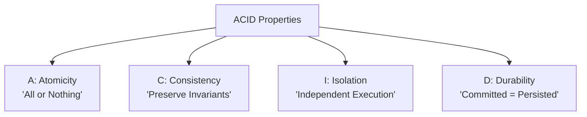
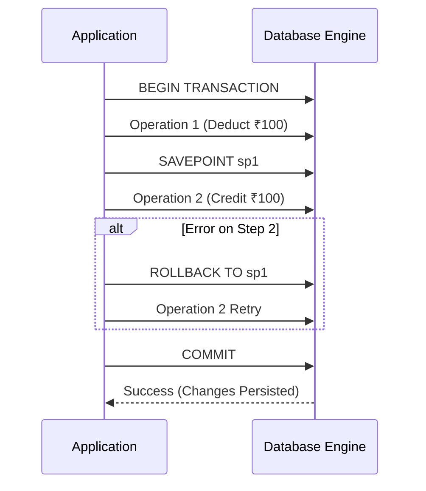
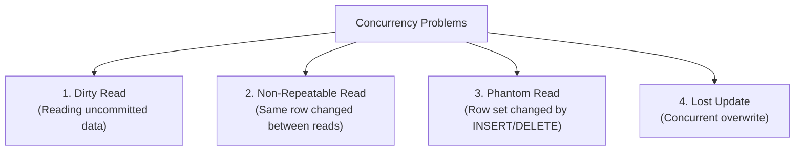
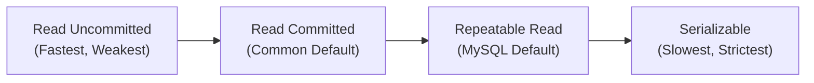
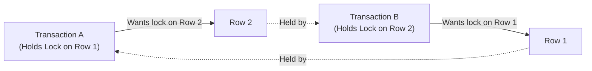

# Phase 7 — Transactions & Concurrency

In technical interviews for fresher and junior software engineering roles, questions on transactions evaluate your understanding of **data integrity, concurrent execution anomalies, and isolation levels**. You don't need to memorize low-level storage engine internals—focus on the **intuition, failure scenarios, and locking mechanisms**.

---

## 1. What is a Transaction?

A **Transaction** is a sequence of one or more database operations treated as a **single, indivisible logical unit of work**. Either all operations execute successfully, or none of them take effect.

### The Classic Bank Transfer Example
Suppose Alice transfers ₹100 to Bob:

```text
Initial Balances:
Alice = ₹1000
Bob   = ₹500
```

The transfer involves two distinct steps:
1. **Deduct ₹100 from Alice**: `UPDATE Account SET balance = balance - 100 WHERE id = 1;`
2. **Credit ₹100 to Bob**: `UPDATE Account SET balance = balance + 100 WHERE id = 2;`

```text
Desired Final State:
Alice = ₹900
Bob   = ₹600 (Total money in system = ₹1500)

Catastrophic Failure Scenario (Server crashes after Step 1):
Alice = ₹900
Bob   = ₹500 (₹100 vanished into thin air!)
```

To prevent this catastrophe, both operations must be wrapped in a single transaction:

```sql
BEGIN;

UPDATE Account
SET balance = balance - 100
WHERE id = 1;

UPDATE Account
SET balance = balance + 100
WHERE id = 2;

COMMIT; -- Both steps succeed together
```

If any failure occurs before `COMMIT`:
```sql
ROLLBACK; -- Undoes all partial changes; balances revert to ₹1000 and ₹500
```

---

## 2. The ACID Properties

The **ACID** properties guarantee that database transactions are processed reliably, even during system crashes, power failures, or concurrent access.



### A — Atomicity ("All or Nothing")
- A transaction cannot partially succeed.
- If all statements execute without error, the transaction commits.
- If any statement fails (or a crash occurs), the database engine uses undo logs to **roll back every change made since `BEGIN`**.

### C — Consistency ("Valid State to Valid State")
- The database moves from one valid state to another valid state that satisfies all defined **integrity constraints, schema rules, and business rules**.
- For example, if a table has a constraint `CHECK (balance >= 0)`, a transaction attempting to withdraw ₹1200 from Alice (balance ₹1000) will be aborted and rejected. The total money across accounts remains conserved.

### I — Isolation ("Concurrency Protection")
- Multiple transactions execute simultaneously without interfering with one another.
- The intermediate, uncommitted states of Transaction A must not be visible to Transaction B unless permitted by the isolation level.
- Controls anomalies like **dirty reads, non-repeatable reads, and phantom reads**.

### D — Durability ("Survives Power Loss")
- Once a transaction is committed (`COMMIT`), its state changes are **permanent and will survive power outages, crashes, or server restarts**.
- Accomplished via write-ahead logging (WAL) and disk-flush operations before reporting success to the client.

> [!NOTE]
> **Quick Interview Memory Hook:**
> - **Atomicity**: All or nothing.
> - **Consistency**: Rules & invariants preserved.
> - **Isolation**: Concurrent transactions don't interfere.
> - **Durability**: Committed data survives crashes.

---

## 3. Transaction Control Commands: COMMIT, ROLLBACK, SAVEPOINT

Transactions are controlled using standard SQL TCL commands:



### `COMMIT`
Permanently applies all modifications made during the current transaction. Once issued, changes cannot be rolled back.

```sql
BEGIN;
UPDATE Account SET balance = balance - 100 WHERE id = 1;
COMMIT;
```

### `ROLLBACK`
Aborts the current transaction and discards all pending uncommitted modifications.

```sql
BEGIN;
UPDATE Account SET balance = balance - 100 WHERE id = 1;
-- Something went wrong!
ROLLBACK; -- Alice's balance remains unchanged
```

### `SAVEPOINT`
Establishes a named checkpoint within a transaction. You can selectively roll back partial work to the savepoint without aborting the entire transaction.

```sql
BEGIN;

UPDATE Account SET balance = balance - 100 WHERE id = 1;

SAVEPOINT after_debit; -- Checkpoint created

UPDATE Account SET balance = balance + 100 WHERE id = 2; -- Suppose account 2 is frozen!

ROLLBACK TO after_debit; -- Rolls back only the credit to Account 2; debit remains active

UPDATE Account SET balance = balance + 100 WHERE id = 3; -- Credit fallback account instead

COMMIT;
```

---

## 4. Concurrent Transactions & Concurrency Problems

Databases handle thousands of transactions from simultaneous users. Executing transactions serially (one by one) eliminates concurrency problems but makes applications unacceptably slow.

However, executing transactions concurrently without proper isolation causes **four critical concurrency anomalies**:



---

## 5. Dirty Read

A **Dirty Read** occurs when Transaction B reads data modified by Transaction A that has **not yet been committed**, and Transaction A subsequently rolls back.

```text
Initial Balance = ₹1000

Transaction A                      Transaction B
─────────────────────────────      ─────────────────────────────
BEGIN;
UPDATE balance = ₹500;
(uncommitted)
                                   BEGIN;
                                   SELECT balance;  --> Reads ₹500 (DIRTY READ!)
ROLLBACK;
(balance reverts to ₹1000)
                                   Calculates based on ₹500 (INCORRECT!)
```

Transaction B made real decisions based on ephemeral data that **never officially existed in the database**.

---

## 6. Non-Repeatable Read (Fuzzy Read)

A **Non-Repeatable Read** occurs when Transaction A reads the same row twice within its execution and observes **different values** because Transaction B modified and committed that row between the two reads.

```text
Initial Balance = ₹1000

Transaction A                      Transaction B
─────────────────────────────      ─────────────────────────────
BEGIN;
SELECT balance; --> Reads ₹1000
                                   BEGIN;
                                   UPDATE balance = ₹500;
                                   COMMIT;
SELECT balance; --> Reads ₹500!
(Same query, same row, different values!)
```

> [!NOTE]
> In Non-Repeatable Read, Transaction B committed its changes legitimately. The issue is that Transaction A experienced an inconsistent view of the exact same row.

---

## 7. Phantom Read

A **Phantom Read** occurs when Transaction A runs a range query twice, and the second execution returns a **different set of matching rows** because Transaction B inserted or deleted rows matching the search condition and committed.

```sql
-- Query run by Transaction A:
SELECT * FROM Employee WHERE salary > 50000;
```

```text
Transaction A                      Transaction B
─────────────────────────────      ─────────────────────────────
BEGIN;
SELECT * WHERE salary > 50000;
Returns: [Alice (60k), Bob (70k)]
                                   BEGIN;
                                   INSERT INTO Employee VALUES ('Carol', 80000);
                                   COMMIT;
SELECT * WHERE salary > 50000;
Returns: [Alice (60k), Bob (70k), Carol (80k)]
(A "phantom" new row appeared!)
```

### Non-Repeatable Read vs Phantom Read

| Feature | Non-Repeatable Read | Phantom Read |
|---|---|---|
| **Anomaly Target** | An **existing individual row** | A **collection / set of rows** |
| **Caused by** | `UPDATE` on existing records | `INSERT` or `DELETE` matching a range predicate |
| **Symptom** | Column values in row change | Number of rows matching the query changes |

---

## 8. Lost Update

A **Lost Update** occurs when two concurrent transactions read the same value, calculate a modification, and write it back. The second write completely overwrites and erases the first write.

```text
Initial Balance = ₹100

Transaction A                      Transaction B
─────────────────────────────      ─────────────────────────────
Reads balance: ₹100                Reads balance: ₹100
Calculates ₹100 + ₹50 = ₹150       Calculates ₹100 + ₹20 = ₹120
Writes balance = ₹150
                                   Writes balance = ₹120 (OVERWRITES A!)
```

Final Balance: **₹120** (Instead of the correct ₹170). Transaction A's credit was lost!

---

## 9. Transaction Isolation Levels

The ANSI SQL standard defines four standard isolation levels to manage the trade-off between **data consistency** and **concurrency performance**:



### The Definitive Isolation Level Matrix

| Isolation Level | Dirty Read | Non-Repeatable Read | Phantom Read | Concurrency Level |
|---|:---:|:---:|:---:|---|
| **Read Uncommitted** | ❌ Allowed | ❌ Allowed | ❌ Allowed | Maximum (No read locks) |
| **Read Committed** | ✅ **Prevented** | ❌ Allowed | ❌ Allowed | High (Standard in Postgres/Oracle) |
| **Repeatable Read** | ✅ **Prevented** | ✅ **Prevented** | ❌ Allowed* | Moderate (Standard in MySQL InnoDB) |
| **Serializable** | ✅ **Prevented** | ✅ **Prevented** | ✅ **Prevented** | Lowest (Strict serial order) |

*\*Note: MySQL InnoDB uses Multi-Version Concurrency Control (MVCC) and Next-Key Locks to prevent phantom reads in Repeatable Read as well.*

### Setting Isolation Level in SQL
```sql
SET TRANSACTION ISOLATION LEVEL READ COMMITTED;
BEGIN;
-- queries here...
COMMIT;
```

---

## 10. Database Locks: Shared vs Exclusive

Locks prevent concurrent transactions from conflicting on the same physical data rows or tables:

```mermaid
graph TD
    Data["Data Row"]
    Tx1["Transaction 1: READ"] -->|Shared Lock (S)| Data
    Tx2["Transaction 2: READ"] -->|Shared Lock (S)| Data
    Tx3["Transaction 3: WRITE"] -.->|Blocked until S locks release| Data
```

### Shared Lock (S-Lock / Read Lock)
- Requested when a transaction wants to **read** data.
- **Multiple transactions can hold shared locks simultaneously on the same row**.
- Does not block other readers.
- **Blocks** any transaction attempting to acquire an Exclusive lock.

### Exclusive Lock (X-Lock / Write Lock)
- Requested when a transaction wants to **modify** (`INSERT`, `UPDATE`, `DELETE`) data.
- **Only one transaction can hold an exclusive lock on a row at any given time**.
- **Blocks ALL other transactions** from acquiring both Shared and Exclusive locks on that row.

### Lock Compatibility Matrix

| Current Lock \ Requested Lock | Shared Lock (S) | Exclusive Lock (X) |
|---|:---:|:---:|
| **Shared Lock (S)** | ✅ Compatible | ❌ Conflict (Must wait) |
| **Exclusive Lock (X)** | ❌ Conflict (Must wait) | ❌ Conflict (Must wait) |

---

## 11. Deadlocks

A **Deadlock** occurs when two or more transactions are waiting indefinitely for locks held by each other, forming a circular wait dependency.



```text
Sequence of events:
1. Transaction A locks Row 1.
2. Transaction B locks Row 2.
3. Transaction A requests lock on Row 2 --> Put on hold (waiting for B).
4. Transaction B requests lock on Row 1 --> Put on hold (waiting for A).
--> DEADLOCK! Neither transaction can ever progress.
```

### How Databases Handle Deadlocks
1. **Deadlock Detection**: The database engine maintains a *Wait-For Graph*. When a cycle is detected, the engine terminates and rolls back the transaction with the lowest cost (the "victim").
2. **Lock Timeouts**: If a transaction waits for a lock longer than a configured threshold (e.g., 50 seconds), it automatically times out and aborts.

### How to Prevent / Minimize Deadlocks in Application Code
- **Consistent Lock Ordering**: Always acquire locks on multiple tables or rows in the exact same deterministic order (e.g., always sort row IDs before locking: `ORDER BY id`).
- **Keep Transactions Short**: Perform computation outside the transaction and avoid user interaction while locks are held.
- **Use Appropriate Isolation Levels**: Avoid `SERIALIZABLE` when `READ COMMITTED` or optimistic locking is sufficient.
