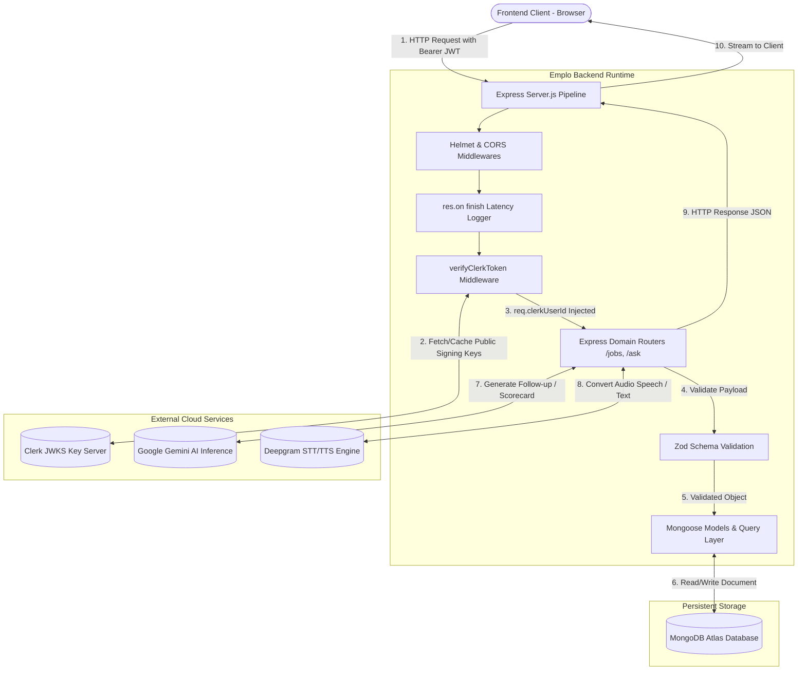
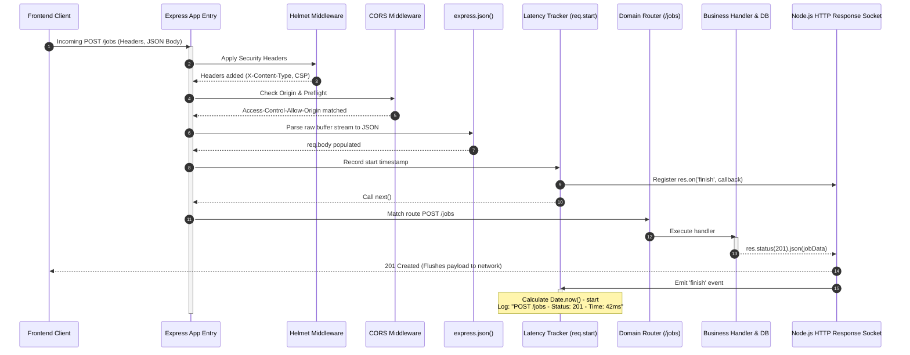

# Emplo AI Backend: Module 1 - Architecture, Tech Stack & Request Pipeline (Interview Prep Edition)

## 1. High-Level System Architecture & Technology Justifications

The Emplo AI Backend is designed as an event-driven **Node.js REST API** built on top of **Express.js**. It serves as the central orchestration engine for candidate evaluation, applicant tracking, live AI video interviews, and asynchronous scorecard generation.

In an interview setting, explaining *why* Node.js and Express were chosen for this specific problem domain demonstrates architectural depth.

### Why Node.js for an AI Interview Platform?

*   **I/O-Bound Workload vs. CPU-Bound Workload**:
    *   *The Nature of Emplo*: The backend is essentially an **API Integration Gateway and Orchestrator**. It spends the majority of its lifecycle waiting on network I/O: waiting for MongoDB queries, streaming audio buffers to Deepgram for Speech-to-Text (STT), awaiting Gemini LLM inference tokens, and dispatching webhook payloads.
    *   *The Node Event Loop*: Node.js utilizes a single-threaded event loop backed by `libuv` worker threads for non-blocking I/O. A single Node.js process can easily handle thousands of concurrent, idling connections (such as open HTTP sessions during an interview) with minimal memory overhead, whereas thread-per-request architectures (like traditional Java Spring or Python WSGI) consume substantial memory per thread while waiting on external API responses.
    *   *When would Node fail here?* If we performed client-side audio/video transcoding (e.g. running raw FFmpeg or deep neural network face detection directly in the Node.js process), the CPU-heavy calculations would block the single-threaded event loop and freeze all incoming HTTP requests. Emplo avoids this completely by offloading heavy media rendering to cloud storage/external SDKs (Deepgram, Google Gemini) and client-side browser workers.

### Core Technology Stack & Architectural Roles

| Technology | Role in Architecture | Interview Justification & Trade-offs |
| :--- | :--- | :--- |
| **Node.js 18+ / Express.js** | HTTP REST Server & Pipeline | Minimalist, unopinionated middleware chain. Extremely low latency overhead compared to heavier enterprise frameworks like NestJS, with maximum community support for SDK integrations. |
| **MongoDB & Mongoose** | Primary Document Datastore & ODM | Flexible schema accommodating polymorphic data (chat transcripts of varying lengths, dynamic question weights, and nested interview logs) without costly relational migrations. |
| **Zod** | Boundary Type Safety & Schema Validation | Runtime data parsing and validation. Guarantees that invalid payloads never touch business logic or reach the database. |
| **Clerk SDK & `jwks-rsa`** | Identity Provider & Cryptographic Token Verification | Decentralized authentication via JSON Web Key Sets (JWKS). The backend verifies signatures asymmetrically without making a blocking HTTP roundtrip on every request. |
| **`@google/genai` (Gemini)** | Large Language Model (LLM) Inference | Fast, cost-effective reasoning for dynamic conversational follow-up questions and multi-rubric candidate scorecards. |
| **`@deepgram/sdk`** | Real-time Speech-to-Text (STT) & Text-to-Speech (TTS) | Industry-leading sub-second speech transcription and synthesis optimized for conversational latency. |

---

## 2. Codebase Organization & Architectural Patterns

The codebase follows a modular, layer-based separation of concerns:

```text
📁 emplo-backend-main
├── 📁 config/        # Environment configurations (.env mappings, constants)
├── 📁 middlewares/   # Interceptors for authentication, error handling, rate limiting
├── 📁 models/        # Mongoose ODM schemas & Zod runtime validators
├── 📁 routes/        # Express route definitions grouped by domain (jobs, interviews, profiles)
├── 📁 scripts/       # Automated CLI tooling and local database seeders
├── 📁 utils/         # Reusable infrastructure utilities (logger, DB connection, Gemini helpers)
├── server.js         # Central server bootstrap, middleware mounting & HTTP listener
└── package.json      # Dependency manifests and scripts
```

### Architectural Principles Implemented:
1.  **Fail-Fast at the Perimeter**: Requests are validated by Zod at the route entry before invoking controllers or hitting the database.
2.  **Stateless API Design**: The backend maintains no server-side sessions in RAM. Any instance can process any request, allowing the API to scale horizontally behind a load balancer.
3.  **Decoupled Authentication**: User identities and credentials live inside Clerk's security perimeter; the backend only validates cryptographic claims.

---

## 3. Server Initialization & Middleware Pipeline (`server.js`)

In Express, **middleware order is critical**. Express processes middleware in the exact sequence they are declared with `app.use()`.

```javascript
// server.js Breakdown
const express = require('express');
const cors = require('cors');
const helmet = require('helmet');
const connectDB = require('./utils/database');
const logger = require('./utils/logger');

// 1. Initialize persistent database connection pool before starting server
connectDB();

const app = express();

// 2. Security Middleware: Helmet
// Sets 15+ HTTP security headers (HSTS, Content-Security-Policy, X-Frame-Options)
app.use(helmet());

// 3. Cross-Origin Resource Sharing (CORS)
// Enforces allowed origins and credentials (cookies/auth headers)
app.use(cors({ origin: 'http://localhost:3000', credentials: true }));

// 4. Body Parsing
// Automatically parses incoming 'application/json' payloads into req.body
app.use(express.json());

// 5. Non-blocking Performance & Latency Logging Middleware
app.use((req, res, next) => {
  const start = Date.now();
  // Listen to the response stream 'finish' event to record accurate end-to-end latency
  res.on('finish', () => {
    const duration = Date.now() - start;
    logger.info(`${req.method} ${req.originalUrl} - Status: ${res.statusCode} - Time: ${duration}ms`);
  });
  next(); // Immediately forward request to next handler in chain
});

// 6. Mount Domain Routers
app.use(require('./routes/jobs'));
app.use(require('./routes/interview_routes'));

// 7. Start HTTP Listener
app.listen(8000, () => {
  logger.info(`Server listening on port 8000`);
});
```

### Deep Dive: Request Timing Logger (`res.on('finish')`)
*Interview Question*: *How do you accurately measure route execution duration without blocking the response?*
*Answer*: We record `const start = Date.now()` *before* invoking `next()`, but we **do not** log immediately. Instead, we attach an event listener to the Node.js HTTP `res` EventEmitter listening for the `'finish'` event. This event fires only after the response headers and body have been completely written to the network socket. This guarantees our logged duration accounts for all middleware, DB queries, third-party API latency, and network serialization without adding synthetic delay.

---

## 4. Macro Backend Architecture (Data Flow Diagram)

This Data Flow Diagram demonstrates how the Express server coordinates between inbound requests, internal services, and external microservices.



---

## 5. Express Middleware Execution Pipeline (Sequence Diagram)

This sequence diagram illustrates the lifecycle of a request traversing through global security, latency logging, route matching, and the eventual asynchronous logging trigger.


