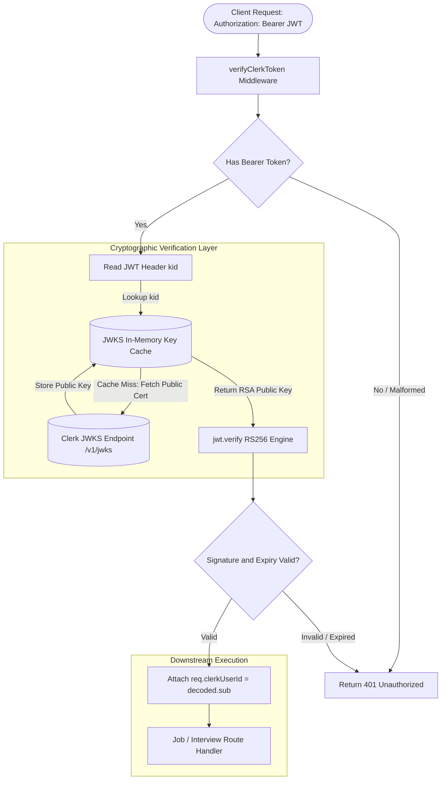
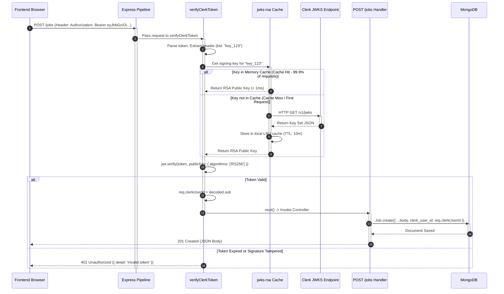

# Emplo AI Backend: Module 2 - Security & Authentication Architecture (Interview Prep Edition)

## 1. Authentication Philosophy: Centralized Identity vs. Decentralized Verification

In a distributed modern architecture, the backend should **never store passwords or maintain session state in server RAM**. Emplo offloads identity management, password hashing, Multi-Factor Authentication (MFA), and session creation to **Clerk**, while retaining strict cryptographic verification at the API boundary.

---

## 2. Cryptographic Foundations: RS256 vs. HS256

A classic senior engineering interview question revolves around why asymmetric encryption was chosen for JWT verification.

### Symmetric Signing (HS256 - HMAC with SHA-256)
*   **Mechanism**: A single shared secret string is used to both *sign* and *verify* the token.
*   **The Risk**: Both the authentication server (Clerk) and every consuming microservice (our backend, background workers, analytics) must know the shared secret. If any single service is compromised or the secret leaks into environment variables, an attacker can forge arbitrary JWTs with root privileges.

### Asymmetric Signing (RS256 - RSA Signature with SHA-256) — *Emplo's Architecture*
*   **Mechanism**: A **Public/Private Key Pair** is used:
    1.  **Private Key**: Held securely and exclusively inside Clerk's hardware security modules. Used to sign JWTs upon user login.
    2.  **Public Key**: Published openly by Clerk via an industry-standard **JWKS (JSON Web Key Set)** endpoint (`https://api.clerk.com/v1/jwks`).
*   **The Benefit**: Our backend needs **zero secret keys** to verify identities. It only downloads the public certificate once, caches it, and verifies token signatures locally. Even if our backend server is completely breached, an attacker cannot forge new tokens for other users.

---

## 3. Deep Dive: The Security Guard (`middlewares/auth.js`)

Here is the exact source code for our authentication middleware, annotated for an interview discussion:

```javascript
// middlewares/auth.js
const jwt = require('jsonwebtoken');
const jwksClient = require('jwks-rsa');

// 1. Initialize JWKS Client with Caching & Rate-Limiting
const client = jwksClient({
  jwksUri: `https://api.clerk.com/v1/jwks`,
  cache: true,              // Cache signing keys in memory to prevent hammering Clerk
  cacheMaxEntries: 5,       // Store up to 5 signing keys (for seamless key rotation)
  cacheMaxAge: 600000       // Cache TTL: 10 minutes (prevents stale keys)
});

// 2. Dynamic Key Resolver Callback
// Uses the Key ID ('kid') found in the unverified JWT header to fetch the matching public key
function getKey(header, callback) {
  client.getSigningKey(header.kid, function (err, key) {
    if (err) {
      return callback(err, null);
    }
    const signingKey = key.publicKey || key.rsaPublicKey;
    callback(null, signingKey);
  });
}

// 3. The Security Guard Middleware
const verifyClerkToken = (req, res, next) => {
  const authHeader = req.headers.authorization;
  
  // Rule A: Validate Header Existence and Format
  if (!authHeader || !authHeader.startsWith('Bearer ')) {
    return res.status(401).json({ detail: 'Authorization token missing' });
  }

  // Rule B: Extract Token String
  const token = authHeader.split(' ')[1];

  // Rule C: Cryptographic Verification
  jwt.verify(token, getKey, { algorithms: ['RS256'] }, (err, decoded) => {
    if (err) {
      // Handles Expired Token, Invalid Signature, or Algorithm Mismatch
      return res.status(401).json({ detail: 'Invalid token' });
    }
    
    // Rule D: Context Injection
    // decoded.sub contains the unique, immutable Clerk User ID (e.g., 'user_2bXYZ...')
    req.clerkUserId = decoded.sub;
    
    // Forward execution to the downstream controller
    next();
  });
};

module.exports = { verifyClerkToken };
```

### Critical Interview Talking Points:

1.  **`jwt.decode()` vs. `jwt.verify()`**:
    *   `jwt.decode()` simply reads the Base64-encoded payload without checking if the signature is authentic. Never trust data from `jwt.decode()` for authorization!
    *   `jwt.verify()` cryptographically validates the signature against the mathematical public key and checks the `exp` (expiration) timestamp claim.
2.  **Key Rotation (`kid`)**:
    *   A JWT consists of `Header.Payload.Signature`. The `Header` contains a `kid` (Key Identifier). When Clerk periodically rotates its cryptographic keys for compliance, existing tokens with the old `kid` still validate against cached keys, while new tokens trigger a fetch for the updated public key.
3.  **Context Injection (`req.clerkUserId`)**:
    *   Notice that rather than querying MongoDB for user profile details during authentication, we simply attach `req.clerkUserId = decoded.sub`. This maintains sub-millisecond middleware execution and prevents an unnecessary database roundtrip on every HTTP request.

---

## 4. Defense-in-Depth: Perimeter Hardening

Authentication is only one pillar of API security. The Emplo backend implements multiple defensive perimeters:

### 1. Helmet HTTP Headers (`app.use(helmet())`)
*   **`Content-Security-Policy (CSP)`**: Restricts where external assets (scripts, images) can be loaded from.
*   **`X-Frame-Options: SAMEORIGIN`**: Prevents **Clickjacking** attacks by forbidding our API responses or pages from being embedded in malicious third-party `<iframe />` tags.
*   **`Strict-Transport-Security (HSTS)`**: Enforces HTTPS connections and disallows insecure HTTP downgrade attacks.
*   **`X-Content-Type-Options: nosniff`**: Instructs browsers not to guess (MIME-sniff) file types, mitigating malicious script execution.

### 2. CORS (Cross-Origin Resource Sharing)
```javascript
app.use(cors({ origin: 'http://localhost:3000', credentials: true }));
```
*   *Why not `origin: '*'`?* Wildcard origins completely expose internal API endpoints to requests initiated by foreign browser domains. When `credentials: true` is enabled (allowing cookies or authorization headers), the CORS specification strictly prohibits using wildcard `*`. The backend explicitly matches against approved origins.

---

## 5. Authentication Verification Flow (Data Flow Diagram)

This DFD visualizes the flow of trust: from the bearer token presented by the client to the key resolution and context injection inside the Express pipeline.



---

## 6. Secure Request Authorization Lifecycle (Sequence Diagram)

This sequence diagram details what happens when a protected endpoint (like creating a job) is called, highlighting the in-memory caching mechanism that prevents network bottlenecks.


