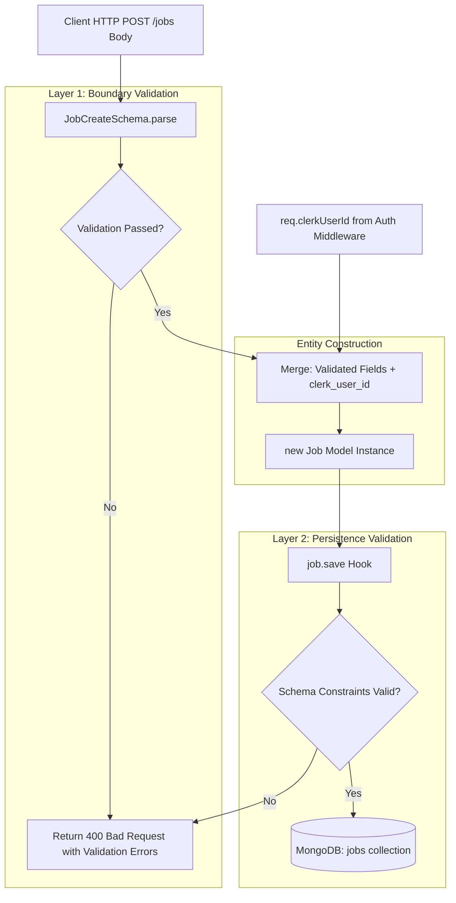
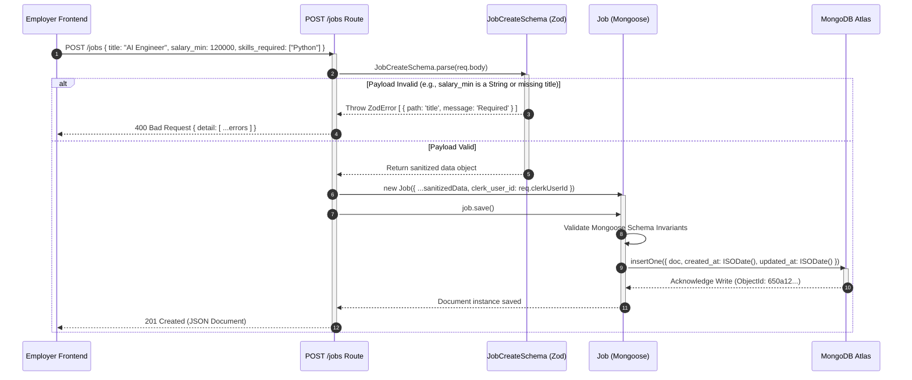

# Emplo AI Backend: Module 3 - Data Modeling, Persistence & Validation (Interview Prep Edition)

## 1. Database Architecture: Document Store vs. Relational Datastores

When architecting a platform that records conversational AI interviews and scores candidates, data modeling is a frequent focal point in system design interviews.

### Why MongoDB (Document DB) over PostgreSQL (RDBMS)?

| Requirement | Relational DB (PostgreSQL / MySQL) | Document Store (MongoDB + Mongoose) |
| :--- | :--- | :--- |
| **Conversational Transcripts** | Requires a separate `messages` table with Foreign Keys to `transcripts`. Every conversational turn requires an SQL `JOIN` or multiple queries to reconstruct context. | **Embedded Arrays**: The entire conversation is stored inside a single document (`Transcript.messages`). Atomic `$push` operations append messages in $O(1)$ time without joins. |
| **Dynamic Job Scoring Rubrics** | Storing arbitrary scoring criteria requires complex Entity-Attribute-Value (EAV) schemas or Postgres `JSONB` with manual migrations. | **Schema Flexibility**: Supported natively via `mongoose.Schema.Types.Mixed` for `question_weights`. Each employer can have completely different evaluation rubrics. |
| **Horizontal Scalability** | Sharding relational databases across multiple nodes requires complex partition keys and limits multi-table transactions. | Document databases naturally partition at the document level (e.g., sharding by `clerk_user_id` or `job_id`). |

---

## 2. Schema Design Patterns: Embedding vs. Referencing

In MongoDB, the most critical modeling decision is choosing between **Embedding** (denormalization) and **Referencing** (normalization).

Let's examine how `models/index.js` implements this:

```javascript
// models/index.js (Deconstructed)
const mongoose = require('mongoose');

// Sub-Document Pattern: MessageSchema
const MessageSchema = new mongoose.Schema({
  role: { type: String, enum: ['user', 'assistant'], required: true },
  content: { type: mongoose.Schema.Types.Mixed, required: true },
  topic: String,
  is_follow_up: Boolean,
  timestamp: { type: Date, default: Date.now }
}, { _id: false }); // Optimization: Disables generation of unnecessary ObjectId for each turn

// Root Document: TranscriptSchema
const TranscriptSchema = new mongoose.Schema({
  job_id: { type: String, required: true, index: true },           // Referenced ID
  clerk_user_id: { type: String, required: true, index: true },    // Referenced ID
  messages: [MessageSchema],                                      // Embedded Sub-Documents
  question_count: { type: Number, default: 0 },
  turn_count: { type: Number, default: 0 },
  status: { 
    type: String, 
    enum: ["pending", "in_progress", "completed"], 
    default: "pending" 
  },
}, { timestamps: { createdAt: 'created_at', updatedAt: 'updated_at' } });

const Transcript = mongoose.model('Transcript', TranscriptSchema, 'transcripts');
```

### Critical Architectural Decisions:
1.  **Embedding `messages: [MessageSchema]`**:
    *   *Why?* A message has no independent lifecycle. You never query for message `#4` across all interviews; you only ever load messages within the context of a specific interview transcript. Embedding guarantees that reading the transcript and its entire history is a **single, lightning-fast disk read**.
    *   *Why `{ _id: false }`?* MongoDB automatically adds a 12-byte `_id` to subdocuments by default. Disabling this saves significant storage and RAM across millions of message turns.
2.  **Referencing `job_id` and `clerk_user_id`**:
    *   *Why?* Jobs and Users are independent business entities. We reference their IDs rather than duplicating the entire Job posting inside the transcript. If the employer edits the job description, the transcript remains linked without requiring updates to thousands of past documents.
3.  **Indexing (`index: true`)**:
    *   Adding secondary indexes on `job_id` and `clerk_user_id` ensures that queries like *"Find all candidate transcripts for Job X"* execute in $O(\log N)$ time via B-trees rather than scanning the entire collection ($O(N)$).

---

## 3. The Two-Layer Validation Strategy: Zod + Mongoose

A major architectural highlight of the Emplo backend is the **Two-Layer Validation Strategy**.

```
Inbound HTTP Request
         │
         ▼
┌─────────────────────────────────┐
│ Layer 1: Zod (Boundary Guard)   │  ──> Validates Shape, Types, Rejects Malformed Payloads (400 Bad Request)
└─────────────────────────────────┘
         │
         ▼
┌─────────────────────────────────┐
│ Business Logic & Transformations│
└─────────────────────────────────┘
         │
         ▼
┌─────────────────────────────────┐
│ Layer 2: Mongoose (DB Guard)    │  ──> Enforces Invariants, Default Values, Required Constraints
└─────────────────────────────────┘
         │
         ▼
     MongoDB
```

### Why Use Both Zod and Mongoose?

*   **Layer 1: Zod at the HTTP Perimeter (`models/validators.js`)**:
    *   *Role*: Defensive validation at the network boundary.
    *   *Advantage*: Catches unexpected fields, type errors (e.g., string passed where a number is expected), and semantic validation (e.g., email format, string lengths) *before* executing database queries. It produces standardized, user-friendly error arrays (`error.errors`).
*   **Layer 2: Mongoose at the Storage Perimeter (`models/index.js`)**:
    *   *Role*: Database integrity.
    *   *Advantage*: Protects the database against programmer errors, background jobs, or CLI scripts (like `seed_vedaai.js`) that bypass the HTTP route handlers.

### Code Implementation (`routes/jobs.js`):

```javascript
router.post('/jobs', verifyClerkToken, async (req, res) => {
  try {
    // 1. Layer 1 Validation: Zod parses and sanitizes request body
    const parsed = JobCreateSchema.parse(req.body);
    
    // 2. Inject verified authentication context (not trusted from client body)
    const job = new Job({ 
        ...parsed, 
        clerk_user_id: req.clerkUserId 
    });
    
    // 3. Layer 2 Validation: Mongoose validates schema constraints upon save()
    await job.save();
    
    res.status(201).json(job);
  } catch (error) {
    // Standardized Bad Request Error Handling
    res.status(400).json({ detail: error.errors || error.message });
  }
});
```

---

## 4. Validation and Storage Architecture (Data Flow Diagram)

This diagram tracks how an incoming payload is sanitized, authenticated, and transformed into a persistent MongoDB document.



---

## 5. Job Creation & Two-Tier Validation Lifecycle (Sequence Diagram)

This sequence diagram illustrates the lifecycle of creating a job, contrasting the defensive checks that protect against database corruption.


