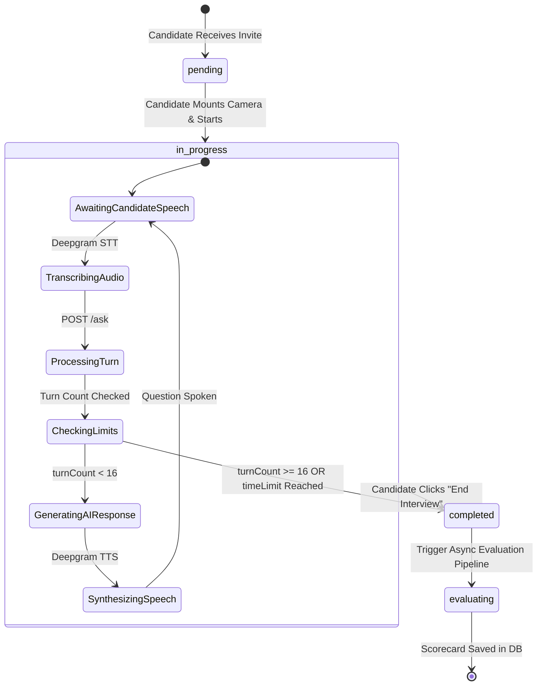
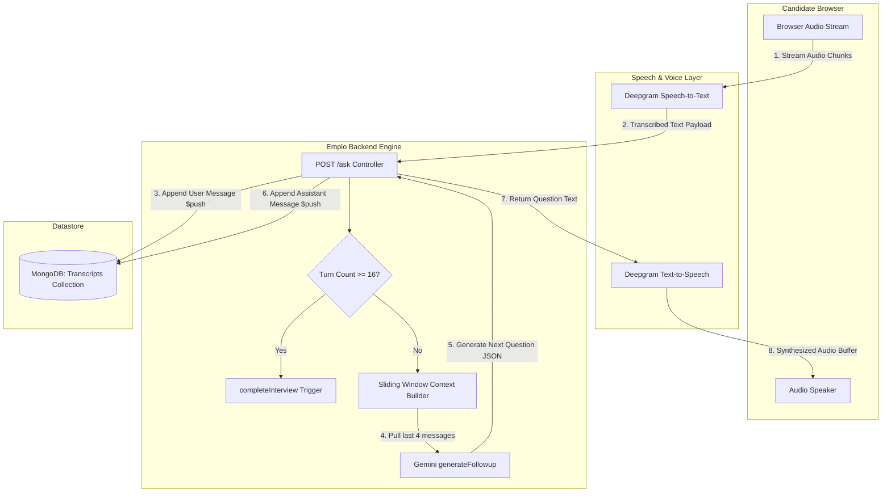
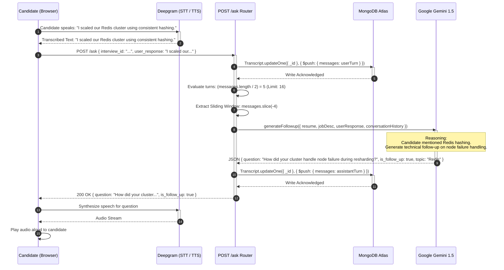

# Emplo AI Backend: Module 4 - Live AI Interview Engine & State Machine (Interview Prep Edition)

## 1. Architectural Overview: The Real-Time AI State Machine

The core value proposition of Emplo AI is its autonomous live video-interview engine. Unlike simple ChatGPT wrappers that merely exchange text prompts, the Emplo backend operates as a **State Machine** governing pacing, context memory, topic transitions, and turn limits.

In system design interviews, demonstrating how to build a state machine around non-deterministic LLMs is a major differentiator.

---

## 2. Conversational Memory & The "Sliding Window" Pattern

One of the most critical engineering decisions in `routes/interview_routes.js` is how conversation history is handled:

```javascript
// routes/interview_routes.js (Snippet)
// 1. Fetch transcript and verify state
const transcript = await Transcript.findById(req.body.interview_id);

// 2. Append user's latest response atomically to MongoDB
const now = new Date();
await Transcript.updateOne(
  { _id: transcript._id },
  { $push: { messages: { role: 'user', content: req.body.user_response, timestamp: now } } }
);

// 3. Evaluate Turn Limits (State Transition)
const messages = transcript.messages;
const turnCount = Math.floor(messages.length / 2);
if (turnCount >= 16) {
    return completeInterview(transcript, 'turn_limit'); 
}

// 4. Token & Latency Optimization: The Sliding Window
// We slice only the last 4 messages for the live prompt context!
const conversationHistory = messages.slice(-4); 

// 5. Query Gemini with bounded context
const followup = await generateFollowup({
  resume: candidateResume,
  jobDescription: job.description,
  userResponse: req.body.user_response,
  coreQuestionCount: transcript.question_count,
  conversationHistory: conversationHistory
});
```

### Why the "Sliding Window" Context Pattern?

*Interview Question*: *Why don't you send the entire conversation history to the LLM on every single turn?*

*   **1. Latency (Time To First Token - TTFT)**:
    In a voice conversation, human conversational pauses average between **200ms to 800ms**. If an AI takes 4 seconds to reply, the interview feels robotic and disjointed. Processing 16 rounds of back-and-forth transcript tokens drastically increases LLM prefill time. A 4-message window guarantees prefill latency remains under 500ms throughout the entire interview.
*   **2. Token Cost Quadratic Explosion**:
    If an interview has 16 turns and you send the cumulative history every turn, token consumption grows with $O(N^2)$ complexity:
    $$\text{Tokens} = \sum_{k=1}^{N} (\text{Prompt} + k \times \text{TurnSize})$$
    With a fixed 4-turn window, token growth is strictly linear ($O(N)$), reducing inference costs by over 70%.
*   **3. Preventing "Lost in the Middle" Hallucinations**:
    LLM research demonstrates that large context windows suffer from attention degradation in the middle of long prompts. Slicing to the immediate 4 messages forces the LLM to focus intensely on whether the candidate's *immediate* prior answer requires a technical follow-up or if it is time to pivot to a new topic.
*   **4. Separation of Live Conversation from Global Audit**:
    Notice that the **entire** conversation is still persisted in MongoDB via `$push`. We discard history only from the *inference payload*, not from the *system of record*.

---

## 3. Finite State Machine (FSM) Transitions

The interview transcript lifecycle is modeled as a deterministic Finite State Machine:



---

## 4. Voice Pipeline Integration (Deepgram + Gemini)

The interview is fully hands-free and voice-driven. The backend coordinates with two specialized AI microservices:

1.  **Speech-to-Text (STT - Deepgram Nova-2)**:
    *   Transcribes candidate voice into text with timestamps and word-level confidence scores.
    *   Optimized for technical jargon, programming language names, and accents.
2.  **LLM Reasoning (Google Gemini 1.5 Flash)**:
    *   Evaluates the candidate's answer against the job description requirements.
    *   Determines `is_follow_up: boolean` (whether to probe deeper into an ambiguous claim or move to the next topic).
3.  **Text-to-Speech (TTS - Deepgram Aura)**:
    *   Converts the generated AI question into natural, conversational speech with human-like prosody and minimal synthesis latency.

---

## 5. Conversational Interview Engine (Data Flow Diagram)

This DFD visualizes the complete conversational feedback loop between the browser, speech engines, the Express state machine, and the MongoDB persistence layer.



---

## 6. Single-Turn Conversational Execution (Sequence Diagram)

This sequence diagram illustrates the millisecond-level execution sequence of a single conversational turn during an interview.


