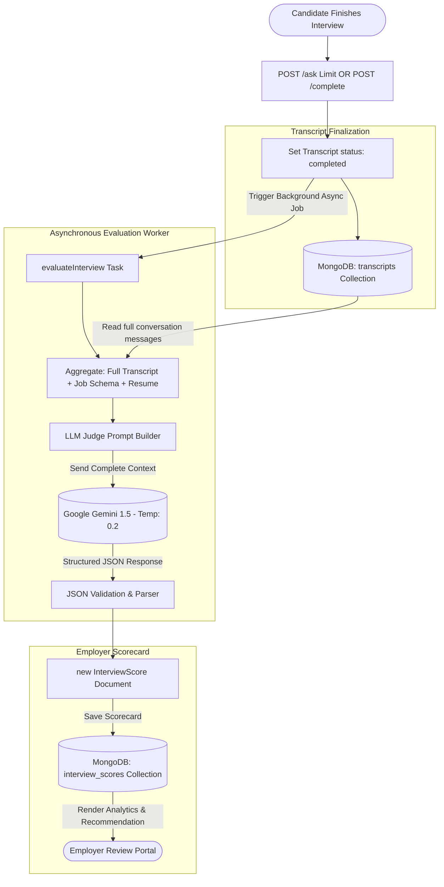
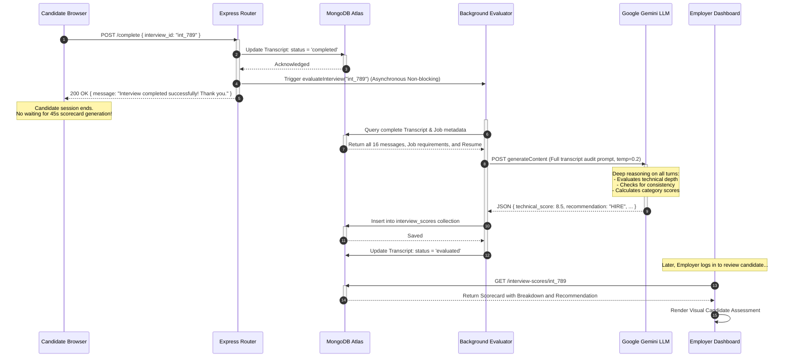

# Emplo AI Backend: Module 5 - Evaluation Pipeline & Developer Tooling (Interview Prep Edition)

## 1. System Design Principle: Decoupling Synchronous Interactions from Asynchronous Batch Analytics

A foundational principle of scalable software design is: **Never execute heavy analytical batch jobs inside low-latency, user-facing request cycles.**

In the Emplo platform, the candidate evaluation workflow is strictly separated into two distinct pipelines:

| Dimension | Live Interview Pipeline (`/ask`) | Post-Interview Evaluation Pipeline (`interview_evaluator.js`) |
| :--- | :--- | :--- |
| **Primary Metric** | **Latency (TTFT)**: Must respond in < 1s to feel like a real voice conversation. | **Throughput & Depth**: Can take 30–60 seconds to produce comprehensive rubrics. |
| **LLM Context Scope** | **Sliding Window**: Last 4 messages only to save tokens and maintain speed. | **Full Transcript**: Ingests all 16+ turns, resume, and full job criteria. |
| **Candidate Impact** | Blocking: Candidate is actively waiting with webcam on. | Non-blocking: Candidate has finished and closed their browser. |
| **Execution Model** | Synchronous HTTP Request/Response. | Asynchronous Event-Driven Background Worker. |

---

## 2. The Evaluator Architecture (`routes/interview_evaluator.js`)

When an interview ends (via turn limit, timeout, or manual completion), `completeInterview()` marks the transcript document as `status: "completed"` and initiates the background evaluator.

```javascript
// routes/interview_evaluator.js (Conceptual Breakdown)

async function evaluateInterview(transcriptId) {
  // 1. Fetch complete conversation transcript and linked Job details
  const transcript = await Transcript.findById(transcriptId);
  const job = await Job.findById(transcript.job_id);

  // 2. Format the complete transcript into an audit log for the LLM
  const formattedTranscript = transcript.messages
    .map(m => `[${m.role.toUpperCase()}]: ${m.content}`)
    .join('\n\n');

  // 3. System Prompt: Directing the LLM as an Impartial Judge
  const prompt = `
    You are an expert technical hiring manager evaluating an interview transcript.
    Job Title: ${job.title}
    Job Description: ${job.description}
    Required Skills: ${job.skills_required.join(', ')}
    
    Complete Interview Transcript:
    ${formattedTranscript}

    Evaluate the candidate strictly on:
    1. Technical Competency (1-10)
    2. Problem Solving & Critical Thinking (1-10)
    3. Communication & Cultural Add (1-10)
    
    Return a strict, valid JSON object matching this schema:
    {
      "technical_score": number,
      "problem_solving_score": number,
      "communication_score": number,
      "overall_score": number,
      "recommendation": "STRONG_HIRE" | "HIRE" | "LEAN_NO_HIRE" | "NO_HIRE",
      "summary": string,
      "strengths": string[],
      "areas_of_improvement": string[]
    }
  `;

  // 4. Low-temperature inference for deterministic, unbiased scoring
  const rawResponse = await geminiModel.generateContent({
    contents: [{ role: 'user', parts: [{ text: prompt }] }],
    generationConfig: {
      temperature: 0.2, // Low temperature minimizes creative hallucinations
      responseMimeType: "application/json" // Enforce strict JSON output
    }
  });

  // 5. Parse and persist scorecard
  const evaluationResult = JSON.parse(rawResponse.text);
  
  const scoreCard = new InterviewScore({
    transcript_id: transcript._id,
    job_id: job._id,
    clerk_user_id: transcript.clerk_user_id,
    ...evaluationResult
  });

  await scoreCard.save();
  
  // 6. Update Transcript status
  await Transcript.updateOne({ _id: transcriptId }, { status: 'evaluated' });
}
```

---

## 3. Production LLM Reliability & Structured JSON Parsing

A recurring challenge when building production applications around LLMs is handling non-deterministic responses. Interviewers frequently ask: *How do you ensure the LLM output doesn't crash your server when parsing JSON?*

Emplo implements multiple layers of defensive handling:

1.  **Native JSON Mode (`responseMimeType: "application/json"`)**:
    We instruct the Gemini engine at the API level to constrain token generation to valid JSON grammars, eliminating conversational preambles like *"Sure! Here is your evaluation:"*.
2.  **Markdown Fence Sanitization**:
    If an older model or alternative provider wraps output in markdown fences (````json ... ````), our parser strips backticks and leading/trailing whitespace before calling `JSON.parse()`.
3.  **Low Temperature Setting (`temperature: 0.2`)**:
    Higher temperatures (0.7–1.0) introduce randomness suitable for creative writing. For candidate scoring, low temperatures ensure that identical performance consistently receives identical scores across multiple evaluations.
4.  **Schema Validation on Evaluator Output**:
    Before saving to the `InterviewScore` collection, the parsed JSON is validated against a Mongoose Schema to guarantee all sub-scores are numbers and required summary strings are present.

---

## 4. Developer Tooling & Database Seeding (`scripts/`)

In modern software engineering, developer velocity is critical. Manually clicking through a frontend UI to create an employer account, post a job, and take an interview just to test a small backend change wastes hours.

The `scripts/` directory provides CLI automation:

```javascript
// scripts/seed_vedaai.js (Conceptual Breakdown)
const mongoose = require('mongoose');
const { Job, Employer } = require('../models');
const config = require('../config');

async function seed() {
  // 1. Direct connection to MongoDB Atlas bypassing the HTTP server
  await mongoose.connect(config.MONGODB_URI);
  
  // 2. Clean existing development fixtures
  await Job.deleteMany({ company: "VedaAI Test" });
  
  // 3. Inject synthetic test entities
  const testJob = await Job.create({
    clerk_user_id: "user_dev_testing_123",
    title: "Senior Fullstack Engineer",
    company: "VedaAI Test",
    location: "Remote",
    salary_min: 140000,
    salary_max: 180000,
    skills_required: ["Node.js", "React", "MongoDB", "TypeScript"],
    status: "active"
  });

  console.log(`Seeded Test Job: ${testJob._id}`);
  process.exit(0);
}

seed();
```

*Interview Talking Point*: Explaining that your repository contains direct database seed scripts shows practical team experience. It demonstrates you build tooling for rapid integration testing, staging environment bootstrapping, and isolated debugging.

---

## 5. Post-Interview Evaluation Pipeline (Data Flow Diagram)

This DFD shows how an interview moves from live completion into background audit logging, LLM evaluation, and eventual employer scorecard delivery.



---

## 6. Post-Interview Evaluation Execution (Sequence Diagram)

This sequence diagram illustrates the non-blocking execution flow when an interview completes, showing how the candidate receives an immediate response while heavy LLM grading proceeds in the background.


