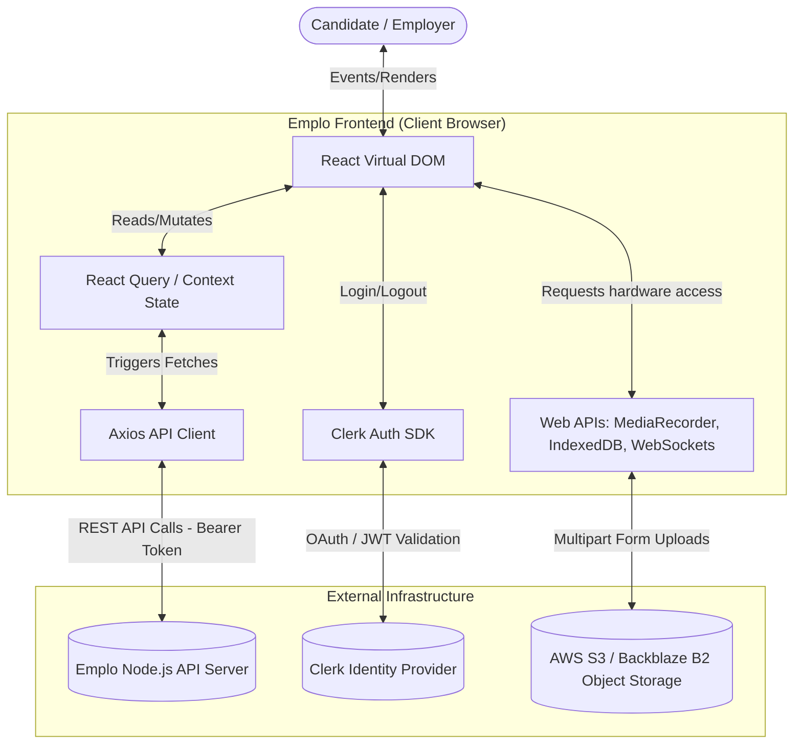
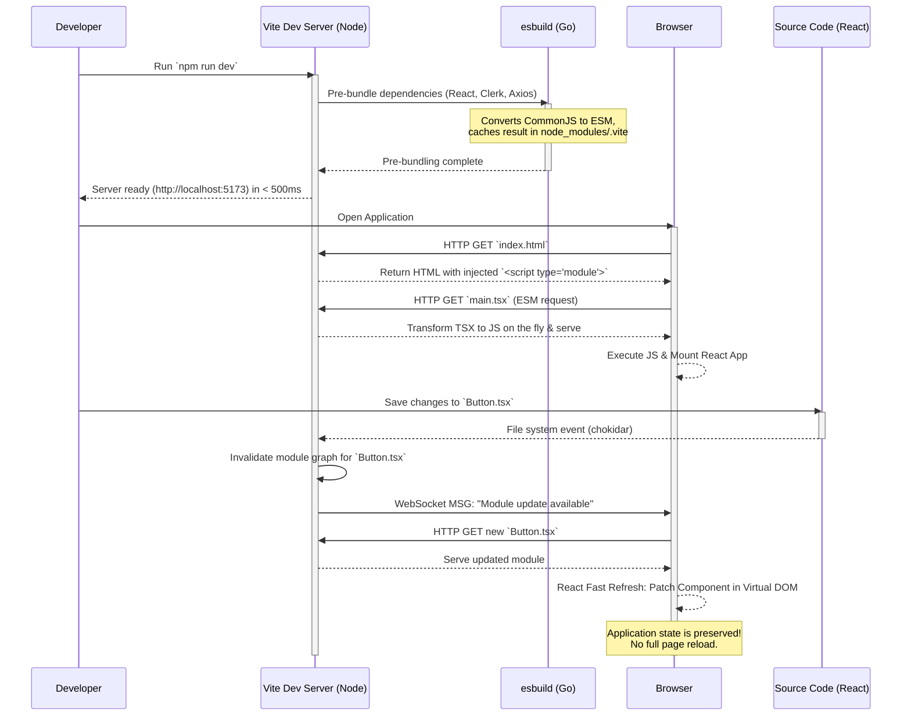

# Emplo AI Frontend: Module 1 - Overview & Architecture (Interview Prep Edition)

## 1. High-Level Project Overview & Architecture Decisions

The Emplo AI Frontend is a unified, production-grade web application. It serves multiple distinct user personas (candidates taking interviews, employers reviewing them) and handles complex real-time operations (webcam streaming, audio processing, background uploads) within a single Single Page Application (SPA) architecture.

For an interview, it's crucial to understand not just *what* technologies are used, but *why* they were chosen over alternatives.

### Core Technology Stack & Architectural Justifications

*   **React 18 (UI Library)**
    *   **What it is**: The foundational library for building interactive user interfaces based on components and reactive state.
    *   **Interview Focus (Why React 18?)**: React 18 introduced **Concurrent Features**. For Emplo, this is critical. The AI Interview module heavily utilizes the main thread for video processing and proctoring checks. React 18's concurrent rendering (like `useTransition`) allows the UI to stay responsive (e.g., typing in a chat or clicking buttons) even while heavy background tasks are running, by yielding control back to the browser. It also features **Automatic Batching**, reducing unnecessary re-renders when multiple state updates happen in asynchronous callbacks (like after an API fetch).
    *   **Alternatives considered**: Vue/Angular. React was chosen for its massive ecosystem, specifically the availability of mature libraries for complex tasks like WebRTC and media handling.

*   **Vite 5 (Build Tool & Dev Server)**
    *   **What it is**: A modern frontend build tool that significantly improves the developer experience.
    *   **Interview Focus (Why Vite over Webpack?)**: Traditional bundlers like Webpack crawl your entire application and bundle it into a single file *before* serving it, which gets painfully slow as the app grows. Vite takes a different approach:
        1.  It pre-bundles dependencies (like React) using **esbuild** (written in Go, which is 10-100x faster than JS-based bundlers).
        2.  It serves source code over native browser **ES Modules (ESM)**. The browser requests files as it needs them, meaning the dev server starts almost instantly, regardless of app size.
        3.  **Hot Module Replacement (HMR)** is exceptionally fast because Vite only needs to invalidate the specific module that changed, rather than rebuilding parts of a massive bundle.

*   **TypeScript (Language)**
    *   **What it is**: A superset of JavaScript that adds static typing.
    *   **Interview Focus (Why TS?)**: In a complex app like Emplo, passing incorrect data structures to the backend or misinterpreting an API response causes runtime crashes. TypeScript catches these errors at compile-time. We rely heavily on shared types (e.g., `InterviewSession`, `CandidateProfile`) to ensure the frontend perfectly aligns with the backend's expected data models.

*   **Tailwind CSS v3 (Styling)**
    *   **What it is**: A utility-first CSS framework.
    *   **Interview Focus (Why Tailwind over CSS Modules/SASS/BEM?)**: Writing custom CSS leads to bloated files, dead code, and naming collisions (the "cascading" problem). Tailwind solves this by providing atomic utility classes (`flex`, `pt-4`, `text-center`). It forces a strict design system (colors and spacing are constrained by the config). In production, Tailwind purges all unused CSS, resulting in incredibly small stylesheet file sizes, improving initial load times.

*   **shadcn/ui (Component Architecture)**
    *   **What it is**: A collection of re-usable components that you copy and paste into your apps.
    *   **Interview Focus (Why shadcn over Material UI/Chakra?)**: Component libraries like MUI are heavy and notoriously difficult to customize. You often spend hours fighting their CSS specificity to make a button match your brand. shadcn uses a **"Headless UI"** approach. It uses **Radix Primitives** under the hood to handle complex accessibility (ARIA labels, keyboard navigation, focus management) but provides zero styling. We apply our own Tailwind classes to these headless components, giving us 100% control over the DOM and styling without sacrificing accessibility.

## 2. Codebase Structure & Domain-Driven Organization

The project structure leans towards a **Domain-Driven** or Feature-Based organization rather than strictly type-based. This is a common pattern in scalable React applications.

```text
📁 emplo-frontend-main
├── 📁 src/
│   ├── 📁 api/             # Centralized Axios network calls. Separated by domain (e.g., auth.api.ts, interview.api.ts) rather than one massive file.
│   ├── 📁 components/      # React components
│   │   ├── 📁 ui/          # Generic, reusable atomic components (Buttons, Inputs, Dialogs). The "Design System" layer.
│   │   ├── 📁 auth/        # Components exclusively related to authentication (ProtectedRoute, SignInForm).
│   │   ├── 📁 landing/     # Components for the public marketing site.
│   │   └── 📁 interview/   # Highly specific, complex widgets for the AI interview (WebcamPanel, LiveTranscript).
│   ├── 📁 contexts/        # React Context API providers for global state that rarely changes (e.g., ThemeContext).
│   ├── 📁 hooks/           # Custom React hooks to extract complex logic from UI components (e.g., useTabMonitor, useProctoringEvents). This adheres to the Separation of Concerns principle.
│   ├── 📁 pages/           # High-level layout components. These map 1:1 with React Router routes. They orchestrate smaller components.
│   ├── 📁 types/           # Global TypeScript interfaces and type aliases.
│   ├── App.tsx             # The root component. Initializes global providers (QueryClient, Clerk) and defines Routes.
│   └── main.tsx            # The entry point that mounts the React tree to the actual DOM (`document.getElementById('root')`).
├── tailwind.config.ts      # The source of truth for the design system (colors, typography).
├── vite.config.ts          # Build configuration (plugins, aliases).
└── package.json            # Dependency management and npm scripts.
```

## 3. High-Level System Interaction (Data Flow Diagram)

This DFD outlines the macro-architecture of the system. For an interview, be prepared to explain the boundaries between these systems.


**Interview Talking Points on the DFD:**
*   **State Separation**: Notice how UI state (React Query) is separated from the API Client. Components don't fetch data directly; they subscribe to the State, which manages the API Client.
*   **Direct Cloud Uploads**: Notice that the Browser APIs talk directly to Cloud Storage for video uploads, *bypassing the Node.js backend*. This is a critical architectural decision. Routing gigabytes of video through the Node server would create a massive bottleneck and increase server costs exponentially. Instead, the backend provides "Presigned URLs" allowing the frontend to upload directly to S3 securely.

## 4. Developer Flow: Vite Initialization & HMR (Sequence Diagram)

Understanding the build tool shows seniority. This diagram explains what happens when a developer runs `npm run dev`.


