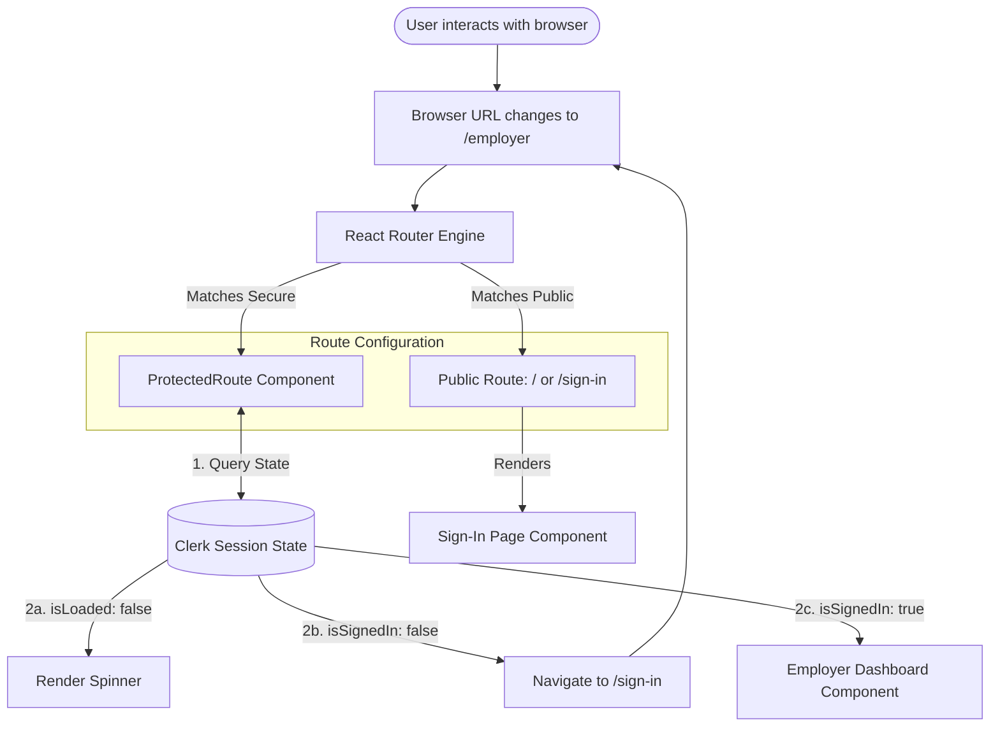
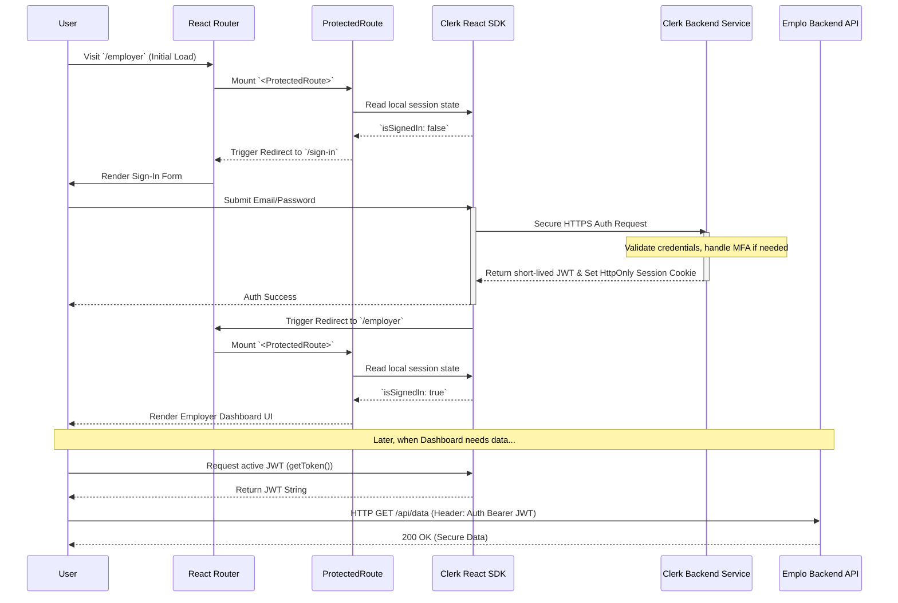

# Emplo AI Frontend: Module 2 - Routing & Authentication (Interview Prep Edition)

## 1. Routing Strategy (`App.tsx`)

`App.tsx` serves as the central nervous system for the frontend. It is responsible for initializing global state providers and defining the URL-to-Component mapping using React Router v6.

### Why React Router v6?
For an interview, it's important to understand why v6 is used over older versions. v6 introduced a much cleaner, more declarative syntax (`<Routes>` replacing `<Switch>`), improved nested routing capabilities, and better performance algorithms for matching URLs to routes. It allows us to build complex layout structures (like a Dashboard layout with a persistent sidebar) where only the child content area re-renders on navigation.

### The Provider Pattern
The app is wrapped in several Context Providers. This is a crucial React pattern that avoids **Prop Drilling** (passing data down through 10 levels of components).

1.  **`<QueryClientProvider>` (React Query)**: Initializes the global cache. This must sit near the top of the tree so *any* component can fetch or read cached server data.
2.  **`<ClerkProvider>`**: Connects the app to the Clerk Identity backend. It exposes hooks like `useUser()` and `useAuth()` to any child component.

## 2. Authentication Architecture (Why Clerk?)

Authentication is famously difficult to build correctly and securely. In an interview, explaining *why* we outsourced this is a strong indicator of architectural maturity.

**Alternatives Considered:**
*   *DIY (Custom JWTs & Passport.js)*: Highly prone to security flaws (XSS, CSRF). Requires maintaining secure password hashing, email verification flows, password resets, and session invalidation logic. High maintenance burden.
*   *Firebase Auth*: A solid option, but heavily tied into the Google/GCP ecosystem and sometimes inflexible regarding custom claims and multi-tenant architectures (B2B SaaS).

**Why Clerk was Chosen:**
Clerk is purpose-built for modern React applications.
1.  **Drop-in UI Components**: Provides pre-built, highly secure `<SignIn />` and `<UserProfile />` components, saving weeks of UI development.
2.  **Session Management**: Automatically handles short-lived JWTs (JSON Web Tokens) and long-lived refresh tokens. This mitigates the risk of token theft.
3.  **Edge Network**: Auth checks happen at the edge, making them incredibly fast.
4.  **B2B Capabilities**: Excellent support for organization/team management, which is essential for the Employer side of the Emplo platform.

### The Higher-Order Component Wrapper (`<ProtectedRoute>`)

Security on the frontend is largely about User Experience (UX). *True* security happens on the backend API. The frontend's job is to ensure a smooth flow: if a user isn't logged in, don't show them a broken dashboard; redirect them to login.

We achieve this using a Wrapper Component pattern.

```tsx
// Mental model of the ProtectedRoute wrapper
const ProtectedRoute = ({ children }) => {
  const { isLoaded, isSignedIn } = useAuth(); // Clerk Hook

  if (!isLoaded) return <LoadingSpinner />; // Wait for Clerk to initialize

  if (!isSignedIn) {
    // Crucial: Use `replace` to prevent the user from hitting the "Back" button 
    // and getting stuck in a redirect loop.
    return <Navigate to="/sign-in" replace />; 
  }

  // User is valid, render the protected component (e.g., Dashboard)
  return children; 
};
```

## 3. Route Protection (Data Flow Diagram)

This diagram details the logical checks that occur during navigation. Be prepared to explain the difference between frontend routing (which just hides UI) and backend API protection (which actually secures data).



## 4. User Login & Secure Route Access (Sequence Diagram)

This is a deep dive into the OAuth/JWT lifecycle during a login event. Understanding tokens is critical for senior roles.


