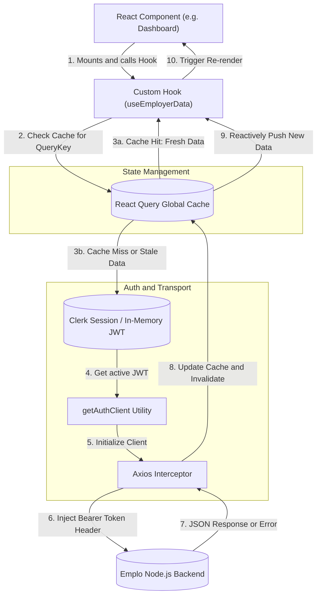
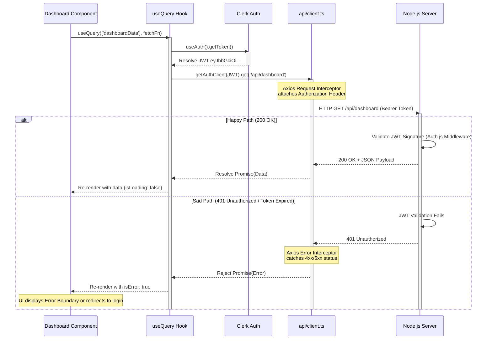

# Emplo AI Frontend: Module 3 - Networking & API (Interview Prep Edition)

## 1. Centralized API Management (`api/client.ts`)

In modern React applications, managing network state is notoriously difficult. If you scatter raw `fetch()` calls across dozens of components, you will inevitably face race conditions, inconsistent error handling, memory leaks (updating unmounted components), and security vulnerabilities (forgetting to attach auth tokens). 

The Emplo frontend solves this by layering two powerful tools: **Axios** (for the transport layer) and **React Query** (for the state management layer).

### The Transport Layer: Why Axios over native `fetch()`?

For an interview, you should be able to articulate why we added a 3rd party library when `fetch()` is built into the browser.
*   **Interceptors**: Axios allows us to define functions that run *before* a request is sent or *after* a response is received globally. We use this to automatically attach authentication headers (detailed below) or globally catch 401 Unauthorized errors to log the user out.
*   **Automatic JSON Parsing**: `fetch()` requires you to call `.json()` manually on the response object. Axios does this automatically.
*   **Error Handling**: `fetch()` only rejects a promise on network failure (e.g., DNS error). It *resolves* successfully even on a 404 or 500 server error, forcing you to manually check `response.ok`. Axios automatically rejects the promise for any HTTP error status (4xx, 5xx), which integrates perfectly with React Query's `isError` state.

### The Security Factory: `getAuthClient(token)`

We do not store the JWT in `localStorage` due to XSS (Cross-Site Scripting) vulnerabilities. The token is managed in memory by Clerk. Therefore, we cannot configure a static Axios instance once on boot. 

Instead, we use a Factory Pattern. 

```typescript
// Mental model of the API Factory
export const getAuthClient = (token: string) => {
  // We create a fresh instance dynamically 
  const instance = axios.create({
    baseURL: import.meta.env.VITE_API_BASE_URL, // e.g., http://localhost:8000
    headers: {
      'Content-Type': 'application/json',
    }
  });

  // We use an Interceptor to attach the token just before it leaves the browser
  instance.interceptors.request.use((config) => {
    if (token) {
      config.headers.Authorization = `Bearer ${token}`;
    }
    return config;
  });

  return instance;
};
```
*Interview Tip*: Explain that by passing the token explicitly to the factory, we ensure that every secure request is undeniably linked to the current active session, preventing stale token errors.

## 2. The State Management Layer: React Query

While Axios handles *getting* the data, **React Query** handles *holding* the data. 

**Why not `useState` and `useEffect`?**
If you use standard React hooks for data fetching, you have to manually track `isLoading`, `isError`, and the `data` itself. More importantly, if Component A and Component B both need the user's profile, they will both trigger a network request, wasting bandwidth and slowing down the app.

**React Query Solves This (Stale-While-Revalidate):**
React Query implements the `stale-while-revalidate` caching strategy.
1.  When Component A requests data, React Query fetches it and caches it under a unique "Query Key" (e.g., `['userProfile']`).
2.  If Component B requests `['userProfile']` 5 seconds later, React Query *instantly* returns the cached data (meaning zero loading screens for Component B).
3.  Simultaneously, in the background, React Query pings the server to see if the data has changed (Revalidate). If it has, it silently updates the UI.

This makes the application feel incredibly fast and responsive.

## 3. Network Architecture (Data Flow Diagram)

This DFD shows the complex interaction between the UI, the caching layer, the transport layer, and the authentication layer.



## 4. Secure API Request Flow (Sequence Diagram)

This sequence diagram illustrates the step-by-step asynchronous process of a secure API call, specifically highlighting how errors are bubbled up.


