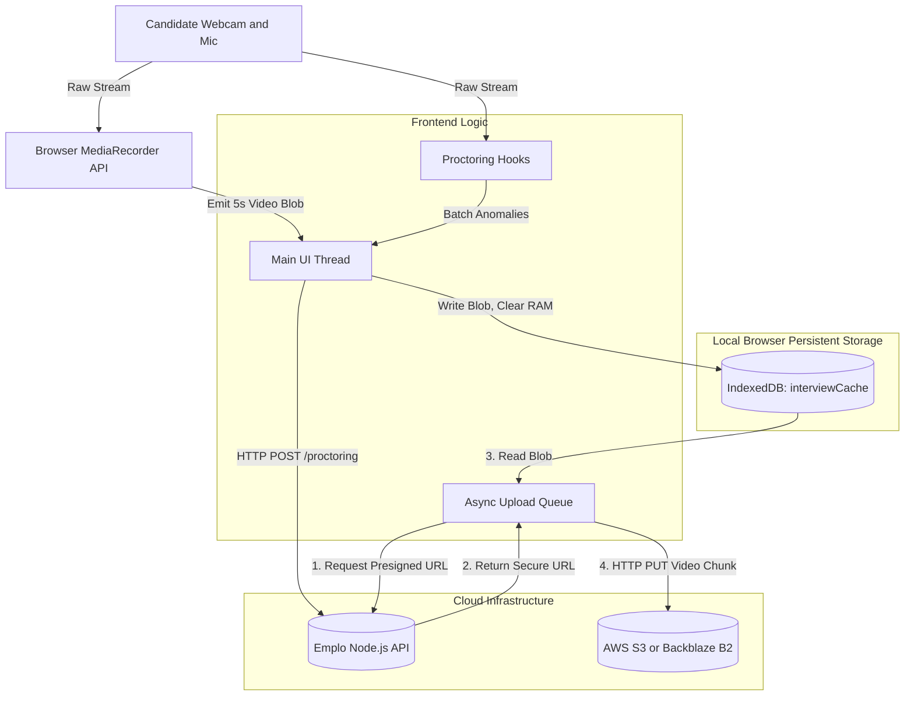
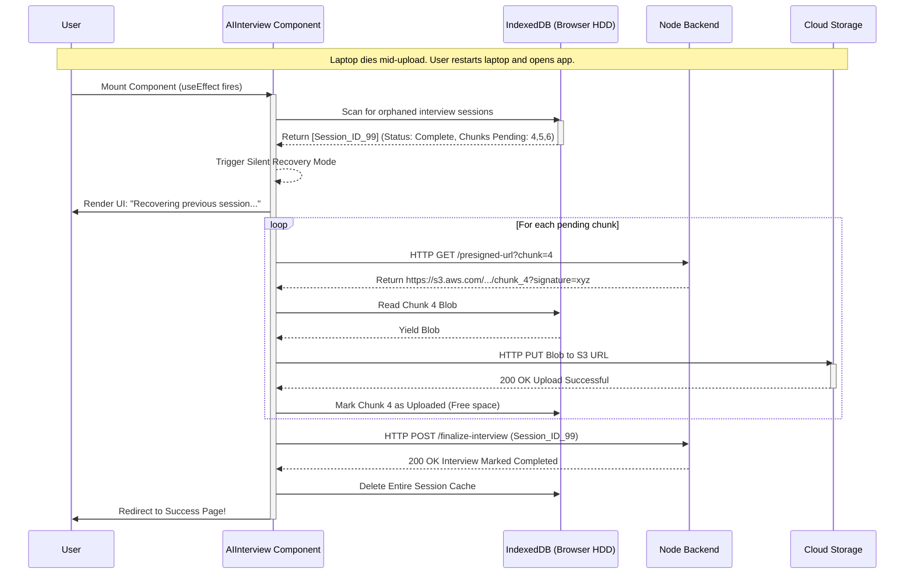

# Emplo AI Frontend: Module 4 - AI Interview Architecture (Interview Prep Edition)

## 1. The AI Interview Engine: Solving Browser Limitations

The `/ai-interview/:id` route is the most technically demanding module in the application. It acts less like a traditional web page and more like a real-time, fault-tolerant desktop application running inside the browser.

During an interview, you must be able to articulate *why* building a video recording app in the browser is hard, and how this architecture solves those problems.

### The Memory Constraint Problem

**The Challenge:** High-definition video files can easily reach hundreds of megabytes or even gigabytes. If you record a 30-minute interview and store the resulting `Blob` directly in the browser's memory (RAM) using standard JavaScript variables, the browser tab will inevitably crash due to an Out-Of-Memory (OOM) error before the interview even finishes.

**The Solution: Chunking & IndexedDB**
Instead of recording one massive video file, we instruct the browser's `MediaRecorder` API to emit data in small "chunks" (e.g., every 5 seconds). 
As soon as a chunk is emitted, we immediately flush it out of RAM and write it to the browser's local hard drive using **IndexedDB** (a low-level API for client-side storage). This keeps the RAM footprint near zero, regardless of how long the interview lasts.

### The Network Instability Problem

**The Challenge:** We cannot assume candidates have perfect Gigabit fiber internet. If we try to stream gigabytes of video to the server in real-time and their connection drops for 5 seconds, the entire upload could fail, ruining their interview.

**The Solution: Asynchronous Background Uploads & Presigned URLs**
1.  **Bypass the Backend**: We do *not* send video files to our Node.js server. Doing so would overwhelm the server's bandwidth and RAM. Instead, the backend generates an AWS S3 "Presigned URL". This is a cryptographically signed, temporary URL that allows the frontend browser to upload a file *directly* to the cloud storage bucket.
2.  **Background Queue**: While the candidate is answering questions (and chunks are saving to IndexedDB), a background Web Worker (or asynchronous loop) quietly reads the chunks from IndexedDB and uploads them to S3 via the Presigned URLs. If the network drops, the queue pauses. The data is safe on the hard drive (IndexedDB) until the connection returns.

### The Anti-Cheating (Proctoring) Architecture

Proctoring requires continuous monitoring of the user's environment.
We use custom React hooks (`useTabMonitor`, `useFaceDetection`) to encapsulate this logic. 

**Event Batching Strategy:** 
If the face detection algorithm loses the candidate's face for 1 second, we don't immediately abort the interview. False positives happen (e.g., bad lighting). Instead, the frontend logs an "Anomaly Event". To avoid DDoSing our own backend with thousands of minor events per minute, we implement an **Event Batching** pattern. The frontend collects events in an array and flushes them to the backend in a single API call every 30 seconds.

## 2. Media Handling & Storage (Data Flow Diagram)

This diagram shows how raw hardware data flows safely to the cloud without crashing the browser tab.

## 3. Intelligent Crash Recovery (Sequence Diagram)

This is the crowning feature of the architecture. If the candidate's laptop battery dies right as they finish their last answer, the video is not lost. When they plug it in and reload the page, the system recovers seamlessly.

