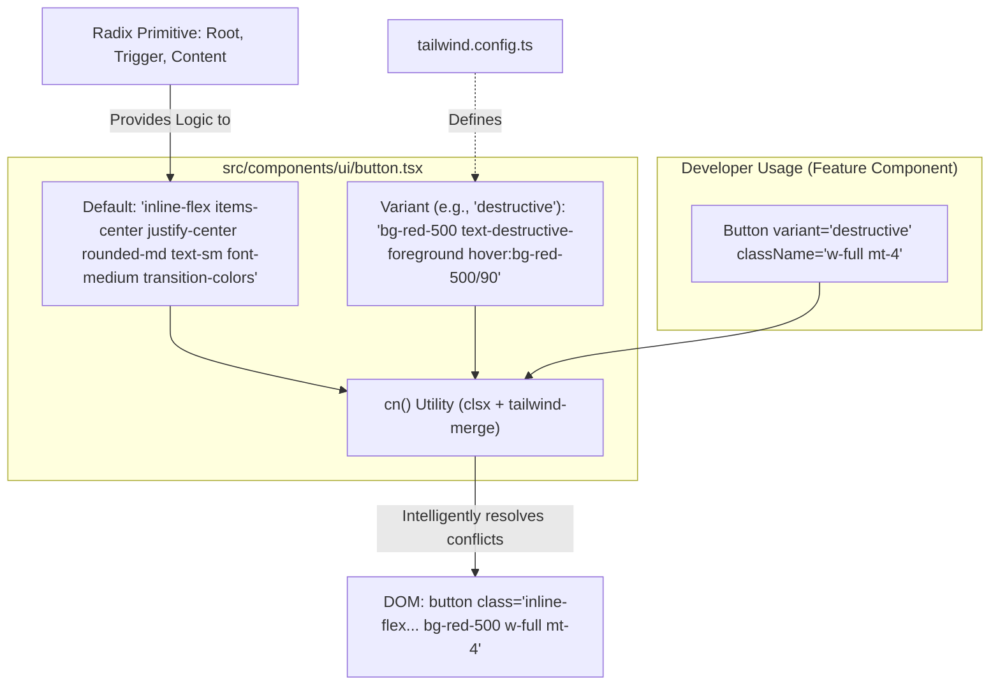
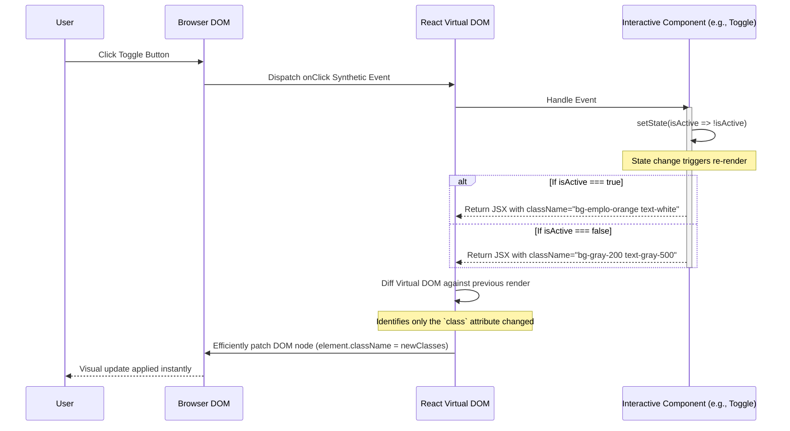

# Emplo AI Frontend: Module 5 - Styling & UI Components (Interview Prep Edition)

## 1. Design System Architecture: The "Utility-First" Paradigm

The frontend ecosystem has seen massive shifts in how styling is handled (CSS -> SASS -> CSS Modules -> CSS-in-JS -> Utility-First). Emplo deliberately chose the **Utility-First (Tailwind CSS)** and **Headless UI (shadcn/ui)** approach. 

During an interview, explaining *why* we didn't use Styled Components or Material UI demonstrates a deep understanding of frontend performance and maintainability at scale.

### Why Tailwind CSS?

**The Problem with Traditional CSS/SASS (BEM):**
As a project grows, CSS grows infinitely. Developers are afraid to delete CSS classes because they don't know what components might break. This leads to massive stylesheets. Furthermore, naming things (e.g., `.employer-dashboard-sidebar-item-active`) is notoriously difficult and leads to specificity wars (`!important`).

**The Problem with CSS-in-JS (Styled Components):**
While it solves the naming problem by scoping CSS to components, it has a significant performance cost. The browser has to parse JavaScript to generate CSS strings at runtime, increasing the time to interactive (TTI), especially on low-end mobile devices.

**The Tailwind Solution:**
Tailwind provides atomic utility classes (`flex`, `text-center`, `p-4`). 
*   **Zero Runtime Cost**: Tailwind extracts all used classes at build time and creates a single, tiny, static CSS file.
*   **No naming collisions**: You never write custom class names.
*   **Design Constraints**: Developers cannot easily introduce "magic numbers" (e.g., `margin: 13px`). They must use the spacing scale defined in `tailwind.config.ts`, ensuring visual consistency across the entire app.

### Why shadcn/ui & Radix Primitives?

**The Problem with Component Libraries (Material UI, Ant Design):**
Libraries like MUI are fantastic for quickly building internal admin tools. However, for a consumer-facing app with a unique brand identity (like Emplo), they are a nightmare. You spend hours overriding deeply nested, library-specific CSS rules to make their `<Button>` look like your design team's `<Button>`.

**The Headless UI Solution:**
shadcn/ui represents a newer paradigm. It is *not* a dependency you install. You copy the raw source code of the components directly into your project (`src/components/ui`).

Under the hood, shadcn uses **Radix Primitives**. Radix is "headless"—it provides the complex JavaScript logic for things like:
*   Keyboard navigation (Arrow keys in dropdowns).
*   Focus management (Trapping focus inside a Modal).
*   ARIA attributes (Screen reader support).

Radix provides zero styling. We take the Radix primitive and apply our Tailwind classes to it. This gives us 100% control over the DOM and the styling (the "head") while outsourcing the highly complex accessibility logic (the "body").

## 2. Component Assembly & Class Merging (Data Flow Diagram)

A common issue in React component design is merging default styles with custom styles passed via props. If a default button has `px-4 py-2 bg-blue-500`, and a developer passes `className="px-8 bg-red-500"`, which one wins? Standard string concatenation (`${default} ${custom}`) causes CSS specificity bugs depending on the order they appear in the final stylesheet.

Emplo uses utility libraries like `clsx` and `tailwind-merge` (standard in shadcn) to intelligently resolve these conflicts.

## 3. The Re-render Cycle (Sequence Diagram)

This sequence diagram illustrates how a UI component reacts to user input, updates state, and efficiently re-renders applying new Tailwind classes, all without mutating the actual DOM directly.

