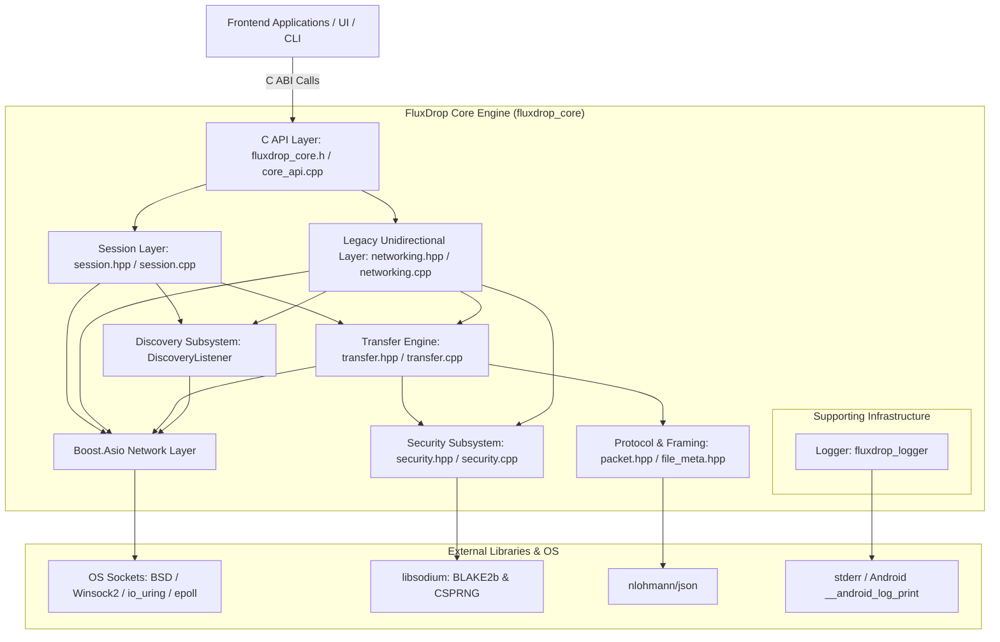
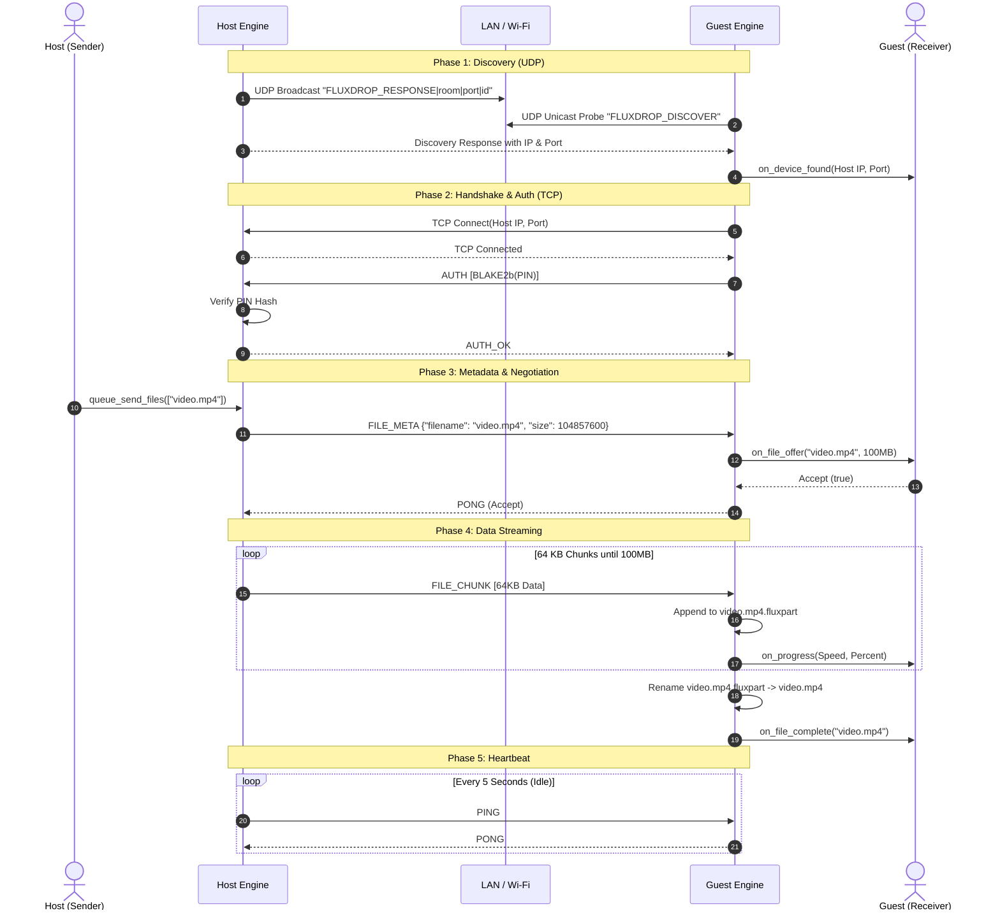

# Module 01: System Architecture & Engine Overview

## 1. Executive Summary & Mission

The **FluxDrop Engine** is the core, high-performance C++20 network and file transfer runtime powering FluxDrop. It is designed to facilitate zero-configuration, ultra-fast, encrypted peer-to-peer file sharing across local networks (Wi-Fi, Ethernet, and Mobile Hotspots) without requiring an internet connection or intermediary cloud servers.

The Engine is packaged as a static library (`fluxdrop_core`) and exposes an ABI-stable C API ([fluxdrop_core.h](https://github.com/SawanTeja/FluxDrop/blob/main/Engine/include/fluxdrop_core.h)). This design allows any frontend (such as Flutter on Android, GTK/Qt on Linux, WinUI on Windows, or custom CLI scripts) to link against the engine seamlessly via Foreign Function Interfaces (FFI / JNI / PInvoke).

---

## 2. High-Level Architecture

The Engine is structured into six discrete, decoupled layers:



### Layer Responsibilities

1. **C API Interface Layer (`include/fluxdrop_core.h`, `src/core_api.cpp`)**:
   - Acts as the firewall between modern C++ abstractions (`std::thread`, `std::function`, `std::unique_ptr`, `std::queue`) and foreign runtimes.
   - Provides C function signatures (`fd_session_host`, `fd_session_join`, `fd_session_send_files`, etc.).
   - Converts C function pointer callbacks into `std::function` closures.
   - Houses global session instances and manages background thread lifecycles.

2. **Session & Coordination Layer (`include/session.hpp`, `src/session.cpp`)**:
   - Manages stateful, bidirectional peer-to-peer sessions (`Session`).
   - Implements the host/guest connection lifecycle, 4-digit PIN authentication handshake, and asynchronous message loop.
   - Manages thread-safe queues for outgoing files (`send_queue_`).
   - Dispatches incoming files, keepalives, and session termination signals.

3. **Transfer Engine Layer (`include/transfer.hpp`, `src/transfer.cpp`)**:
   - Low-level binary streaming pipeline.
   - Reads files in 64KB buffers from disk and pushes packets across TCP sockets.
   - Handles partial file downloads (`.fluxpart`), resumable transfers via seek offsets, and atomic renames.
   - Computes real-time transfer speeds (MB/s) and triggers throttle-controlled progress callbacks.

4. **Protocol & Wire Serialization Layer (`include/protocol/packet.hpp`, `src/packet.cpp`, `include/protocol/file_meta.hpp`)**:
   - Enforces the 16-byte fixed binary packet header across all TCP transmissions.
   - Performs network byte order conversions (`htonl`/`ntohl`) to guarantee endianness safety between x86_64, ARM, and RISC-V devices.
   - Uses `nlohmann::json` to serialize and parse rich file metadata envelopes (`FileInfo`).
   - Validates and sanitizes file paths to neutralize path-traversal directory attacks.

5. **Security & Cryptography Subsystem (`include/security.hpp`, `src/security.cpp`)**:
   - Uses **libsodium** (`randombytes_uniform`) to generate cryptographically secure 4-digit numeric PINs.
   - Hashes PINs using BLAKE2b (`crypto_generichash`) to prevent plaintext password leakage across the network.
   - Compares hashes in constant time to resist side-channel timing attacks.

6. **Networking & Discovery Subsystem (`include/networking.hpp`, `src/networking.cpp`)**:
   - Encapsulates **Boost.Asio** for TCP/UDP network communication.
   - Employs a multi-strategy discovery mechanism: UDP Broadcast (`255.255.255.255`), UDP Multicast (`224.0.0.167`), and direct Unicast Gateway Probing for mobile hotspots.
   - Enumerates physical, virtual, and cellular network interfaces via platform-specific APIs (`getifaddrs` on Linux/Android and `GetAdaptersAddresses` on Windows).

---

## 3. Directory Layout & File Organization

The `Engine/` folder is cleanly split between public API headers, internal implementation files, build configuration, and tests:

```
Engine/
├── CMakeLists.txt              # Build definition for fluxdrop_core & unit tests
├── include/                    # Public C and C++ header files
│   ├── fluxdrop_core.h         # C ABI interface (extern "C")
│   ├── networking.hpp          # Boost.Asio network wrappers & DiscoveryListener
│   ├── security.hpp            # PIN generation & BLAKE2b cryptographic hashing
│   ├── session.hpp             # Bidirectional Session manager & message loop
│   ├── transfer.hpp            # MessageSender and MessageReceiver static helpers
│   └── protocol/
│       ├── file_meta.hpp       # FileInfo struct & nlohmann/json serialization
│       └── packet.hpp          # 16-byte PacketHeader & CommandType enum
├── src/                        # Implementation files
│   ├── core_api.cpp            # C API glue code & background thread orchestration
│   ├── networking.cpp          # UDP discovery, interface enumeration, legacy Server/Client
│   ├── packet.cpp              # Packet header serialization/deserialization (htonl/ntohl)
│   ├── security.cpp            # libsodium integration (crypto_generichash, randombytes)
│   ├── session.cpp             # Stateful bidirectional message loop & batch file transfer
│   └── transfer.cpp            # 64KB streaming, .fluxpart handling, resume offsets
└── tests/                      # GoogleTest unit test suite
    ├── CMakeLists.txt          # Test executable configuration
    ├── test_packet.cpp         # Packet serialization unit tests
    ├── test_security.cpp       # PIN generation & hash verification unit tests
    └── test_transfer.cpp       # File metadata JSON serialization unit tests
```

---

## 4. End-to-End Data Flow & Lifecycle

The typical life cycle of a file transfer session in FluxDrop follows four distinct phases:

### Phase 1: Discovery Phase (UDP)
1. **Host** starts listening on a random available TCP port and begins broadcasting UDP discovery packets to `255.255.255.255:45454`, `224.0.0.167:45454`, and interface-directed broadcast addresses.
2. **Guest** runs `DiscoveryListener`, joins the multicast group, and actively probes the default gateway (hotspot host).
3. Guest receives the broadcast announcement `FLUXDROP_RESPONSE|<session_id>|<port>|<instance_id>` and notifies the UI via callback.

### Phase 2: Connection & Mutual Authentication (TCP)
1. Guest initiates a TCP connection to Host at `ip:port`.
2. Host accepts the TCP socket.
3. Guest computes `hash = BLAKE2b(pin)` and transmits an `AUTH` packet containing the hash.
4. Host computes the same hash against its local random PIN.
   - If matching: Host sends `AUTH_OK` and both peers enter the active message loop.
   - If mismatch: Host sends `AUTH_FAIL` and terminates or re-awaits authentication.

### Phase 3: Transfer Negotiation & Chunk Streaming (TCP)
1. Initiator pushes file paths into `send_queue_`.
2. The message loop dequeues files, computes file sizes, and sends a `FILE_META` packet containing JSON metadata (`filename`, `size`, `mime`).
3. Receiver checks available disk space via `std::filesystem::space()`.
4. Receiver checks if a `.fluxpart` file already exists on disk:
   - If exists: Receiver replies with `RESUME` (specifying the existing byte offset).
   - If new: Receiver asks the user via `on_file_offer` callback and replies with `PONG` (accept) or `FILE_REJECT` (decline).
5. Sender streams the file in **64KB chunks** via `FILE_CHUNK` packets until the full file size is transmitted.
6. Receiver writes chunks into `.fluxpart` and atomically renames `.fluxpart` to the final destination name upon completion.

### Phase 4: Idle & Heartbeat (TCP)
1. When no files are queued, the connection remains alive.
2. Every 5 seconds, an application-level `PING` packet is exchanged to verify network liveness and prevent router NAT timeouts.
3. When either user disconnects, a `SESSION_END` packet is transmitted and the socket closes gracefully.



---

## 5. Technology Stack & Library Matrix

The following table summarizes all libraries used by the Engine, why they were chosen, and their critical role:

| Library / Tool | Category | Version / Spec | Primary Use Case in FluxDrop |
|---|---|---|---|
| **Boost.Asio** | Networking | >= 1.70 (System/Header) | Non-blocking TCP/UDP sockets, multicast group management, asynchronous stream read/write buffers. |
| **libsodium** | Cryptography | System Pkg (1.0.18+) | Cryptographically secure random PIN generation (`randombytes_uniform`) and fast BLAKE2b hashing (`crypto_generichash`). |
| **nlohmann/json** | Serialization | 3.x (Header-only) | Zero-boilerplate serialization and deserialization of protocol metadata (`protocol::FileInfo`). |
| **GoogleTest** | Testing | 1.12.1 (FetchContent) | Automated unit testing for packet serialization, cryptography, and metadata parsing. |
| **Standard C++20** | Language Standard | ISO C++20 | Modern threading (`std::thread`, `std::atomic`), filesystem operations (`std::filesystem`), and memory safety (`std::unique_ptr`). |
| **fluxdrop_logger** | Logging | Custom Sub-module | High-performance, timestamped, thread-safe diagnostics with Android logcat redirection. |

In the next module, we will explore the **C API & Application Integration Layer** in detail.
