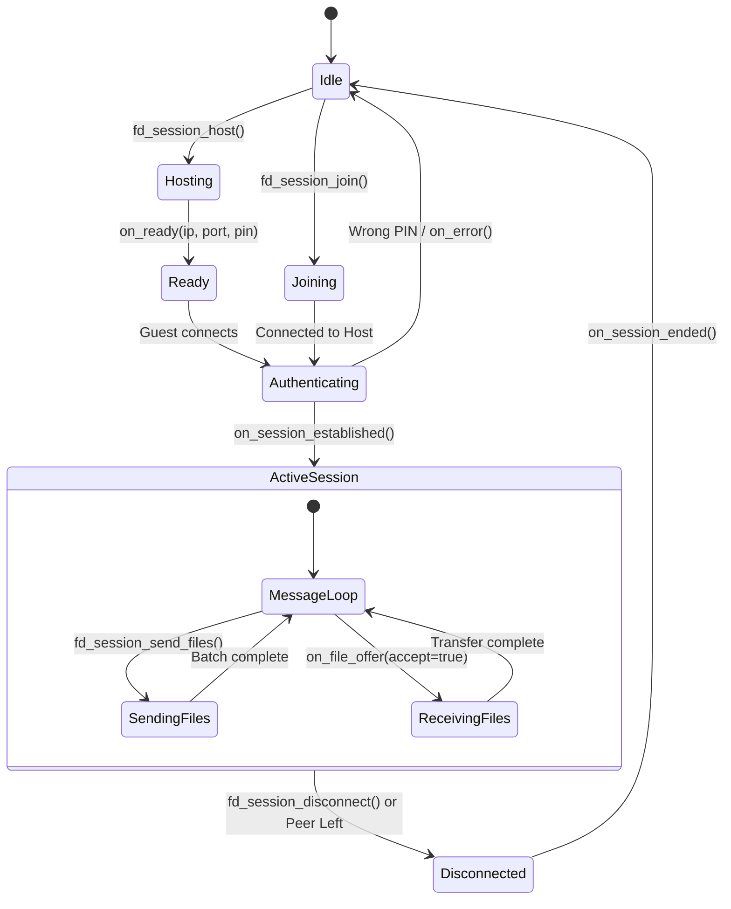

# Module 02: C API & Application Integration Layer

## 1. Why a C ABI Interface?

Modern applications rarely exist as monolithic C++ desktop binaries. FluxDrop targets:
- **Android**: User interfaces built with Kotlin/Jetpack Compose or Flutter (Dart).
- **Linux**: Frontends built with Flutter, GTK, or Qt.
- **Windows**: Frontends built with Flutter, C#/WinUI, or WPF.

C++ does not have a standardized Application Binary Interface (ABI). Name mangling, virtual table layouts, exception handling, and standard library implementations (`libstdc++` vs `libc++` vs MSVC CRT) differ across compilers and platforms.

To ensure universal compatibility without requiring complex C++ wrappers, FluxDrop exposes an **ABI-stable C interface** wrapped in `extern "C"`:

```c
#ifdef __cplusplus
extern "C" {
#endif
    // Functions and types exposed to the foreign runtime
#ifdef __cplusplus
}
#endif
```

By adhering to the C calling convention (`cdecl`), any programming language with a Foreign Function Interface (FFI)—including Dart FFI, Java/Kotlin JNI, Python `ctypes`, C# P/Invoke, and Rust FFI—can call directly into `fluxdrop_core` with zero overhead.

---

## 2. Header Dissection: `fluxdrop_core.h`

The public header [include/fluxdrop_core.h](https://github.com/SawanTeja/FluxDrop/blob/main/Engine/include/fluxdrop_core.h) defines the entire public surface of the engine.

### Core Data Types

```c
typedef struct {
    uint32_t session_id;
    int port;
    const char* ip;
} fd_device_t;

typedef struct {
    uint32_t session_id;
    const char* peer_ip;
    int peer_port;
    int role; // 0 = HOST, 1 = GUEST
} fd_session_info_t;
```

> [!NOTE]
> All pointers passed through structs (`const char* ip`) point to null-terminated UTF-8 strings. The caller must not mutate or free these pointers unless explicitly documented.

### Callback Function Pointers

The engine is asynchronous and reactive. Callbacks are delivered via standard C function pointers:

```c
// Session ready callback: informs the UI of local IP, ephemeral port, and generated 4-digit PIN
typedef void (*fd_session_ready_cb)(const char* ip, int port, int pin);

// Session established: fired when mutual PIN authentication succeeds
typedef void (*fd_session_established_cb)(const fd_session_info_t* info);

// Session ended: fired when the connection drops or is closed
typedef void (*fd_session_ended_cb)();

// Status messages for logs or toast notifications
typedef void (*fd_session_status_cb)(const char* message);

// Error notifications
typedef void (*fd_session_error_cb)(const char* error);

// File offer callback: Prompt user to accept (return true) or reject (return false)
typedef bool (*fd_session_file_offer_cb)(const char* filename, uint64_t file_size);

// Streaming progress: fired every 300ms or upon completion
typedef void (*fd_session_progress_cb)(const char* filename, uint64_t transferred, uint64_t total, double speed_mbps);

// Single file completion notification
typedef void (*fd_session_file_complete_cb)(const char* filename);
```

---

## 3. Two Generations of APIs: Unidirectional vs Bidirectional

FluxDrop contains two sets of APIs in [fluxdrop_core.h](https://github.com/SawanTeja/FluxDrop/blob/main/Engine/include/fluxdrop_core.h):

| API Family | Functions | Paradigm | Use Case |
|---|---|---|---|
| **Legacy 1-Way** | `fd_start_server()`, `fd_connect()` | Unidirectional: Server only sends, Client only receives | Simple batch one-shot drops |
| **Modern Session** | `fd_session_host()`, `fd_session_join()`, `fd_session_send_files()` | Bidirectional: Peer-to-peer, both sides can send files anytime | Interactive GUI sharing sessions |

### The Modern Bidirectional Session Flow

In the modern session API:
- One device calls `fd_session_host()`. It binds to an ephemeral TCP port and generates a 4-digit PIN.
- The other device discovers the host and calls `fd_session_join(ip, port, pin, save_dir)`.
- Once `fd_session_established_cb` fires on both sides, **either peer** can call `fd_session_send_files()` at any time without reconnecting!



---

## 4. Implementation Analysis: `core_api.cpp`

Let's examine how [src/core_api.cpp](https://github.com/SawanTeja/FluxDrop/blob/main/Engine/src/core_api.cpp) implements the bridge between the C API and the C++ engine.

### Global Instances & Worker Threads

`core_api.cpp` maintains static pointers to the active engines and background worker threads:

```cpp
// Static instances for legacy transfers
static std::unique_ptr<networking::Server> g_server;
static std::unique_ptr<networking::Client> g_client;
static std::unique_ptr<networking::DiscoveryListener> g_discovery;

// Atomic cancellation flags
static std::atomic<bool> g_server_cancel_flag{false};
static std::atomic<bool> g_client_cancel_flag{false};

// Worker threads
static std::thread g_server_thread;
static std::thread g_client_thread;

// Active Bidirectional Session
static std::unique_ptr<networking::Session> g_session;
static std::thread g_session_thread;
static std::string g_session_save_dir;  // Persists across session recreation
```

### Memory Safety Across the ABI Boundary: The `thread_local` Trick

When invoking C callbacks from C++, you cannot return a temporary `std::string::c_str()` pointer if that string is destroyed at the end of the statement or stack frame. Doing so causes a **Use-After-Free (UAF)** or memory corruption in the caller runtime.

To solve this cleanly without heap allocation leaks, `core_api.cpp` utilizes `static thread_local std::string`:

```cpp
callbacks.on_session_established = [established_cb](const networking::SessionInfo& info) {
    if (established_cb) {
        // Persist the string in thread-local storage during the callback invocation
        static thread_local std::string ip_storage;
        ip_storage = info.peer_ip;
        
        fd_session_info_t c_info;
        c_info.session_id = info.session_id;
        c_info.peer_ip = ip_storage.c_str(); // Safe pointer valid for callback duration
        c_info.peer_port = info.peer_port;
        c_info.role = (info.role == networking::SessionRole::HOST) ? 0 : 1;
        
        established_cb(&c_info);
    }
};
```

### Recursive Directory Traversal in `fd_start_server`

When a user passes a folder path to the engine, `core_api.cpp` flattens it recursively into individual `TransferJob` items using C++17/20 `std::filesystem`:

```cpp
for (int i = 0; i < num_files; ++i) {
    fs::path path = fs::path(file_paths[i]).lexically_normal();
    if (fs::is_directory(path)) {
        fs::path base_dir = path.filename();
        if (base_dir.empty()) {
            base_dir = path.root_name();
        }
        std::error_code iter_ec;
        fs::recursive_directory_iterator end;
        for (fs::recursive_directory_iterator it(path, fs::directory_options::skip_permission_denied, iter_ec);
             it != end && !iter_ec; it.increment(iter_ec)) {
            if (it->is_regular_file()) {
                // Compute relative path preserving the root folder name
                fs::path relative = base_dir / fs::relative(it->path(), path);
                jobs.push({it->path().string(), to_protocol_relative_path(relative), room_id});
            }
        }
    } else if (fs::is_regular_file(path)) {
        jobs.push({path.string(), to_protocol_relative_path(path.filename()), room_id});
    }
}
```

This ensures that when sending a folder named `Photos/`, a file `Photos/2026/vacation.jpg` is delivered to the peer with its exact relative subfolder structure intact!

---

## 5. Blocking vs Non-Blocking Cancellation

Applications require two modes of cancellation:

1. **Non-Blocking Cancellation (`fd_request_cancel_server()`, `fd_request_cancel_client()`)**:
   - Sets `g_server_cancel_flag = true` (an `std::atomic<bool>`).
   - Calls `g_server->stop()`, which immediately closes the underlying socket/acceptor to abort any blocking `accept()` or `read()` operations.
   - Returns immediately to avoid freezing the UI thread.
   
2. **Blocking Cancellation (`fd_cancel_server()`, `fd_cancel_client()`, `fd_session_disconnect()`)**:
   - Sets the cancellation flag.
   - Closes the active socket.
   - Executes `thread.join()` to guarantee all background network threads have terminated and resources are completely reclaimed before proceeding.

```cpp
void fd_cancel_server() {
    CORE_LOG("fd_cancel_server() — blocking cancel");
    g_server_cancel_flag = true;
    if (g_server) {
        g_server->stop(); // Force-close socket
    }
    if (g_server_thread.joinable()) {
        CORE_LOG("fd_cancel_server() — joining thread...");
        g_server_thread.join(); // Wait for thread termination
        CORE_LOG("fd_cancel_server() — thread joined");
    }
    g_server.reset();
}
```

---

## 6. Integration Guide & Standalone Examples

### Example A: Native C Consumer

```c
// main.c
#include "fluxdrop_core.h"
#include <stdio.h>
#include <unistd.h>

void on_ready(const char* ip, int port, int pin) {
    printf("[HOST] Ready on %s:%d | PIN: %d\n", ip, port, pin);
}

void on_established(const fd_session_info_t* info) {
    printf("[SESSION] Established with %s:%d (Role: %s)\n",
           info->peer_ip, info->peer_port, info->role == 0 ? "HOST" : "GUEST");
}

void on_progress(const char* filename, uint64_t transferred, uint64_t total, double speed_mbps) {
    int percent = (int)((transferred * 100) / total);
    printf("\r[TRANSFER] %s: %d%% (%.2f MB/s)", filename, percent, speed_mbps);
    fflush(stdout);
}

bool on_file_offer(const char* filename, uint64_t size) {
    printf("\n[OFFER] Peer wants to send %s (%lu bytes). Accept? (y/n): ", filename, size);
    return true; // Auto-accept
}

int main() {
    fd_init();

    // Start hosting
    fd_session_host(on_ready, on_established, NULL, NULL, NULL, on_file_offer, on_progress, NULL);

    // Keep running
    while (1) {
        sleep(1);
    }

    fd_cleanup();
    return 0;
}
```

### Example B: Dart FFI Integration (Flutter)

```dart
// fluxdrop_bindings.dart
import 'dart:ffi';
import 'package:ffi/ffi.dart';

typedef FdInitC = Void Function();
typedef FdInitDart = void Function();

typedef SessionReadyNative = Void Function(Pointer<Utf8> ip, Int32 port, Int32 pin);
typedef SessionReadyDart = void Function(Pointer<Utf8> ip, int port, int pin);

typedef FdSessionHostC = Void Function(
  Pointer<NativeFunction<SessionReadyNative>> readyCb,
  Pointer<NativeFunction<Void Function(Pointer<Void>)>> establishedCb,
  Pointer<NativeFunction<Void Function()>> endedCb,
  Pointer<NativeFunction<Void Function(Pointer<Utf8>)>> statusCb,
  Pointer<NativeFunction<Void Function(Pointer<Utf8>)>> errorCb,
  Pointer<NativeFunction<Bool Function(Pointer<Utf8>, Uint64)>> fileOfferCb,
  Pointer<NativeFunction<Void Function(Pointer<Utf8>, Uint64, Uint64, Double)>> progressCb,
  Pointer<NativeFunction<Void Function(Pointer<Utf8>)>> completeCb,
);

class FluxDropEngine {
  late DynamicLibrary _dylib;
  
  FluxDropEngine() {
    _dylib = DynamicLibrary.open("libfluxdrop_core.so");
  }

  void init() {
    final fdInit = _dylib.lookupFunction<FdInitC, FdInitDart>("fd_init");
    fdInit();
  }
}
```

In the next module, we will explore the **Binary Protocol & Wire Serialization Layer**.
