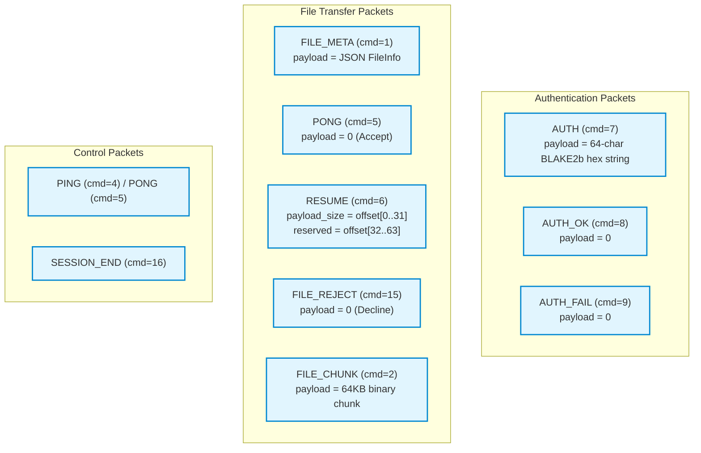

# Module 03: Binary Protocol & Wire Serialization

## 1. Protocol Design Philosophy

When designing local peer-to-peer file transfer protocols, developers often default to HTTP/REST, WebSockets, or gRPC. However, FluxDrop chooses a **custom binary framing protocol** over raw TCP for several key reasons:

1. **Zero Framing Overhead**: HTTP chunked transfer encoding and JSON-RPC introduce textual delimiters and escape overhead. FluxDrop uses a minimal **16-byte fixed binary header**, resulting in virtually 100% wire efficiency for large files.
2. **Deterministic Stream Boundaries**: TCP is a byte stream without message boundaries. Fixed-size headers allow receivers to know *exactly* how many bytes to read (`payload_size`) before interpreting the next command.
3. **Hardware-Accelerated Throughput**: 64KB file chunks can be piped directly from OS disk cache to the network socket without intermediate string formatting or memory copying.

---

## 2. The 16-Byte Wire Header

Every transmission over a FluxDrop TCP connection begins with the `PacketHeader` defined in [include/protocol/packet.hpp](https://github.com/SawanTeja/FluxDrop/blob/main/Engine/include/protocol/packet.hpp):

```
 0                   1                   2                   3
 0 1 2 3 4 5 6 7 8 9 0 1 2 3 4 5 6 7 8 9 0 1 2 3 4 5 6 7 8 9 0 1
+-+-+-+-+-+-+-+-+-+-+-+-+-+-+-+-+-+-+-+-+-+-+-+-+-+-+-+-+-+-+-+-+
|                          Command                              |  (4 bytes)
+-+-+-+-+-+-+-+-+-+-+-+-+-+-+-+-+-+-+-+-+-+-+-+-+-+-+-+-+-+-+-+-+
|                        Payload Size                           |  (4 bytes)
+-+-+-+-+-+-+-+-+-+-+-+-+-+-+-+-+-+-+-+-+-+-+-+-+-+-+-+-+-+-+-+-+
|                         Session ID                            |  (4 bytes)
+-+-+-+-+-+-+-+-+-+-+-+-+-+-+-+-+-+-+-+-+-+-+-+-+-+-+-+-+-+-+-+-+
|                     Reserved / High Offset                    |  (4 bytes)
+-+-+-+-+-+-+-+-+-+-+-+-+-+-+-+-+-+-+-+-+-+-+-+-+-+-+-+-+-+-+-+-+
```

### Field Definitions

| Field | Type | Offset | Size | Purpose |
|---|---|---|---|---|
| `command` | `uint32_t` | 0 | 4 bytes | Command identifier from `CommandType` enum. |
| `payload_size` | `uint32_t` | 4 | 4 bytes | Number of payload bytes immediately following this 16-byte header. For `RESUME`, contains the lower 32-bits of the offset. |
| `session_id` | `uint32_t` | 8 | 4 bytes | Identifies the transfer session / pairing room (prevents cross-session interference). |
| `reserved` | `uint32_t` | 12 | 4 bytes | For `RESUME`, stores the upper 32-bits of a 64-bit resume offset. Reserved for future extensions in other packets. |

---

## 3. Endianness & Network Byte Order (`htonl` / `ntohl`)

In computer memory, integers can be represented in:
- **Little-Endian** (LSB first): Standard on x86_64, ARM (default Android/Linux/Windows).
- **Big-Endian** (MSB first): Standard Network Byte Order.

If a little-endian x86 PC sent raw memory bytes of the integer `1` (`0x01 0x00 0x00 0x00`) across the network to a big-endian system, the receiver would parse it as `16,777,216` (`0x01000000`).

To avoid this disaster, [src/packet.cpp](https://github.com/SawanTeja/FluxDrop/blob/main/Engine/src/packet.cpp) explicitly converts all header fields between Host Byte Order and Network Byte Order using POSIX/Winsock functions:
- `htonl()`: **H**ost **to** **N**etwork **L**ong (32-bit conversion).
- `ntohl()`: **N**etwork **to** **H**ost **L**ong (32-bit conversion).

### Serialization Code Walkthrough

```cpp
std::array<uint8_t, 16> serialize_header(const PacketHeader& header) {
    std::array<uint8_t, 16> buffer;
    uint32_t cmd     = htonl(header.command);
    uint32_t payload = htonl(header.payload_size);
    uint32_t session = htonl(header.session_id);
    uint32_t res     = htonl(header.reserved);

    std::memcpy(buffer.data(),      &cmd,     4);
    std::memcpy(buffer.data() + 4,  &payload, 4);
    std::memcpy(buffer.data() + 8,  &session, 4);
    std::memcpy(buffer.data() + 12, &res,     4);

    return buffer;
}
```

### Deserialization Code Walkthrough

```cpp
PacketHeader deserialize_header(const std::array<uint8_t, 16>& buffer) {
    PacketHeader header;
    uint32_t cmd, payload, session, res;

    std::memcpy(&cmd,     buffer.data(),      4);
    std::memcpy(&payload, buffer.data() + 4,  4);
    std::memcpy(&session, buffer.data() + 8,  4);
    std::memcpy(&res,     buffer.data() + 12, 4);

    header.command      = ntohl(cmd);
    header.payload_size = ntohl(payload);
    header.session_id   = ntohl(session);
    header.reserved     = ntohl(res);

    return header;
}
```

---

## 4. Command Types & Message Semantics

The `CommandType` enumeration in [include/protocol/packet.hpp](https://github.com/SawanTeja/FluxDrop/blob/main/Engine/include/protocol/packet.hpp) defines the complete grammar of the protocol:

```cpp
enum class CommandType : uint32_t {
    FILE_META      = 1,   // Metadata for the next file (payload = JSON string)
    FILE_CHUNK     = 2,   // Raw binary chunk of file data (payload = up to 64KB)
    CANCEL         = 3,   // Active transfer cancelled
    PING           = 4,   // Keepalive ping request (payload = 0)
    PONG           = 5,   // Keepalive pong reply or File Acceptance signal
    RESUME         = 6,   // Resume request carrying 64-bit byte offset
    AUTH           = 7,   // Handshake PIN authentication (payload = BLAKE2b hash)
    AUTH_OK        = 8,   // Authentication accepted
    AUTH_FAIL      = 9,   // Authentication rejected (wrong PIN)
    FILE_REJECT    = 15,  // Receiver declined to accept file
    SESSION_END    = 16   // Orderly session disconnect
};
```

### Packet Visualizer & Lifecycle



---

## 5. Metadata Serialization via `nlohmann/json`

When a file transfer is about to begin, the sender must convey:
- The relative filename or directory path (e.g. `Documents/Report.pdf`).
- The exact file size in bytes (e.g. `104857600`).
- The MIME type (e.g. `application/pdf`).

FluxDrop packages this into `protocol::FileInfo` defined in [include/protocol/file_meta.hpp](https://github.com/SawanTeja/FluxDrop/blob/main/Engine/include/protocol/file_meta.hpp):

```cpp
#include <cstdint>
#include <nlohmann/json.hpp>
#include <string>

namespace protocol {

struct FileInfo {
    std::string filename;
    uint64_t size;
    std::string mime;
};

// Generate to_json(json&, const FileInfo&) and from_json(const json&, FileInfo&)
NLOHMANN_DEFINE_TYPE_NON_INTRUSIVE(FileInfo, filename, size, mime)

} // namespace protocol
```

### How `NLOHMANN_DEFINE_TYPE_NON_INTRUSIVE` Works

`nlohmann/json` is a modern, header-only C++ library. The macro `NLOHMANN_DEFINE_TYPE_NON_INTRUSIVE` expands into ADL (Argument-Dependent Lookup) friend functions:

```cpp
// Serializing to wire:
protocol::FileInfo info{"vacation.mp4", 52428800, "video/mp4"};
nlohmann::json j = info;
std::string payload = j.dump(); 
// payload = {"filename":"vacation.mp4","mime":"video/mp4","size":52428800}

// Deserializing from socket:
nlohmann::json j = nlohmann::json::parse(payload_string);
protocol::FileInfo info = j.get<protocol::FileInfo>();
```

This eliminates manual JSON key lookups and prevents serialization bugs.

---

## 6. Critical Security Defense: Path Traversal Sanitization

A common vulnerability in peer-to-peer file transfer software is **Directory Traversal** (CWE-22 / Zip Slip). 

### The Attack Vector
A malicious client could send a `FILE_META` packet with:
```json
{
  "filename": "../../../../../etc/shadow",
  "size": 1024,
  "mime": "text/plain"
}
```
Or on Windows:
```json
{
  "filename": "C:\\Windows\\System32\\calc.exe",
  "size": 4096,
  "mime": "application/octet-stream"
}
```
If the receiving engine naively concatenated `save_dir + "/" + filename`, the sender could overwrite critical system files!

### The Defense: `sanitize_relative_save_path`

FluxDrop implements rigorous path sanitization in [src/networking.cpp](https://github.com/SawanTeja/FluxDrop/blob/main/Engine/src/networking.cpp#L52-L78) and [src/session.cpp](https://github.com/SawanTeja/FluxDrop/blob/main/Engine/src/session.cpp#L36-L62):

```cpp
fs::path sanitize_relative_save_path(const std::string& remote_name) {
    std::string normalized = remote_name;
    // 1. Normalize backslashes to forward slashes
    std::replace(normalized.begin(), normalized.end(), '\\', '/');

    fs::path parsed(normalized);
    // 2. Reject absolute paths or paths with drive letters (C:)
    if (parsed.is_absolute() || parsed.has_root_name() || parsed.has_root_directory()) {
        throw std::runtime_error("Sender provided an absolute file path.");
    }

    fs::path sanitized;
    // 3. Tokenize path components and verify each segment
    for (const auto& part : parsed) {
        std::string token = part.generic_string();
        if (token.empty() || token == ".") {
            continue; // Skip redundant current-dir tokens
        }
        if (token == "..") {
            // 4. Hard reject any parent directory navigation
            throw std::runtime_error("Sender tried to write outside the selected folder.");
        }
        sanitized /= part;
    }

    if (sanitized.empty()) {
        throw std::runtime_error("Sender provided an empty file name.");
    }

    return sanitized.lexically_normal();
}
```

If an attacker attempts to send any path containing `..`, root prefixes, or drive letters, the receiver instantly rejects the transfer with `FILE_REJECT`, logging the error and protecting user data.

In the next module, we will explore the **Security & Cryptography Subsystem (libsodium Deep Dive)**.
