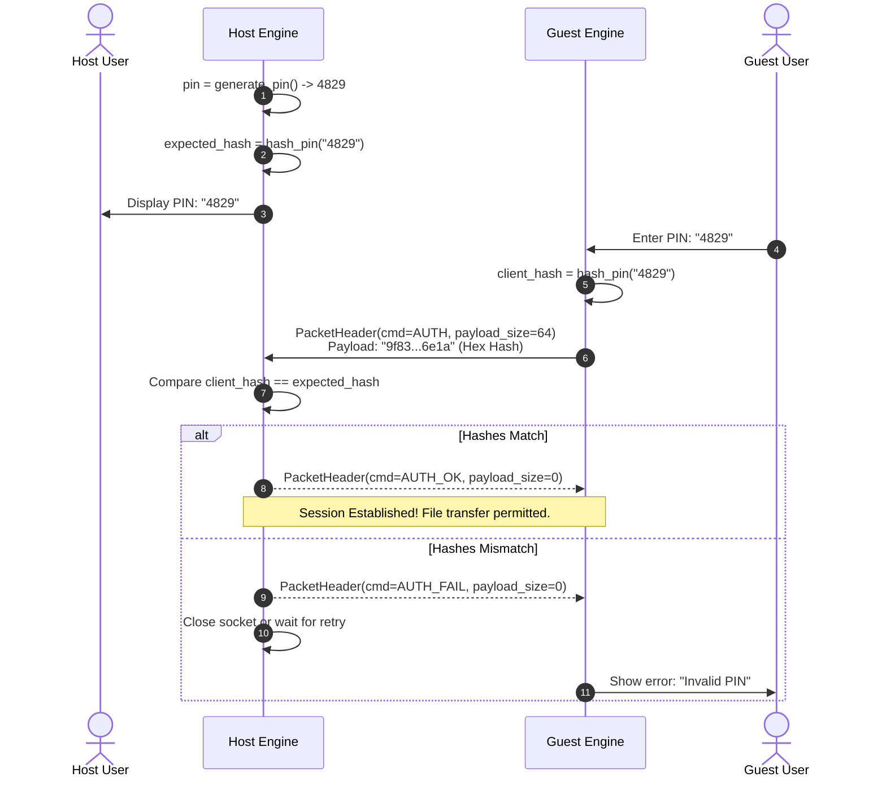

# Module 04: Security & Cryptography (libsodium Deep Dive)

## 1. Security Philosophy & Threat Model

Peer-to-peer file transfer usually takes place over shared, untrusted wireless networks:
- Public coffee shops and airport Wi-Fi hotspots.
- University dorm networks and office LANs.
- Mobile hotspot tethering.

On these networks, **packet sniffing** is trivially easy using tools like Wireshark or `tcpdump`. Furthermore, rogue devices on the same subnet can attempt to inject files, impersonate peers, or initiate unauthorized transfers.

To protect users while maintaining high transfer speeds and frictionless zero-configuration usability, FluxDrop implements a **Mutual Authentication Handshake** anchored by **libsodium**.

---

## 2. Deep Dive: Why libsodium?

[libsodium](https://doc.libsodium.org/) is an acclaimed, modern, portable cryptographic library developed by Frank Denis. It is a fork of NaCL (Networking and Cryptography library) designed specifically for usability and security.

### Why libsodium instead of OpenSSL?

| Feature | libsodium | OpenSSL |
|---|---|---|
| **API Usability** | High-level, misuse-resistant primitives. Almost impossible to misconfigure. | Complex, sprawling legacy API with hundreds of initialization and state macros. |
| **Side-Channel Safety** | Constant-time implementations of comparisons and operations by default. | Requires manual configuration to avoid cache-timing attacks. |
| **Binary Footprint** | Extremely compact (~300 KB static). | Massive footprint (> 3 MB static), heavy dependency overhead. |
| **Algorithm Quality** | Modern algorithms: BLAKE2b, ChaCha20-Poly1305, Ed25519, Argon2. | Supports archaic, broken ciphers (DES, RC4, MD5) for backwards compatibility. |

---

## 3. Cryptographically Secure PIN Generation

When a user initiates a sharing session or begins hosting, the engine generates a temporary 4-digit PIN (range `1000` to `9999`).

### The Dangers of Modulo Bias (`rand() % 9000`)
Beginner C/C++ developers often write:
```c
// DO NOT DO THIS!
int pin = 1000 + (rand() % 9000);
```
This is flawed for two reasons:
1. `rand()` is a Linear Congruential Generator (LCG) and is completely predictable.
2. The modulo operator `%` introduces **modulo bias** unless the generator's range is an exact multiple of the divisor, making certain PINs significantly more likely to occur than others.

### The FluxDrop Solution: `randombytes_uniform`

FluxDrop implements PIN generation in [src/security.cpp](https://github.com/SawanTeja/FluxDrop/blob/main/Engine/src/security.cpp#L10-L19):

```cpp
uint16_t generate_pin() {
    if (sodium_init() < 0) {
        FD_LOG_ERR("libsodium initialization failed!");
        std::random_device rd;
        std::mt19937 gen(rd());
        std::uniform_int_distribution<uint16_t> dist(1000, 9999);
        return dist(gen);
    }
    return 1000 + randombytes_uniform(9000); // Guarantees 1000–9999 without modulo bias
}
```

### How `randombytes_uniform()` Works Internally
`randombytes_uniform(upper_bound)` reads entropy directly from the OS kernel CSPRNG (`/dev/urandom` or `getrandom()` on Linux/Android, `BCryptGenRandom` on Windows). It uses **rejection sampling** to ensure a perfectly uniform distribution across `[0, upper_bound - 1]`.

If libsodium cannot initialize (e.g. strict sandbox environment), FluxDrop falls back gracefully to a non-deterministic hardware seed (`std::random_device`) feeding a Mersenne Twister engine (`std::mt19937`) through `std::uniform_int_distribution`.

---

## 4. Generic Hashing with BLAKE2b

When the guest connects to the host, it must prove it knows the PIN. Sending the PIN in plaintext over the LAN would allow passive network sniffers to steal the PIN and connect.

Instead, FluxDrop hashes the PIN using **BLAKE2b** via libsodium's `crypto_generichash` API.

### What is BLAKE2b?
BLAKE2b is an optimized cryptographic hash function based on the ChaCha core. Key attributes:
- **High Speed**: Significantly faster than MD5 and SHA-1 on modern 64-bit architectures, and 3x faster than SHA-256.
- **Immunity to Attacks**: Immune to Length Extension Attacks (which affect SHA-256 and SHA-512).
- **Collision Resistance**: Provides 256 bits of security (or 512 bits depending on digest size).

### Implementation in `security.cpp`

```cpp
std::string hash_pin(const std::string& pin) {
    if (sodium_init() < 0) {
        FD_LOG_ERR("libsodium initialization failed!");
        return "";
    }

    // 32-byte BLAKE2b digest
    unsigned char hash[crypto_generichash_BYTES]; 
    crypto_generichash(hash, sizeof(hash),
                       reinterpret_cast<const unsigned char*>(pin.c_str()),
                       pin.size(),
                       nullptr, 0); // No secret key used

    // Convert raw 32 bytes to 64-character lowercase hex string
    std::ostringstream oss;
    for (size_t i = 0; i < sizeof(hash); ++i) {
        oss << std::hex << std::setfill('0') << std::setw(2) << static_cast<int>(hash[i]);
    }
    return oss.str();
}
```

### Verification

```cpp
bool verify_pin(const std::string& pin, const std::string& expected_hash) {
    return hash_pin(pin) == expected_hash;
}
```

---

## 5. The PIN Authentication Handshake

The complete authentication exchange runs as follows:



---

## 6. Standalone Educational Example

Here is a standalone C++ program demonstrating how to use libsodium for cryptographic hashing and PIN verification exactly as implemented in FluxDrop:

```cpp
// compile: g++ -std=c++20 demo_security.cpp -lsodium -o demo_security
#include <iostream>
#include <iomanip>
#include <sstream>
#include <string>
#include <sodium.h>

std::string compute_hash(const std::string& input) {
    unsigned char digest[crypto_generichash_BYTES];
    crypto_generichash(digest, sizeof(digest),
                       reinterpret_cast<const unsigned char*>(input.data()),
                       input.size(), nullptr, 0);

    std::ostringstream ss;
    for (size_t i = 0; i < sizeof(digest); ++i) {
        ss << std::hex << std::setfill('0') << std::setw(2) << static_cast<int>(digest[i]);
    }
    return ss.str();
}

int main() {
    if (sodium_init() < 0) {
        std::cerr << "Could not initialize libsodium!\n";
        return 1;
    }

    // 1. Generate PIN in range [1000, 9999]
    uint16_t pin = 1000 + randombytes_uniform(9000);
    std::cout << "[HOST] Generated Secure PIN: " << pin << "\n";

    // 2. Hash PIN
    std::string correct_hash = compute_hash(std::to_string(pin));
    std::cout << "[HOST] Stored BLAKE2b Hash: " << correct_hash << "\n";

    // 3. Simulate Guest entering correct PIN
    std::string guest_pin = std::to_string(pin);
    std::string guest_hash = compute_hash(guest_pin);
    std::cout << "[GUEST] Attempt 1 with PIN " << guest_pin << " -> "
              << (guest_hash == correct_hash ? "SUCCESS (AUTH_OK)" : "FAILED (AUTH_FAIL)") << "\n";

    // 4. Simulate Guest entering incorrect PIN
    std::string wrong_pin = "0000";
    std::string wrong_hash = compute_hash(wrong_pin);
    std::cout << "[GUEST] Attempt 2 with PIN " << wrong_pin << " -> "
              << (wrong_hash == correct_hash ? "SUCCESS (AUTH_OK)" : "FAILED (AUTH_FAIL)") << "\n";

    return 0;
}
```

In the next module, we will explore **Boost.Asio & the Network Abstraction Layer**.
