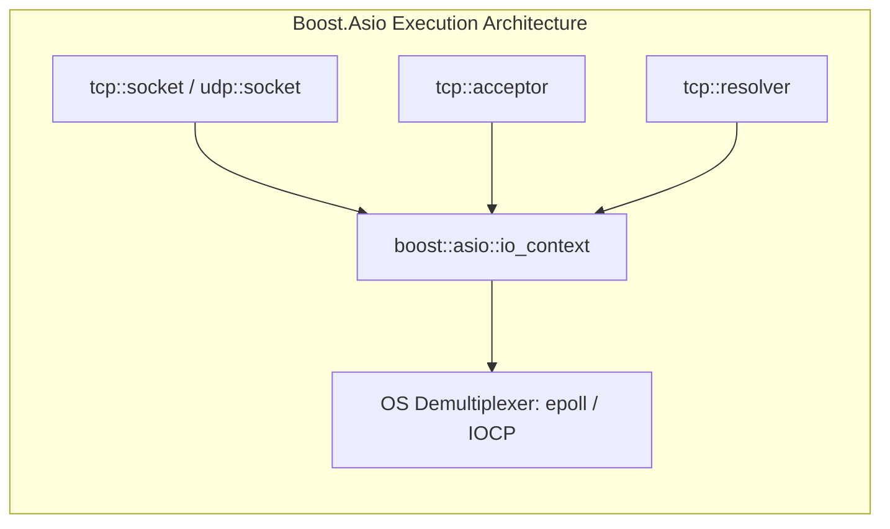

# Module 05: Boost.Asio & Network Abstraction Layer

## 1. Introduction to Boost.Asio

Networking in cross-platform C++ is notoriously difficult. Windows uses **Winsock2** (`WSAStartup`, `SOCKET`, `WSAGetLastError`), whereas Linux and Android use **POSIX/BSD sockets** (`socket`, `int fd`, `errno`, `fcntl`).

[Boost.Asio](https://www.boost.org/doc/libs/release/doc/html/boost_asio.html) is the industry-standard, high-performance C++ networking and asynchronous I/O library. It provides a portable, type-safe, and zero-overhead abstraction layer above the operating system's native event demultiplexers (`epoll` on Linux, `kqueue` on macOS/BSD, and `IOCP` on Windows).

In FluxDrop, Boost.Asio is used for:
- TCP connection management (`tcp::acceptor`, `tcp::socket`, `tcp::resolver`).
- High-throughput streaming I/O (`boost::asio::write`, `boost::asio::read`).
- UDP discovery broadcasts and multicast groups (`udp::socket`, `udp::endpoint`).
- Low-level socket tuning (TCP keepalive, `TCP_NODELAY`, non-blocking I/O).

---

## 2. Core Concepts in Boost.Asio



### 1. `boost::asio::io_context`
The central execution context and event loop. It acts as the bridge between your C++ program and the operating system's asynchronous I/O multiplexer. Even when using synchronous functions, Boost.Asio objects require a reference to an `io_context`.

### 2. `boost::asio::ip::tcp::acceptor`
Listens for incoming TCP connections. In FluxDrop:
```cpp
boost::asio::io_context io_context;
// Bind to all IPv4 interfaces on an ephemeral port (port 0 lets the OS pick a free port)
tcp::acceptor acceptor(io_context, tcp::endpoint(tcp::v4(), 0));
unsigned short assigned_port = acceptor.local_endpoint().port();
```

### 3. `boost::asio::ip::tcp::socket`
Represents an active, connected TCP stream socket. In FluxDrop, sockets are passed by reference to `MessageSender` and `MessageReceiver`:
```cpp
tcp::socket socket(io_context);
acceptor.accept(socket); // Blocks until a peer connects
```

### 4. `boost::asio::buffer`
A non-owning view of a contiguous block of memory. It wraps raw pointers or standard containers (`std::vector`, `std::array`, `std::string`) safely without copying bytes:
```cpp
// Writing an std::vector<char>
std::vector<char> buffer(64 * 1024);
boost::asio::write(socket, boost::asio::buffer(buffer.data(), bytes_read));

// Reading exactly 16 bytes into an std::array
std::array<uint8_t, 16> header_buf;
boost::asio::read(socket, boost::asio::buffer(header_buf));
```

---

## 3. High-Performance Socket Tuning in FluxDrop

High-speed file transfer across Wi-Fi requires deliberate socket configuration. Default OS socket options introduce severe latency spikes and connection drops.

FluxDrop configures several low-level socket options in [src/session.cpp](https://github.com/SawanTeja/FluxDrop/blob/main/Engine/src/session.cpp#L449-L466):

### 1. Disabling Nagle's Algorithm (`TCP_NODELAY`)
```cpp
boost::asio::ip::tcp::no_delay no_delay_opt(true);
socket.set_option(no_delay_opt);
```
**Why?** Nagle's algorithm buffers small outgoing packets (like `FILE_META`, `PONG`, `PING`) until a full MTU (1500 bytes) is accumulated or an ACK is received. Combined with the receiver's Delayed-ACK algorithm (200ms delay), this creates a devastating **40ms to 200ms latency penalty** on every packet negotiation. Disabling Nagle ensures control packets are flushed to the wire instantly.

### 2. Aggressive TCP Keepalive & Fast Dead Peer Detection
When transferring files on mobile networks or Wi-Fi, a device may suddenly lose signal or disconnect without sending a TCP `FIN` packet (a "half-open" socket). Standard OS keepalives take **2 hours** to detect this!

FluxDrop configures aggressive keepalives:
```cpp
boost::asio::socket_base::keep_alive keep_alive_opt(true);
socket.set_option(keep_alive_opt);

#if defined(__linux__) || defined(__ANDROID__)
int fd = socket.native_handle();
int idle = 2;     // Wait only 2 seconds of inactivity before sending probes
int interval = 1; // Send probe every 1 second
int count = 3;    // Drop connection after 3 unacknowledged probes (5s total!)
setsockopt(fd, IPPROTO_TCP, TCP_KEEPIDLE, &idle, sizeof(idle));
setsockopt(fd, IPPROTO_TCP, TCP_KEEPINTVL, &interval, sizeof(interval));
setsockopt(fd, IPPROTO_TCP, TCP_KEEPCNT, &count, sizeof(count));
#endif
```

### 3. Non-Blocking Polling with `socket.available()`
Rather than dedicating a separate OS thread to blocking reads, FluxDrop's bidirectional message loop in `Session::run_message_loop()` sets `socket.non_blocking(true)` and polls `socket.available(ec)`:
```cpp
boost::system::error_code ec;
size_t bytes_ready = socket.available(ec);
if (bytes_ready >= 16) {
    // We have a full PacketHeader waiting — read and process
    auto header = transfer::MessageReceiver::receive_header(socket);
    // ...
} else {
    // Idle — sleep for 50ms to yield CPU
    std::this_thread::sleep_for(std::chrono::milliseconds(50));
}
```

---

## 4. Cross-Platform Network Interface Enumeration

To listen for incoming connections and broadcast discovery messages, FluxDrop must know the device's local IP address and subnet broadcast address.

FluxDrop implements custom, OS-specific enumeration in [src/networking.cpp](https://github.com/SawanTeja/FluxDrop/blob/main/Engine/src/networking.cpp#L102-L272):

### Windows: `GetAdaptersAddresses`
On Windows, `gethostbyname` is deprecated and lacks subnet mask support. FluxDrop uses the modern IP Helper API:
```cpp
#ifdef _WIN32
std::vector<InterfaceAddress> get_detailed_network_interfaces() {
    // Calls GetAdaptersAddresses(AF_INET, ...)
    // Extracts friendly adapter name (e.g. "Wi-Fi", "Local Area Connection")
    // Identifies Hotspot: Checks if adapter description contains "Wi-Fi Direct" or "Virtual"
    // Identifies Cellular: Checks if IfType is IF_TYPE_WWANPP (243)
    // Computes broadcast address using OnLinkPrefixLength (e.g. /24):
    uint32_t ip_host = ntohl(sa_in->sin_addr.s_addr);
    uint32_t mask_host = ~((1u << (32 - prefixLen)) - 1u);
    uint32_t bcast_host = ip_host | (~mask_host);
}
#endif
```

### Linux & Android: `getifaddrs` & `/proc/net/route`
On POSIX systems:
- `getifaddrs()` iterates through all active network interfaces.
- Filters out loopback (`IFF_LOOPBACK`) and down (`!(ifa_flags & IFF_UP)`) interfaces.
- Detects cellular interfaces by prefix: `rmnet`, `ccmni`, `pdp`, `wwan`.
- Detects hotspot interfaces by prefix: `ap0`, `softap`, `tether`, or IP `192.168.43.x`.
- Parses `/proc/net/route` to find the default gateway IP address (essential for mobile hotspot discovery!).

### Smart Interface Prioritization Heuristic
When multiple network adapters are active (e.g., Ethernet, Wi-Fi, and a 4G Cellular data link), FluxDrop sorts interfaces using a scoring model:
```cpp
std::stable_sort(detailed.begin(), detailed.end(), [](const InterfaceAddress& a, const InterfaceAddress& b) {
    int score_a = (a.is_hotspot ? 2 : 0) - (a.is_cellular ? 2 : 0);
    int score_b = (b.is_hotspot ? 2 : 0) - (b.is_cellular ? 2 : 0);
    return score_a > score_b;
});
```
This guarantees that **Mobile Hotspots are prioritized first**, regular Wi-Fi second, and **Cellular metered networks last**.

---

## 5. Standalone Boost.Asio Example

Here is a minimal, complete C++20 program demonstrating a Boost.Asio TCP server and client exchanging a message with `TCP_NODELAY`:

```cpp
// compile: g++ -std=c++20 demo_boost_asio.cpp -lboost_system -lpthread -o demo_boost_asio
#include <boost/asio.hpp>
#include <iostream>
#include <string>
#include <thread>

using boost::asio::ip::tcp;

void run_server(unsigned short& out_port) {
    boost::asio::io_context io;
    tcp::acceptor acceptor(io, tcp::endpoint(tcp::v4(), 0));
    out_port = acceptor.local_endpoint().port();
    std::cout << "[SERVER] Listening on port " << out_port << "\n";

    tcp::socket socket(io);
    acceptor.accept(socket);

    // Disable Nagle's algorithm
    socket.set_option(tcp::no_delay(true));

    // Read message until newline
    boost::asio::streambuf buf;
    boost::asio::read_until(socket, buf, '\n');
    std::istream is(&buf);
    std::string line;
    std::getline(is, line);
    std::cout << "[SERVER] Received: " << line << "\n";

    // Reply
    std::string reply = "HELLO FROM FLUXDROP SERVER\n";
    boost::asio::write(socket, boost::asio::buffer(reply));
}

void run_client(unsigned short port) {
    boost::asio::io_context io;
    tcp::socket socket(io);
    socket.connect(tcp::endpoint(boost::asio::ip::make_address("127.0.0.1"), port));
    socket.set_option(tcp::no_delay(true));

    std::string msg = "PING FLUXDROP\n";
    boost::asio::write(socket, boost::asio::buffer(msg));

    boost::asio::streambuf buf;
    boost::asio::read_until(socket, buf, '\n');
    std::istream is(&buf);
    std::string reply;
    std::getline(is, reply);
    std::cout << "[CLIENT] Server replied: " << reply << "\n";
}

int main() {
    unsigned short port = 0;
    std::thread server_thread([&]() { run_server(port); });

    // Wait for server to bind
    while (port == 0) {
        std::this_thread::sleep_for(std::chrono::milliseconds(10));
    }

    std::thread client_thread([&]() { run_client(port); });

    server_thread.join();
    client_thread.join();
    return 0;
}
```

In the next module, we will explore the **Device Discovery Subsystem & Network Probing**.
