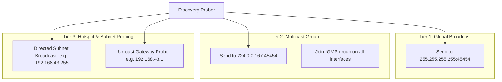
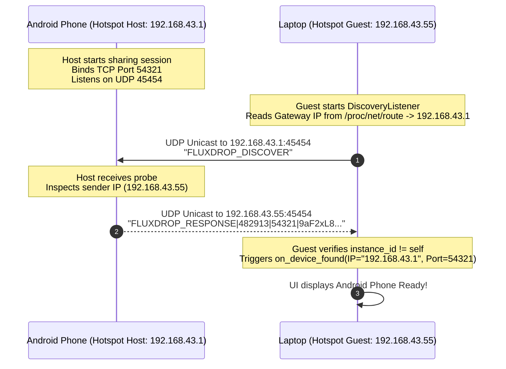

# Module 06: Device Discovery Subsystem & Network Probing

## 1. The Zero-Configuration Discovery Challenge

In peer-to-peer file sharing, asking non-technical users to open a terminal, run `ip addr` or `ipconfig`, and type `192.168.1.142:58321` into a phone is unacceptable. The exchange must be automatic:
1. One device initiates sharing.
2. The other device opens FluxDrop and immediately sees the sender appear on the radar.

However, local networks present formidable hurdles:
- **Routers dropping UDP Broadcasts**: Many modern Wi-Fi routers block or rate-limit general broadcasts to `255.255.255.255`.
- **Multicast snooping / IGMP Filtering**: Corporate, enterprise, and university Wi-Fi networks frequently block multicast packets.
- **The Mobile Hotspot Dilemma**: When an Android phone enables "Portable Wi-Fi Hotspot", the Android Linux kernel and Wi-Fi chipsets often **disable broadcast and multicast forwarding** entirely between tethered clients to save battery!

FluxDrop solves this with an innovative **Triple-Tiered Hybrid Discovery Engine**.

---

## 2. The 3-Tiered Hybrid Discovery Architecture

FluxDrop concurrently employs three independent discovery vectors:



### Tier 1: General UDP Broadcast (`255.255.255.255`)
- Standard Layer 2/3 broadcast on port `45454`.
- Works on home routers and simple unmanaged network switches.

### Tier 2: IPv4 UDP Multicast (`224.0.0.167`)
- Multicast addresses are special class D IP addresses (`224.0.0.0` to `239.255.255.255`).
- Unlike broadcasts (which force every device on the LAN to interrupt its CPU to inspect the packet), multicast is forwarded only to network interfaces that explicitly "join" the group via IGMP:
```cpp
socket.set_option(boost::asio::ip::multicast::join_group(
    boost::asio::ip::make_address("224.0.0.167").to_v4(),
    boost::asio::ip::make_address(local_interface_ip).to_v4()
));
```

### Tier 3: Subnet-Directed Broadcast & Unicast Gateway Fastpath (The Hotspot Breakthrough)
When an Android device creates a hotspot, it assigns itself as the Default Gateway (typically `192.168.43.1`). Connected clients cannot see broadcasts from the host.

**The FluxDrop Innovation**:
1. The guest parses its default gateway IP address ([get_default_gateway_ip()](https://github.com/SawanTeja/FluxDrop/blob/main/Engine/src/networking.cpp#L274-L336) via `/proc/net/route` on Linux or `GetAdaptersAddresses` on Windows).
2. The guest sends a direct **unicast UDP packet** `FLUXDROP_DISCOVER` straight to the gateway IP (`192.168.43.1:45454`).
3. Because this is a direct unicast IP packet, the Android kernel cannot drop it as a broadcast!
4. The host receives the unicast packet and replies with `FLUXDROP_RESPONSE` directly to the guest's IP. Discovery completes in milliseconds.

---

## 3. Protocol Message Grammars

Discovery packets are simple, pipe-delimited UTF-8 strings:

### 1. Passive Announcement Broadcast
Emitted periodically (once per second) by the Host:
```
FLUXDROP|<session_id>|<port>|<instance_id>
```
*Example:* `FLUXDROP|482913|51234|X8j92La0Pq1Z`

### 2. Active Discovery Request
Emitted by the Guest looking for hosts:
```
FLUXDROP_DISCOVER
```

### 3. Direct Discovery Response
Returned by the Host in response to `FLUXDROP_DISCOVER`:
```
FLUXDROP_RESPONSE|<session_id>|<port>|<instance_id>
```
*Example:* `FLUXDROP_RESPONSE|482913|51234|X8j92La0Pq1Z`

---

## 4. Loop Suppression & Instance Deduplication

Because discovery packets are broadcast across all network adapters (including virtual adapters and Wi-Fi Direct interfaces), a device will frequently receive its own broadcast packets.

If not handled, a device would discover *itself* and display itself as an available peer on the UI!

### The Solution: 16-Character Ephemeral Instance ID
In [src/networking.cpp](https://github.com/SawanTeja/FluxDrop/blob/main/Engine/src/networking.cpp#L382-L395):

```cpp
std::string get_instance_id() {
    static std::string instance_id;
    if (instance_id.empty()) {
        const char charset[] = "0123456789ABCDEFGHIJKLMNOPQRSTUVWXYZabcdefghijklmnopqrstuvwxyz";
        std::random_device rd;
        std::mt19937 gen(rd());
        std::uniform_int_distribution<> dis(0, sizeof(charset) - 2);
        for (int i = 0; i < 16; ++i) {
            instance_id += charset[dis(gen)];
        }
    }
    return instance_id;
}
```

When receiving any discovery packet, the receiver parses `instance_id`:
```cpp
if (instance_id == get_instance_id()) {
    continue; // Drop packet: self-discovery loop prevented!
}
if (device.session_id != room_id && room_id != 0) {
    continue; // Drop packet: room ID filter
}
```

---

## 5. Sequence Diagram: Mobile Hotspot Discovery



---

## 6. Implementation Analysis: `DiscoveryListener`

The `DiscoveryListener` class in [src/networking.cpp](https://github.com/SawanTeja/FluxDrop/blob/main/Engine/src/networking.cpp#L402-L531) manages two threads:

1. **Active Prober Thread (`prober`)**:
   - Loops every 1 second while `running_ == true`.
   - Broadcasts `FLUXDROP_DISCOVER` to `255.255.255.255:45454`.
   - Sends to multicast group `224.0.0.167:45454`.
   - Sends to every active interface's directed subnet broadcast address.
   - Sends unicast probe to the default gateway IP.

2. **Receiver Thread (`thread_`)**:
   - Binds a UDP socket on `0.0.0.0:45454` with `reuse_address(true)`.
   - Joins multicast group `224.0.0.167` across all available network interfaces.
   - Sets non-blocking socket mode and receives packets via `socket.receive_from()`.
   - Parses tokens, validates room ID, discards self packets, and fires `callback(DiscoveredDevice)`.

In the next module, we will examine the **File Transfer Engine & Resumption Pipeline**.
