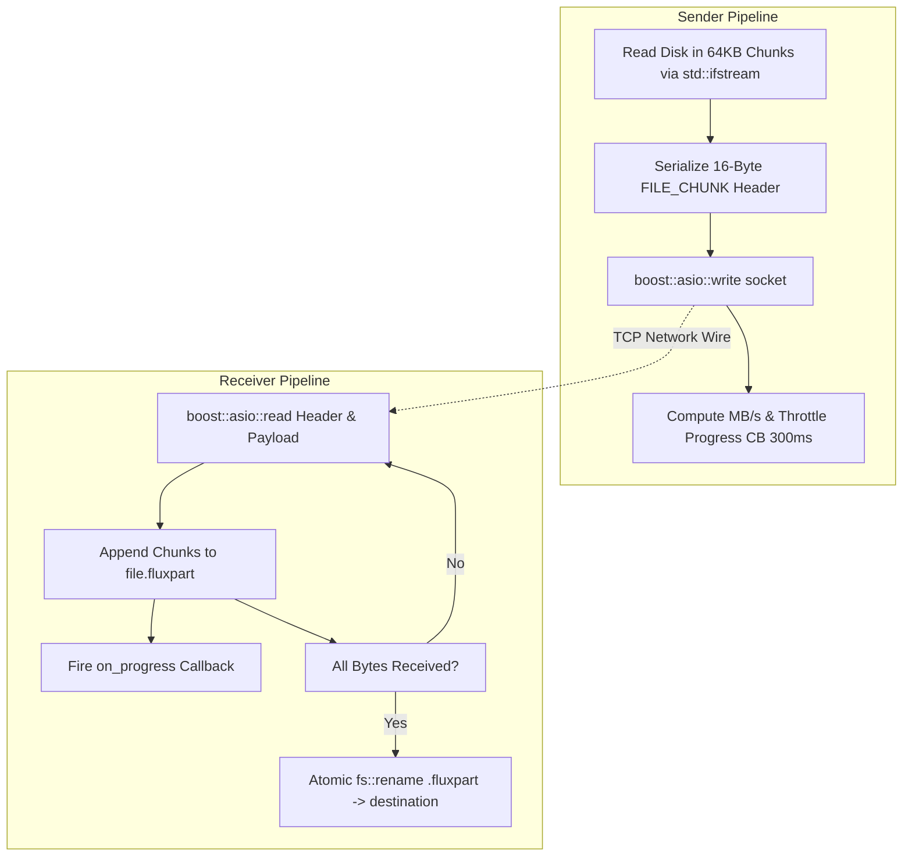

# Module 07: File Transfer Engine & Resumption Pipeline

## 1. High-Throughput Streaming Pipeline

File transfer is the core operational competency of FluxDrop. Achieving sustained gigabit speeds over Wi-Fi 6 / Ethernet while gracefully handling multi-gigabyte files requires careful pipeline engineering.

The transfer engine is encapsulated in [include/transfer.hpp](https://github.com/SawanTeja/FluxDrop/blob/main/Engine/include/transfer.hpp) and implemented in [src/transfer.cpp](https://github.com/SawanTeja/FluxDrop/blob/main/Engine/src/transfer.cpp).



---

## 2. 64KB Chunk Buffer Optimization

In `MessageSender::send_file()`, data is streamed in **64KB chunks** (`65,536 bytes`):
```cpp
std::vector<char> buffer(64 * 1024); // 64KB per chunk
while (file.read(buffer.data(), buffer.size()) || file.gcount() > 0) {
    std::streamsize bytes_read = file.gcount();
    protocol::PacketHeader header{
        static_cast<uint32_t>(protocol::CommandType::FILE_CHUNK),
        static_cast<uint32_t>(bytes_read),
        session_id, 
        0
    };
    if (!send_header(socket, header)) return false;
    boost::asio::write(socket, boost::asio::buffer(buffer.data(), bytes_read));
    total_sent += bytes_read;
}
```

### Why 64KB?
1. **L1/L2 CPU Cache Friendly**: 64KB fits neatly into modern CPU L2 data caches (typically 256KB to 1MB per core).
2. **TCP Window Alignment**: 64KB matches standard TCP receive window sizes (`TCP_WINDOW_CLAMP`), avoiding buffer thrashing.
3. **Low Framing Overhead**: With a 16-byte header per 65,536-byte payload, protocol framing overhead is **0.024%**, meaning 99.976% of all network bandwidth is pure file payload.

---

## 3. Progress Throttling & Speed Calculation

Invoking UI callbacks on every packet when streaming at 100 MB/s (1,600 packets per second) would freeze the frontend UI thread with event queue starvation.

FluxDrop implements **300ms Progress Throttling**:
```cpp
auto now = std::chrono::steady_clock::now();
auto elapsed_since_cb = std::chrono::duration_cast<std::chrono::milliseconds>(now - last_cb_time).count();

// Only fire callback every 300ms or upon the final byte
if (elapsed_since_cb >= 300 || total_sent == file_size) {
    double elapsed = std::chrono::duration<double>(now - start_time).count();
    uint64_t session_sent = total_sent - start_offset;
    double speed_mbps = (elapsed > 0) ? (session_sent / elapsed / (1024.0 * 1024.0)) : 0;
    
    fs::path p(filepath);
    progress_cb(p.filename().string(), total_sent, file_size, speed_mbps);
    last_cb_time = now;
}
```

---

## 4. The Resumption Protocol (Handling Large Files & Drops)

If a 50GB file transfer drops at 95% due to a Wi-Fi glitch, forcing the user to re-download the entire 50GB from byte 0 is unacceptable.

FluxDrop implements **automatic chunk-accurate resumption**:

### 1. In-Progress Temporary Files (`.fluxpart`)
All incoming transfers are written to a temporary sibling file with the extension `.fluxpart`:
`vacation.mp4` $\rightarrow$ `vacation.mp4.fluxpart`

### 2. Resume Offset Detection
When the receiver gets a `FILE_META` packet, it checks if a `.fluxpart` file already exists:
```cpp
uint64_t resume_offset = 0;
std::string part_file = save_path_string + ".fluxpart";
std::error_code ec;
auto part_size = fs::file_size(part_file, ec);
if (!ec && part_size > 0 && part_size < meta.size) {
    resume_offset = part_size; // Resume from exact byte length!
}
```

### 3. The 64-Bit Offset Encoding Problem & Solution
The `payload_size` field in `PacketHeader` is 32-bit (`uint32_t`), which caps out at 4 GB. How can the protocol communicate a resume offset of 25 GB?

**The FluxDrop 64-bit Split Scheme**:
The 64-bit offset is split across `reserved` (upper 32 bits) and `payload_size` (lower 32 bits):

```cpp
// Sender and Receiver helper functions
protocol::PacketHeader make_resume_header(uint32_t session_id, uint64_t resume_offset) {
    return {
        static_cast<uint32_t>(protocol::CommandType::RESUME),
        static_cast<uint32_t>(resume_offset & 0xFFFFFFFFull), // Lower 32 bits
        session_id,
        static_cast<uint32_t>(resume_offset >> 32)             // Upper 32 bits
    };
}

uint64_t decode_resume_offset(const protocol::PacketHeader& header) {
    return (static_cast<uint64_t>(header.reserved) << 32) | header.payload_size;
}
```

### 4. Seeking & Appending
1. The receiver replies with `RESUME` carrying the 64-bit offset.
2. The sender opens the file and seeks: `file.seekg(start_offset)`.
3. The receiver opens the `.fluxpart` file in append mode:
   ```cpp
   std::ios_base::openmode mode = std::ios::binary;
   if (start_offset > 0) {
       mode |= std::ios::app;
   }
   std::ofstream file(part_path, mode);
   ```
4. Transfer resumes seamlessly without re-transmitting previous gigabytes.

---

## 5. Atomic Finalization: `replace_with_completed_file`

If a file transfer is interrupted or cancelled, the destination file must never be left in a corrupted or half-written state.

In [src/transfer.cpp](https://github.com/SawanTeja/FluxDrop/blob/main/Engine/src/transfer.cpp#L57-L75):

```cpp
bool replace_with_completed_file(const fs::path& part_path, const fs::path& final_path) {
    std::error_code ec;

    // 1. If an older version of the destination file exists, remove it
    if (fs::exists(final_path, ec)) {
        fs::remove(final_path, ec);
        if (ec) return false;
    }

    // 2. Perform atomic OS-level filesystem rename
    fs::rename(part_path, final_path, ec);
    if (ec) return false;

    return true;
}
```
Only when the final byte is written and verified is `fs::rename()` called. On POSIX systems, `rename()` is an atomic inode pointer update.

---

## 6. Pre-Transfer Guardrails: Disk Space & Name Collisions

Before accepting a file, the receiver performs two safety validations:

### 1. Available Disk Space Validation
```cpp
uint64_t available_space = available_space_for_target(save_path);
if (available_space > 0 && available_space < meta.size) {
    // Insufficient disk space: reject immediately to prevent filling disk
    send_header(socket, reject_header);
    return;
}
```
`available_space_for_target()` calls `std::filesystem::space()` to check free partition bytes.

### 2. File Name Collision Prevention
If `report.pdf` already exists and is complete, receiving another `report.pdf` should not destroy the user's existing file. FluxDrop automatically detects this and appends numbers:
- `report.pdf` $\rightarrow$ `report (1).pdf` $\rightarrow$ `report (2).pdf`

```cpp
if (fs::exists(save_path, ec) && !fs::exists(part_file, ec)) {
    int counter = 1;
    fs::path stem = relative_path.stem();
    fs::path ext = relative_path.extension();
    fs::path parent = relative_path.parent_path();
    
    while (fs::exists(save_path, ec) && !fs::exists(save_path.string() + ".fluxpart", ec)) {
        fs::path new_name = stem.string() + " (" + std::to_string(counter) + ")" + ext.string();
        save_path = (base_dir / parent / new_name).lexically_normal();
        counter++;
    }
}
```

In the next module, we will explore the **Bidirectional Session Architecture**.
