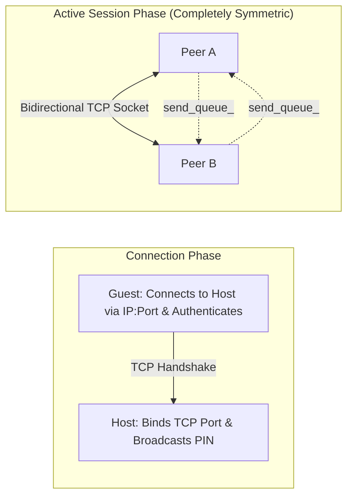
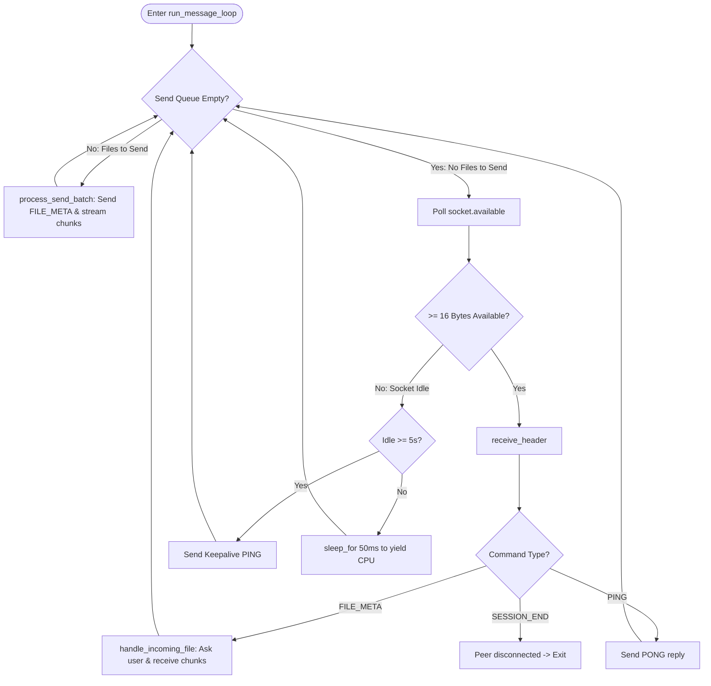
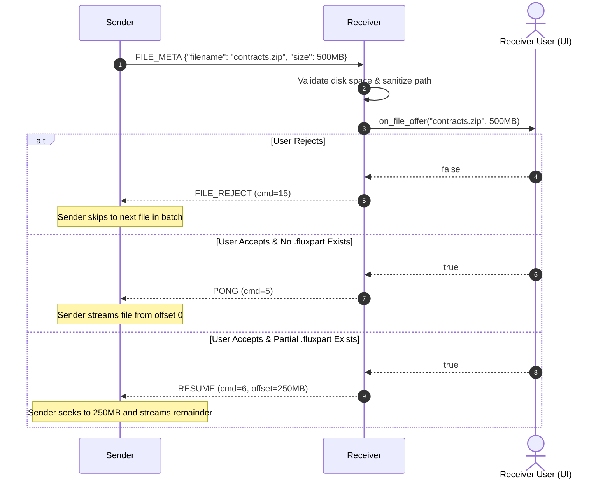

# Module 08: Bidirectional Session Architecture

## 1. The Paradigm Shift: Unidirectional vs Bidirectional

Early versions of FluxDrop (and most naive file sharing tools) used a strict Client/Server model:
- **Server**: Selected files $\rightarrow$ Opened TCP port $\rightarrow$ Streamed files $\rightarrow$ Closed socket.
- **Client**: Connected $\rightarrow$ Downloaded files $\rightarrow$ Disconnected.

This architecture suffered from major limitations:
1. **One-Way Traffic**: If Alice sent a photo to Bob, and Bob wanted to reply with a document, Bob had to close the app, become the Server, Alice had to become the Client, enter a new PIN, and reconnect.
2. **Short-Lived Sockets**: Establishing new TCP connections and performing PIN handshakes for every file drop added friction.

The **Modern Session Architecture** (`networking::Session`) in [include/session.hpp](https://github.com/SawanTeja/FluxDrop/blob/main/Engine/include/session.hpp) replaces this with a **stateful, bidirectional peer-to-peer session**.

---

## 2. Peer Symmetry (Host vs Guest)

In `networking::Session`, `SessionRole::HOST` and `SessionRole::GUEST` describe **only how the connection is initiated**:



Once authentication completes, the roles dissolve:
- Both peers run the identical **Bidirectional Message Loop**.
- Either peer can call `queue_send_files()` or `queue_send_files_with_names()` at any time.
- Incoming and outgoing transfers can occur sequentially over the same persistent connection.

---

## 3. The Bidirectional Message Loop: `run_message_loop()`

The heart of the session is `Session::run_message_loop()` in [src/session.cpp](https://github.com/SawanTeja/FluxDrop/blob/main/Engine/src/session.cpp#L436-L564).

It uses an event-driven multiplexing loop that alternates between **servicing the local send queue** and **polling for incoming remote packets**:



### Deconstructing the Loop Mechanics

#### 1. Outgoing Queue Processing
```cpp
std::vector<std::string> pending_files;
{
    std::lock_guard<std::mutex> lock(send_mtx_);
    if (!send_queue_.empty()) {
        pending_files = std::move(send_queue_.front());
        send_queue_.pop();
    }
}
if (!pending_files.empty()) {
    process_send_batch(socket, pending_files);
    continue;
}
```

#### 2. Non-Blocking Socket Polling
Instead of blocking on `read()`, the loop checks `socket.available(ec)`. This ensures that a thread waiting for incoming files can immediately wake up to send outgoing files when the user drops a new file in the UI!

#### 3. Keepalive Heartbeat
If the connection is idle for 5 seconds, an application-level `PING` is sent:
```cpp
auto now = std::chrono::steady_clock::now();
auto since_last_ping = std::chrono::duration_cast<std::chrono::seconds>(now - last_ping_time).count();
if (since_last_ping >= 5) {
    protocol::PacketHeader ping{static_cast<uint32_t>(protocol::CommandType::PING), 0, info_.session_id, 0};
    if (!transfer::MessageSender::send_header(socket, ping)) {
        // Connection died silently
        break;
    }
    last_ping_time = now;
}
```

---

## 4. Recursive Directory Expansion

When sending a directory, the sender must recursively discover all nested files while recording their relative subpaths.

In `Session::process_send_batch()`:
```cpp
for (const auto& path_str : file_paths) {
    fs::path path = fs::path(path_str).lexically_normal();
    if (fs::is_directory(path)) {
        fs::path base_dir = path.filename();
        std::error_code iter_ec;
        fs::recursive_directory_iterator end;
        for (fs::recursive_directory_iterator it(path, fs::directory_options::skip_permission_denied, iter_ec);
             it != end && !iter_ec; it.increment(iter_ec)) {
            if (it->is_regular_file()) {
                fs::path relative = base_dir / fs::relative(it->path(), path);
                jobs.push({it->path().string(), to_protocol_relative_path(relative), info_.session_id});
            }
        }
    } else if (fs::is_regular_file(path)) {
        jobs.push({path.string(), to_protocol_relative_path(path.filename()), info_.session_id});
    }
}
```

### Named Batches for Android (`process_send_batch_with_names`)
On Android, apps do not have direct filesystem paths to shared files; they receive Content URIs mapped into `/proc/self/fd/<fd>`. 

FluxDrop supports explicit named pairs (`std::vector<std::pair<std::string, std::string>>`), allowing the Android frontend to stream file descriptors while providing the true human-readable filename to the receiver:
```cpp
void Session::queue_send_files_with_names(const std::vector<std::pair<std::string, std::string>>& files);
```

---

## 5. Interactive File Negotiation Flow

When a sender initiates a file transfer, the receiver does not automatically save it to disk. An interactive handshake takes place:



---

## 6. Orderly Disconnection vs Force Termination

1. **Orderly Disconnect (`Session::disconnect()`)**:
   - Sends a `SESSION_END` packet to the peer.
   - Sets `stop_flag_ = true`.
   - Closes the active socket and acceptor under `socket_mtx_`.
   - The peer receives `SESSION_END`, exits its message loop, and triggers `on_session_ended()`.

2. **Emergency Termination (`Session::stop()`)**:
   - Called when the app is backgrounded or destroyed.
   - Acquires `socket_mtx_` and invokes `socket.close(ec)` immediately, interrupting any in-flight blocking Boost.Asio system calls.

In the next module, we will explore **Concurrency, Threading & Synchronization**.
