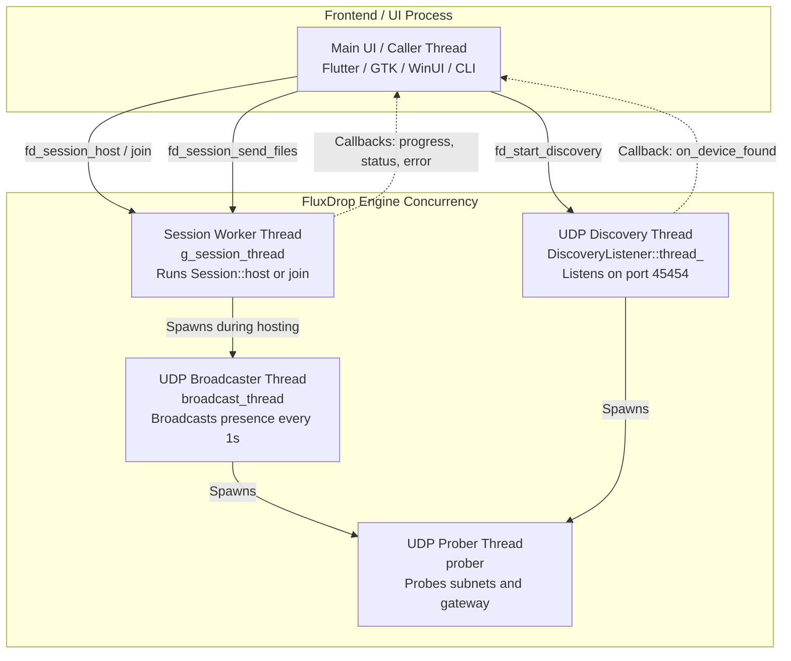

# Module 09: Concurrency Model, Threading & Synchronization

## 1. Threading Architecture Overview

Network transfer applications are intrinsically concurrent. Blocking the main thread for disk I/O, network handshakes, or socket reads causes UI freezes ("Application Not Responding" / ANR errors).

FluxDrop employs a **multi-threaded asynchronous concurrency model** utilizing ISO C++20 standard library primitives:
- `std::thread`
- `std::atomic<bool>`
- `std::mutex` and `std::lock_guard`
- Thread-local storage (`thread_local`)

---

## 2. Complete Thread Map

During an active session, up to five concurrent OS threads execute cooperatively within the Engine:



### Thread Descriptions

1. **Main UI Thread**: Owned by the host application (Dart FFI / Kotlin JNI / C++ GUI). Calls API functions (`fd_session_host`, `fd_session_send_files`, `fd_session_disconnect`). Never blocks on network operations.
2. **Session Worker Thread (`g_session_thread`)**: Owns the active TCP socket. Executes connection handshakes, authentication, and the bidirectional message loop (`run_message_loop`).
3. **UDP Broadcaster Thread (`broadcast_thread`)**: Runs only while waiting for a peer to connect. Every 1 second, it emits UDP broadcast announcements. Terminated as soon as authentication succeeds.
4. **UDP Prober Thread (`prober`)**: Periodically broadcasts `FLUXDROP_DISCOVER` packets and directly pings the default gateway on mobile hotspots.
5. **UDP Discovery Listener Thread (`thread_`)**: Listens on UDP port `45454` for announcements from nearby peers and dispatches `on_device_found` callbacks.

---

## 3. Synchronization Primitives

### 1. `std::atomic<bool>`: Lock-Free State Flags
Atomic variables provide sequentially consistent, lock-free status signaling between threads without the overhead of mutexes.

FluxDrop uses atomics for state and cancellation:
```cpp
std::atomic<bool> connected_{false};  // True when authenticated
std::atomic<bool> stop_flag_{false};   // Signals message loop to terminate
std::atomic<bool> sending_{false};     // True during an active send batch
std::atomic<bool> running_{false};     // True while discovery listener is active
```

**Memory Order**: By default, standard operations on `std::atomic` in C++ use `std::memory_order_seq_cst` (sequential consistency), guaranteeing that all CPU cores observe state changes in the exact same chronological order.

### 2. `std::mutex` and `std::lock_guard`: Mutual Exclusion
When accessing shared mutable data (such as queues or raw pointer handles), mutexes ensure single-threaded access.

#### Protecting the Send Queue (`send_mtx_`)
```cpp
// UI Thread pushes:
void Session::queue_send_files(const std::vector<std::string>& file_paths) {
    std::lock_guard<std::mutex> lock(send_mtx_);
    send_queue_.push(file_paths);
}

// Session Worker Thread pops:
void Session::run_message_loop(...) {
    std::vector<std::string> pending;
    {
        std::lock_guard<std::mutex> lock(send_mtx_);
        if (!send_queue_.empty()) {
            pending = std::move(send_queue_.front());
            send_queue_.pop();
        }
    }
    // Mutex released before beginning long disk/network operations!
    if (!pending.empty()) {
        process_send_batch(socket, pending);
    }
}
```

> [!TIP]
> Notice that `send_mtx_` is held **only** for the duration of the queue pop (`std::move`), and released *before* `process_send_batch` begins. Holding a mutex during network I/O is a severe anti-pattern that leads to UI deadlocks.

---

## 4. Concurrency Patterns & Pitfalls Avoided

### Pattern 1: Interrupting Blocking Sockets Across Threads
A fundamental challenge in network programming is cancelling an active blocking `read()` or `accept()` from the UI thread. In POSIX/Winsock, threads cannot easily be "interrupted" or "killed".

**The FluxDrop Pattern**:
The worker thread exposes its raw active socket pointer under `socket_mtx_`:
```cpp
// In Session worker thread:
{
    std::lock_guard<std::mutex> lock(socket_mtx_);
    active_socket_ = &socket;
}

// In UI thread calling disconnect():
void Session::disconnect() {
    stop_flag_ = true;
    std::lock_guard<std::mutex> lock(socket_mtx_);
    if (active_socket_) {
        boost::system::error_code ec;
        active_socket_->close(ec); // Force-close the socket handle!
    }
}
```
When `socket.close()` is called from the UI thread, the operating system kernel immediately awakens the worker thread with an `operation_aborted` or `bad_descriptor` error code, breaking it out of the read loop instantly!

### Pattern 2: RAII Socket Cleanup (`ClientSocketGuard`)
In `Client::connect_gui()`, if an exception is thrown, the raw pointer `socket_` must not be left dangling. FluxDrop uses a custom RAII struct:
```cpp
struct ClientSocketGuard {
    Client* c;
    ~ClientSocketGuard() {
        std::lock_guard<std::mutex> lock(c->mtx_);
        c->socket_ = nullptr; // Always reset pointer upon function exit
    }
} cg{this};
```

### Pattern 3: Thread-Local Storage for C ABI Memory Safety
As discussed in Module 02, returning strings from background worker threads across the C ABI is made safe using `static thread_local std::string`, ensuring each thread has its own isolated string buffer without locking overhead.

### Pattern 4: Thread Joining and Preventing Zombies
In `core_api.cpp`, whenever a new server or client is launched, any existing thread is safely cancelled and joined:
```cpp
if (g_server_thread.joinable()) {
    fd_cancel_server(); // Signals stop, closes socket, calls g_server_thread.join()
}
```
This guarantees that orphaned background threads never accumulate in memory.

In the next module, we will explore **Third-Party Libraries, CMake & the Testing Suite**.
