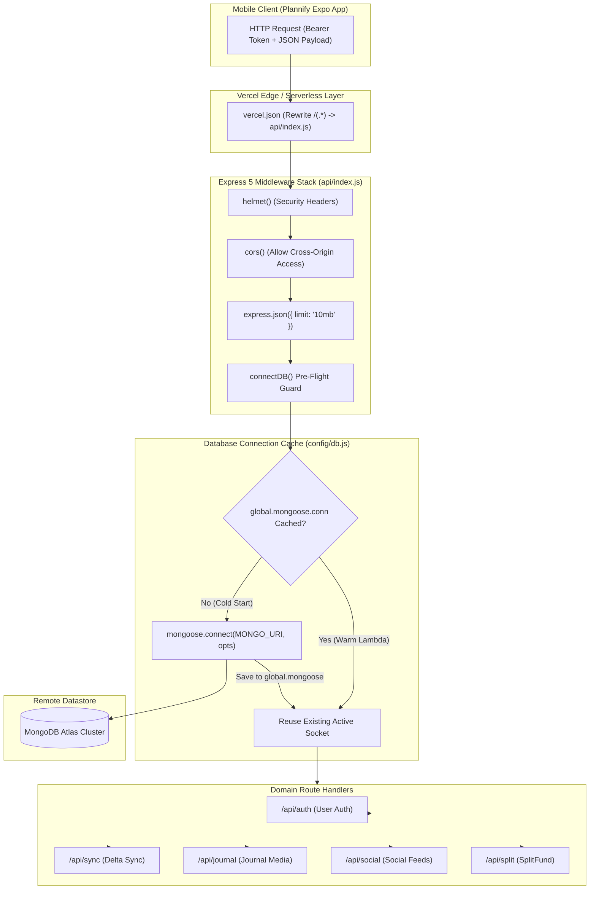
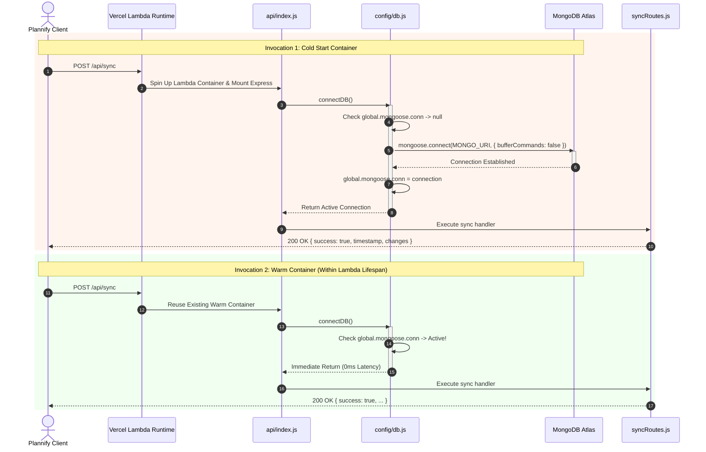

# Module 01: Server Architecture, Security & Serverless Database Gateway

## 1. Module Overview & Architectural Role

The **Server Architecture, Security & Serverless Database Gateway** module is the central hosting, security enforcement, and database lifecycle foundation of the Plannify backend (`c:\Tejashvi\Plannify\Backend`). Designed for deployment as both a local development server and a high-concurrency serverless microservice on **Vercel**, this module is responsible for:
- **Express 5 Application Factory (`api/index.js`)**: Establishing the HTTP middleware pipeline, request parsing limits, security headers, and mounting domain routes.
- **Serverless Pre-Flight Database Middleware**: Intercepting every incoming HTTP request to guarantee an established MongoDB connection before route handlers execute.
- **Global Connection Pooling & Socket Reuse (`config/db.js`)**: Preventing database connection exhaustion in ephemeral serverless environments by caching Mongoose connections in the Node.js `global` scope across lambda container invocations.
- **HTTP Security & CORS Hardening**: Implementing security headers via **Helmet** and enabling cross-origin communication for the Expo React Native client via **CORS**.
- **Deployment Topology (`vercel.json`)**: Directing all incoming network traffic through `@vercel/node` to the single serverless entrypoint `api/index.js`.

### File Manifest
```
Backend/
├── api/
│   └── index.js               # Express 5 server initialization, security stack, and route registry
├── config/
│   └── db.js                  # Serverless-optimized Mongoose connection caching pool
├── vercel.json                # Vercel serverless build and route rewrite configuration
└── package.json               # Runtime dependencies, scripts, and engine specifications
```

---

## 2. Frameworks & Libraries Used (With Architectural Justifications)

| Library / Framework | Version | Role in this Module | Rationale & Alternatives Considered |
|---|---|---|---|
| **Express** | `^5.2.1` | Core HTTP web framework | Express 5 offers native Promise error rejection handling in route handlers, eliminating unhandled asynchronous rejections without custom async wrapper boilerplate. Chosen over Fastify or NestJS for simplicity and seamless compatibility with Vercel serverless adapters. |
| **Mongoose** | `^9.1.5` | MongoDB Object Data Modeling (ODM) | Provides strong schema typing, validation constraints, middleware hooks, and connection management. Avoids raw MongoDB driver boilerplate while ensuring structured schema evolution across 14 collections. |
| **helmet** | `^8.1.0` | HTTP security header protection | Secures the API against common web vulnerabilities (XSS, clickjacking, MIME sniffing) by setting critical HTTP response headers (`X-Content-Type-Options`, `Strict-Transport-Security`, `X-Frame-Options`). |
| **cors** | `^2.8.6` | Cross-Origin Resource Sharing | Configures HTTP headers (`Access-Control-Allow-Origin`, `Access-Control-Allow-Headers`) allowing the Expo React Native app and web clients to communicate securely with the API. |
| **dotenv** | `^17.2.3` | Environment variable isolation | Injects local credentials (`MONGO_URI`, `GOOGLE_CLIENT_ID`, `CLOUDINARY_*`) from `.env` into `process.env` during development, keeping secrets out of version control. |

---

## 3. Data Flow Diagram (DFD)

This diagram outlines how incoming HTTP traffic passes through security layers, verifies cached database connections, and routes to specific feature controllers:



---

## 4. Sequence Diagram: Serverless Cold Start vs. Warm Invocation

This sequence demonstrates the database connection caching mechanics during serverless cold starts versus subsequent warm invocations:



---

## 5. Component & Code Anatomy

### `Backend/api/index.js`
- **Body Parsing Threshold**:
  - `app.use(express.json({ limit: '10mb' }))` raises the default $100\text{ KB}$ JSON limit to $10\text{ MB}$. This accommodates comprehensive synchronization pushes containing months of tasks, habits, and journals in a single payload.
- **Pre-Flight Database Middleware**:
  ```javascript
  app.use(async (req, res, next) => {
    await connectDB();
    next();
  });
  ```
  Guarantees that database connectivity is active before any controller logic executes, preventing `MongooseError: Operation buffering timed out` errors.
- **Environment Polymorphism**:
  - In local development (`process.env.NODE_ENV !== 'production'`), starts a traditional Node.js HTTP server on `PORT || 5000`.
  - In production, exports `module.exports = app` for Vercel's serverless handler.

### `Backend/config/db.js`
- **Global Scope Singleton**:
  - Serverless platforms freeze and thaw Node.js runtime instances. Standard `mongoose.connect()` calls on every request quickly exhaust MongoDB connection limits (e.g. 500 max pool limit on MongoDB Atlas free/shared tiers).
  - Uses `global.mongoose = { conn: null, promise: null }` to persist connection instances across invocations on the same physical host.
- **Buffering Optimization**:
  - Passes `{ bufferCommands: false }`. If MongoDB is down or network connectivity fails, Mongoose immediately throws an error rather than indefinitely queueing operations in memory.

### `Backend/vercel.json`
```json
{
  "version": 2,
  "builds": [
    {
      "src": "api/index.js",
      "use": "@vercel/node"
    }
  ],
  "routes": [
    {
      "src": "/(.*)",
      "dest": "api/index.js"
    }
  ]
}
```
Directs all incoming HTTP path routes (`/(.*)`) into `api/index.js`, delegating full routing authority to Express.

---

## 6. Data Schemas & Server Configurations

### Server Environment Variables Specification (`.env`)
```bash
# Server Port (Development)
PORT=5000

# MongoDB Atlas Connection URI
MONGO_URI=mongodb+srv://<username>:<password>@cluster0.mongodb.net/plannify?retryWrites=true&w=majority

# Google Cloud OAuth Web Client ID
GOOGLE_CLIENT_ID=690723040085-8mmpou6mbpmamathrlos0hc40bp4ke1l.apps.googleusercontent.com

# Cloudinary Media Storage Credentials
CLOUDINARY_CLOUD_NAME=dv5bf64yx
CLOUDINARY_API_KEY=your_cloudinary_key
CLOUDINARY_API_SECRET=your_cloudinary_secret
```

---

## 7. Algorithms & Core Logic

### Serverless Connection Pooling Algorithm
```javascript
let cached = global.mongoose;
if (!cached) {
  cached = global.mongoose = { conn: null, promise: null };
}

async function connectDB() {
  if (cached.conn) {
    return cached.conn; // 1. Instant return for warm containers
  }

  if (!cached.promise) {
    const opts = { bufferCommands: false };
    // 2. Cache the connection promise so concurrent requests share one handshake
    cached.promise = mongoose.connect(process.env.MONGO_URI, opts).then((mongoose) => {
      console.log('✅ New MongoDB connection established');
      return mongoose;
    });
  }

  try {
    cached.conn = await cached.promise;
  } catch (e) {
    cached.promise = null; // 3. Reset promise on failure to allow subsequent retries
    throw e;
  }

  return cached.conn;
}
```

---

## 8. Edge Cases, Security & Error Handling

1. **Simultaneous Cold Start Connection Throttling**:
   - By caching the `cached.promise` before awaiting the connection, multiple requests arriving simultaneously during a cold start attach to the same connection promise, avoiding duplicate handshake storms against MongoDB Atlas.
2. **DNS & Network Hiccups**:
   - If the database handshake rejects, `cached.promise` is reset to `null` inside the `catch` block so future requests can attempt to reconnect rather than remaining permanently locked.
3. **Cross-Origin Threat Protection**:
   - `helmet()` automatically disables `x-powered-by` headers, preventing potential attackers from detecting the Express framework version.
4. **Body Parser Overload Protection**:
   - While `10mb` is permitted for bulk sync payloads, payloads exceeding `10mb` are rejected with HTTP `413 Payload Too Large`, preventing memory exhaustion attacks.
