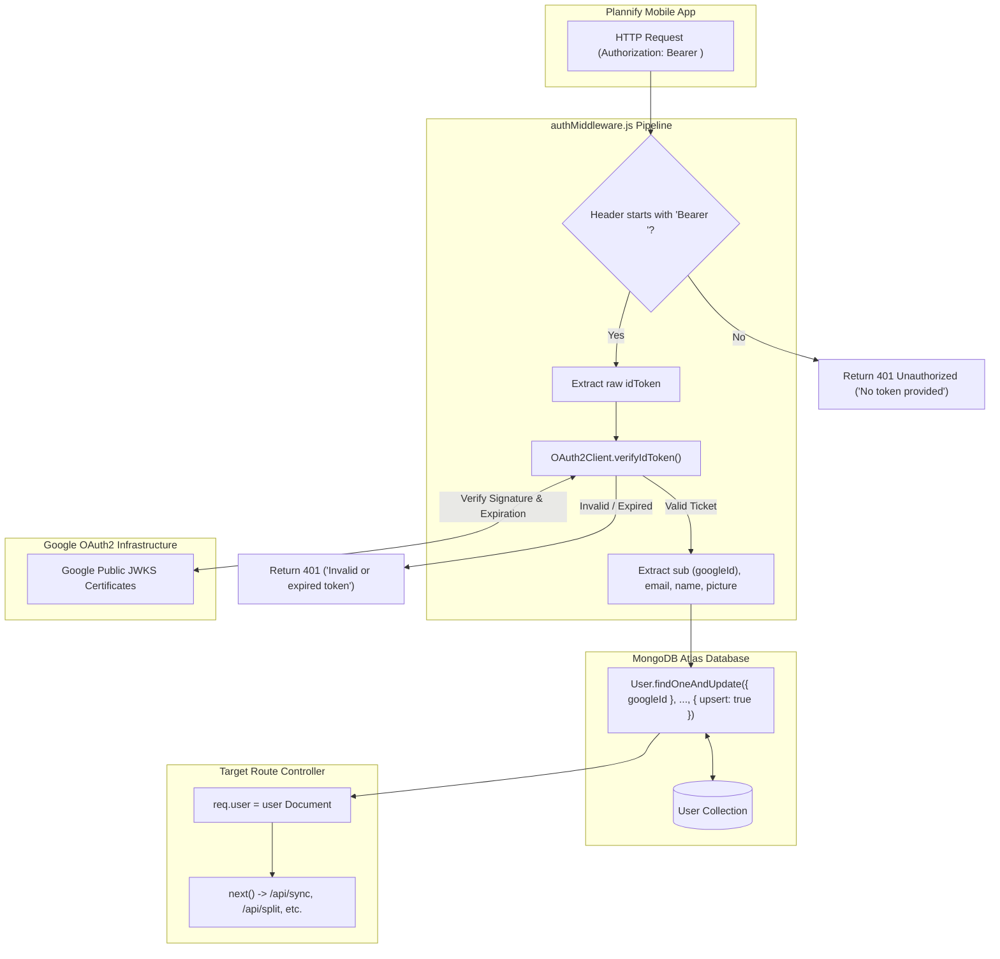
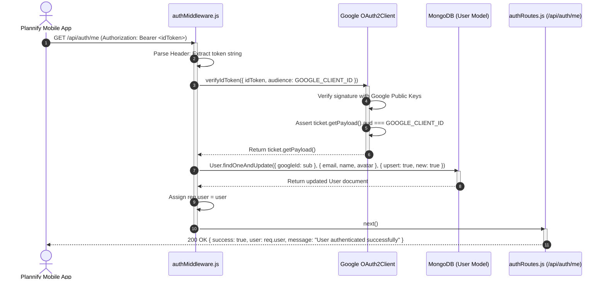

# Module 02: Google OAuth2 Identity, JWT Verification & User Upsert

## 1. Module Overview & Architectural Role

The **Google OAuth2 Identity, JWT Verification & User Upsert** module serves as Plannify's security gatekeeper and account management pipeline (`c:\Tejashvi\Plannify\Backend`). Located within `middleware/`, `routes/`, and `models/`, this module is responsible for:
- **Zero-Password Cryptographic Authentication**: Validating Google OpenID Connect identity tokens (`idToken`) issued by Google Play Services without storing passwords, hashes, or managing custom refresh token databases.
- **Cryptographic Signature Verification (`middleware/authMiddleware.js`)**: Utilizing Google's official public RSA cert keys via `google-auth-library` (`OAuth2Client`) to verify cryptographic signatures, token expiration (`exp`), and audience constraints (`aud === GOOGLE_CLIENT_ID`).
- **Atomic User Upsertion Pattern**: Automatically creating new user accounts upon first login or updating profile metadata (name, email, avatar) using MongoDB's atomic `findOneAndUpdate({ googleId }, ..., { upsert: true })`.
- **Request Context Injection**: Binding the authenticated Mongoose user document directly to `req.user`, providing downstream route handlers with seamless access to `req.user._id`.
- **Session Verification Endpoint (`routes/authRoutes.js`)**: Exposing `GET /api/auth/me` to enable client-side startup verification and profile retrieval.

### File Manifest
```
Backend/
├── middleware/
│   └── authMiddleware.js      # Google OAuth2 JWT verification and Mongoose user injection
├── models/
│   └── User.js                # User schema definition with Google ID, email, and sync tracking
└── routes/
    └── authRoutes.js          # Authentication validation routes (/api/auth/me)
```

---

## 2. Frameworks & Libraries Used (With Architectural Justifications)

| Library / Framework | Version | Role in this Module | Rationale & Alternatives Considered |
|---|---|---|---|
| **google-auth-library** | `^10.5.0` | Google ID token verification | Google's official Node.js authentication client. It automatically caches and rotates Google's public JSON Web Key Sets (JWKS), preventing slow per-request HTTP calls to Google while guaranteeing bulletproof signature verification. Far superior to generic JWT libraries (like `jsonwebtoken`) which require manual cert fetching and caching logic. |
| **Mongoose (`findOneAndUpdate`)** | `^9.1.5` | Atomic account provisioning | The `{ upsert: true }` parameter eliminates race conditions where simultaneous requests from a new device might otherwise create duplicate user documents. |

---

## 3. Data Flow Diagram (DFD)

This diagram portrays how Google ID tokens are extracted, cryptographically verified against Google's public key infrastructure, and used to resolve the user in MongoDB:



---

## 4. Sequence Diagram: Authentication Handshake & User Provisioning

This sequence depicts the complete verification flow when the mobile client issues an authenticated request:



---

## 5. Component & Code Anatomy

### `Backend/middleware/authMiddleware.js`
- **Client Initialization**:
  ```javascript
  const { OAuth2Client } = require('google-auth-library');
  const client = new OAuth2Client(process.env.GOOGLE_CLIENT_ID);
  ```
- **Audience Enforcement**:
  - `audience: process.env.GOOGLE_CLIENT_ID` ensures that tokens generated for other apps or services cannot be replayed against Plannify.
- **Atomic Upsert Specification**:
  ```javascript
  let user = await User.findOneAndUpdate(
    { googleId },
    { email, name, avatar: picture },
    { new: true, upsert: true, setDefaultsOnInsert: true }
  );
  req.user = user;
  next();
  ```
  - `new: true`: Returns the modified or newly created document instead of the pre-update document.
  - `upsert: true`: Performs an `INSERT` if no document matches `googleId`, otherwise performs an `UPDATE`.
  - `setDefaultsOnInsert: true`: Enforces Mongoose schema defaults (such as `lastSync: Date.now`) when a document is created for the first time.

### `Backend/models/User.js`
- **Indexed Fields**:
  - `googleId`: Marked with `unique: true` to guarantee a 1-to-1 relationship between Google identity accounts and Plannify databases.
  - `email`: Marked with `unique: true` for identity integrity.
- **Timestamps**:
  - `{ timestamps: true }` automatically generates and manages `createdAt` and `updatedAt`.

### `Backend/routes/authRoutes.js`
- **Protected Verification Endpoint**:
  ```javascript
  router.get('/me', authMiddleware, (req, res) => {
    res.status(200).json({
      success: true,
      user: req.user,
      message: "User authenticated successfully"
    });
  });
  ```

---

## 6. Data Schemas & Mongoose Models

### Mongoose User Schema (`models/User.js`)
```typescript
interface IUser {
  _id: mongoose.Types.ObjectId;   // Primary MongoDB Document ID
  googleId: string;               // Google OpenID Unique Subject ID (sub)
  email: string;                  // User Google Account Email
  name?: string;                  // User Google Display Name
  avatar?: string;                // User Google Profile Picture URL
  lastSync: Date;                 // Timestamp tracking the last successful data pull
  createdAt: Date;                // Account creation timestamp
  updatedAt: Date;                // Last profile update timestamp
}
```

---

## 7. Algorithms & Security Logic

### 1. Bearer Header Parsing
Protects against malformed headers by validating both presence and space delimiters:
```javascript
const authHeader = req.headers.authorization;
if (!authHeader || !authHeader.startsWith('Bearer ')) {
  return res.status(401).json({ error: 'No token provided' });
}
const token = authHeader.split(' ')[1];
```

### 2. Google Identity Payload Extraction
```javascript
const ticket = await client.verifyIdToken({
  idToken: token,
  audience: process.env.GOOGLE_CLIENT_ID,
});
const payload = ticket.getPayload();
const { sub: googleId, email, name, picture } = payload;
```

---

## 8. Edge Cases, Security & Error Handling

1. **Token Expiration (HTTP 401)**:
   - Google `idToken` payloads typically expire after 1 hour (3600 seconds). When an expired token is transmitted, `client.verifyIdToken` rejects with an error caught in the `catch` block, responding with:
     ```json
     { "error": "Invalid or expired token" }
     ```
   - This triggers Plannify's mobile client (`AppContext.js`) to invoke `refreshGoogleToken()` silently.
2. **Audience Mismatch Protection**:
   - If a malicious client passes a valid Google token issued for a different Google project, `audience: process.env.GOOGLE_CLIENT_ID` rejects the token, preventing unauthorized access.
3. **Database Uniqueness Collisions**:
   - The combination of unique indexes on `{ googleId: 1 }` and atomic `{ upsert: true }` prevents duplicate user creation even if multiple requests arrive simultaneously on account creation.
