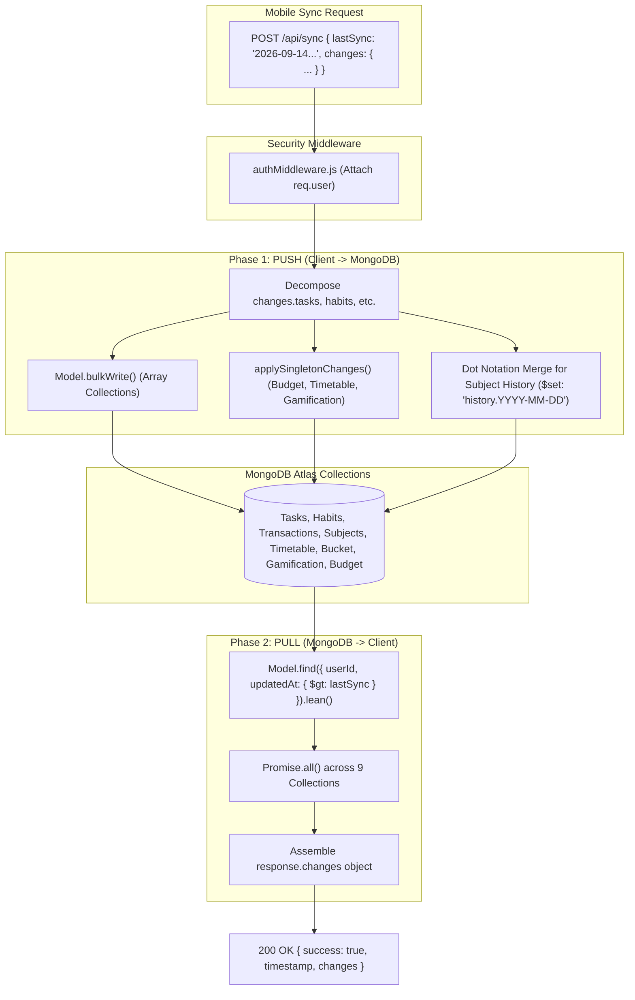
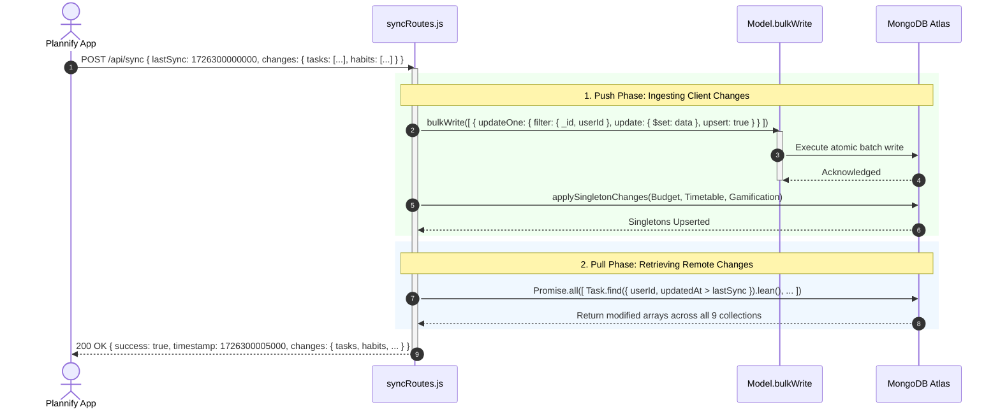

# Module 03: Bidirectional Delta Sync Engine & Mongoose Schema Architecture

## 1. Module Overview & Architectural Role

The **Bidirectional Delta Sync Engine & Mongoose Schema Architecture** module forms the data persistence and multi-device synchronization engine of the Plannify backend (`c:\Tejashvi\Plannify\Backend`). Located in `routes/syncRoutes.js` and `models/`, this module is responsible for:
- **Timestamp-Based Delta Exchange (`POST /api/sync`)**: Operating on a high-speed "push-then-pull" pipeline that ingests modified client records and retrieves server changes modified after `lastSyncDate` (`updatedAt > lastSyncDate`).
- **High-Throughput Batch Writes via `bulkWrite`**: Utilizing MongoDB's native `Model.bulkWrite(operations)` to execute atomic, parallel upserts across client payloads in a single round-trip.
- **Deep Dot-Notation History Merging**: Merging nested daily attendance records (`Subject.history`) using MongoDB's `$set: { 'history.YYYY-MM-DD': data }` syntax, ensuring multi-device attendance entries combine rather than overwrite each other.
- **Singleton Document Management (`applySingletonChanges`)**: Guaranteeing that single-instance configurations (`Timetable`, `Gamification`, and `Budget`) maintain a strict 1-to-1 relationship per user account.
- **Nuclear Account Purge (`DELETE /api/sync/reset`)**: Wiping all user records across all 9 personal tracking models upon user request.

### File Manifest
```
Backend/
├── routes/
│   └── syncRoutes.js          # Delta push/pull controller, bulkWrite operations, and reset handler
└── models/
    ├── Task.js                # Task model with compound index { userId: 1, updatedAt: -1 }
    ├── Habit.js               # Habit model with daily history maps and streak tracking
    ├── Transaction.js         # Expense & income transaction records
    ├── Subject.js             # Academic subjects with nested attendance logs
    ├── Timetable.js           # Weekly recurring class schedule singleton
    ├── BucketItem.js          # Bucket list milestones and status flags
    ├── Gamification.js        # XP, levels, and badge awards singleton
    └── Budget.js              # Monthly budget ceiling, categories, and recurring payments singleton
```

---

## 2. Frameworks & Libraries Used (With Architectural Justifications)

| Library / Framework | Version | Role in this Module | Rationale & Alternatives Considered |
|---|---|---|---|
| **Mongoose (`bulkWrite`)** | `^9.1.5` | Batch database mutations | `bulkWrite` executes an array of write operations (`updateOne`, `upsert`) directly over a single MongoDB wire protocol socket, reducing latency by over $80\%$ compared to sequential `save()` or individual `findOneAndUpdate()` calls. |
| **Mongoose (`.lean()`)** | `^9.1.5` | High-speed read hydration | Bypasses Mongoose document change tracking, getters, and prototype inheritance, returning plain JavaScript objects for outgoing sync payloads to minimize memory and CPU latency. |
| **MongoDB Compound Indexes** | Indexing | Optimized delta query filtering | Compound indexes on `{ userId: 1, updatedAt: -1 }` allow the query planner to instantly locate documents modified after `lastSync` without scanning unindexed collections. |

---

## 3. Data Flow Diagram (DFD)

This diagram visualizes the dual Push-and-Pull phases of the `/api/sync` endpoint:



---

## 4. Sequence Diagram: Full Sync Handshake

This sequence shows the push and pull execution cycle between client, server, and MongoDB:



---

## 5. Component & Code Anatomy

### `applyChanges()`: Bulk Array Synchronization
Processes array collections (Tasks, Habits, Transactions, Subjects, Bucket Items):
```javascript
async function applyChanges(Model, userId, items) {
  if (!items || items.length === 0) return;

  const operations = items.map(item => {
    const { _id, ...data } = item;
    data.userId = userId;
    data.updatedAt = new Date(); // Server sets authoritative timestamp

    // Special handling for Subject history: dot-notation merge
    if (data.history && typeof data.history === 'object') {
      const historyUpdates = {};
      for (const [dateKey, dateValue] of Object.entries(data.history)) {
        historyUpdates[`history.${dateKey}`] = dateValue;
      }
      delete data.history;
      return {
        updateOne: {
          filter: { _id, userId },
          update: { $set: { ...data, ...historyUpdates } },
          upsert: true,
        },
      };
    }

    return {
      updateOne: {
        filter: { _id, userId },
        update: { $set: data },
        upsert: true,
      },
    };
  });

  await Model.bulkWrite(operations);
}
```

### `applySingletonChanges()`: Single-Instance Documents
For singleton configurations (`Timetable`, `Gamification`, `Budget`):
1. Sorts incoming array descending by `updatedAt` to pick the freshest record.
2. Strips client `_id` to prevent primary key collision errors with native MongoDB ObjectIds.
3. For Timetable: Merges day schedules (`Monday`, `Tuesday`, etc.) so that editing Wednesday on one phone does not delete Thursday scheduled from a tablet.
4. Executes `Model.findOneAndUpdate({ userId }, { $set: data }, { upsert: true, new: true })`.

---

## 6. Data Schemas & Mongoose Models

### Task Model Schema (`models/Task.js`)
```javascript
const TaskSchema = new mongoose.Schema({
  _id: { type: String, required: true }, // Client-assigned ID string
  userId: { type: mongoose.Schema.Types.ObjectId, ref: 'User', required: true },
  title: { type: String, required: true },
  description: { type: String },
  category: { type: String, default: 'General' },
  priority: { type: String, default: 'Medium' },
  duration: { type: String },
  date: { type: String },                // YYYY-MM-DD
  completed: { type: Boolean, default: false },
  isDeleted: { type: Boolean, default: false }, // Soft delete flag
}, { timestamps: true });

TaskSchema.index({ userId: 1, updatedAt: -1 });
```

### Habit Model Schema (`models/Habit.js`)
```javascript
const HabitSchema = new mongoose.Schema({
  _id: { type: String, required: true },
  userId: { type: mongoose.Schema.Types.ObjectId, ref: 'User', required: true },
  title: { type: String, required: true },
  category: { type: String, default: 'Health' },
  duration: { type: String },
  history: { type: Map, of: Object, default: {} }, // Map of "YYYY-MM-DD" -> status
  streak: { type: Number, default: 0 },
  isDeleted: { type: Boolean, default: false },
}, { timestamps: true });
```

---

## 7. Algorithms & Core Logic

### 1. Authoritative Server Timestamp Pinning
To resolve clock drift across different mobile devices, the server enforces its own system clock when saving changes:
```javascript
data.updatedAt = new Date();
```
The server then returns `timestamp: currentSyncTime` in the response payload. The mobile client saves this exact timestamp under `'last_sync_timestamp'`, guaranteeing that subsequent sync calls only query records modified strictly after that point in time.

### 2. Full Account Reset Routine (`DELETE /api/sync/reset`)
```javascript
router.delete('/reset', authMiddleware, async (req, res) => {
  const userId = req.user._id;
  await Promise.all([
    Task.deleteMany({ userId }),
    Habit.deleteMany({ userId }),
    Transaction.deleteMany({ userId }),
    Journal.deleteMany({ userId }),
    Subject.deleteMany({ userId }),
    Timetable.deleteMany({ userId }),
    BucketItem.deleteMany({ userId }),
    Gamification.deleteMany({ userId }),
    Budget.deleteMany({ userId }),
  ]);
  res.json({ success: true, message: 'All user data cleared' });
});
```

---

## 8. Edge Cases, Security & Error Handling

1. **User Identity Hijacking Prevention**:
   - `applyChanges` explicitly overwrites any client-supplied `userId` field with `data.userId = req.user._id`. A client cannot modify or query another user's documents by forging `userId` in the payload.
2. **Compound Index Query Acceleration**:
   - Every tracked model features a compound index `{ userId: 1, updatedAt: -1 }`. Without this index, querying 9 collections on every 5-second auto-sync pulse would require full collection table scans, rapidly exceeding MongoDB Atlas CPU quotas.
3. **Soft Delete Propagation**:
   - When a task or habit is deleted on the client, it is transmitted with `isDeleted: true`. MongoDB updates the document with a fresh `updatedAt`. When other devices sync, they receive the item with `isDeleted: true` and remove it from their local SQLite/AsyncStorage databases.
