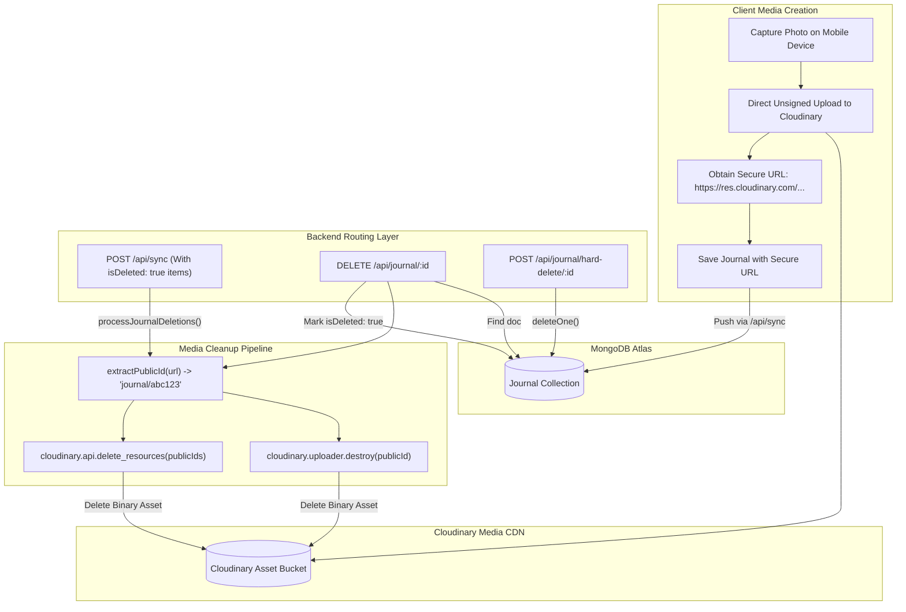
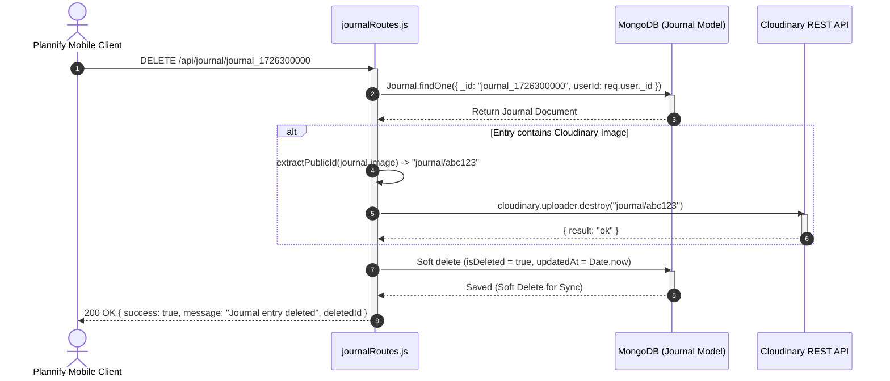

# Module 04: Media Asset Pipeline, Cloudinary CDN & Journal Storage Engine

## 1. Module Overview & Architectural Role

The **Media Asset Pipeline, Cloudinary CDN & Journal Storage Engine** module manages binary asset lifecycle, CDN image garbage collection, and personal diary storage within the Plannify backend (`c:\Tejashvi\Plannify\Backend`). Located within `routes/journalRoutes.js`, `models/Journal.js`, and `routes/syncRoutes.js`, this module is responsible for:
- **Direct-to-CDN Offloading Architecture**: Leveraging client-side direct uploads to Cloudinary to eliminate server memory buffering, high egress bandwidth costs, and slow multipart handling on Vercel serverless functions.
- **Automated Cloudinary Public ID Extraction**: Parsing CDN image URLs with regular expressions (`/\/upload\/(?:v\d+\/)?(.+)\.\w+$/`) to extract Cloudinary `public_id` identifiers for asset management.
- **Orphaned Media Garbage Collection**: Automatically purging remote Cloudinary images whenever journal records are deleted—both through explicit HTTP calls (`DELETE /api/journal/:id`) and during bulk synchronization pulses (`processJournalDeletions`).
- **Soft-Delete Sync Synchronization**: Marking records as `isDeleted: true` with updated timestamps so mobile devices sync deletions before physical database removal occurs.
- **Hard Purge Endpoint (`POST /api/journal/hard-delete/:id`)**: Providing permanent database removal for privacy and GDPR compliance.

### File Manifest
```
Backend/
├── routes/
│   ├── journalRoutes.js       # Journal CRUD endpoints and Cloudinary resource destroyers
│   └── syncRoutes.js          # processJournalDeletions() batch asset cleanup
└── models/
    └── Journal.js             # Diary entry model with Cloudinary URLs, moods, and GPS tags
```

---

## 2. Frameworks & Libraries Used (With Architectural Justifications)

| Library / Framework | Version | Role in this Module | Rationale & Alternatives Considered |
|---|---|---|---|
| **cloudinary** | `^2.9.0` | Cloud media deletion & CDN management | Official Cloudinary Node.js SDK (v2). Provides programmatic asset destruction (`cloudinary.uploader.destroy`) and bulk resource deletion (`cloudinary.api.delete_resources`), ensuring images removed from the mobile app do not consume orphaned cloud storage. |
| **Mongoose (`models/Journal.js`)** | `^9.1.5` | Diary schema persistence | Stores structured metadata (moods, GPS location strings, tags, timestamps) alongside CDN image URLs. |

---

## 3. Data Flow Diagram (DFD)

This diagram portrays both the entry lifecycle and the automated media destruction pipeline across the mobile client, Express server, MongoDB, and Cloudinary CDN:



---

## 4. Sequence Diagram: Journal Deletion & Cloudinary Cleanup

This sequence shows the synchronized database soft-delete and remote CDN image destruction:



---

## 5. Component & Code Anatomy

### Public ID Regular Expression Extraction
Cloudinary image URLs follow strict URL path structures. To delete an image, the SDK requires the raw `public_id` without folder prefixes, transformation parameters, or file extensions:
```javascript
const extractPublicId = (url) => {
  if (!url || !url.includes('cloudinary.com')) return null;
  try {
    // Matches the path after /upload/ (skipping version tag /v123.../) up to the extension
    const match = url.match(/\/upload\/(?:v\d+\/)?(.+)\.\w+$/);
    if (match && match[1]) return match[1];
  } catch (e) {
    console.error('Error extracting public_id:', e);
  }
  return null;
};
```
*Example*:
- Input URL: `https://res.cloudinary.com/dv5bf64yx/image/upload/v1726300000/journal/memory_42.jpg`
- Extracted Public ID: `journal/memory_42`

### Batch Deletion in Delta Sync (`processJournalDeletions`)
When users delete memories while offline, the deletion arrives as part of the periodic sync array. `syncRoutes.js` intercepts these tombstones and cleans up Cloudinary assets before writing changes:
```javascript
async function processJournalDeletions(userId, items) {
  if (!items || items.length === 0) return;
  const deletedItems = items.filter(i => i.isDeleted);
  if (deletedItems.length === 0) return;

  const ids = deletedItems.map(i => i._id);
  const docs = await Journal.find({ _id: { $in: ids }, userId }).lean();
  
  const publicIds = [];
  docs.forEach(doc => {
    if (doc.image && doc.image.includes('cloudinary.com')) {
      const pid = extractPublicId(doc.image);
      if (pid) publicIds.push(pid);
    }
  });

  if (publicIds.length > 0) {
    try {
      await cloudinary.api.delete_resources(publicIds);
    } catch (batchErr) {
      await Promise.all(publicIds.map(id => cloudinary.uploader.destroy(id)));
    }
  }
}
```

---

## 6. Data Schemas & Mongoose Models

### Journal Mongoose Model (`models/Journal.js`)
```typescript
interface IJournal {
  _id: string;                     // Client-assigned memory ID
  userId: mongoose.Types.ObjectId; // Owner user reference
  topic?: string;                  // Diary title (e.g. "Hiking Trip")
  text?: string;                   // Memory text body
  image?: string;                  // Cloudinary secure HTTPS URL
  location?: string;               // Reverse-geocoded place string
  mood?: string;                   // Emoji mood representation
  date?: string;                   // Formatted display date
  timestamp?: number;              // Numeric epoch for chronological sorting
  tags: string[];                  // Tag labels
  uploadStatus?: string;           // 'pending' | 'complete' | 'failed'
  isDeleted: boolean;              // Soft-delete sync tombstone
  createdAt: Date;
  updatedAt: Date;
}
```

---

## 7. Algorithms & Error Handling

### 1. Fault-Tolerant Cascade Deletion
If Cloudinary network connectivity fails during a journal deletion, the database operation still succeeds:
```javascript
try {
  await cloudinary.uploader.destroy(publicId);
} catch (cloudError) {
  console.error('Cloudinary delete failed:', cloudError);
  // Do NOT throw: Proceed with DB soft delete so user data remains consistent
}
```
This ensures that a transient CDN network outage does not block users from deleting memories from their personal timeline.

### 2. Multi-Device Soft Deletion
When `DELETE /api/journal/:id` is called, the document is flagged with `isDeleted = true` and given a fresh `updatedAt = new Date()`. During the next sync pulse from the user's second device (e.g., tablet), the server returns the updated record with `isDeleted: true`, instructing the tablet to drop the memory from its local storage.
