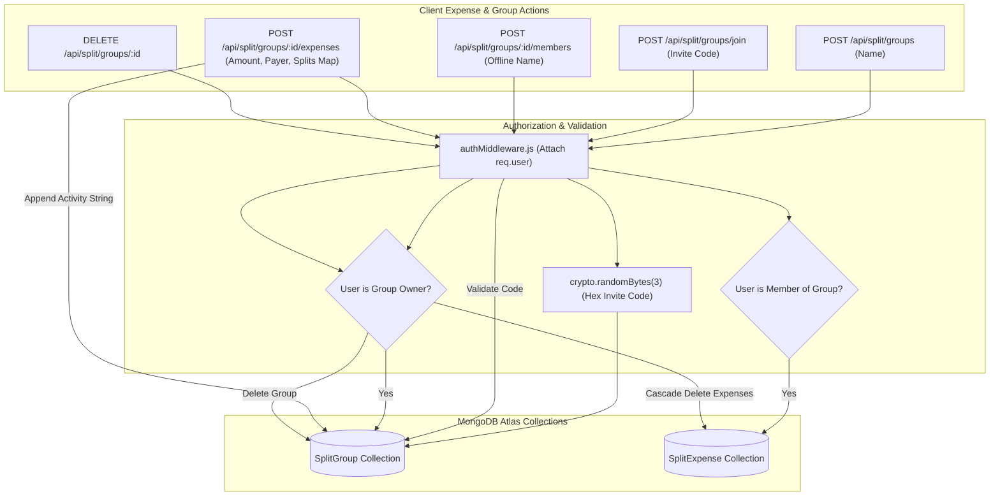
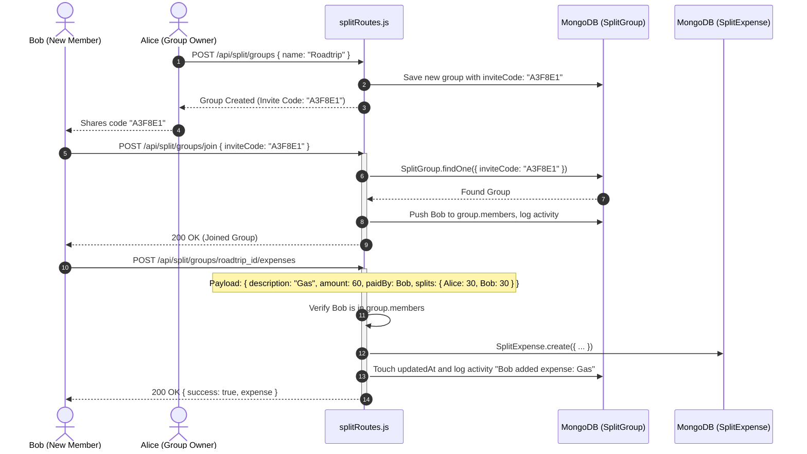

# Module 05: Collaborative SplitFund Ledger & Debt Settlement API

## 1. Module Overview & Architectural Role

The **Collaborative SplitFund Ledger & Debt Settlement API** module powers group financial coordination, shared expense tracking, and debt resolution within the Plannify backend (`c:\Tejashvi\Plannify\Backend`). Situated within `routes/splitRoutes.js` and `models/`, this module is responsible for:
- **Group Creation & Cryptographic Invite Codes (`POST /api/split/groups`)**: Generating unique 6-character uppercase cryptographic hexadecimal codes (`generateInviteCode`) allowing users to invite peers without sharing phone numbers or emails.
- **Virtual / Offline Member Integration (`POST /api/split/groups/:id/members`)**: Permitting group administrators to add offline participants (`virtual_${Date.now()}_...`) so groups can track expenses involving individuals who do not possess a registered Google account.
- **Shared Expense Ledger (`POST /api/split/groups/:groupId/expenses`)**: Recording expenses with multi-payer attribution, split classification (Equally, Percent, Shares, Adjust, Exact), and individual split maps.
- **Peer Settlement Transactions**: Recording reimbursement payments (`type: 'payment'`) that offset calculated balances between debtors and creditors.
- **Cascade Deletion & Audit Activities**: Deleting all child expense records whenever an owner deletes a group, while logging timestamped audit activity strings (`group.activities`) for all operations.

### File Manifest
```
Backend/
├── routes/
│   └── splitRoutes.js         # Group management, member invitations, and expense endpoints
└── models/
    ├── SplitGroup.js          # Group schema with ownerId, members, virtualMembers, and activities
    └── SplitExpense.js        # Expense records with payer, splitType enum, and splits Map
```

---

## 2. Frameworks & Libraries Used (With Architectural Justifications)

| Library / Framework | Version | Role in this Module | Rationale & Alternatives Considered |
|---|---|---|---|
| **crypto (Node.js Native)** | Built-in | Cryptographic invite code generation | Uses `crypto.randomBytes(3).toString('hex').toUpperCase()` to create 6-character entropy codes ($16.7\text{ million}$ combinations) resistant to brute-force sequential guessing. |
| **Mongoose (`models/SplitExpense.js`)** | `^9.1.5` | Dynamic Map storage for split shares | Employs `{ type: Map, of: Number }` for `splits`, enabling flexible key-value associations of `userId -> amount` across dynamic group sizes. |

---

## 3. Data Flow Diagram (DFD)

This diagram portrays group creation, peer joining, expense addition, and cascade group deletion:



---

## 4. Sequence Diagram: Group Joining & Expense Logging

This sequence illustrates a user joining via invite code and an expense being shared across the group:



---

## 5. Component & Code Anatomy

### Cryptographic Invite Code Generation
```javascript
const generateInviteCode = () => {
  return crypto.randomBytes(3).toString('hex').toUpperCase();
};

// Collision-proof generation loop
let inviteCode;
let isUnique = false;
while (!isUnique) {
  inviteCode = generateInviteCode();
  const existing = await SplitGroup.findOne({ inviteCode });
  if (!existing) isUnique = true;
}
```

### Virtual Offline Member Management
Allows users to split bills with peers who have not downloaded the app:
```javascript
router.post('/groups/:id/members', authMiddleware, async (req, res) => {
  const { id } = req.params;
  const { name } = req.body;
  const group = await SplitGroup.findById(id);

  if (!group) return res.status(404).json({ error: 'Group not found' });
  if (group.ownerId.toString() !== req.user._id.toString()) {
    return res.status(403).json({ error: 'Only admin can add members' });
  }

  const newVirtual = {
    id: `virtual_${Date.now()}_${Math.random().toString(36).substr(2, 5)}`,
    name,
  };
  group.virtualMembers.push(newVirtual);
  group.activities.push({
    text: `${req.user.name} added ${name} (offline)`,
    date: new Date(),
  });
  await group.save();
  res.json({ success: true, member: newVirtual, group });
});
```

### Cascade Deletion
Guarantees zero orphaned expense records when a group is deleted:
```javascript
router.delete('/groups/:id', authMiddleware, async (req, res) => {
  const group = await SplitGroup.findById(req.params.id);
  if (!group) return res.status(404).json({ message: 'Group not found' });
  if (group.ownerId.toString() !== req.user._id.toString()) {
    return res.status(403).json({ message: 'Not authorized to delete this group' });
  }

  // 1. Delete group document
  await SplitGroup.findByIdAndDelete(req.params.id);
  // 2. Cascade delete all linked expenses
  await SplitExpense.deleteMany({ groupId: req.params.id });

  res.json({ message: 'Group deleted successfully' });
});
```

---

## 6. Data Schemas & Mongoose Models

### SplitGroup Schema (`models/SplitGroup.js`)
```typescript
interface ISplitGroup {
  _id: string;                     // "group_" + timestamp
  name: string;                    // Group title (e.g., "Apartment 4B")
  inviteCode: string;              // Unique 6-character hex code (e.g., "7F2B1A")
  ownerId: mongoose.Types.ObjectId;// Admin / creator reference
  members: mongoose.Types.ObjectId[]; // Registered users
  virtualMembers: { id: string; name: string }[]; // Offline members
  activities: { text: string; date: Date }[]; // Audit activity log
  createdAt: Date;
  updatedAt: Date;
}
```

### SplitExpense Schema (`models/SplitExpense.js`)
```typescript
interface ISplitExpense {
  _id: string;                     // "expense_" + timestamp
  groupId: string;                 // Reference to SplitGroup._id
  description: string;             // Expense memo (e.g. "Groceries")
  amount: number;                  // Total monetary value
  paidBy: mongoose.Types.ObjectId; // User who paid upfront
  splitType: "Equally" | "Percent" | "Shares" | "Adjust" | "Exact" | "Payment";
  splits: Map<string, number>;     // Map of userId -> amount owed
  type: "expense" | "payment";     // Debt settlement marker
  date: Date;
  createdBy: mongoose.Types.ObjectId;
  createdAt: Date;
}
```

---

## 7. Security & Error Handling

1. **Group Membership Access Protection**:
   - Both `GET /expenses` and `POST /expenses` strictly assert `group.members.includes(req.user._id)`. Unauthorized users cannot read or inject expenses into groups they do not belong to.
2. **Owner-Only Administrative Actions**:
   - Only `group.ownerId` can add virtual members or permanently delete the group.
3. **Double Join Protection**:
   - When a user submits an invite code for a group they already belong to, `splitRoutes.js` detects `group.members.includes(userId)` and returns a graceful HTTP 200 `{ message: 'Already a member' }` rather than duplicating the array entry.
