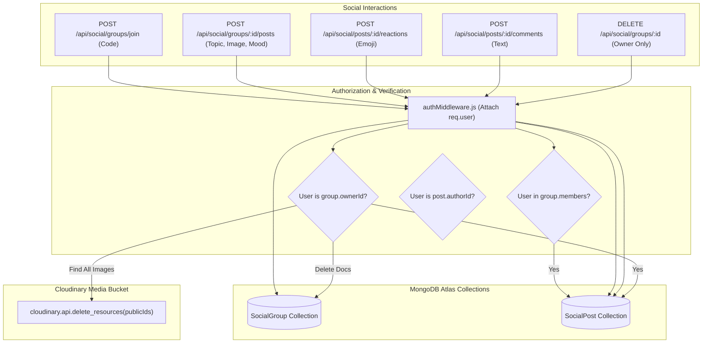
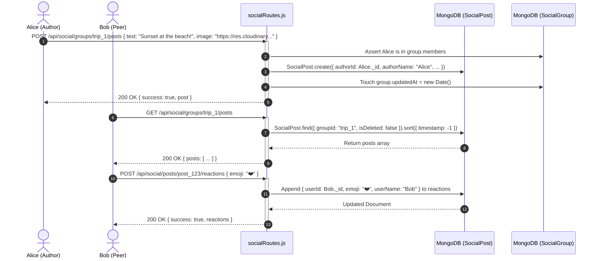

# Module 06: Private Social Network, Feeds & Community Interaction

## 1. Module Overview & Architectural Role

The **Private Social Network, Feeds & Community Interaction** module provides a decentralized, invite-only social sharing platform within the Plannify backend (`c:\Tejashvi\Plannify\Backend`). Located within `routes/socialRoutes.js` and `models/`, this module is responsible for:
- **Private Group Encapsulation (`SocialGroup.js`)**: Housing private peer groups secured by 6-character cryptographic invite codes, avoiding public feeds, tracking algorithms, or external visibility.
- **Rich Media Group Feeds (`SocialPost.js`)**: Permitting group members to publish memories, text entries, location tags, and Cloudinary-backed photos.
- **Interactive Multi-Emoji Reactions**: Storing and toggling emoji reactions (`reactions: [{ userId, emoji, userName }]`) with instant un-react toggles.
- **Threaded Group Discussions**: Providing member comment threads attached to individual posts.
- **Two-Tier Administrative Access Control**:
  - *Post Editing*: Restricted strictly to the original author (`post.authorId`).
  - *Post Deletion*: Permitted by either the author OR the group administrator (`group.ownerId`).
  - *Group Deletion & Asset Destruction*: Permitted only by the owner, triggering cascade deletion of all group posts and bulk removal of associated Cloudinary image binaries.

### File Manifest
```
Backend/
├── routes/
│   └── socialRoutes.js        # Group lifecycle, post feeds, reactions, and comment endpoints
└── models/
    ├── SocialGroup.js         # Group schema with ownerId, member arrays, and compound index
    └── SocialPost.js          # Post model with denormalized author data, reactions, and media
```

---

## 2. Frameworks & Libraries Used (With Architectural Justifications)

| Library / Framework | Version | Role in this Module | Rationale & Alternatives Considered |
|---|---|---|---|
| **cloudinary** | `^2.9.0` | Cascade photo destruction | Automatically cleans up media assets via `cloudinary.api.delete_resources(publicIds)` when posts or entire groups are deleted. |
| **Mongoose (`.populate()`)** | `^9.1.5` | User identity projection | Dynamically resolves member profiles (`name`, `email`, `avatar`) without storing duplicated user records across groups. |
| **MongoDB Compound Indexing** | Indexing | Optimized feed sorting | Employs `{ groupId: 1, timestamp: -1 }` on `SocialPost` to return chronologically ordered group feeds in $\mathcal{O}(\log N)$ time. |

---

## 3. Data Flow Diagram (DFD)

This diagram outlines how groups are joined, posts are published, reactions are toggled, and cascade deletions are executed:



---

## 4. Sequence Diagram: Group Post Creation & Reaction Lifecycle

This sequence demonstrates creating a rich media post in a private group followed by a peer adding an emoji reaction:



---

## 5. Component & Code Anatomy

### Denormalized Author Data Pattern
To allow mobile feed scrolling without expensive database `$lookup` joins on every single card render, author details are denormalized upon post creation:
```javascript
const post = new SocialPost({
  _id: postData._id || `social_post_${Date.now()}`,
  groupId,
  authorId: userId,
  authorName: req.user.name || 'Unknown',
  authorAvatar: req.user.avatar || null,
  topic: postData.topic,
  text: postData.text,
  image: postData.image,
  mood: postData.mood,
  timestamp: Date.now(),
});
await post.save();
```

### Cascade Group Deletion & Bulk Media Purge
When a group owner deletes a group, all associated posts and images stored in Cloudinary are purged:
```javascript
router.delete('/groups/:groupId', authMiddleware, async (req, res) => {
  const { groupId } = req.params;
  const group = await SocialGroup.findById(groupId);
  if (group.ownerId.toString() !== req.user._id.toString()) {
    return res.status(403).json({ error: 'Only owner can delete group' });
  }

  // 1. Gather all image public IDs across all posts in this group
  const posts = await SocialPost.find({ groupId });
  const imagePublicIds = [];
  posts.forEach(post => {
    if (post.image) {
      const pid = extractPublicId(post.image);
      if (pid) imagePublicIds.push(pid);
    }
  });

  // 2. Batch delete media from Cloudinary
  if (imagePublicIds.length > 0) {
    try {
      await cloudinary.api.delete_resources(imagePublicIds);
    } catch (cloudErr) {
      await Promise.all(imagePublicIds.map(id => cloudinary.uploader.destroy(id)));
    }
  }

  // 3. Delete database documents
  await SocialPost.deleteMany({ groupId });
  await SocialGroup.findByIdAndDelete(groupId);

  res.json({ success: true, message: 'Group and all data deleted' });
});
```

---

## 6. Data Schemas & Mongoose Models

### SocialGroup Schema (`models/SocialGroup.js`)
```typescript
interface ISocialGroup {
  _id: string;                     // "group_" + timestamp
  name: string;                    // Community title
  inviteCode: string;              // Unique 6-character hex code
  ownerId: mongoose.Types.ObjectId;// Admin reference
  members: mongoose.Types.ObjectId[]; // Array of member user IDs
  createdAt: Date;
  updatedAt: Date;
}
```

### SocialPost Schema (`models/SocialPost.js`)
```typescript
interface IReaction {
  userId: mongoose.Types.ObjectId;
  emoji: string;                   // e.g. "❤️", "🔥", "😂"
  userName?: string;
}

interface IComment {
  userId: mongoose.Types.ObjectId;
  userName: string;
  userAvatar?: string;
  text: string;
  createdAt: Date;
}

interface ISocialPost {
  _id: string;
  groupId: string;                 // Reference to SocialGroup._id
  authorId: mongoose.Types.ObjectId;
  authorName: string;
  authorAvatar?: string;
  topic?: string;
  text?: string;
  image?: string;                  // Cloudinary secure HTTPS URL
  mood?: string;
  timestamp: number;
  reactions: IReaction[];
  comments?: IComment[];
  isDeleted: boolean;
  createdAt: Date;
  updatedAt: Date;
}
```

---

## 7. Security & Edge Cases

1. **Owner vs Member Post Deletion Matrix**:
   - `DELETE /api/social/posts/:postId` evaluates both conditions:
     ```javascript
     const isAuthor = post.authorId.toString() === userId.toString();
     const isOwner = group.ownerId.toString() === userId.toString();
     if (!isAuthor && !isOwner) {
       return res.status(403).json({ error: 'Not authorized to delete this post' });
     }
     ```
   - This allows users to delete their own content while granting group admins moderation authority to remove inappropriate posts.
2. **Owner Cannot Abandon Group**:
   - If a group owner attempts to call `DELETE /api/social/groups/:id/leave`, the endpoint rejects with HTTP `400 Bad Request`: `"Owner cannot leave. Transfer ownership or delete the group."`
3. **Reaction Toggle Idempotency**:
   - If a user reacts with the same emoji they already applied, the reaction is removed (un-reacted). If they select a different emoji, their reaction is updated.
