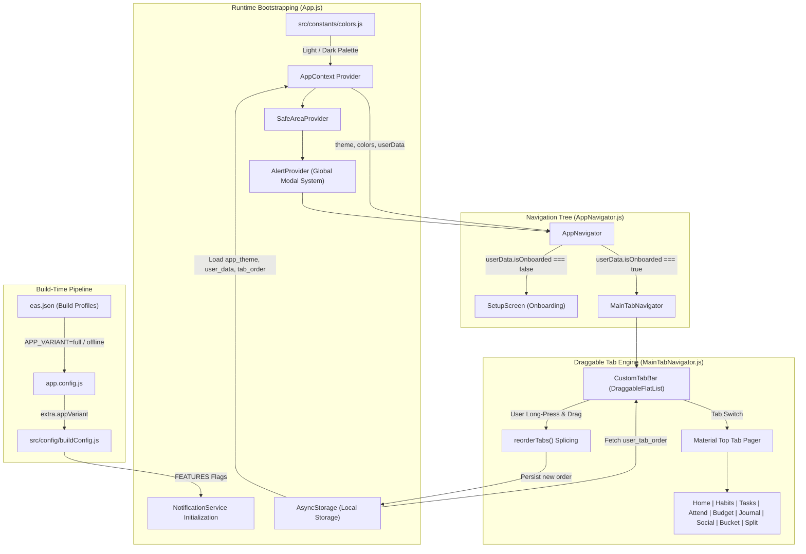
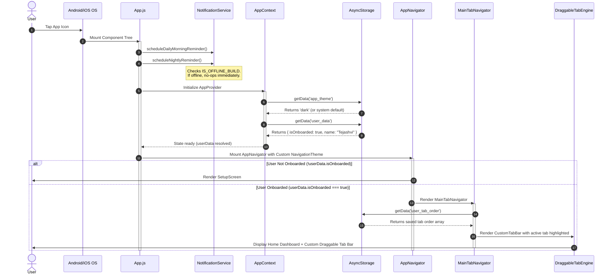

# Module 01: Core Architecture, Build Variants & Global Navigation

## 1. Module Overview & Architectural Role

The **Core Architecture, Build Variants & Global Navigation** module serves as the foundational skeleton of the Plannify mobile application. Located at the root and within `src/navigation`, `src/config`, and `src/constants`, this module governs:
- **Application Initialization & Bootstrapping**: Setting up safe area boundaries, context providers, global alert portals, and background notification schedulers.
- **Build-Time Polymorphism**: Managing two distinct operational variants—**Full Build** (cloud-enabled with Google Auth, Drive backups, push notifications, and sync) and **Offline Build** (purely local sandbox compliance for restricted Play Store releases)—without code duplication.
- **Navigation Topology**: Establishing a two-tier navigation hierarchy featuring a root Native Stack Navigator (`AppNavigator.js`) that conditionally pivots between first-time Onboarding (`SetupScreen`) and the main authenticated interface (`MainTabNavigator.js`).
- **Interactive Drag-and-Drop Tab Engine**: Providing a gesture-driven horizontal draggable tab bar using `react-native-draggable-flatlist`, enabling users to reorder tabs according to personal workflows.
- **Theme & Design Token Engine**: Centralizing design tokens (`colors.js`) with an Emerald/Teal palette supporting Light (Mint Fresh) and Dark (Cyber Forest) modes with glassmorphism values.

### File Manifest
```
Plannify/
├── App.js                         # Application entrypoint & Provider cascade
├── app.config.js                  # Dynamic Expo config for environment injection
├── app.json                       # Base Expo configuration metadata
├── eas.json                       # Expo Application Services build profile matrix
└── src/
    ├── config/
    │   └── buildConfig.js         # Runtime feature flags based on build variant
    ├── constants/
    │   └── colors.js              # Theme design tokens & glassmorphism parameters
    └── navigation/
        ├── AppNavigator.js        # Root Native Stack (Authentication / Setup gate)
        └── MainTabNavigator.js    # 9-tab Draggable Top Tab Bar + Nested Stacks
```

---

## 2. Frameworks & Libraries Used (With Architectural Justifications)

| Library / Framework | Version | Role in this Module | Rationale & Alternatives Considered |
|---|---|---|---|
| **React Native** | `0.81.5` | Core mobile runtime environment | Chosen for cross-platform native compilation, Fabric renderer support, and direct integration with native Android UI threads. Alternative (Flutter) was ruled out due to React ecosystem synergy and standard JavaScript/TypeScript code sharing. |
| **Expo SDK** | `~54.0.33` | Application platform & toolchain | Provides EAS build profiles, managed native dependencies, and rapid OTA update pathways without requiring Android Studio configuration for day-to-day feature work. |
| **React** | `19.1.0` | Declarative component UI engine | Provides concurrent rendering, transitions, and unified hook lifecycle management (`useContext`, `useCallback`, `useRef`). |
| **@react-navigation/native** | `^7.1.8` | Core routing state machine | Industry standard for mobile React navigation. Offers deep linking, custom theme inheritance, and event listeners. |
| **@react-navigation/native-stack** | `^7.3.16` | Native screen transitions | Uses Android `Fragment` and iOS `UIViewController` primitives via `react-native-screens`, delivering 60 FPS transition animations and reduced memory footprint compared to JavaScript-based card stacks. |
| **@react-navigation/material-top-tabs** | `^7.4.13` | Top tab navigation container | Enables swipeable tab pages backed by `react-native-pager-view` while supporting custom decoupled header renderers. |
| **react-native-draggable-flatlist** | `^4.0.3` | Reorderable tab bar UI | Delivers zero-lag drag-and-drop cell reordering using native gesture tracking. Far superior to static tab bars or custom gesture re-implementations that struggle with Android touch responsiveness. |
| **react-native-gesture-handler** | `~2.28.0` | Native touch & gesture subsystem | Bypasses the asynchronous React Native bridge for drag, pinch, and pan interactions, ensuring fluid interactions at native frame rates. |
| **react-native-reanimated** | `~4.1.1` | Worklet-based animations | Drives smooth scale, elevation, and opacity transitions when tabs are dragged or pressed. |
| **react-native-safe-area-context** | `~5.6.0` | Hardware inset management | Accurately queries hardware notch, punch-hole camera, and home indicator insets across Android and iOS devices. |

---

## 3. Data Flow Diagram (DFD)

The following diagram illustrates how build flags, theme tokens, persistent storage, and navigation state flow through the core architecture:



---

## 4. Sequence Diagram: App Launch & Navigation Resolution

This sequence diagram depicts the chronological initialization lifecycle from binary launch to interactive UI presentation:



---

## 5. Component & Code Anatomy

### `App.js`
- **Role**: Top-level root component.
- **Provider Cascade**:
  1. `SafeAreaProvider`: Injects edge-to-edge window inset metrics.
  2. `AppProvider`: Injects global auth, theme, sync status, and persistent profile state.
  3. `AlertProvider`: Injects custom animated modal dialog capabilities accessible across all screens and services.
  4. `AppNavigator`: The conditional stack controller.
  5. `PremiumAlert`: Global floating component bound to `AlertContext` for paywalls and alerts.
- **Lifecycle Triggers**: Dispatches morning (`6:00 AM`) and evening (`9:00 PM`) notifications on initial mount via `useEffect`.

### `app.config.js` & `src/config/buildConfig.js`
- **Role**: Dynamic configuration and feature flag management.
- **Mechanism**:
  - `app.config.js` acts as a function wrapper around `app.json`. It evaluates `process.env.APP_VARIANT` and assigns it to `extra.appVariant`.
  - `buildConfig.js` imports `Constants` from `expo-constants` and exposes boolean feature toggles:
    ```javascript
    export const IS_OFFLINE_BUILD = APP_VARIANT === 'offline';
    export const FEATURES = {
      LOGIN: !IS_OFFLINE_BUILD,
      PREMIUM: !IS_OFFLINE_BUILD,
      CLOUD_BACKUP: !IS_OFFLINE_BUILD,
      NOTIFICATIONS: !IS_OFFLINE_BUILD,
      CLEAR_DATABASE: !IS_OFFLINE_BUILD,
      RESET_APP: !IS_OFFLINE_BUILD,
    };
    ```

### `src/navigation/AppNavigator.js`
- **Role**: Root stack navigator managing the authentication/onboarding fork.
- **Theme Injection**: Merges React Navigation's `DarkTheme` or `DefaultTheme` with Plannify's color tokens (`colors.primary`, `colors.background`, `colors.surface`, `colors.textPrimary`), guaranteeing that native stack headers and background canvases match the selected theme.
- **Guarded Rendering**:
  - Displays a centered `ActivityIndicator` styled with `colors.primary` while `userData === undefined`.
  - If `!userData.isOnboarded`, mounts `SetupScreen`.
  - Otherwise, mounts `MainTabNavigator`.

### `src/navigation/MainTabNavigator.js`
- **Role**: Manages the 9 core application tabs and 3 nested stack navigators:
  1. `HomeStackNavigator`: Hosts `SummaryDashboard`.
  2. `BudgetStackNavigator`: Hosts `BudgetScreen`, `BudgetHistory`, and `BudgetSetup`.
  3. `SplitFundStackNavigator`: Hosts `SplitFundDashboard`, `GroupScreen`, `AddExpenseScreen`, and `SettleUpScreen`.
- **Custom Draggable Tab Bar (`CustomTabBar`)**:
  - Built using `DraggableFlatList` wrapped in `GestureHandlerRootView`.
  - Evaluates device width dynamically (`Dimensions.get("window").width`) to compute an optimal tab button width: `(screenWidth - 40) / 4.5`.
  - Listens to active tab index changes and calls `flatListRef.current.scrollToIndex({ index, animated: true, viewPosition: 0.5 })` to smoothly center the active tab horizontally.
  - Supports long-press dragging (`delayLongPress={200}`) triggering `onDragEnd={({ data }) => onReorder(data)}`.

### `src/constants/colors.js`
- **Role**: Design token repository.
- **Palette Architecture**:
  - **Light Theme**: Mint and fresh emerald (`background: "#F0FDF4"`, `surface: "#FFFFFF"`, `primary: "#10B981"`, `textPrimary: "#064E3B"`).
  - **Dark Theme**: Deep cyber-forest green (`background: "#000A05"`, `surface: "#01120B"`, `primary: "#059669"`, `textPrimary: "#E2E8F0"`).
  - **Glassmorphism Tokens**: Exposes pre-calculated RGBA values (`glassBg`, `glassBorder`) for translucent card and modal backdrops.

---

## 6. Data Schemas & State Specifications

### Persistent Tab Order Schema (`user_tab_order`)
```typescript
type TabKey = 
  | "Home" 
  | "Habits" 
  | "Tasks" 
  | "Attendance" 
  | "Budget" 
  | "Journal" 
  | "Social" 
  | "BucketList" 
  | "SplitFund";

type UserTabOrder = TabKey[];
// Default: ["Home", "Habits", "Tasks", "Attendance", "Budget", "Journal", "Social", "BucketList", "SplitFund"]
```

### Navigation Theme Object Specification
```typescript
interface CustomNavigationTheme {
  dark: boolean;
  colors: {
    primary: string;       // Plannify emerald accent
    background: string;    // Light/dark canvas background
    card: string;          // Surface color for navigation headers/bars
    text: string;          // Primary typography color
    border: string;        // Subdued border/divider line color
    notification: string;  // Accent/badge indicator color
  };
  fonts: Record<string, any>; // Inherited from React Navigation BaseTheme
}
```

---

## 7. Algorithms & Core Logic

### 1. Dynamic Tab Width Calculation
To ensure that tabs are easily tappable while revealing adjacent tabs on both compact and large screens, tab item width is computed dynamically:
$$\text{TAB\_WIDTH} = \frac{W_{\text{screen}} - 40}{4.5}$$
- $W_{\text{screen}}$: Active screen window width obtained via `Dimensions.get("window").width`.
- $40$: Horizontal margin padding on container edges ($20\text{px}$ on left, $20\text{px}$ on right).
- $4.5$: Viewport divisor, ensuring that exactly 4 full tabs and 1 half tab are visible at any time, visually hinting horizontal scrollability.

### 2. Auto-Centering Active Tab Scroll
When switching tabs programmatically or via swipe, the custom tab bar centers the selected tab using an index-based spring animation:
```javascript
useEffect(() => {
  if (flatListRef.current && routes.length > 0) {
    flatListRef.current.scrollToIndex({
      index: activeIndex,
      animated: true,
      viewPosition: 0.5, // Centers the element in the visible list container
    });
  }
}, [activeIndex, routes.length]);
```

### 3. Drag Reordering & State Persistence
When the user finishes dragging a tab cell, the updated order is saved to local storage:
```javascript
const handleReorder = async (newOrder) => {
  setTabOrder(newOrder);
  await storeData("user_tab_order", newOrder);
};
```

---

## 8. Edge Cases, Offline Mode & Error Handling

1. **Missing or Corrupt Tab Order in Local Storage**:
   - If `getData("user_tab_order")` returns `null`, empty, or an array missing newly introduced tabs, `MainTabNavigator` detects the discrepancy and falls back to `DEFAULT_TAB_ORDER`, preventing navigation crashes.
2. **Offline Build Profile Boundary**:
   - When compiled under `APP_VARIANT=offline`, `IS_OFFLINE_BUILD` is resolved to `true`.
   - Notification setup in `App.js` is bypassed, and cloud synchronization buttons are hidden from drawer and navigation stacks.
3. **Android Hardware Back Button Handling**:
   - Nested stack navigators (`HomeStack`, `BudgetStack`, `SplitStack`) utilize native back behaviors. Back actions in deeper screens pop the nested screen before delegating back behavior to the parent tab bar.
4. **Android Layout Animation Crash Avoidance**:
   - Experimental UI layout animation flags are safely wrapped in platform checks:
     ```javascript
     if (Platform.OS === 'android' && UIManager.setLayoutAnimationEnabledExperimental) {
       UIManager.setLayoutAnimationEnabledExperimental(true);
     }
     ```
