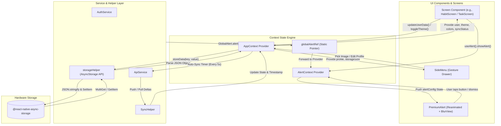
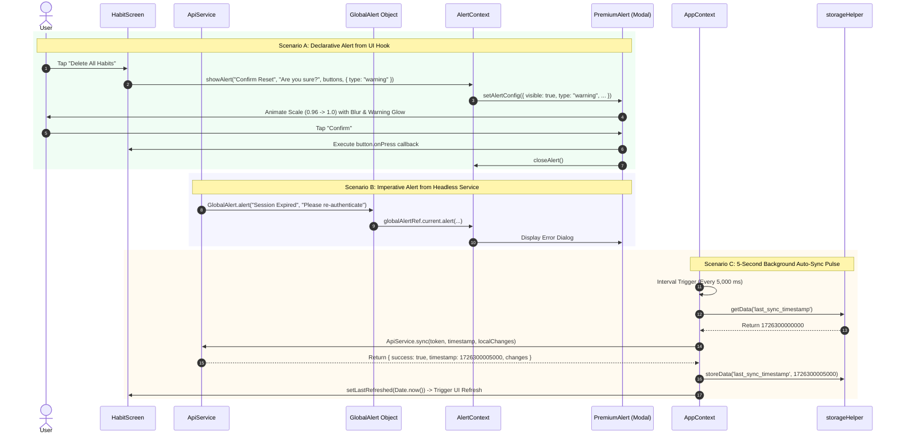

# Module 02: Global State Management, Local Storage & Dialog Systems

## 1. Module Overview & Architectural Role

The **Global State Management, Local Storage & Dialog Systems** module acts as the operational nervous system of the Plannify mobile application. Situated within `src/context`, `src/utils`, and `src/components`, this module is responsible for:
- **Centralized Application Store (`AppContext.js`)**: Orchestrating global reactivity across the app, including active theme tokens, authenticated user records, real-time background sync pulses, offline data recalculations, user profile data, and storage metrics.
- **Global Imperative & Declarative Dialog Engine (`AlertContext.js` & `PremiumAlert.js`)**: Providing a glassmorphic, animated modal dialog system that can be invoked declaratively via React hooks (`useAlert()`) or imperatively from headless service files (`GlobalAlert.alert()`) via static object reference bindings.
- **Physics-Based Gesture Drawer (`SideMenu.js`)**: Delivering a 2D physics-driven navigation and configuration drawer driven by `PanResponder` and 2D vector mathematics, supporting fling dismissal, theme swapping, local storage inspection, and profile photo capture.
- **Storage Abstraction Layer (`storageHelper.js`)**: Encapsulating low-level `@react-native-async-storage/async-storage` operations with bulletproof serialization, error boundary catching, and uniform deserialization.

### File Manifest
```
Plannify/src/
├── context/
│   ├── AppContext.js           # Core reactive application store & background sync timer
│   └── AlertContext.js         # Dialog state controller & static global ref bridge
├── components/
│   ├── PremiumAlert.js         # Reanimated glassmorphic modal renderer
│   ├── SideMenu.js             # 2D physics pan responder drawer & profile manager
│   └── BackupModal.js          # Google Drive archive & restore interactive modal
└── utils/
    └── storageHelper.js        # AsyncStorage serialization and error boundary wrapper
```

---

## 2. Frameworks & Libraries Used (With Architectural Justifications)

| Library / Framework | Version | Role in this Module | Rationale & Alternatives Considered |
|---|---|---|---|
| **React Context API** | `19.1.0` | Global state communication | Chosen over Redux Toolkit or Zustand because Plannify's state graph is modular and largely localized to distinct feature screens. Context API avoids external boilerplate while providing direct integration with React 19 concurrent features. |
| **@react-native-async-storage/async-storage** | `2.2.0` | Persistent key-value store | Unmanaged SQLite or Realm was avoided because Plannify's document model is based on serialized JSON blobs, matching the schema-free NoSQL sync model of MongoDB and Google Drive. |
| **react-native-modal** | `^14.0.0-rc.1` | Modal dialog viewport orchestration | Superior to the stock React Native `Modal` component on Android because it prevents status bar flickering, supports hardware back button interception, and provides fine-grained backdrop dismiss hooks. |
| **expo-blur** | `~15.0.8` | Glassmorphism blur effects | Provides hardware-accelerated real-time background blurring (`BlurView`) on iOS (UIVisualEffectView) and Android, elevating Plannify's visual aesthetic without frame drops. |
| **react-native-reanimated** | `~4.1.1` | Micro-animations in alert popups | Operates on the UI thread using shared values (`useSharedValue`, `withTiming`), ensuring that modal zoom/fade animations maintain 60 FPS even when the JavaScript thread is busy parsing JSON. |
| **expo-image-picker** | `~17.0.10` | User avatar selection & cropping | Allows seamless access to device camera rolls with built-in aspect ratio locking (`[1, 1]`) and automated quality compression before local storage persistence. |
| **PanResponder (React Native)** | `0.81.5` | 2D drawer fling physics | Provides granular multi-phase gesture interception (`onStartShouldSetPanResponderCapture`, `onMoveShouldSetPanResponderCapture`), permitting child tap handling while catching fast fling sweeps. |

---

## 3. Data Flow Diagram (DFD)

This diagram outlines how state mutations, storage reads/writes, and dialog requests propagate through `AppContext` and `AlertContext`:



---

## 4. Sequence Diagram: Global Alert Invocation & Background Sync

This sequence demonstrates both declarative (React hook) and imperative (headless service) alert triggering, alongside the reactive background auto-sync lifecycle:



---

## 5. Component & Code Anatomy

### `src/context/AppContext.js`
- **State Properties**:
  - `theme`: `"light" | "dark"` (persisted under `"app_theme"`).
  - `user`: Google User Object (`{ idToken, user: { email, name, photo } }`).
  - `authLoading`: Boolean flag protecting initial authentication bootstrap.
  - `isSyncing`: Boolean indicating network synchronization in flight.
  - `lastRefreshed`: Monotonically increasing timestamp (`Date.now()`) used as a dependency trigger for screens to refresh local datasets when cloud sync delivers remote changes.
  - `isPremium`: Boolean state toggle for premium feature gating.
  - `userData`: Persistent profile record (`name`, `image`, `userType`, `isOnboarded`, `notifyTasks`).
- **Hooks & Listeners**:
  - `useEffect` (Auto-Sync): Spawns a 5-second recurring interval when an authenticated `user.idToken` is present:
    ```javascript
    useEffect(() => {
      let syncInterval;
      if (user && user.idToken) {
        syncInterval = setInterval(() => {
          performSync(user.idToken, true); // true = silent background mode
        }, 5000);
      }
      return () => { if (syncInterval) clearInterval(syncInterval); };
    }, [user, isPremium]);
    ```
  - `AppState.addEventListener('change')`: Detects when the mobile operating system returns Plannify from background to active foreground. Instantly triggers `refreshGoogleToken()` to proactively prevent expired token rejections.
  - `getStorageUsage()`: Scans all local storage keys via `AsyncStorage.getAllKeys()` and sums byte sizes to render a human-readable storage footprint (e.g., `"142.50 KB"`).

### `src/context/AlertContext.js`
- **Static Ref Bridge**:
  - Exports `globalAlertRef = React.createRef()`.
  - In `AlertProvider`, assigns `globalAlertRef.current = { alert: showAlert }`.
  - Enables `GlobalAlert.alert(...)` to function outside React components (e.g., in Axios/Fetch network interceptors).
- **Auto-Type Inference**:
  - Automatically analyzes title string tokens (`"error"`, `"fail"`, `"success"`, `"warn"`) if explicit dialog type option is omitted.

### `src/components/PremiumAlert.js`
- **Visual Design**:
  - Uses `BlurView` (`intensity={40}`) from `expo-blur` and translucent card backings (`rgba(1, 18, 11, 0.85)` in dark mode) to create a frosted-glass finish.
  - Generates a colored box-shadow halo matching the alert type (`colors.success`, `colors.danger`, `colors.warning`, or `colors.primary`).
- **Animation Orchestration**:
  - Employs Reanimated shared values (`scale` initialized to `0.96`, `opacity` initialized to `0`).
  - Fades in over 200ms and scales to `1.0` over 150ms upon activation.

### `src/components/SideMenu.js`
- **Physics-Based Gesture Handling**:
  - Utilizes a fine-tuned `PanResponder` to track user drag gestures in real time.
  - Configured with high-sensitivity capture (`Math.abs(gesture.dx) > 4`) so fast swipe dismissals are recognized before child components can block them.
  - Computes gesture distance and release velocity vectors. If distance exceeds $120\text{px}$ or velocity exceeds $0.5$, it flings the menu out of the viewport in the direction of the swipe.
- **Features Hosted**:
  - Avatar camera roll selection with `ImagePicker.launchImageLibraryAsync({ allowsEditing: true, aspect: [1, 1] })`.
  - Inline user nickname editing.
  - Real-time disk footprint calculation.
  - Direct trigger for `BackupModal` (Google Drive backup).
  - Premium feature toggle switch.

---

## 6. Data Schemas & State Specifications

### Local Profile Schema (`user_data`)
```typescript
interface UserData {
  name: string;             // User display name (Default: "Guest")
  image: string | null;     // Local file URI ("file:///...") or Cloudinary URL
  userType: "student" | "professional"; // Determines default tracking presets
  isOnboarded: boolean;     // False shows SetupScreen; true displays MainTabs
  notifyTasks: boolean;     // Toggle for local task reminder alerts
}
```

### Alert Configuration Schema (`alertConfig`)
```typescript
interface AlertButton {
  text: string;
  onPress?: () => void;
  style?: "default" | "cancel" | "destructive";
}

interface AlertConfig {
  visible: boolean;
  title: string;
  message: string;
  type: "info" | "success" | "warning" | "error";
  buttons: AlertButton[];
  onDismiss?: (() => void) | null;
}
```

---

## 7. Algorithms & Mathematical Formulas

### 1. 2D Vector Fling Dismissal Physics in `SideMenu.js`
When the user releases a drag touch on the side menu drawer, the release handler computes the Euclidean distance ($d$) and velocity magnitude ($v$):
$$d = \sqrt{(\Delta x)^2 + (\Delta y)^2}$$
$$v = \sqrt{(v_x)^2 + (v_y)^2}$$

If $d > 120\text{px}$ or $v > 0.5\text{px/ms}$, dismissal is confirmed. To animate the menu card along the user's release trajectory without unnatural angular snapping, normalized trajectory vectors $(\hat{u}_x, \hat{u}_y)$ are computed:
$$\hat{u}_x = \frac{v_x}{v}, \quad \hat{u}_y = \frac{v_y}{v}$$
$$\vec{P}_{\text{target}} = \begin{pmatrix} \hat{u}_x \cdot W_{\text{screen}} \\ \hat{u}_y \cdot H_{\text{screen}} \end{pmatrix}$$
An `Animated.parallel` timing animation then sweeps the menu card to $\vec{P}_{\text{target}}$ over 200ms while simultaneously fading the backdrop opacity to `0`.

### 2. Local Storage Usage Aggregation Algorithm
```javascript
const getStorageUsage = async () => {
  try {
    const keys = await AsyncStorage.getAllKeys();
    let totalBytes = 0;
    for (let key of keys) {
      const item = await AsyncStorage.getItem(key);
      totalBytes += item ? item.length : 0; // Length in UTF-16 code units (~1 byte per ASCII char)
    }
    return (totalBytes / 1024).toFixed(2) + " KB";
  } catch (e) {
    return "Unknown";
  }
};
```

---

## 8. Edge Cases, Offline Mode & Error Handling

1. **Storage Read Failure Resilience**:
   - `storageHelper.getData` safely wraps JSON deserialization in `try/catch`. If an entry in `AsyncStorage` is truncated or corrupted, it logs the exception and returns `null` instead of throwing an unhandled runtime error that would crash the app.
2. **Concurrent Sync Collision Prevention**:
   - `AppContext.performSync` implements an execution lock via `isSyncing`. If a background 5-second interval fires while a manual or previous sync is still awaiting HTTP completion, the background invocation exits immediately to prevent race conditions.
3. **App Resumption Token Expiry**:
   - Mobile operating systems frequently suspend background apps, resulting in expired OAuth tokens. By listening to `AppState.addEventListener('change')`, Plannify automatically triggers `refreshGoogleToken()` the moment the application enters the foreground, ensuring uninterrupted cloud operations.
4. **Offline Build Profile Suppression**:
   - Under `IS_OFFLINE_BUILD`, Google login options, cloud sync indicators, and backup triggers within `SideMenu` are conditionally hidden from the DOM via `FEATURES.LOGIN` and `FEATURES.CLOUD_BACKUP`.
