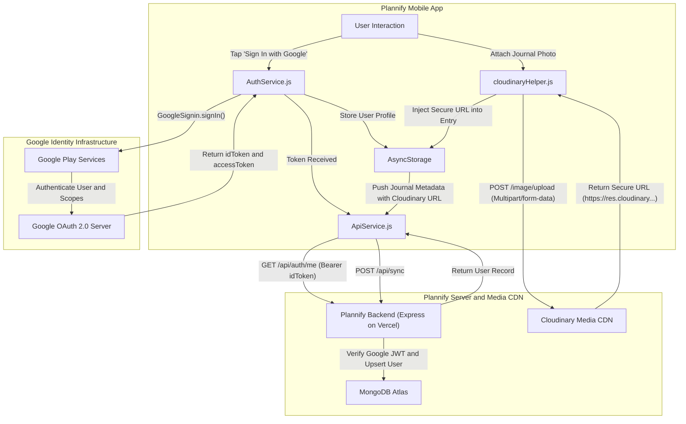
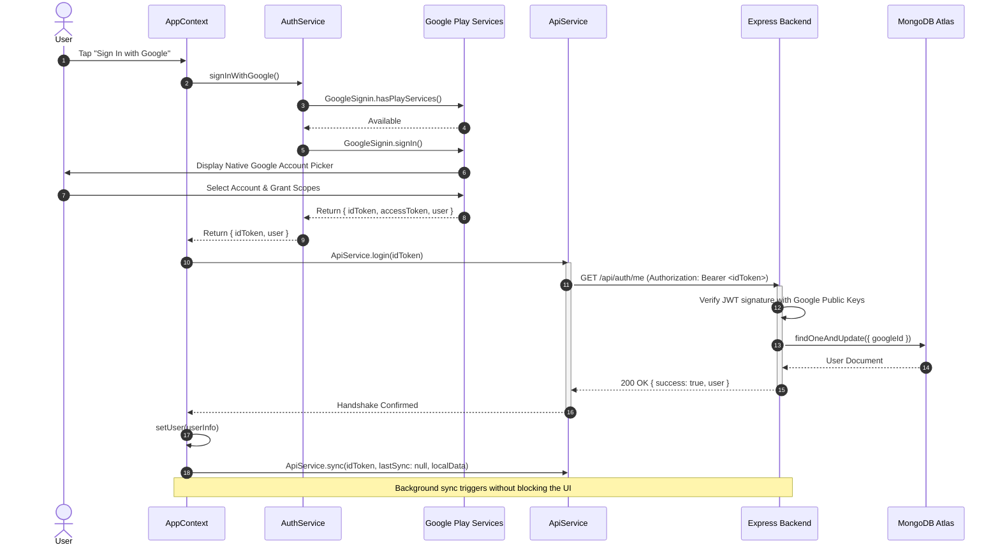

# Module 03: Authentication, Cloud Services & Backend API Integration

## 1. Module Overview & Architectural Role

The **Authentication, Cloud Services & Backend API Integration** module bridges the Plannify mobile client with identity providers, remote REST servers, and media delivery networks. Located within `src/services` and `src/utils`, this module is responsible for:
- **Identity & Authorization (`AuthService.js`)**: Managing Google OAuth 2.0 authentication via `@react-native-google-signin/google-signin`, maintaining the user's `idToken` (for Express backend validation) and `accessToken` (with `drive.appdata` scope for Google Drive integration), and executing silent token refreshes on app wake.
- **Backend API Communication (`ApiService.js`)**: Serving as the unified HTTP transport layer to the Plannify Express.js backend (deployed on Vercel), transmitting delta-based sync requests, session checks (`/auth/me`), cloud purge actions, and journal record removals.
- **Direct-to-Cloud Media Pipeline (`cloudinaryHelper.js`)**: Executing unsigned multipart uploads of camera photos and journal attachments directly to Cloudinary's media CDN, bypassing intermediate backend storage to optimize latency and server bandwidth.

### File Manifest
```
Plannify/src/
├── services/
│   ├── AuthService.js         # Google Sign-In, token acquisition, and silent refresh
│   └── ApiService.js          # REST client communicating with Plannify Express backend
└── utils/
    └── cloudinaryHelper.js    # Unsigned multipart media uploader for Cloudinary CDN
```

---

## 2. Frameworks & Libraries Used (With Architectural Justifications)

| Library / Framework | Version | Role in this Module | Rationale & Alternatives Considered |
|---|---|---|---|
| **@react-native-google-signin/google-signin** | `^16.1.1` | Native Google authentication | Wraps Google Play Services Auth on Android and GoogleSignIn SDK on iOS. Chosen over WebView-based OAuth or browser redirects because native Play Services provides one-tap sign-in, biometric confirmation, and direct credential caching without exposing web view vulnerabilities. |
| **Fetch API (Native)** | Built-in | HTTP network requests | Used in place of Axios to minimize bundle size. Standard `fetch` natively handles `FormData` streams in React Native 0.81, supports CORS headers, and requires zero external dependency management. |
| **Cloudinary REST API** | v1_1 | Cloud image hosting & transformation | Enables client-side unsigned uploads using upload presets (`plannify_journal`). Offloads image compression, resizing, and CDN asset distribution from the Node.js backend. |

---

## 3. Data Flow Diagram (DFD)

This diagram visualizes user credential authorization, token propagation to the backend, and direct image streaming to Cloudinary:



---

## 4. Sequence Diagram: Authentication & Initial Backend Handshake

This sequence shows the authentication lifecycle, from initiating the native Google prompt to verifying the cryptographic JWT on the backend and fetching initial data:



---

## 5. Component & Code Anatomy

### `src/services/AuthService.js`
- **Configuration (`configureGoogleSignIn`)**:
  - Initializes Google Sign-In with Web Client ID (`690723040085-...`).
  - Requests special scope `"https://www.googleapis.com/auth/drive.appdata"` to enable silent Google Drive AppData folder backup.
  - Enforces `offlineAccess: true` to ensure an OpenID Connect `idToken` is returned alongside the OAuth authorization grant.
- **Methods**:
  - `signInWithGoogle()`: Normalizes compatibility across different versions of the library by checking both `response.idToken` and `response.data?.idToken`. Intercepts `statusCodes.SIGN_IN_CANCELLED` and `statusCodes.IN_PROGRESS` gracefully.
  - `refreshGoogleToken()`: Calls `GoogleSignin.signInSilently()`. If a network interruption occurs (Play Services error code `7`), it skips gracefully rather than terminating the user session.
  - `getGoogleAccessToken()`: Queries active OAuth access tokens required by `DriveService` to upload raw archives.

### `src/services/ApiService.js`
- **API Endpoint Registry**:
  - `API_URL`: Configured to `https://plannify-red.vercel.app/api` (with local Android emulator override `http://10.0.2.2:5000/api` available for local debugging).
- **Core Endpoints**:
  - `login(googleIdToken)`: Sends `GET /auth/me` with `Authorization: Bearer <token>`. Confirms identity and creates user record on the server if first time.
  - `sync(googleIdToken, lastSyncTime, changes)`: Sends `POST /sync` with delta payloads. The server returns changes made by other devices since `lastSyncTime` and stores incoming changes.
  - `resetData(googleIdToken)`: Sends `DELETE /sync/reset` to purge all cloud records belonging to the authenticated account.
  - `deleteJournal(googleIdToken, journalId)`: Sends `DELETE /journal/:id`, triggering backend deletion of both database records and associated Cloudinary assets.

### `src/utils/cloudinaryHelper.js`
- **Upload Pipeline (`uploadToCloudinary`)**:
  - Inspects input URI: if already prefixed with `"http"`, skips upload immediately.
  - Extracts file extension from URI path to infer MIME type (`image/jpeg`, `image/png`, etc.).
  - Constructs `FormData` with fields:
    - `file`: `{ uri: localUri, type: mimeType, name: filename }`
    - `upload_preset`: `'plannify_journal'`
    - `folder`: `'journal'`
  - Sends multipart POST to `https://api.cloudinary.com/v1_1/dv5bf64yx/image/upload`.
  - Returns HTTPS CDN URL (`data.secure_url`).
- **Validation Guard (`isCloudinaryUrl`)**:
  - Checks if a string contains `'cloudinary.com'` or starts with `'https://res.cloudinary.com'`, preventing redundant uploads during sync cycles.

---

## 6. Data Schemas & State Specifications

### Google User Object Format (`user`)
```typescript
interface GoogleUserPayload {
  idToken: string;            // Cryptographic JWT signed by Google
  accessToken?: string;       // OAuth 2.0 token with drive.appdata scope
  user: {
    id: string;               // Unique Google ID (sub)
    name: string;             // Display Name (e.g., "Tejashvi")
    email: string;            // User email
    photo: string | null;     // Google profile avatar URL
    familyName: string;
    givenName: string;
  };
}
```

### Sync API Request Payload
```typescript
interface SyncRequestPayload {
  lastSync: number | null;    // Epoch millisecond timestamp of previous sync
  changes: {
    tasks?: { created: any[]; updated: any[]; deleted: string[] };
    habits?: { created: any[]; updated: any[]; deleted: string[] };
    budget?: { transactions: any[]; settings: any };
    attendance?: { subjects: any[]; logs: any[] };
    journal?: { entries: any[]; deleted: string[] };
  };
}
```

---

## 7. Algorithms & Core Logic

### 1. File Name and MIME-Type Extraction
To satisfy RFC 7578 multipart upload specifications across Android content URIs and iOS file paths, `cloudinaryHelper.js` implements regular expression matching:
```javascript
const filename = localUri.split('/').pop() || 'image.jpg';
const match = /\.(\w+)$/.exec(filename);
const type = match ? `image/${match[1]}` : 'image/jpeg';
```

### 2. Silent Token Refresh with Network Fallback
To ensure that mobile network dropouts do not invalidate the user's login state while offline, `refreshGoogleToken` isolates network error codes:
```javascript
try {
  await GoogleSignin.hasPlayServices();
  const userInfo = await GoogleSignin.signInSilently();
  return {
    idToken: userInfo.idToken || userInfo.data?.idToken,
    user: userInfo.user || userInfo.data?.user,
  };
} catch (error) {
  if (error.code === statusCodes.SIGN_IN_REQUIRED) {
    console.log("User must sign in explicitly");
  } else if (error.message?.includes('NETWORK_ERROR') || error.code === '7') {
    // Code 7: Network error in Google Play Services -> Preserve offline state
    console.log("Token refresh skipped: offline network state");
  }
  return null;
}
```

---

## 8. Edge Cases, Offline Mode & Error Handling

1. **Google Play Services Missing or Disabled**:
   - On Android devices running de-Googled ROMs or outdated Play Services, `signInWithGoogle` catches `statusCodes.PLAY_SERVICES_NOT_AVAILABLE` and raises a clean message rather than crashing native threads.
2. **Backend Outages & Offline Graceful Degradation**:
   - When the user signs in with Google, `AppContext.login()` attempts to reach `ApiService.login(idToken)`. If the backend is unreachable (e.g. 503 error, DNS failure, or lack of internet), it catches the exception and logs: `"Backend login failed (Offline mode active)"`. The app still sets the local user state, allowing full offline functionality.
3. **Preventing Re-uploading CDN Images**:
   - Images in journal entries or social posts are passed through `isCloudinaryUrl()`. If an image was already synced or imported from cloud backup, the upload is bypassed, saving mobile data.
4. **Offline Variant Enforcement**:
   - In `IS_OFFLINE_BUILD`, Google sign-in configuration and network calls in `ApiService` are disabled, guaranteeing 100% network isolation for offline-only app distributions.
