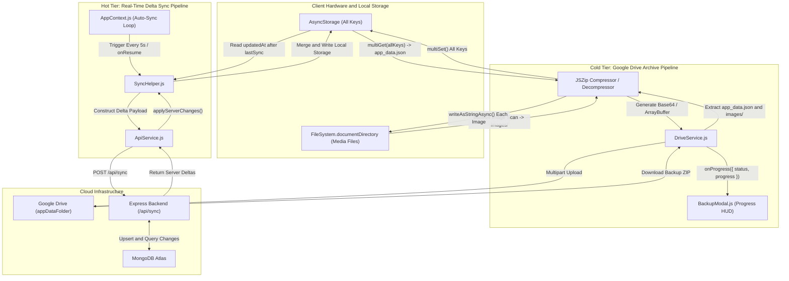
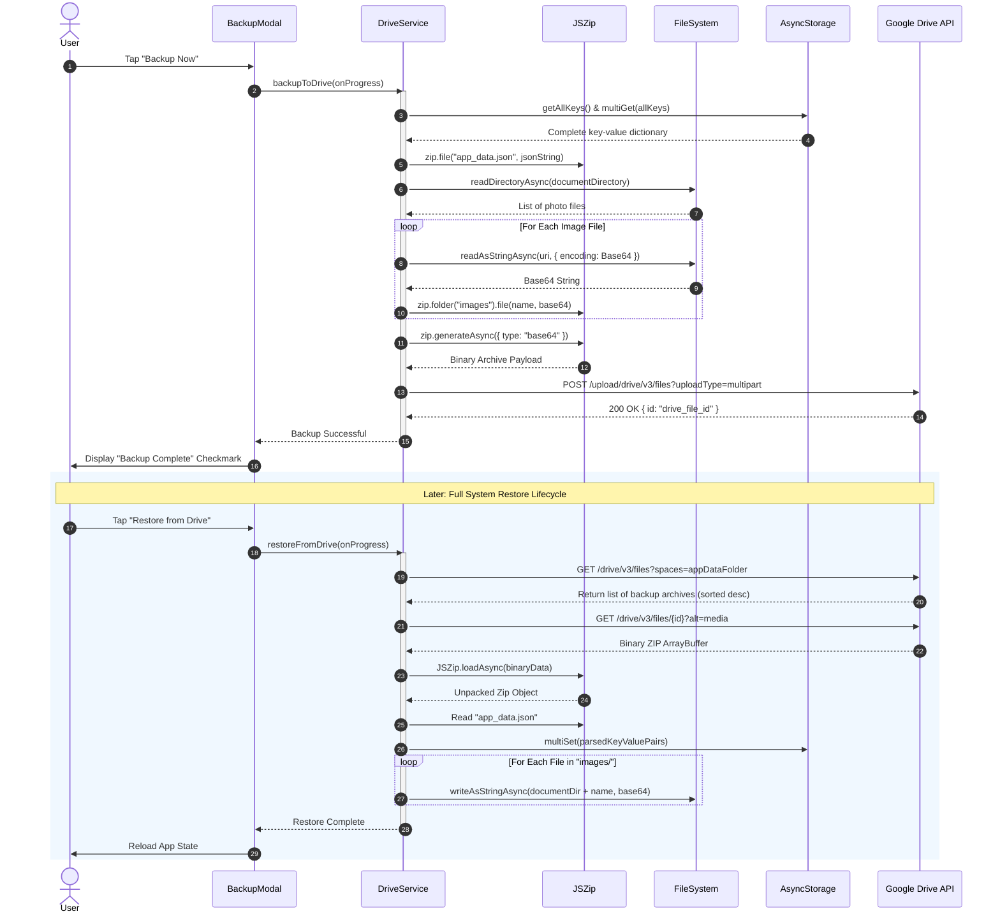

# Module 04: Google Drive Cloud Backup & Real-Time Sync Engine

## 1. Module Overview & Architectural Role

The **Google Drive Cloud Backup & Real-Time Sync Engine** module forms Plannify's dual-tier data preservation and synchronization backbone. Situated within `src/services`, `src/utils`, and `src/components`, this module is responsible for:
- **Comprehensive Cold Backup to Google Drive (`DriveService.js`)**: Bundling the entire local `AsyncStorage` database along with all device-stored media files (journal photos, avatars, and attachments) into a compressed `.zip` archive using `JSZip`, and transmitting it directly to the user's hidden Google Drive `appDataFolder` using the Google Drive REST API v3.
- **Full Database Restoration (`DriveService.js` & `BackupModal.js`)**: Retrieving, decompressing, and atomic-rebuilding local storage keys and local filesystem media directories from Google Drive backup archives.
- **Delta-Based Real-Time Synchronization (`SyncHelper.js`)**: Tracking granular modification timestamps (`updatedAt > lastSyncTime`) across 10 collections (tasks, habits, journal, attendance, budget settings, transactions, timetable, gamification, and split funds), sending delta pushes to the Express/MongoDB backend, and applying Last-Write-Wins (LWW) conflict resolution for incoming server records.

### File Manifest
```
Plannify/src/
├── services/
│   └── DriveService.js         # JSZip archive builder & Google Drive REST API client
├── utils/
│   └── SyncHelper.js           # Delta collector, collection mapper, and conflict resolver
└── components/
    └── BackupModal.js          # Interactive progress modal for Drive backup and restore
```

---

## 2. Frameworks & Libraries Used (With Architectural Justifications)

| Library / Framework | Version | Role in this Module | Rationale & Alternatives Considered |
|---|---|---|---|
| **jszip** | `^3.10.1` | In-memory archive creation & extraction | Pure JavaScript compression engine capable of running inside React Native Hermes without native C++ compilation issues. Replaced native zip libraries that frequently break between Android NDK versions. |
| **expo-file-system/legacy** | `~19.0.21` | Base64 file I/O & document directory scanning | Provides high-speed asynchronous filesystem inspection (`readAsStringAsync`, `writeAsStringAsync`, `readDirectoryAsync`) necessary to read and reconstruct binary image assets across app installs. |
| **Google Drive REST API v3** | REST Endpoint | Cloud storage target | Uses Google's standard `appDataFolder` space. Backups are stored in a dedicated, hidden app-specific sandbox in the user's own Google account, respecting user data privacy without incurring third-party server hosting costs. |
| **AsyncStorage (MultiGet / MultiSet)** | `2.2.0` | Batch database snapshotting | Utilizes `multiGet(allKeys)` and `multiSet(keyValuePairs)` to snapshot and restore the entire client datastore in single transactional native operations. |

---

## 3. Data Flow Diagram (DFD)

This diagram visualizes the dual pathways: (1) Cold full-system archive creation and extraction with Google Drive, and (2) Hot delta synchronization with the Express backend:



---

## 4. Sequence Diagram: Google Drive Backup & Restoration

This sequence portrays the full cold backup lifecycle followed by the archive restoration flow:



---

## 5. Component & Code Anatomy

### `src/services/DriveService.js`
- **Authentication Handshake (`getAccessToken`)**:
  - Queries `GoogleSignin.getTokens()` to obtain a fresh OAuth2 `accessToken` with `drive.appdata` authorization.
- **Backup Pipeline (`backupToDrive`)**:
  1. Serializes all `AsyncStorage` key-values into `app_data.json` inside the ZIP.
  2. Traverses `journal_data` records and executes a directory scan of `FileSystem.documentDirectory` to identify local photos, converting each into base64 and nesting under `/images`.
  3. Formulates a boundary-delimited multipart body containing file metadata (`name: "plannify_backup_<timestamp>.zip"`, `parents: ["appDataFolder"]`) and the binary content.
  4. Posts to `https://www.googleapis.com/upload/drive/v3/files?uploadType=multipart`.
- **Restore Pipeline (`restoreFromDrive`)**:
  1. Locates existing backups by querying `https://www.googleapis.com/drive/v3/files?spaces=appDataFolder&orderBy=createdTime desc`.
  2. Downloads the latest file binary as an `ArrayBuffer`.
  3. Unzips `app_data.json` and writes every key back to `AsyncStorage`.
  4. Iterates through the `/images` directory inside the ZIP, decoding each base64 entry into `FileSystem.documentDirectory + filename`.

### `src/utils/SyncHelper.js`
- **Collection Key Mapping (`COLLECTIONS`)**:
  - Associates MongoDB backend keys with `AsyncStorage` local storage keys:
    ```javascript
    const COLLECTIONS = {
      tasks: 'tasks',
      habits: 'habits_data',
      journal: 'journal_data',
      subjects: 'att_subjects',
      timetable: 'att_schedule',
      bucketList: 'bucket_list',
      gamification: 'user_gamification',
      budget: 'budget_data',
      splitGroups: 'splitfund_groups',
      splitExpenses: 'splitfund_expenses'
    };
    ```
- **Delta Extraction (`getChanges`)**:
  - Gated by `isPremium`. Free users bypass cloud upload.
  - Compares item `updatedAt` against `lastSyncTime`. If greater (or if timestamp is absent on newly created entities), the item is flagged for server synchronization.
  - **Special Case Merging**: Budget settings are decoupled from transactions so that currency and category changes sync without clobbering ledger records.
- **Server Delta Ingestion (`applyServerChanges`)**:
  - Handles array collections using Last-Write-Wins (LWW) resolution based on `_id` matching.
  - Handles dictionary structures (`timetable` and `budget_data`) through deep property merging:
    ```javascript
    const newBudget = {
      ...currentBudget,
      currency: latest.currency || currentBudget.currency,
      totalBudget: latest.totalBudget ?? currentBudget.totalBudget,
      categories: latest.categories || currentBudget.categories,
      transactions: currentBudget.transactions || [], // Preserves local ledger!
      updatedAt: latest.updatedAt || new Date()
    };
    ```

### `src/components/BackupModal.js`
- **Progress Tracking State Machine**:
  - Tracks `progress` float ($0.0 \to 1.0$) and `statusText` string updates passed via callback.
  - Prevents accidental dismissal during active uploads by disabling backdrop press handlers while `loading === true`.

---

## 6. Data Schemas & State Specifications

### Google Drive Multipart Payload Structure
```http
POST /upload/drive/v3/files?uploadType=multipart HTTP/1.1
Host: www.googleapis.com
Authorization: Bearer ya29.a0AfH6...
Content-Type: multipart/related; boundary=foo_bar_baz

--foo_bar_baz
Content-Type: application/json; charset=UTF-8

{
  "name": "plannify_backup_1726300000000.zip",
  "parents": ["appDataFolder"],
  "description": "Full Plannify Database and Media Archive"
}

--foo_bar_baz
Content-Type: application/zip
Content-Transfer-Encoding: base64

UEsDBBQAAAAIAExs...
--foo_bar_baz--
```

### In-Memory ZIP File System Structure
```
plannify_backup.zip
├── app_data.json            # Complete JSON string map of all AsyncStorage keys
└── images/                  # Binary image assets
    ├── journal_1726201.jpg
    ├── journal_1726202.png
    └── avatar_profile.jpg
```

---

## 7. Algorithms & Core Logic

### 1. Array-Based Last-Write-Wins (LWW) Entity Merging
When server items are received, `SyncHelper` merges them with local arrays by comparing unique keys (`_id` or `id`) and timestamps:
```javascript
const mergeArrayData = (localArray = [], serverArray = []) => {
  const mergedMap = new Map();
  // 1. Seed with local records
  localArray.forEach(item => {
    const key = item._id || item.id;
    if (key) mergedMap.set(key, item);
  });
  // 2. Overwrite with server records if newer or absent
  serverArray.forEach(serverItem => {
    const key = serverItem._id || serverItem.id;
    if (!key) return;
    const localItem = mergedMap.get(key);
    if (!localItem) {
      mergedMap.set(key, serverItem);
    } else {
      const localTime = new Date(localItem.updatedAt || 0).getTime();
      const serverTime = new Date(serverItem.updatedAt || 0).getTime();
      if (serverTime >= localTime) {
        mergedMap.set(key, serverItem);
      }
    }
  });
  return Array.from(mergedMap.values());
};
```

### 2. Timetable Day-by-Day Merge Strategy
Rather than discarding the entire local timetable schedule on conflict, `SyncHelper` merges schedule entries by day key:
```javascript
const mergedSchedule = { ...localSchedule };
for (const [day, classes] of Object.entries(serverSchedule)) {
  mergedSchedule[day] = classes; // Server version overrides by specific day
}
```

---

## 8. Edge Cases, Offline Mode & Error Handling

1. **Large Media Archives & Memory Constraints**:
   - `DriveService` avoids holding duplicate binary blobs in memory by using streaming chunks and base64 string pointers.
2. **Offline Drive Access**:
   - If Google Drive is unreachable during backup or restore, `DriveService` throws a typed exception that `BackupModal` catches, displaying a friendly retry prompt instead of leaving the progress modal stuck.
3. **Budget Transaction Collision Avoidance**:
   - Because budget transactions can be created rapidly offline, `SyncHelper` strictly isolates transaction records from general budget settings (`currency`, `totalBudget`), preventing simultaneous expense logging from overwriting category configurations.
4. **Duplicate Image Skipping**:
   - A `Set()` of file names (`includedFileNames`) is maintained during image scanning, preventing the same photo from being archived multiple times if referenced in both journal entries and document directories.
