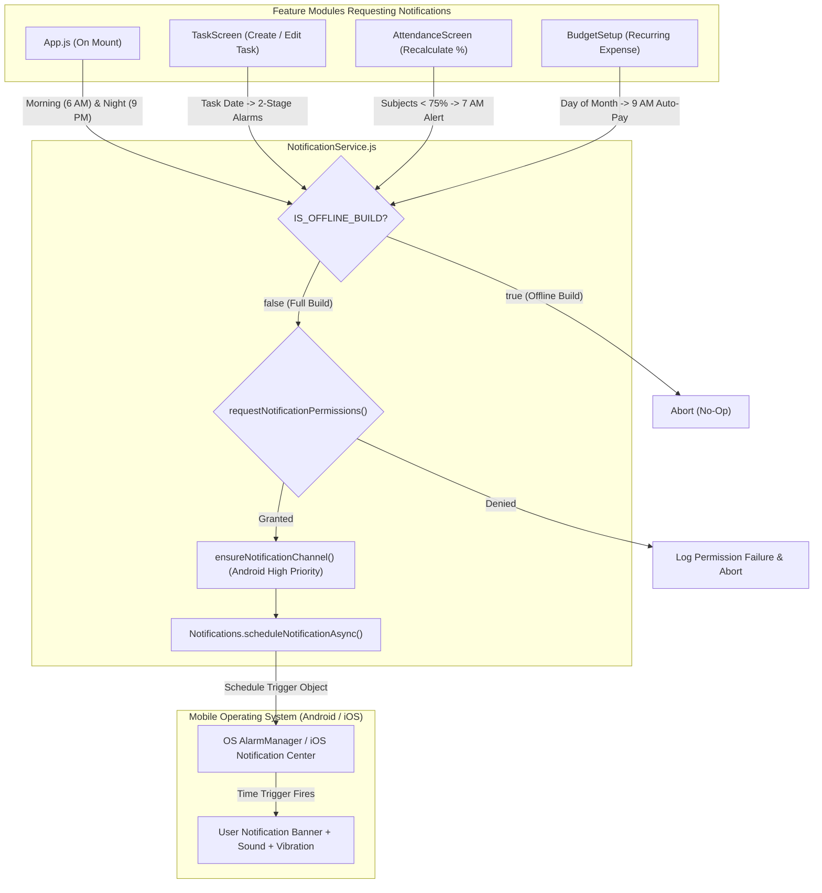
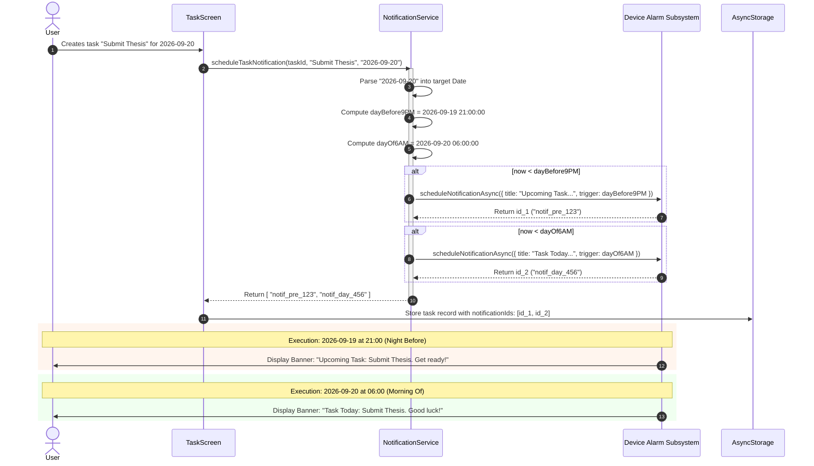

# Module 05: Push & Local Notification Scheduling Engine

## 1. Module Overview & Architectural Role

The **Push & Local Notification Scheduling Engine** module powers user engagement, streak preservation, class attendance warnings, and task deadline reminders across the Plannify application. Located in `src/services/NotificationService.js`, this module is responsible for:
- **Foreground Notification Presentation**: Intercepting arriving notifications while the app is active and dictating presentation behavior (sound, alert dialog, badge).
- **Android Notification Channels**: Registering high-importance notification channels with hardware vibration patterns and custom LED light colors (`#FF231F7C`).
- **Recurring Circadian Habit Reminders**: Scheduling automated local alarms for the morning kick-off (`6:00 AM daily`) and evening wrap-up (`9:00 PM daily`).
- **Academic Attendance Protection Alarms**: Scheduling proactive alerts at `7:00 AM daily` when any enrolled subject falls below the required threshold (e.g., 75%).
- **Two-Stage Task Deadline Engine**: Automatically generating two distinct calendar-anchored notifications for each scheduled task: (1) An evening preparatory notice the day before at 9:00 PM, and (2) An execution alert on the day of the task at 6:00 AM.
- **Monthly Auto-Pay Bill Alerts**: Setting recurring monthly calendar triggers for recurring budget debits at 9:00 AM on the specified day of the month.
- **Offline Build Isolation**: Immediately neutralizing all notification APIs when running under `IS_OFFLINE_BUILD` to maintain sandbox compliance.

### File Manifest
```
Plannify/src/
└── services/
    └── NotificationService.js   # Local notification triggers, channels, and schedulers
```

---

## 2. Frameworks & Libraries Used (With Architectural Justifications)

| Library / Framework | Version | Role in this Module | Rationale & Alternatives Considered |
|---|---|---|---|
| **expo-notifications** | `~0.32.16` | Cross-platform notification orchestration | Chosen over bare `react-native-push-notification` or raw Firebase Cloud Messaging (FCM) because it provides unified cross-platform local scheduling (exact date, daily repeating, and calendar triggers) with zero native Java/Kotlin code required. |
| **Platform (React Native)** | `0.81.5` | Operating system condition branching | Distinguishes between Android (which requires Android 8.0+ notification channels) and iOS (which relies purely on UNUserNotificationCenter permissions). |

---

## 3. Data Flow Diagram (DFD)

This diagram details the scheduling pipeline, permission verification gate, and channel routing logic:



---

## 4. Sequence Diagram: Two-Stage Task Reminder Lifecycle

This sequence demonstrates the two-stage scheduling algorithm executed whenever a user assigns a date to a task:



---

## 5. Component & Code Anatomy

### Foreground Notification Behavior
```javascript
if (!IS_OFFLINE_BUILD) {
  Notifications.setNotificationHandler({
    handleNotification: async () => ({
      shouldShowAlert: true,   // Display banner while user is inside Plannify
      shouldPlaySound: true,   // Play hardware ringtone
      shouldSetBadge: false,   // Do not modify app icon badge count
    }),
  });
}
```

### Channel Management (`ensureNotificationChannel`)
- On Android, notifications without an assigned channel are discarded on API level 26 (Android 8.0)+.
- Registers channel `'default'` with `AndroidImportance.HIGH`, custom vibration pulses `[0, 250, 250, 250]`, and LED indicator tint `#FF231F7C`.

### Circadian Alarms
- **`scheduleDailyMorningReminder()`**:
  - Uses static ID `"morning-reminder-id"`.
  - First calls `cancelScheduledNotificationAsync(MORNING_ID)` to guarantee idempotency and avoid duplicate daily alarms.
  - Registers recurring trigger at `hour: 6, minute: 0, repeats: true`.
- **`scheduleNightlyReminder()`**:
  - Uses static ID `"night-reminder-recurring-id"`.
  - Registers recurring trigger at `hour: 21, minute: 0, repeats: true`.

### Contextual Alarms
- **`scheduleLowAttendanceReminder(lowSubjects)`**:
  - Scans user subjects; if any subject has an attendance percentage below target, registers a recurring 7:00 AM daily alert listing delinquent subjects.
  - If all subjects meet or exceed target, automatically cancels the recurring ID `"low-attendance-recurring-id"`.
- **`scheduleAutoPayNotification(title, amount, day, currency)`**:
  - Uses `Notifications.SchedulableTriggerInputTypes.CALENDAR`.
  - Triggers on day $D$ of every month at 9:00 AM, alerting users before recurring expenses or subscription fees are debited.

---

## 6. Data Schemas & State Specifications

### Task Notification State Array
```typescript
interface TaskNotificationMetadata {
  taskId: string;                 // Unique task ID
  notificationIds: string[];      // Array of active Expo notification identifiers (e.g. ["uuid-1", "uuid-2"])
}
```

### Notification Trigger Payload Schemas
```typescript
// Calendar Daily Recurring Trigger
interface DailyReminderTrigger {
  hour: number;                   // 0-23
  minute: number;                 // 0-59
  repeats: true;
}

// Monthly Day Trigger
interface MonthlyCalendarTrigger {
  type: "calendar";
  day: number;                    // 1-31
  hour: number;                   // 9
  minute: number;                 // 0
  repeats: true;
  channelId: "default";
}

// Exact Date Trigger
interface ExactDateTrigger {
  type: "date";
  date: Date;                     // JavaScript Date object
  channelId: "default";
}
```

---

## 7. Algorithms & Core Logic

### 1. Two-Stage Date Decomposition Algorithm
To guarantee that reminders fire relative to local device time without timezone drift, `scheduleTaskNotification` parses the date string into calendar parts before setting alert thresholds:
```javascript
let targetDate = new Date(taskDate);
if (typeof taskDate === 'string') {
  const [year, month, day] = taskDate.split('-').map(Number);
  // Month is 0-indexed in JavaScript Date constructor
  targetDate = new Date(year, month - 1, day);
}

// 1. Day Before at 9:00 PM (21:00)
const dayBefore9PM = new Date(targetDate);
dayBefore9PM.setDate(dayBefore9PM.getDate() - 1);
dayBefore9PM.setHours(21, 0, 0, 0);

// 2. Day Of at 6:00 AM (06:00)
const dayOf6AM = new Date(targetDate);
dayOf6AM.setHours(6, 0, 0, 0);
```

### 2. Time-Guard Verification
Before registering notifications with the operating system, the current time is evaluated against target timestamps:
```javascript
const now = new Date();
if (now < dayBefore9PM) {
  // Safe to schedule preparatory alert
}
if (now < dayOf6AM) {
  // Safe to schedule day-of alert
}
```
This ensures that tasks created for the current day after 6:00 AM do not schedule past timestamps, which would cause an instant and confusing alert burst.

---

## 8. Edge Cases, Offline Mode & Error Handling

1. **System Reboots & Alarm Retention**:
   - Expo Notifications handles native `RECEIVE_BOOT_COMPLETED` intents on Android, re-registering active notification triggers automatically across phone reboots.
2. **Task Deletion Cleanup**:
   - When a task is removed or marked completed in `TaskScreen`, `cancelTaskNotifications(task.notificationIds)` is called, preventing orphaned reminders for completed items.
3. **Invalid Date Inputs**:
   - If a corrupted string is passed into `scheduleTaskNotification`, `isNaN(targetDate.getTime())` catches the condition, logs an error, and returns an empty array `[]` so that task creation is not blocked.
4. **Zero-Permission Graceful Degradation**:
   - If the user denies notification permissions, `requestNotificationPermissions()` returns `false`, causing all scheduling functions to exit cleanly without runtime exceptions.
