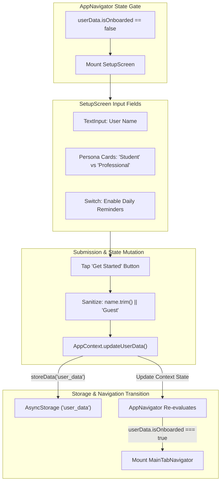
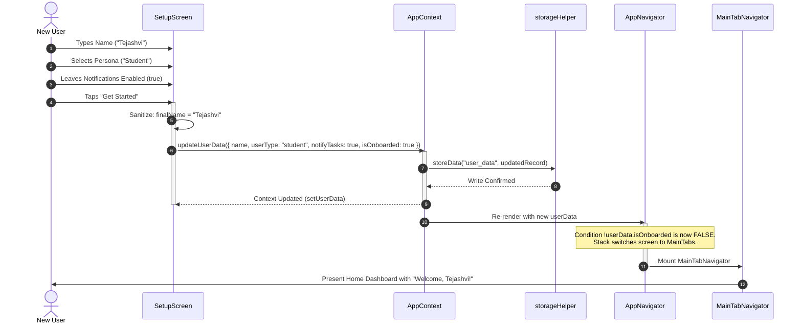

# Module 06: User Onboarding & Profile Setup

## 1. Module Overview & Architectural Role

The **User Onboarding & Profile Setup** module is the gateway to the Plannify application for first-time installations. Located in `src/screens/Onboarding/SetupScreen.js`, this module is responsible for:
- **First-Time Experience (FTUE) Orchestration**: Intercepting uninitialized app launches and preventing access to main application tabs until core user attributes are defined.
- **Identity Personalization**: Capturing the user's preferred display name, defaulting to `"Guest"` if left blank.
- **Role/Persona Classification**: Classifying the user as either a **Student** or a **Professional**, establishing downstream defaults for modules such as the Attendance Tracker and SplitFund.
- **Notification Opt-In Gate**: Requesting upfront user preference for daily circadian task and habit reminders (conditionally rendered via `FEATURES.NOTIFICATIONS`).
- **Atomic Onboarding State Commitment**: Dispatching `updateUserData({ name, userType, notifyTasks, isOnboarded: true })` via `AppContext`, triggering an instant reactive transition in `AppNavigator.js` from the onboarding stack to `MainTabNavigator`.

### File Manifest
```
Plannify/src/
└── screens/
    └── Onboarding/
        └── SetupScreen.js       # First-run onboarding screen & profile builder
```

---

## 2. Frameworks & Libraries Used (With Architectural Justifications)

| Library / Framework | Version | Role in this Module | Rationale & Alternatives Considered |
|---|---|---|---|
| **react-native-safe-area-context** | `~5.6.0` | Viewport boundary containment | Ensures input fields, banners, and call-to-action buttons render safely below status bar cutouts and notches across heterogeneous Android devices. |
| **KeyboardAvoidingView (React Native)** | Built-in | Dynamic keyboard offset | Automatically offsets input fields when the software keyboard appears. Configured dynamically with `behavior={Platform.OS === 'ios' ? 'padding' : 'height'}` to prevent input occlusion. |
| **@expo/vector-icons (MaterialCommunityIcons)** | `^15.0.3` | Semantic icon illustration | Provides lightweight vector glyphs (`hand-wave`, `school-outline`, `briefcase-outline`, `arrow-right`) without embedding heavy static PNGs. |
| **ScrollView (React Native)** | Built-in | Compact viewport adaptivity | Ensures that smaller phone screens or users with large accessibility font settings can scroll comfortably through onboarding choices. |

---

## 3. Data Flow Diagram (DFD)

This diagram portrays the progression from launch detection to persistent profile commit and navigation release:



---

## 4. Sequence Diagram: Onboarding Completion

This sequence details the synchronous and asynchronous steps occurring during the onboarding transition:



---

## 5. Component & Code Anatomy

### Dynamic Palette Integration
`SetupScreen` derives all borders, backgrounds, and text tints dynamically from `AppContext`:
```javascript
const { updateUserData, colors, theme } = useContext(AppContext);

const dynamicStyles = {
  container: { backgroundColor: colors.background },
  textPrimary: { color: colors.textPrimary },
  textSecondary: { color: colors.textSecondary },
  input: {
    backgroundColor: colors.surface,
    color: colors.textPrimary,
    borderColor: colors.border,
  },
  cardActive: {
    backgroundColor: colors.surfaceHighlight,
    borderColor: colors.primary,
    shadowColor: colors.primary,
  },
  button: { backgroundColor: colors.primary },
};
```

### Persona Card Selection
- Implemented as interactive `TouchableOpacity` cards.
- Selection is tracked in local React state (`const [role, setRole] = useState("student")`).
- The active card displays a highlighted border, emerald background tint (`colors.surfaceHighlight`), and primary accent icon tint.

### Notification Gate
```javascript
{FEATURES.NOTIFICATIONS && (
  <View style={styles.section}>
    <View style={[styles.toggleContainer, { backgroundColor: colors.surface }]}>
      <View style={{ flex: 1 }}>
        <Text style={[styles.toggleLabel, dynamicStyles.textPrimary]}>
          Enable Daily Reminders
        </Text>
        <Text style={[styles.toggleSub, dynamicStyles.textSecondary]}>
          Get notified about tasks & habits.
        </Text>
      </View>
      <Switch
        trackColor={{ false: colors.border, true: colors.primary }}
        thumbColor={colors.white}
        onValueChange={() => setNotify(!notify)}
        value={notify}
      />
    </View>
  </View>
)}
```
When compiled under the offline build profile (`APP_VARIANT=offline`), `FEATURES.NOTIFICATIONS` evaluates to `false`, omitting the permission prompt entirely.

---

## 6. Data Schemas & State Specifications

### Onboarding Submission Payload
```typescript
interface OnboardingSubmission {
  name: string;                   // User name (e.g. "Tejashvi") or fallback "Guest"
  userType: "student" | "job";    // Persona classification
  notifyTasks: boolean;           // Preference flag for local task alarms
  isOnboarded: true;              // Terminal flag unlocking MainTabs
}
```

---

## 7. Algorithms & Core Logic

### 1. Name Sanitization & Fallback Logic
To avoid empty labels across dashboards and greeting banners, input strings are trimmed and normalized:
```javascript
const handleFinish = () => {
  const finalName = name.trim().length > 0 ? name.trim() : "Guest";
  updateUserData({
    name: finalName,
    userType: role,
    notifyTasks: notify,
    isOnboarded: true,
  });
};
```

### 2. Zero-Lag Conditional Root Transition
Rather than calling `navigation.navigate('MainTabs')`—which would keep the onboarding screen in the back-stack history—`AppNavigator.js` reacts directly to state:
```javascript
<Stack.Navigator screenOptions={{ headerShown: false, animation: "fade" }}>
  {!userData.isOnboarded ? (
    <Stack.Screen name="Setup" component={SetupScreen} />
  ) : (
    <Stack.Screen name="MainTabs" component={MainTabNavigator} />
  )}
</Stack.Navigator>
```
Because the component unmounts from the stack, pressing the Android hardware back button from the dashboard cannot return the user to the onboarding screen.

---

## 8. Edge Cases, Offline Mode & Error Handling

1. **App Termination Mid-Onboarding**:
   - If the user quits the app before tapping "Get Started", `isOnboarded` remains `false`. Upon relaunch, `AppNavigator` safely redirects back to `SetupScreen`.
2. **Whitespace-Only Name Submission**:
   - If a user inputs space characters (`"   "`), `.trim()` collapses the string to empty length, causing `finalName` to fall back to `"Guest"`.
3. **Subsequent Google Sign-In Name Merge**:
   - If the user completed onboarding as `"Guest"` and later connects a Google account via `SideMenu`, `AppContext.login()` detects the `"Guest"` placeholder and automatically updates the profile name and avatar from Google OAuth metadata (`userInfo.user.name`, `userInfo.user.photo`).
