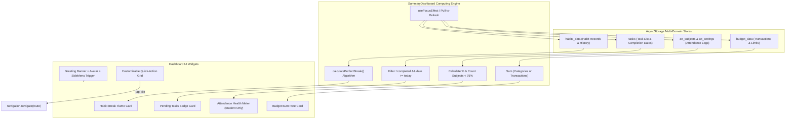
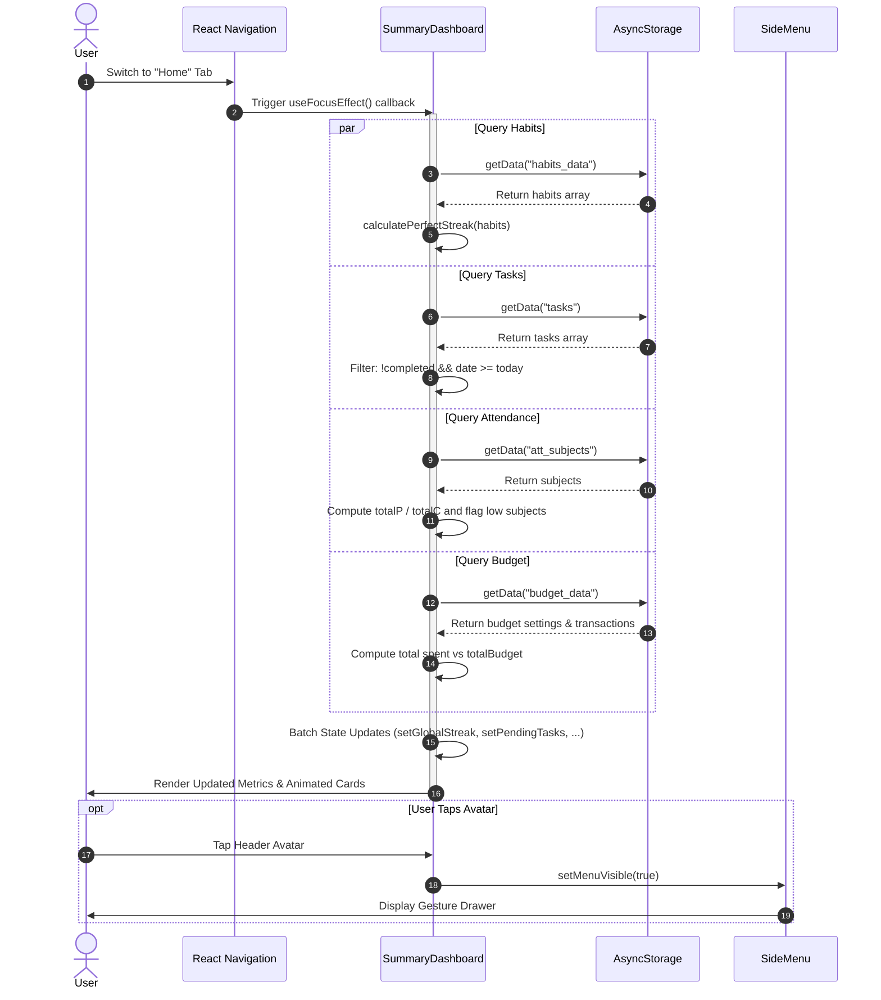

# Module 07: Home Summary Dashboard

## 1. Module Overview & Architectural Role

The **Home Summary Dashboard** module is the central operational command deck of Plannify. Located in `src/screens/Home/SummaryDashboard.js`, this module acts as a real-time aggregator that synthesizes data across all independent tracker modules into an actionable morning-to-night briefing:
- **Unified Health & Progress Metrics**: Consolidating the user's perfect habit streak counter, outstanding task count, academic attendance standing, and budget burn rate.
- **Dynamic Shortcut Grid**: Providing customizable quick-action tiles for fast navigation into frequently visited modules (Journal, Bucket List, SplitFund, etc.), with personalization persisted locally.
- **Role-Aware Widget Rendering**: Conditionally displaying academic metrics (Attendance Average, Bunk Warnings) if the user persona is configured as `"student"` in `AppContext.userData`.
- **Reactive Focus Loading**: Hooking into React Navigation's `useFocusEffect` to recalculate aggregates instantly whenever the user returns from any sub-screen.

### File Manifest
```
Plannify/src/
└── screens/
    └── Home/
        └── SummaryDashboard.js  # Aggregator dashboard, metric widgets, and quick shortcuts
```

---

## 2. Frameworks & Libraries Used (With Architectural Justifications)

| Library / Framework | Version | Role in this Module | Rationale & Alternatives Considered |
|---|---|---|---|
| **@react-navigation/native (useFocusEffect)** | `^7.1.8` | Screen focus lifecycle hooks | Critical for re-querying `AsyncStorage` whenever the user navigates back to the Dashboard tab, ensuring metrics update without requiring full app reloads. |
| **react-native-modal** | `^14.0.0-rc.1` | Shortcut customization bottom sheet | Powers the "Edit Shortcuts" dialog, allowing users to toggle dashboard widgets with backdrop blur and swipe-to-dismiss capabilities. |
| **LayoutAnimation (React Native)** | Built-in | Spring-loaded card re-layout | Drives smooth transitions when shortcuts are toggled on/off, animating adjacent grid cells naturally without the overhead of heavy animation frameworks. |
| **RefreshControl (React Native)** | Built-in | Pull-to-refresh data sync | Provides native bounce pull-to-refresh that triggers both local storage reload and background cloud sync. |

---

## 3. Data Flow Diagram (DFD)

This diagram portrays how `SummaryDashboard` queries multiple storage namespaces, calculates aggregates, and renders responsive widgets:



---

## 4. Sequence Diagram: Dashboard Metric Aggregation

This sequence outlines the data gathering cycle that executes on screen focus:



---

## 5. Component & Code Anatomy

### Feature Shortcut Registry (`ALL_FEATURES`)
Exposes all potential navigation shortcuts that can be pinned to the dashboard:
```javascript
const ALL_FEATURES = [
  { id: "journal", name: "Journal", icon: "notebook-outline", route: "Journal" },
  { id: "bucket", name: "Bucket List", icon: "star-four-points-outline", route: "BucketList" },
  { id: "habits", name: "Habits", icon: "fire", route: "Habits" },
  { id: "tasks", name: "Tasks", icon: "checkbox-marked-circle-outline", route: "Tasks" },
  { id: "budget", name: "Budget", icon: "wallet-outline", route: "BudgetTab" },
  { id: "attendance", name: "Attendance", icon: "school-outline", route: "Attendance", studentOnly: true },
  { id: "social", name: "Social", icon: "account-group-outline", route: "Social" },
  { id: "splitfund", name: "Split Fund", icon: "account-cash-outline", route: "SplitFund" },
];
```

### Role & Premium Filtering
Shortcuts are filtered at render time according to the user's persona and premium status:
```javascript
const activeFeatures = ALL_FEATURES.filter((f) => {
  if (!activeShortcutIds.includes(f.id)) return false;
  if (f.studentOnly && userData.userType !== "student") return false;
  if (f.id === 'social' && !isPremium) return false;
  return true;
});
```

---

## 6. Data Schemas & State Specifications

### Dashboard State Interface
```typescript
interface DashboardState {
  globalStreak: number;           // Consecutive unbroken days across all habits
  pendingTasks: number;           // Uncompleted tasks scheduled for today or future
  attendanceAvg: number | null;   // Cumulative attendance % (null if no subjects)
  lowAttendanceCount: number;     // Number of subjects falling below target %
  budgetStatus: {
    spent: number;                // Aggregated expenditures in current month
    limit: number;                // Total budget allocation
    currency: string;             // Currency symbol ("$", "₹", "€")
  };
  activeShortcutIds: string[];    // Pinned shortcut IDs (e.g. ["journal", "bucket"])
}
```

---

## 7. Algorithms & Core Logic

### 1. Perfect Global Habit Streak Algorithm
Plannify defines a "Perfect Streak" as unbroken consecutive calendar days where **every active habit** was completed:
```javascript
const calculatePerfectStreak = (habits) => {
  if (!habits || habits.length === 0) return 0;
  let streak = 0;
  let d = new Date();
  
  // Step 1: Check Today
  const todayStr = getLocalDateString(d);
  const allDoneToday = habits.every((h) => h.history && h.history[todayStr]);
  if (allDoneToday) streak++;
  
  // Step 2: Traverse Backward Day by Day
  d.setDate(d.getDate() - 1);
  while (true) {
    const dateStr = getLocalDateString(d);
    const allDone = habits.every((h) => h.history && h.history[dateStr]);
    if (allDone) {
      streak++;
      d.setDate(d.getDate() - 1);
    } else {
      break; // Unbroken streak ends
    }
  }
  return streak;
};
```

### 2. Weighted Attendance Calculation & Alert Aggregation
$$\text{Attendance Average} = \left( \frac{\sum P_{\text{all}}}{\sum C_{\text{all}}} \right) \times 100$$
Where $P$ represents classes attended and $C$ represents total classes conducted. Concurrently, individual subjects are evaluated against the target threshold:
$$\text{isLow} = \left( \frac{P_{\text{subject}}}{C_{\text{subject}}} \times 100 \right) < \text{minAttendance}$$

---

## 8. Edge Cases, Offline Mode & Error Handling

1. **Zero State Handling**:
   - If a new user has not created any habits, tasks, or subjects, widgets display informative empty states (e.g., `"No tasks for today"`, `"No attendance tracked"`) rather than showing `NaN%` or dividing by zero.
2. **Date Timezone Shift Guard**:
   - Date comparison relies on `getLocalDateString()` and `getLocalToday()`, which extract local device year, month, and day components, avoiding UTC midnight rollovers that cause inaccurate day counts.
3. **Pull-to-Refresh Sync Coordination**:
   - Pulling the list calls `loadSummaries()` and `syncNow()` simultaneously, ensuring both local state calculations and cloud deltas refresh in unison.
