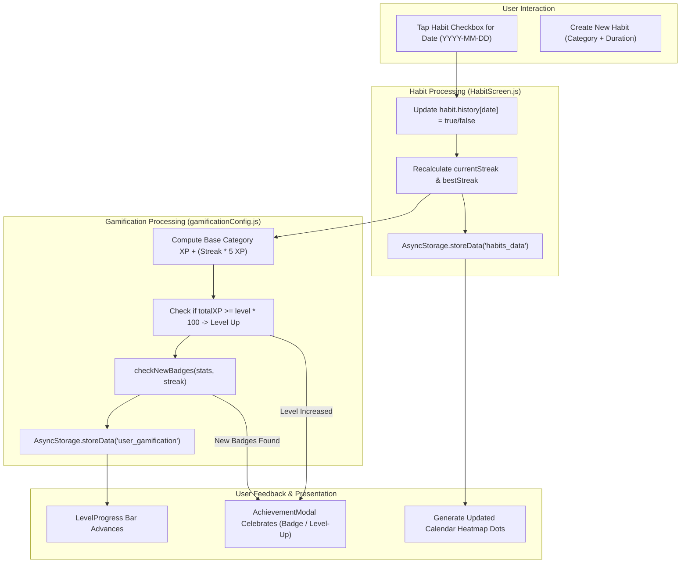
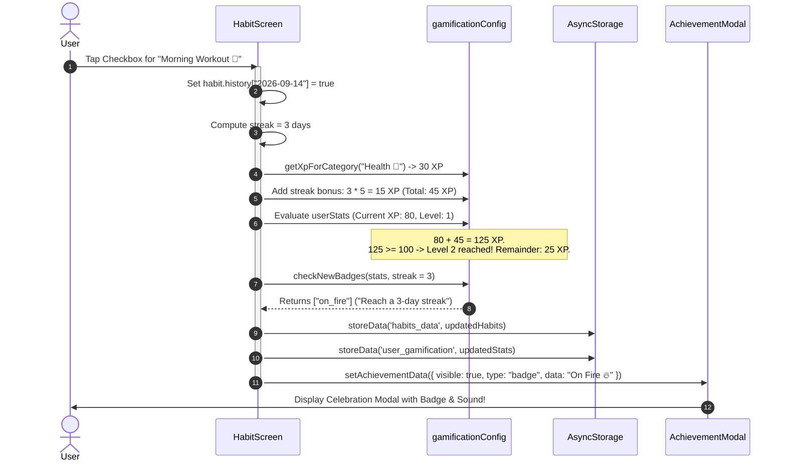

# Module 08: Habit Tracker & Gamification Engine

## 1. Module Overview & Architectural Role

The **Habit Tracker & Gamification Engine** module is designed to build long-term positive routines through behavioral psychology, visual streaks, and progression mechanics. Located in `src/screens/Habits`, this module is responsible for:
- **Routine Lifecycle Management (`HabitScreen.js`)**: Enabling habit creation, customization with duration timers (hours/minutes), categorized metadata, daily checkbox toggles, and habit archiving.
- **Calendar Heatmap Visualization**: Generating a color-coded monthly calendar heatmap via `react-native-calendars` displaying completion consistency across time.
- **Weekly Date Strip Integration (`WeeklyStrip.js`)**: Providing rapid day-by-day switching within the active week.
- **Gamification Mechanics (`gamificationConfig.js`, `LevelProgress.js`, `AchievementModal.js`)**:
  - Rewarding dynamic Experience Points (XP) weighted by category difficulty.
  - Applying multiplier bonuses based on active streak length ($+5\text{ XP}$ per streak day).
  - Calculating level thresholds ($100\text{ XP}$ per level) and presenting level progress meters.
  - Evaluating criteria for badges (First Step, On Fire, Unstoppable, Habit Master, Early Bird) and triggering celebratory modal popups upon unlocking.

### File Manifest
```
Plannify/src/screens/Habits/
├── HabitScreen.js                    # Core habit dashboard, calendar heatmap, and CRUD modals
└── gamification/
    ├── gamificationConfig.js         # XP rewards, level thresholds, badge conditions, and initial stats
    ├── LevelProgress.js              # Animated level badge and progress bar component
    └── AchievementModal.js           # Celebratory popup modal for level-ups and new badges
```

---

## 2. Frameworks & Libraries Used (With Architectural Justifications)

| Library / Framework | Version | Role in this Module | Rationale & Alternatives Considered |
|---|---|---|---|
| **react-native-calendars** | `^1.1313.0` | Monthly calendar & dot-marked heatmap | Industry-standard calendar component providing customizable day marking, custom theme inheritance, and month navigation. Avoids writing custom date-matrix rendering math from scratch. |
| **react-native-modal** | `^14.0.0-rc.1` | Fullscreen calendar picker & achievement popups | Ensures high z-index display above tab bars and handles back-button dismissals cleanly. |
| **LayoutAnimation (React Native)** | Built-in | Dynamic habit card completion transitions | Animates card heights, checkbox scales, and deletion shifts smoothly at native frame rates. |

---

## 3. Data Flow Diagram (DFD)

This diagram outlines how habit toggles trigger XP gains, level calculations, badge checks, and local persistence:



---

## 4. Sequence Diagram: Habit Completion & Gamification Flow

This sequence depicts the complete journey when a user completes a habit, earns XP, and unlocks an achievement:



---

## 5. Component & Code Anatomy

### Category XP Matrix (`gamificationConfig.js`)
Rewards difficulty-adjusted base XP upon habit completion:
```javascript
export const CATEGORY_XP = {
  "Health 💪": 30,
  "Study 📚": 25,
  "Work 💼": 25,
  "Skill 🎨": 20,
  "Mindfulness 🧘": 15,
  "General ⚡": 10,
};

export const XP_PER_STREAK_DAY = 5;
export const XP_PER_LEVEL = 100;
```

### Badge Registry
Evaluates state criteria dynamically on every completion event:
```javascript
export const BADGES = [
  {
    id: "first_step",
    icon: "🌱",
    title: "First Step",
    desc: "Complete your first habit",
    condition: (stats, streak) => stats.totalCompleted >= 1,
  },
  {
    id: "on_fire",
    icon: "🔥",
    title: "On Fire",
    desc: "Reach a 3-day streak",
    condition: (stats, streak) => streak >= 3,
  },
  {
    id: "unstoppable",
    icon: "🚀",
    title: "Unstoppable",
    desc: "Reach a 7-day streak",
    condition: (stats, streak) => streak >= 7,
  },
  {
    id: "master",
    icon: "👑",
    title: "Habit Master",
    desc: "Reach Level 5",
    condition: (stats, streak) => stats.level >= 5,
  },
  {
    id: "early_bird",
    icon: "🌅",
    title: "Early Bird",
    desc: "Complete a habit before 8 AM",
    condition: (stats, streak) => new Date().getHours() < 8,
  },
];
```

### `LevelProgress.js`
- Computes progress percentage toward the next level: $\text{progress} = \frac{\text{XP} \pmod{100}}{100}$.
- Renders an emerald linear progress bar with level badge display (`Lv. 2`).

### Heatmap Generator (`generateHeatmap`)
Iterates over all habits and checks history dates to build a `markedDates` dictionary compatible with `react-native-calendars`:
```javascript
const generateHeatmap = () => {
  const marks = {};
  habits.forEach((h) => {
    Object.keys(h.history || {}).forEach((date) => {
      if (h.history[date]) {
        marks[date] = {
          marked: true,
          dotColor: colors.primary,
          selected: date === selectedDate,
          selectedColor: date === selectedDate ? colors.primaryLight : undefined,
        };
      }
    });
  });
  setMarkedDates(marks);
};
```

---

## 6. Data Schemas & State Specifications

### Habit Record Schema
```typescript
interface Habit {
  _id: string;                     // Unique identifier
  title: string;                   // Habit description (e.g., "Drink 3L Water")
  category: string;                // Category key (e.g., "Health 💪")
  durationMinutes?: number;        // Optional target duration in minutes
  currentStreak: number;           // Active unbroken streak count
  bestStreak: number;              // Historical maximum unbroken streak
  history: Record<string, boolean>;// Map of "YYYY-MM-DD" -> true/false
  updatedAt: string;               // ISO 8601 string for SyncHelper delta tracking
}
```

### User Gamification Schema (`user_gamification`)
```typescript
interface UserGamificationStats {
  xp: number;                      // Current accumulated XP toward next level (0-99)
  level: number;                   // Current level (Starting at 1)
  badges: string[];                // Unlocked badge IDs (e.g. ["first_step", "on_fire"])
  totalCompleted: number;          // Total lifetime habit completions
  updatedAt: string;
}
```

---

## 7. Algorithms & Core Logic

### 1. Habit Streak Maintenance Algorithm
When date $D$ is toggled, the engine verifies whether completion continuity from $D-1$ remains intact:
```javascript
const computeHabitStreak = (history) => {
  let streak = 0;
  let d = new Date();
  const todayStr = getLocalDateString(d);
  
  if (history[todayStr]) streak++;
  d.setDate(d.getDate() - 1);
  
  while (true) {
    const dStr = getLocalDateString(d);
    if (history[dStr]) {
      streak++;
      d.setDate(d.getDate() - 1);
    } else {
      break;
    }
  }
  return streak;
};
```

### 2. Level Progression Curve
$$\text{XP}_{\text{earned}} = \text{BaseXP}_{\text{category}} + (\text{currentStreak} \times 5)$$
$$\text{Level}_{\text{new}} = \left\lfloor \frac{\text{TotalXP}}{100} \right\rfloor + 1$$
$$\text{XP}_{\text{remainder}} = \text{TotalXP} \pmod{100}$$

---

## 8. Edge Cases, Offline Mode & Error Handling

1. **Unchecking a Habit (XP Rollback)**:
   - When a habit is unchecked for the current day, `HabitScreen` recalculates the streak downward and safely rolls back the earned XP, preventing users from gaming the gamification engine by rapidly toggling checkboxes.
2. **Back-Dating Habit Completions**:
   - Marking a past date completes history for that date and updates heatmap dots, but streak algorithms evaluate sequential continuity up to the present day before increasing active streaks.
3. **Offline Sync Compatibility**:
   - `habits_data` and `user_gamification` both maintain `updatedAt` timestamps, ensuring that habits checked while offline sync cleanly with cloud databases during the next auto-sync pulse.
