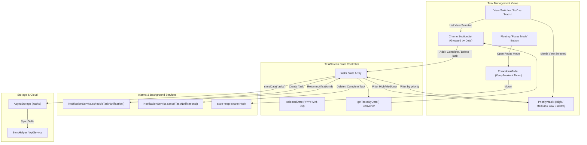
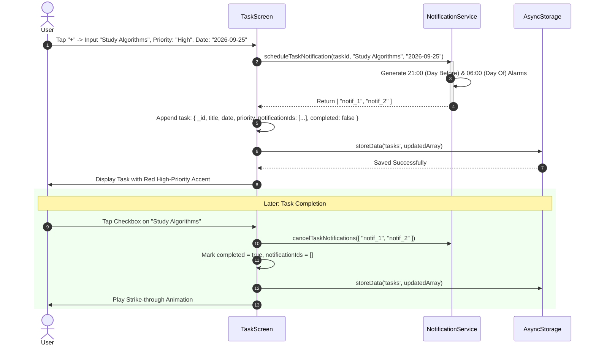

# Module 09: Task Management, Pomodoro Focus & Eisenhower Matrix

## 1. Module Overview & Architectural Role

The **Task Management, Pomodoro Focus & Eisenhower Matrix** module provides Plannify's core daily execution engine. Located within `src/screens/Tasks`, this module is responsible for:
- **Dual Perspective Task Views (`TaskScreen.js`)**: Seamlessly switching between a date-partitioned chronological **List View** and a priority-based **Eisenhower Priority Matrix**.
- **Priority Quadrants (`PriorityMatrix.js`)**: Categorizing active tasks into High Priority (urgent/critical), Medium Priority (scheduled tasks), and Low Priority (delegable/casual tasks) with color-coded accent indicators.
- **Deep Focus Pomodoro Timer (`PomodoroModal.js`)**: Providing a full-screen distraction-free timer modal equipped with screen wake locking (`expo-keep-awake`), breathing neon glow pulses (`react-native Animated`), tabular monospaced digit formatting, and terminal alert notifications.
- **Horizontal Date Navigation (`WeeklyStrip.js`)**: Permitting one-tap week-level browsing with day selection and dot-marked indicators.
- **Integrated Deadline Alarm Automation**: Dispatching two-stage local notifications (evening prior + morning of task) upon task creation and purging alerts upon completion or deletion.

### File Manifest
```
Plannify/src/screens/Tasks/
├── TaskScreen.js                  # Primary task orchestrator, SectionList manager, and modal controller
└── components/
    ├── PriorityMatrix.js          # Priority-grouped Eisenhower bucket view
    ├── PomodoroModal.js           # Keep-awake focus timer with pulsing visual effects
    ├── WeeklyStrip.js             # Horizontal interactive 7-day calendar strip
    └── HabitCard.js               # Reusable task/habit card component
```

---

## 2. Frameworks & Libraries Used (With Architectural Justifications)

| Library / Framework | Version | Role in this Module | Rationale & Alternatives Considered |
|---|---|---|---|
| **expo-keep-awake** | `~15.0.8` | Screen sleep prevention | Prevents device displays from dimming or locking during Pomodoro focus sessions, ensuring continuous visual progress feedback for students and professionals. |
| **react-native-modal** | `^14.0.0-rc.1` | Task creator & Pomodoro overlays | Delivers animated translucent backdrops (`backdropOpacity={0.85}`) that focus attention while allowing dismissal gestures. |
| **SectionList & FlatList (React Native)** | Built-in | Virtualized task rendering | Ensures fluid 60 FPS scrolling through months of past and upcoming tasks by recycling off-screen DOM nodes. |
| **react-native-calendars** | `^1.1313.0` | Year/Month date picking | Allows users to assign tasks to distant calendar dates with dot-marked task density indicators. |

---

## 3. Data Flow Diagram (DFD)

This diagram portrays task creation, view switching, notification dispatch, and Pomodoro session execution:



---

## 4. Sequence Diagram: Task Creation, Scheduling & Completion

This sequence details the creation of a task, automatic scheduling of two-stage local notifications, and subsequent completion cleanup:



---

## 5. Component & Code Anatomy

### `TaskScreen.js` Data Structure Transformation
Tasks are stored as a flat array in `AsyncStorage` (for MongoDB schema compatibility). For presentation, the flat array is dynamically converted into a date-keyed dictionary:
```javascript
const getTasksByDate = () => {
  const map = {};
  tasks.forEach(task => {
    if (!task.isDeleted) {
      const date = task.date || today;
      if (!map[date]) map[date] = [];
      map[date].push(task);
    }
  });
  return map;
};
```

### `PriorityMatrix.js`
- Partitions the task list into three priority tiers:
  - **High Priority**: Rendered with `colors.danger` border and fire icon (`🔥`).
  - **Medium Priority**: Rendered with `colors.warning` border and bolt icon (`⚡`).
  - **Low Priority**: Rendered with `colors.accent` border and coffee icon (`☕`).
- Displays task titles, duration chips, and calendar date labels.

### `PomodoroModal.js`
- **Display Stabilization**:
  - Employs `fontVariant: ["tabular-nums"]` in CSS styles to prevent jittering when digits change from wide characters (`0`, `8`) to narrow characters (`1`).
- **Breathing Pulse Animation**:
  ```javascript
  Animated.loop(
    Animated.sequence([
      Animated.timing(pulseAnim, { toValue: 1.05, duration: 1000, easing: Easing.inOut(Easing.ease), useNativeDriver: true }),
      Animated.timing(pulseAnim, { toValue: 1, duration: 1000, easing: Easing.inOut(Easing.ease), useNativeDriver: true }),
    ])
  ).start();
  ```
- **Interval State Machine**:
  - Decrements remaining seconds every 1,000ms.
  - Upon reaching zero, triggers local terminal alert via `Notifications.scheduleNotificationAsync({ content: { title: "Time's Up!" }, trigger: null })` and resets the timer ring.

---

## 6. Data Schemas & State Specifications

### Task Record Interface (`tasks`)
```typescript
interface TaskItem {
  _id: string;                     // Unique task identifier (UUID or timestamp)
  title: string;                   // Task description
  date: string;                    // Target execution date (YYYY-MM-DD)
  duration?: string;               // Estimated duration (e.g., "45m", "1h 30m")
  priority: "High" | "Medium" | "Low"; // Priority classification
  completed: boolean;              // Completion status flag
  isDeleted?: boolean;             // Soft delete flag for cloud sync reconciliation
  notificationIds?: string[];      // Active scheduled notification identifiers
  updatedAt: string;               // ISO 8601 modification timestamp
}
```

---

## 7. Algorithms & Core Logic

### 1. SectionList Categorization and Grouping
To feed React Native's `SectionList`, `TaskScreen` generates section arrays sorted chronologically:
```javascript
const processSections = () => {
  const dateMap = getTasksByDate();
  const sortedDates = Object.keys(dateMap).sort();
  const newSections = sortedDates.map(date => ({
    title: date === today ? "Today" : formatDateHeader(date),
    data: dateMap[date],
  }));
  setSections(newSections);
};
```

### 2. Tabular Seconds Decomposition
```javascript
const formatTime = (totalSeconds) => {
  const h = Math.floor(totalSeconds / 3600);
  const m = Math.floor((totalSeconds % 3600) / 60);
  const s = totalSeconds % 60;
  const mStr = m < 10 ? `0${m}` : m;
  const sStr = s < 10 ? `0${s}` : s;
  return h > 0 ? `${h}:${mStr}:${sStr}` : `${mStr}:${sStr}`;
};
```

---

## 8. Edge Cases, Offline Mode & Error Handling

1. **Orphaned Notifications on Re-scheduling**:
   - If a user changes a task's date from the 20th to the 25th, `cancelTaskNotifications(task.notificationIds)` is invoked first before registering new notification IDs, eliminating duplicate or invalid alerts.
2. **Soft Deletion for Cloud Sync**:
   - Rather than instantly removing items from the flat array, deleted items are tagged with `isDeleted: true` and a fresh `updatedAt`. This ensures the deletion tombstone propagates to MongoDB before the local record is pruned.
3. **App Suspension During Pomodoro Timer**:
   - `useKeepAwake` keeps the CPU and display active during the session. If the user manually backgrounds the app, a local scheduled alert fires at the exact completion timestamp, notifying them even when the app is suspended.
