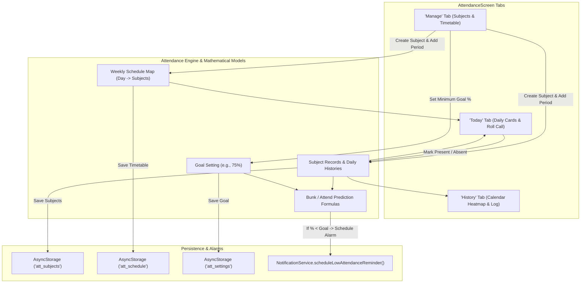
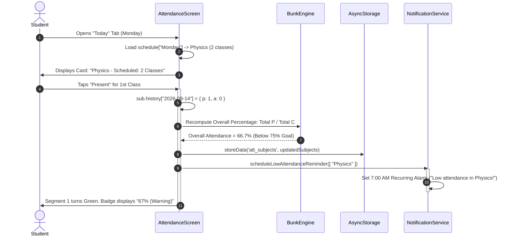

# Module 10: Attendance Tracker & Bunk Predictor

## 1. Module Overview & Architectural Role

The **Attendance Tracker & Bunk Predictor** module is tailored specifically for academic workflows, student accountability, and timetable management. Located in `src/screens/Attendance/AttendanceScreen.js`, this module is responsible for:
- **Weekly Class Timetable Modeling**: Enabling students to build a full recurring schedule across all 7 days of the week (`Sunday` through `Saturday`), mapping multiple subject periods per day.
- **Three-Pillar Interactive Navigation**:
  1. **Today Tab**: Instant daily roll-call cards with batch actions ("Mark All Present", "Mark All Absent") and segmented visual class bars.
  2. **History Tab**: Monthly calendar heatmap powered by `react-native-calendars`, color-coding days as perfect (green), partial (yellow), or absent (red).
  3. **Manage Tab**: Subject creation/deletion, timetable period assignment, and minimum goal threshold configuration (e.g., 75%, 80%).
- **Mathematical Bunk / Attend Prediction Engine**: Calculating exactly how many consecutive upcoming classes a student can safely bunk (skip) while staying above their goal, or how many consecutive classes they must attend to recover from a deficit.
- **Automated Deficit Warning Notifications**: Feeding low-attendance subject lists into `NotificationService.scheduleLowAttendanceReminder()` to trigger 7:00 AM daily wake-up alarms.

### File Manifest
```
Plannify/src/
└── screens/
    └── Attendance/
        └── AttendanceScreen.js  # Tri-tab attendance manager, timetable builder, and bunk calculator
```

---

## 2. Frameworks & Libraries Used (With Architectural Justifications)

| Library / Framework | Version | Role in this Module | Rationale & Alternatives Considered |
|---|---|---|---|
| **react-native-calendars** | `^1.1313.0` | Calendar log & color-coded dot matrix | Allows date selection and visual attendance quality heatmaps (`markingType={"custom"}`) without rebuilding a bespoke calendar renderer. |
| **react-native-modal** | `^14.0.0-rc.1` | Subject creator & class scheduler modals | Provides focus overlays for inputting subject names and period counts. |
| **LayoutAnimation (React Native)** | Built-in | Spring-loaded card state mutations | Animates class status changes, tab shifts, and tag removals smoothly. |

---

## 3. Data Flow Diagram (DFD)

This diagram outlines how timetable schedules, daily roll-calls, and threshold evaluations flow through the attendance system:



---

## 4. Sequence Diagram: Attendance Roll Call & Warning Trigger

This sequence illustrates marking attendance for a scheduled class, recalculating percentages, and dispatching morning alerts:



---

## 5. Component & Code Anatomy

### Date & Day Resolvers
Ensures day names and ISO date strings correspond accurately to device local time:
```javascript
const getLocalToday = () => {
  const now = new Date();
  const year = now.getFullYear();
  const month = String(now.getMonth() + 1).padStart(2, "0");
  const day = String(now.getDate()).padStart(2, "0");
  return {
    dateStr: `${year}-${month}-${day}`,
    dayName: DAYS[now.getDay()],
  };
};
```

### Segmented Daily Class Visualizer
Inside `renderClassCard`, rather than just displaying text, a segmented progress row visualizes the status of each period in the day:
```javascript
<View style={styles.barRow}>
  {Array.from({ length: item.count }).map((_, i) => {
    let color = colors.border;
    if (i < record.p) color = colors.success;                 // Attended
    else if (i < record.p + record.a) color = colors.danger; // Missed
    return <View key={i} style={[styles.barSegment, { backgroundColor: color }]} />;
  })}
</View>
```

---

## 6. Data Schemas & State Specifications

### Subject Record Schema (`att_subjects`)
```typescript
interface AttendanceRecord {
  p: number;                       // Classes attended (Present) on this date
  a: number;                       // Classes missed (Absent) on this date
}

interface Subject {
  _id: string;                     // Unique subject ID
  name: string;                    // Subject title (e.g. "Data Structures")
  history: Record<string, AttendanceRecord>; // Map of "YYYY-MM-DD" -> { p, a }
  updatedAt: string;               // ISO 8601 modification timestamp
}
```

### Timetable Schedule Schema (`att_schedule`)
```typescript
interface ScheduleItem {
  subjectId: string;               // Reference to Subject._id
  count: number;                   // Number of scheduled periods on this day
}

interface TimetableWrapper {
  _id: "timetable";
  schedule: Record<string, ScheduleItem[]>; // Keyed by "Monday", "Tuesday", etc.
  updatedAt: string;
}
```

---

## 7. Algorithms & Mathematical Formulas

### 1. Cumulative Attendance Percentage
For a subject with history records $d \in \text{history}$:
$$P = \sum d.p, \quad C = \sum (d.p + d.a)$$
$$\text{Attendance } \% = \begin{cases} 0\% & \text{if } C = 0 \\ \left(\frac{P}{C}\right) \times 100 & \text{if } C > 0 \end{cases}$$

### 2. Bunk Calculator (Safe Skips Formula)
When current attendance meets or exceeds the minimum required threshold $T$ ($\frac{P}{C} \ge \frac{T}{100}$), how many consecutive classes $y$ can the student skip without dropping below $T$?
$$\frac{P}{C + y} \ge \frac{T}{100}$$
$$100 \cdot P \ge T \cdot (C + y)$$
$$100 \cdot P - T \cdot C \ge T \cdot y$$
$$y \le \left\lfloor \frac{100 \cdot P - T \cdot C}{T} \right\rfloor$$
**Result**: The student can safely bunk $y$ classes.

### 3. Recovery Calculator (Required Attend Formula)
When current attendance falls below the target threshold $T$ ($\frac{P}{C} < \frac{T}{100}$), how many consecutive classes $x$ must the student attend to raise their percentage back to $T$?
$$\frac{P + x}{C + x} \ge \frac{T}{100}$$
$$100 \cdot (P + x) \ge T \cdot (C + x)$$
$$100 \cdot P + 100 \cdot x \ge T \cdot C + T \cdot x$$
$$(100 - T) \cdot x \ge T \cdot C - 100 \cdot P$$
$$x \ge \left\lceil \frac{T \cdot C - 100 \cdot P}{100 - T} \right\rceil$$
**Result**: The student must attend $x$ consecutive classes.

---

## 8. Edge Cases, Offline Mode & Error Handling

1. **Future Date Attendance Guard**:
   - Marking attendance on dates ahead of current local time (`targetDate > todayStr`) is explicitly blocked with a user alert (`"Cannot mark future attendance"`), preventing accidental schedule corruption.
2. **Class Limit Exceeded**:
   - If a subject has 2 periods scheduled on Monday, tapping "Present" a 3rd time is prevented with an alert (`"Max 2 classes"`).
3. **Database Migration Tolerance**:
   - Older local databases that stored the timetable as a raw object without wrapping metadata are automatically detected and wrapped in `{ _id: 'timetable', schedule, updatedAt }` on load, maintaining full cloud sync compatibility.
