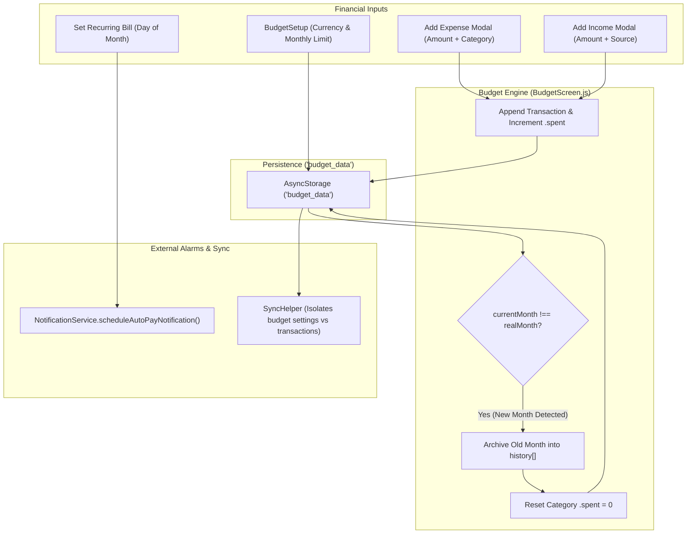
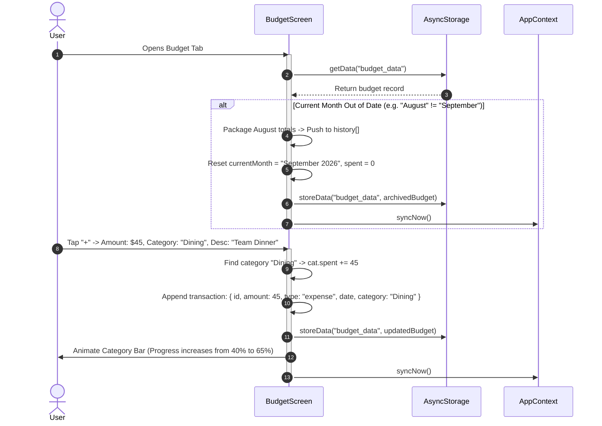

# Module 11: Budget Planning, Expense Tracking & Financial Analytics

## 1. Module Overview & Architectural Role

The **Budget Planning, Expense Tracking & Financial Analytics** module provides Plannify's personal finance ledger and spending analytics suite. Located within `src/screens/Budget`, this module is responsible for:
- **First-Time Financial Onboarding (`BudgetSetup.js`)**: Setting up international currency symbols (`$`, `₹`, `€`, `£`, `¥`), allocating the overall monthly limit, and defining custom categories (Food, Rent, Transport, Entertainment, etc.).
- **Real-Time Financial Dashboard (`BudgetScreen.js`)**: Visualizing total monthly burn rate, remaining allowance, category progress bars, and recent transactions.
- **Automated Month Rollover Engine**: Automatically detecting the transition into a new calendar month, archiving past expenditure summaries into `history`, and resetting active category balances to zero.
- **Recurring Payments & Auto-Pay Alerts**: Managing scheduled monthly subscriptions (Rent, Netflix, Gym) and registering repeating alarms via `scheduleAutoPayNotification()`.
- **Historical Analysis & Filtering (`BudgetHistory.js`)**: Providing month-by-month archival browsing and transaction filtering.

### File Manifest
```
Plannify/src/screens/Budget/
├── BudgetScreen.js                # Core finance dashboard, expense/income modals, and auto-pay manager
├── BudgetSetup.js                 # Monthly limit creator, category allocator, and currency picker
└── BudgetHistory.js               # Historical archive browser, monthly balance cards, and search filters
```

---

## 2. Frameworks & Libraries Used (With Architectural Justifications)

| Library / Framework | Version | Role in this Module | Rationale & Alternatives Considered |
|---|---|---|---|
| **react-native-modal** | `^14.0.0-rc.1` | Expense, Income & Recurring modals | Delivers clean numerical input modals with backdrop dismissal. |
| **@expo/vector-icons (MaterialCommunityIcons)** | `^15.0.3` | Financial & category iconography | Provides semantic currency and category glyphs (`wallet`, `food`, `home`, `car`, `cash-plus`). |
| **ScrollView (React Native)** | Built-in | Financial metrics presentation | Handles large category lists and transaction streams without frame lag. |

---

## 3. Data Flow Diagram (DFD)

This diagram visualizes how transactions, monthly resets, and recurring payment reminders propagate through the financial system:



---

## 4. Sequence Diagram: Adding an Expense & Auto-Archiving Month

This sequence illustrates logging an expense, checking monthly rollovers, and updating category progress:



---

## 5. Component & Code Anatomy

### Automatic Monthly Rollover Algorithm
Protects historical transaction ledgers when transitioning into a new month without requiring manual user resets:
```javascript
const realMonth = new Date().toLocaleString("default", { month: "long", year: "numeric" });

if (!data.currentMonth || data.currentMonth !== realMonth) {
  if (data.currentMonth) {
    const oldTransactions = data.transactions || [];
    const oldSpent = (data.categories || []).reduce(
      (acc, c) => acc + (parseFloat(c.spent) || 0), 0
    );

    const historyEntry = {
      month: data.currentMonth,
      totalBudget: data.totalBudget,
      totalSpent: oldSpent,
      transactions: oldTransactions,
      isCurrent: false,
    };

    if (!data.history) data.history = [];
    data.history.push(historyEntry);
  }

  // Reset for new month
  data.currentMonth = realMonth;
  data.transactions = [];
  if (data.categories) {
    data.categories = data.categories.map((c) => ({ ...c, spent: 0 }));
  }
  await storeData("budget_data", data);
}
```

### Recurring Auto-Pay Billing
```javascript
const handleAddRecurring = async () => {
  const dayNum = parseInt(payDay);
  if (isNaN(dayNum) || dayNum < 1 || dayNum > 31) {
    showAlert("Invalid Day", "Enter a valid day between 1 and 31.");
    return;
  }
  
  // Register recurring monthly local alarm at 9:00 AM
  const notifId = await scheduleAutoPayNotification(desc, amount, dayNum, budget.currency);
  
  const newRecurring = {
    id: Date.now().toString(),
    title: desc,
    amount: parseFloat(amount),
    day: dayNum,
    notificationId: notifId,
  };
  
  budget.recurringPayments = [...(budget.recurringPayments || []), newRecurring];
  await storeData("budget_data", budget);
};
```

---

## 6. Data Schemas & State Specifications

### Budget Document Schema (`budget_data`)
```typescript
interface BudgetCategory {
  id: string;                      // Category ID (e.g., "cat_food")
  name: string;                    // Name (e.g., "Food & Groceries")
  icon: string;                    // MaterialCommunityIcon glyph
  allocated: number;               // Planned budget limit for this category
  spent: number;                   // Cumulative amount spent in current month
}

interface BudgetTransaction {
  id: string;                      // Unique transaction ID
  amount: number;                  // Monetary amount
  type: "expense" | "income";      // Transaction type
  category?: string;               // Category name (for expenses)
  desc: string;                    // User memo
  date: string;                    // Date string
  updatedAt: string;
}

interface BudgetData {
  _id: "budget_settings";
  currency: string;                // "$", "₹", "€", "£", "¥"
  totalBudget: number;             // Total monthly expenditure ceiling
  currentMonth: string;            // Active month string (e.g., "September 2026")
  categories: BudgetCategory[];    // Category allocations
  transactions: BudgetTransaction[]; // Active month ledger
  recurringPayments?: any[];       // Scheduled monthly bills
  history?: any[];                 // Archived historical month documents
  updatedAt: string;
}
```

---

## 7. Algorithms & Financial Metrics

### 1. Burn Rate & Remaining Allowance
$$\text{Total Spent} = \sum_{c \in \text{Categories}} c.\text{spent}$$
$$\text{Remaining Balance} = \text{Total Budget} - \text{Total Spent}$$
$$\text{Burn Percentage} = \left( \frac{\text{Total Spent}}{\text{Total Budget}} \right) \times 100$$

### 2. Category Saturation Indicator
$$\text{Category Saturation } \% = \left( \frac{\text{Category Spent}}{\text{Category Allocated}} \right) \times 100$$
- If $\text{Saturation} \ge 100\%$, the progress bar turns `colors.danger` (red) to visually signal an overspent allocation.
- If $80\% \le \text{Saturation} < 100\%$, the bar turns `colors.warning` (amber).
- If $\text{Saturation} < 80\%$, the bar displays `colors.primary` (emerald).

---

## 8. Edge Cases, Offline Mode & Error Handling

1. **Category vs Transaction Cloud Sync Isolation**:
   - As documented in Module 04 (`SyncHelper.js`), `transactions` are stripped from `budget_data` settings payloads during cloud sync. This prevents simultaneous offline expense logging from overwriting category configuration edits.
2. **Missing Currency Symbols**:
   - If an imported cloud backup lacks a currency symbol, it safely defaults to `"$"` to prevent rendering exceptions.
3. **Invalid Calendar Day Submissions**:
   - Day numbers entered for recurring payments are clamped between 1 and 31. If months have fewer days (e.g., February), mobile alarm managers fire on the final available day.
