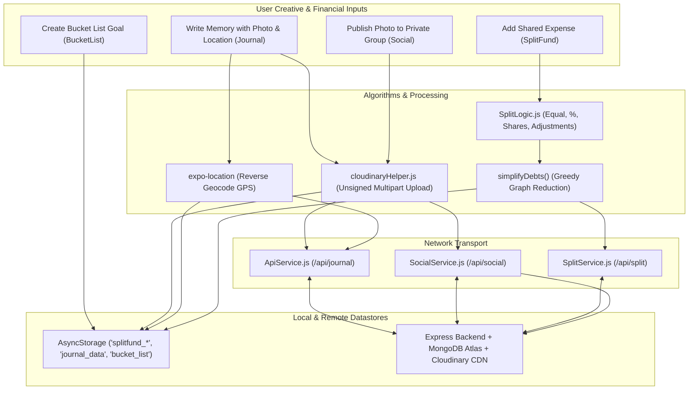
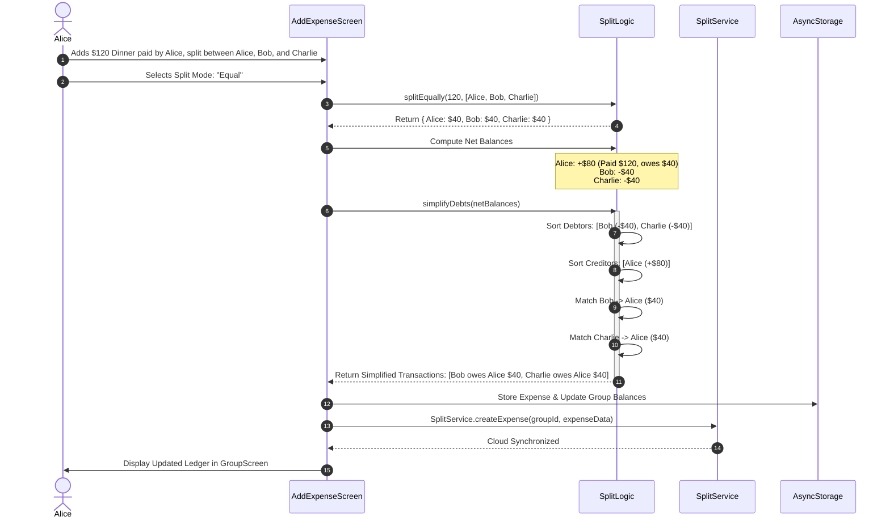

# Module 12: Collaborative SplitFund, Social Community & Daily Journaling

## 1. Module Overview & Architectural Role

The **Collaborative SplitFund, Social Community & Daily Journaling** module represents Plannify's peer-to-peer collaboration, shared finance, emotional reflection, and life-milestone ecosystem. Spanning `src/screens/SplitFund`, `src/screens/Social`, `src/screens/Journal`, and `src/screens/BucketList`, this module is responsible for:
- **SplitFund Expense Sharing (`SplitFundDashboard.js`, `GroupScreen.js`, `AddExpenseScreen.js`, `SettleUpScreen.js`)**: Managing group expenses (trips, apartments, dining), supporting 5 distinct split formulas (Equal, Percentage, Shares, Adjustments, Exact amounts), and resolving group debts using a greedy debt simplification graph algorithm (`simplifyDebts`).
- **Private Social Network (`SocialScreen.js`, `SocialPostModal.js`, `SocialService.js`)**: Enabling invite-code-gated private group communities where friends share moments, upload photos via Cloudinary, and post reactions and comments.
- **Enriched Daily Journal (`JournalScreen.js`, `JournalModal.js`, `JournalUtils.js`)**: Providing a personal reflection diary equipped with mood tracking (`😊`, `😂`, `🥰`, `😐`, `😢`, `😡`), geolocation reverse-geocoding (`expo-location`), tag categorization, and cloud photo synchronization.
- **Bucket List Milestones (`BucketListScreen.js`)**: Tracking long-term personal aspirations across categories (Travel, Movies, Books, Food, Other) with completion ratios and status toggles.

### File Manifest
```
Plannify/src/
├── screens/
│   ├── SplitFund/
│   │   ├── SplitFundDashboard.js   # Group overview, member balances, and total owed/owe metrics
│   │   ├── GroupScreen.js          # Detailed group ledger, expense history, and member breakdown
│   │   ├── AddExpenseScreen.js     # Multi-payer, multi-split configuration screen
│   │   └── SettleUpScreen.js       # Peer-to-peer balance reconciliation interface
│   ├── Social/
│   │   ├── SocialScreen.js         # Community feed, group switcher, reactions, and comment drawer
│   │   └── SocialPostModal.js      # Media capture, caption input, and Cloudinary publisher
│   ├── Journal/
│   │   ├── JournalScreen.js        # Timeline diary feed, search bar, and memory cards
│   │   ├── JournalModal.js         # Rich memory composer (moods, location, tags, camera)
│   │   └── JournalUtils.js         # Formatting and date helpers for diary entries
│   └── BucketList/
│       └── BucketListScreen.js     # Categorized milestone tracker and achievement checklist
├── services/
│   ├── SplitService.js             # Online/offline group sync and settlement API client
│   └── SocialService.js            # Social group management, post feeds, and reaction API
└── utils/
    └── SplitLogic.js               # Debt simplification algorithm and split distribution math
```

---

## 2. Frameworks & Libraries Used (With Architectural Justifications)

| Library / Framework | Version | Role in this Module | Rationale & Alternatives Considered |
|---|---|---|---|
| **expo-location** | `~19.0.8` | GPS coordinates & reverse-geocoding | Obtains current latitude/longitude (`getCurrentPositionAsync`) and resolves city/neighborhood names (`reverseGeocodeAsync`) without requiring paid third-party maps SDKs. |
| **expo-image-picker** | `~17.0.10` | Photo capture for journals & social feeds | Enables direct camera access or photo library imports with built-in compression. |
| **react-native-modal** | `^14.0.0-rc.1` | Composer modals & settle-up dialogs | Provides keyboard-aware modal dialogs with backdrop dismissal for journaling and expense entries. |
| **Cloudinary Media REST API** | v1_1 | Decentralized social media streaming | Distributes journal and social photo uploads directly to CDN storage, preventing heavy image payloads from congesting MongoDB databases. |

---

## 3. Data Flow Diagram (DFD)

This diagram portrays the convergence of SplitFund debt resolution, Social media posts, and Journal reflection entries:



---

## 4. Sequence Diagram: Shared Expense Logging & Debt Simplification

This sequence illustrates adding a multi-member expense and running the greedy settlement algorithm:



---

## 5. Component & Code Anatomy

### Split Methods (`src/utils/SplitLogic.js`)
- **`splitEqually(amount, members)`**: Divides total by member count, distributing residual cent differences to the first member to eliminate floating-point penny discrepancies.
- **`splitByPercentage(amount, members, percentages)`**: Evaluates percentage shares ($\sum = 100\%$) and distributes residuals.
- **`splitByShares(amount, members, shares)`**: Computes unit cost $\frac{\text{amount}}{\sum \text{shares}}$ and assigns proportional shares.
- **`splitByAdjustment(amount, members, adjustments)`**: Splits the baseline amount $( \text{total} - \sum \text{adjustments} )$ equally before layering individual adjustments.

### `JournalModal.js`
- **Location Geocoding Integration**:
  ```javascript
  const fetchLocation = async () => {
    const { status } = await Location.requestForegroundPermissionsAsync();
    if (status !== 'granted') return;
    setIsFetchingLoc(true);
    const loc = await Location.getCurrentPositionAsync({});
    const [geo] = await Location.reverseGeocodeAsync({
      latitude: loc.coords.latitude,
      longitude: loc.coords.longitude,
    });
    if (geo) {
      const locString = [geo.city || geo.district, geo.region, geo.country]
        .filter(Boolean)
        .join(", ");
      setLocationName(locString);
    }
    setIsFetchingLoc(false);
  };
  ```
- **Media Upload Pipeline**:
  - Directs local photos picked via `ImagePicker.launchImageLibraryAsync()` to `uploadToCloudinary()`.
  - Replaces local `file:///` URIs with permanent CDN HTTPS URLs before database persistence.

### `BucketListScreen.js`
- **Category Filter Matrix**: Filters items by category (`Travel`, `Movies`, `Books`, `Food`, `Other`).
- **Progress Ratio**: Computes overall completion percentage:
  $$\text{Completion } \% = \left( \frac{\text{Count}(\text{completed})}{\text{Total Items}} \right) \times 100$$

---

## 6. Data Schemas & State Specifications

### Journal Entry Record Schema (`journal_data`)
```typescript
interface JournalEntry {
  _id: string;                     // Unique memory ID
  topic: string;                   // Title or subject of memory
  text: string;                    // Diary content body
  image: string | null;            // Cloudinary HTTPS URL or local file URI
  mood: string | null;             // Emoji mood ("😊", "😂", "🥰", "😐", "😢", "😡")
  location?: string;               // Geocoded location string (e.g., "Brooklyn, New York")
  tags: string[];                  // Custom string labels (e.g. ["Vacation", "Family"])
  date: string;                    // ISO 8601 string or YYYY-MM-DD
  updatedAt: string;
}
```

### Simplified Debt Transaction Schema
```typescript
interface DebtTransaction {
  from: string;                    // User ID of debtor
  to: string;                      // User ID of creditor
  amount: number;                  // Monetary balance to settle (e.g., 40.00)
}
```

---

## 7. Algorithms & Core Logic: Greedy Debt Simplification

In group finance, if $N$ members exchange expenses, the naive transaction count can approach $\mathcal{O}(N^2)$. The `simplifyDebts` algorithm optimizes this into at most $N-1$ peer-to-peer settlements using a greedy balance-matching algorithm:

```javascript
export const simplifyDebts = (balances) => {
  let debtors = [];
  let creditors = [];
  
  // 1. Separate users into Debtors (negative) and Creditors (positive)
  Object.entries(balances).forEach(([uid, amount]) => {
    if (amount < -0.01) debtors.push({ id: uid, amount });
    if (amount > 0.01) creditors.push({ id: uid, amount });
  });
  
  // 2. Sort Debtors ascending (most negative first) and Creditors descending (most positive first)
  debtors.sort((a, b) => a.amount - b.amount);
  creditors.sort((a, b) => b.amount - a.amount);
  
  const transactions = [];
  let i = 0; // Debtor pointer
  let j = 0; // Creditor pointer
  
  // 3. Greedily match maximum debtor with maximum creditor
  while (i < debtors.length && j < creditors.length) {
    const debtor = debtors[i];
    const creditor = creditors[j];
    
    // Settlement amount is the minimum of debt owed and credit required
    const settleAmount = Math.min(Math.abs(debtor.amount), creditor.amount);
    
    transactions.push({
      from: debtor.id,
      to: creditor.id,
      amount: parseFloat(settleAmount.toFixed(2)),
    });
    
    debtor.amount += settleAmount;
    creditor.amount -= settleAmount;
    
    if (Math.abs(debtor.amount) < 0.01) i++;
    if (creditor.amount < 0.01) j++;
  }
  
  return transactions;
};
```

---

## 8. Edge Cases, Offline Mode & Error Handling

1. **Floating-Point Cent Discrepancies**:
   - Standard division ($100 / 3 = 33.3333...$) creates fractional rounding errors. `distributeResidual` sums allocated shares and assigns the residual difference ($100 - 99.99 = 0.01$) to the primary payer, ensuring exact balance reconciliations.
2. **GPS Sensor Unavailable or Denied**:
   - If location permissions are denied or device GPS is toggled off, `JournalModal` skips geocoding gracefully without interrupting text composition.
3. **Large Image Upload Drops**:
   - If an internet disconnection occurs during Cloudinary upload, `JournalModal` catches the error, displays an informative prompt, and retains the local image URI so the user can retry later without losing their written diary thoughts.
